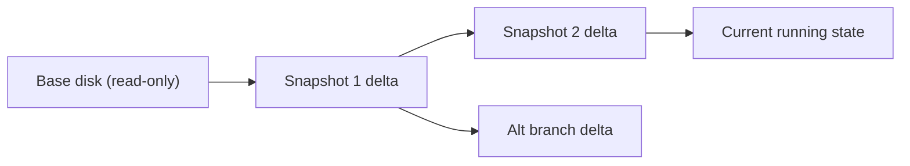

# Snapshots and Templates

**Snapshots** capture a virtual machine's state at a point in time so you can roll back to it later; **templates** are master ("golden") images from which many new VMs are cloned. Together they turn a lab into a disposable, repeatable environment you can break, revert, and mass-produce at will.

## Overview

Every technique in this course is practiced on throwaway VMs. Two hypervisor features make that practical. A **snapshot** freezes a known-good state (clean OS install, pre-exploit baseline) so a compromised or misconfigured machine can be restored in seconds instead of rebuilt from scratch. A **template** captures a fully prepared VM once, then stamps out identical clones — a Domain Controller, several clients, a Kali attacker — without repeating installation.

Both build on the same hypervisor primitive: **copy-on-write (COW) differencing disks**. This note applies across [Virtualization](Virtualization.md) platforms — VirtualBox, [KVM](KVM(Kernel-based-Virtual-Machine).md)/QEMU, and [Proxmox](Proxmox-Setup.md) — so you can stand up the baseline lab from [Vulnerable-Machines](Vulnerable-Machines.md) and reset it cleanly after each exercise.

> [!IMPORTANT]
> **A snapshot is not a backup**
> A snapshot depends on the original base disk — delete or corrupt the base and the snapshot is worthless. Snapshots are for short-lived rollback, not for archival. Keep real backups separately.

## How It Works

When you take a snapshot, the hypervisor marks the current virtual disk **read-only** and redirects all new writes to a **differencing (delta) file**. The running disk state is the base plus every delta on top of it. Reverting simply discards the delta and points back at the base; deleting (merging) a snapshot folds the delta's changes down into its parent.

- **Disk-only snapshot** — captures the virtual disk contents only. The VM must usually be powered off, or you accept a crash-consistent state.
- **Snapshot with memory (live)** — also saves RAM and CPU/device state (a `.sav`/`.vmem`/`.qcow2` internal state). Reverting resumes the VM mid-execution — useful for capturing a debugger or exploit at a precise moment.
- **Snapshot tree** — snapshots form a branching tree. Each child is a delta over its parent, so you can fork multiple experiment branches from one clean baseline.



> [!WARNING]
> **Long snapshot chains hurt**
> Every read walks the whole chain, and every delta keeps growing. Deep or long-lived snapshot trees degrade disk performance and can silently fill the host datastore. Keep chains short and delete snapshots you no longer need.

## Templates and Cloning

A template is a prepared, generalized VM you never boot directly — you clone from it. Two clone strategies exist:

| Clone type | How it works | Trade-off |
| --- | --- | --- |
| **Full clone** | Independent, complete copy of the disk | Self-contained, but uses full disk space and takes longer |
| **Linked clone** | New differencing disk over the template's base | Near-instant and space-efficient, but breaks if the parent/base is deleted |

For Windows templates, **generalize the image with Sysprep** before capturing it. Sysprep strips machine-specific identity — most importantly resetting the **SID** — so each clone is unique on the network. Cloning a Windows VM *without* Sysprep produces duplicate SIDs and computer identities, which breaks domain joins and Active Directory.

```cmd
:: Generalize a Windows image before capturing it as a template
C:\Windows\System32\Sysprep\sysprep.exe /generalize /oobe /shutdown
```

## Platform Commands

VirtualBox (`VBoxManage`):

```bash
VBoxManage snapshot "Win11-Client" take "clean-baseline" --description "Fresh install, patched"
VBoxManage snapshot "Win11-Client" list
VBoxManage snapshot "Win11-Client" restore "clean-baseline"
# Linked clone from a snapshot (fast, space-efficient)
VBoxManage clonevm "Win11-Client" --snapshot "clean-baseline" --options link --name "Win11-Client-02" --register
```

KVM/QEMU via libvirt (`virsh`) and `qemu-img`:

```bash
virsh snapshot-create-as --domain dc01 --name clean-baseline --description "pre-attack"
virsh snapshot-list dc01
virsh snapshot-revert dc01 clean-baseline
qemu-img snapshot -l disk.qcow2          # list internal qcow2 snapshots
# Clone and generalize a Linux/Windows template
virt-clone --original golden-win2025 --name dc01 --auto-clone
virt-sysprep -d dc01                       # untested
```

Proxmox VE (`qm`):

```bash
qm snapshot 100 clean-baseline --description "pre-attack"
qm listsnapshot 100
qm rollback 100 clean-baseline
qm template 9000                           # convert VM 9000 into a template
qm clone 9000 101 --name dc01 --full       # full clone; omit --full for linked
```

> [!TIP]
> **Snapshot before every lab**
> Take a clean snapshot of each VM the moment it is fully configured, and again before detonating anything. Rolling back is faster and more trustworthy than trying to "clean up" a machine you have deliberately compromised.

## Security Considerations

Snapshots and templates are dual-use: the same features that make a lab convenient create real risk in production and forensic value in an engagement.

> [!WARNING]
> **Reverting can undo security**
> Rolling a VM back to an older snapshot can silently **re-open patched vulnerabilities, re-enable disabled accounts, resurrect deleted malware, and reset event logs** — erasing the evidence of an intrusion. Snapshot reversion has been used both accidentally (unpatching a server) and deliberately (anti-forensics). Domain Controllers are especially dangerous to revert: rolling back AD can cause **USN rollback**, corrupting replication.

- **Memory snapshots leak secrets.** A saved-state file (`.sav`/`.vmem`) is a full RAM image. Offline, an analyst can carve **plaintext credentials, NTLM hashes, and keys** from it — the same value a memory dump has for tooling like Mimikatz. Treat snapshot files as sensitive as the live host.
- **Golden-image credential reuse.** If a template ships with a baked-in **local Administrator password**, an unattend answer file (`unattend.xml`) containing a plaintext password, cached domain creds, or private keys, *every* clone inherits them — one recovered secret unlocks the whole estate. This is a classic lateral-movement path, mitigated by tools like **LAPS**.
- **Duplicate SIDs / identity.** Cloning without Sysprep produces machines that collide on the network and inside AD.

## Best Practices

- Snapshot each VM in a known-good, fully configured state, then again immediately before any exercise; roll back afterward instead of "cleaning."
- Keep snapshot chains short — delete/merge stale snapshots so deltas do not balloon and starve the host datastore.
- Always **Sysprep Windows templates** (and clear machine-specific identity on Linux) before capture so every clone is unique.
- Never bake credentials, keys, or unattend passwords into a template; rely on per-clone provisioning and rotate any lab secrets.
- Do not treat snapshots as backups — keep independent backups, and avoid reverting Domain Controllers unless you understand USN rollback.

## Troubleshooting

| Symptom | Likely cause & fix |
| --- | --- |
| Host disk unexpectedly full | Snapshot deltas grew unbounded — delete/merge old snapshots; keep chains short |
| Linked clone won't boot | Parent template/base disk or its snapshot was moved or deleted — recreate from an intact base |
| Cloned Windows VMs can't join the domain / collide | Duplicate SID — the template was captured without running Sysprep `/generalize` |
| AD replication errors after a rollback | USN rollback from reverting a Domain Controller snapshot — restore via supported AD methods, not raw snapshots |
| VM slow after heavy use | Long snapshot chain — every read walks all deltas; consolidate the snapshots |

## References

- [Microsoft Learn — Sysprep (System Preparation) overview](https://learn.microsoft.com/windows-hardware/manufacture/desktop/sysprep--system-preparation--overview)
- [Microsoft Learn — Virtual Domain Controller cloning and USN rollback](https://learn.microsoft.com/windows-server/identity/ad-ds/get-started/virtual-dc/introduction-to-active-directory-domain-services-ad-ds-virtualization-level-100)
- [Oracle VirtualBox Manual — Snapshots](https://www.virtualbox.org/manual/ch01.html#snapshots)
- [Proxmox VE — VM template and clone documentation](https://pve.proxmox.com/pve-docs/chapter-qm.html)

## Related

- [Enterprise Windows Infrastructure Security](../Readme.md) — course hub
- [Virtualization](Virtualization.md) — hypervisor concepts these features build on
- [Vulnerable-Machines](Vulnerable-Machines.md) — the practice targets you snapshot and reset
- [Proxmox-Setup](Proxmox-Setup.md) — snapshots/templates in Proxmox VE
- [KVM-and-QEMU-Setup-on-Kali-Linux](KVM-and-QEMU-Setup-on-Kali-Linux.md) — libvirt/qcow2 snapshots on Kali
- [VirtualBox-Network-Modes](VirtualBox-Network-Modes.md) — isolating the cloned lab network
- [Microsoft-Windows-Activation](Microsoft-Windows-Activation.md) — activation/rearm considerations for templates
