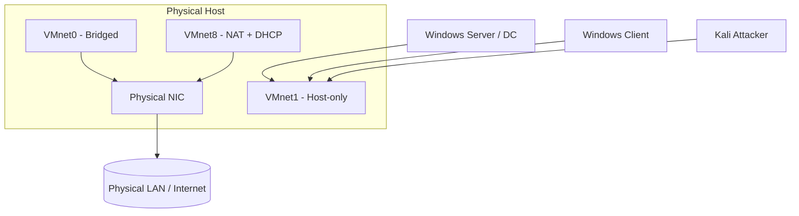

# VMware Workstation

VMware Workstation is a **Type-2 (hosted) hypervisor** from VMware (now part of Broadcom) that runs on top of a Windows or Linux host operating system and lets you create, run, and snapshot multiple isolated virtual machines. It is a popular choice for building a self-contained Windows/Active Directory lab because of its mature snapshot engine, flexible virtual networking, and stable Windows guest support.

## Overview

Because it is a **hosted** hypervisor, VMware Workstation relies on the host OS for hardware access rather than running directly on bare metal like [Proxmox](Proxmox-Setup.md) or a Type-1 product such as VMware ESXi. That trade-off — slightly lower performance for far easier setup — makes it well suited to a laptop/desktop lab. Conceptually it sits in the same category as [VirtualBox](VirtualBox-Network-Modes.md) and Linux [KVM](KVM(Kernel-based-Virtual-Machine).md), and the underlying ideas are covered in [Virtualization](Virtualization.md).

The product is sold as **VMware Workstation Pro** (full feature set) alongside the lighter **Workstation Player**. As of late 2024, Broadcom made Workstation Pro **free for personal use**, so a lab can use the full feature set without a licence.

> [!NOTE]
> **Host requirements**
> A 64-bit host with hardware virtualization (**Intel VT-x** or **AMD-V**) enabled in firmware/BIOS is required to run 64-bit guests. On Windows hosts, coexisting with Hyper-V-based features (WSL2, Credential Guard, Device Guard) depends on the **Windows Hypervisor Platform (WHP)** support in recent Workstation releases.

## Key Features

- **Snapshots** — capture a VM's exact disk, memory, and settings state and roll back to it instantly. Essential for malware detonation and repeatable labs.
- **Clones** — *linked clones* (small, share a base disk) and *full clones* (independent copies) for spinning up many similar hosts quickly.
- **Virtual networking** — bridged, NAT, and host-only modes plus fully custom segments via the **Virtual Network Editor**.
- **VMware Tools** — in-guest drivers/agent that add clipboard sharing, drag-and-drop, shared folders, better display, and time sync.
- **Nested virtualization** — expose VT-x/AMD-V to a guest so it can itself run a hypervisor (needed for Hyper-V or nested [KVM](KVM(Kernel-based-Virtual-Machine).md) labs).
- **VM encryption** and **restricted VMs** to protect sensitive images.

## Components and File Layout

A VMware VM is a folder of files rather than a single opaque image:

| File | Purpose |
|------|---------|
| `.vmx` | VM configuration (hardware, settings) — the file you "open" |
| `.vmdk` | Virtual hard disk |
| `.vmsn` | Snapshot state (memory + settings) |
| `.vmsd` | Snapshot metadata/dictionary |
| `.nvram` | Virtual BIOS/UEFI firmware state |
| `.vmem` | Paged guest memory (present while running/suspended) |

> [!TIP]
> **`.vmem` and forensics**
> A suspended VM's `.vmem` file is essentially a raw memory image of the guest. In a lab it is a convenient way to practice memory forensics or credential extraction without a separate acquisition step.

## Networking Modes

VMware exposes several virtual switches (VMnets). The three defaults map to the same concepts as other hypervisors:

| Mode | Default VMnet | Behaviour | Lab use |
|------|--------------|-----------|---------|
| **Bridged** | VMnet0 | Guest appears as a peer on the physical LAN with its own IP | Avoid for vulnerable targets |
| **NAT** | VMnet8 | Guest shares the host IP; outbound internet, no inbound from LAN | Updates / tool downloads |
| **Host-only** | VMnet1 | Private network between host and guests, no route out | Isolated AD/attack lab |
| **Custom / LAN segment** | VMnetX | Fully private switch with no host adapter | Air-gapped multi-VM lab |



The host-only segment (VMnet1) keeps the [vulnerable targets](Vulnerable-Machines.md) and attacker talking to each other while staying isolated from the physical network.

## Configuration

Networking is edited through **Edit > Virtual Network Editor** (Windows) or `vmware-netcfg` (Linux), where you assign subnets, toggle the built-in DHCP/NAT services, and create custom VMnets.

Workstation also ships the `vmrun` command-line tool for scripting VM operations against the local host:

```bash
# Power operations (nogui runs headless)
vmrun start "/path/to/DC01.vmx" nogui
vmrun stop  "/path/to/DC01.vmx" soft

# Snapshot lifecycle
vmrun snapshot          "/path/to/DC01.vmx" clean-baseline
vmrun listSnapshots     "/path/to/DC01.vmx"
vmrun revertToSnapshot  "/path/to/DC01.vmx" clean-baseline
```

> [!IMPORTANT]
> **Snapshot before you break it**
> Take a clean snapshot of every VM *before* the first lab exercise. Rolling back to a known-good state is faster and more reliable than trying to "clean" a compromised or misconfigured guest.

## Security Considerations

> [!WARNING]
> **The hypervisor is part of the attack surface**
> A hosted hypervisor shares the kernel and hardware with the host. **VM escape** vulnerabilities — bugs in emulated devices, shared-folder handling, or drag-and-drop/clipboard channels — can let code break out of the guest onto the host. Such flaws are a recurring category at competitions like Pwn2Own. Keep Workstation patched, and treat the host as reachable if a guest is fully compromised.

- **Disable convenience channels for detonation** — shared folders, clipboard sharing, and drag-and-drop are guest-to-host bridges; turn them off (and consider uninstalling VMware Tools) when running untrusted samples.
- **Never bridge a vulnerable VM** onto your real LAN — use host-only/custom segments so lab traffic cannot reach production or the internet.
- **Snapshots are not sanitization** — a reverted VM can still hold artefacts on disk; rebuild from a clean baseline for sensitive work.
- **Anti-analysis awareness** — malware commonly fingerprints VMware (VMware Tools processes, `vmx`/`vmmouse` devices, MAC OUIs) and alters behaviour; account for this when analysing samples.

## Best Practices

- Snapshot every VM in a **known-good clean state** before each lab, and roll back afterwards.
- Keep the lab on an **isolated host-only or custom segment** with no route to production unless an exercise explicitly needs internet.
- Right-size VMs (vCPU/RAM/disk) and prefer **linked clones** to save space when standing up many similar hosts.
- Install **VMware Tools** in trusted lab guests for stability — but disable/remove it for malware detonation.
- Keep Workstation and guest OS media patched; source Windows via the [evaluation media](Windows-Evaluation-Center.md) rather than untrusted keys.

## Troubleshooting

| Symptom | Likely cause & fix |
|---------|--------------------|
| "VT-x/AMD-V is disabled" or 64-bit guests won't boot | Enable Intel VT-x / AMD-V in firmware; on Windows, resolve Hyper-V/WHP coexistence |
| VMs on host-only can't reach each other | Guests placed on different VMnets — put them all on the same host-only/custom segment |
| No clipboard / shared folders / display resize | VMware Tools not installed or out of date in the guest |
| NAT guest has no internet | VMware NAT/DHCP service stopped, or wrong VMnet assigned in VM settings |

## References

- VMware Workstation Pro documentation: https://techdocs.broadcom.com/us/en/vmware-cis/desktop-hypervisors/workstation-pro.html
- Using the Virtual Network Editor: https://knowledge.broadcom.com/external/article/315810
- `vmrun` command reference: https://www.vmware.com/support/developer/vix-api/

## Related

- [Enterprise Windows Infrastructure Security](../Readme.md) — course hub
- [Virtualization](Virtualization.md) — related note (hypervisor concepts and Type-1 vs Type-2)
- [VirtualBox-Network-Modes](VirtualBox-Network-Modes.md) — related note (equivalent hosted hypervisor and its network modes)
- [KVM(Kernel-based-Virtual-Machine)](KVM(Kernel-based-Virtual-Machine).md) — related note (Linux Type-1/hybrid alternative)
- [Proxmox-Setup](Proxmox-Setup.md) — related note (bare-metal Type-1 lab platform)
- [Windows-Evaluation-Center](Windows-Evaluation-Center.md) — related note (legally sourcing Windows guest media)
- [Vulnerable-Machines](Vulnerable-Machines.md) — related note (isolated practice targets to run in the lab)
