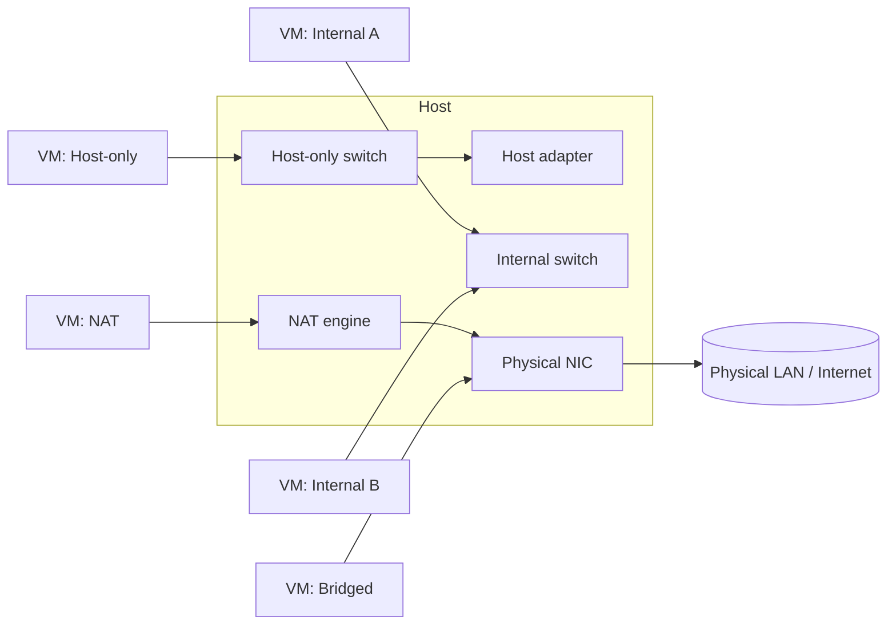

# Virtual Networking

Virtual networking is the software-defined plumbing that connects virtual machines to each other, to the host, and (optionally) to the physical LAN and internet. Choosing the right virtual network mode is what keeps a security lab **isolated and contained** while still letting the machines that need to talk, talk.

## Overview

Every hypervisor — VirtualBox, KVM/QEMU, Proxmox, VMware — emulates a **virtual NIC** inside each guest and wires it to a **virtual switch (vSwitch) or bridge** on the host. The mode you attach that virtual switch to decides who the VM can reach: only the host, only other lab VMs, the physical network, or the internet through NAT. Getting this layer right is the single most important safety control in a [virtualization](Virtualization.md) lab — it is how you stop a deliberately [vulnerable target](Vulnerable-Machines.md) or live malware sample from ever touching your production LAN.

This note covers the concepts that are common across all hypervisors. For the vendor-specific mapping in VirtualBox, see [VirtualBox-Network-Modes](VirtualBox-Network-Modes.md); for the Linux/libvirt side, see [KVM-and-QEMU-Setup-on-Kali-Linux](KVM-and-QEMU-Setup-on-Kali-Linux.md) and [Proxmox-Setup](Proxmox-Setup.md).

## How It Works

Three components make up a virtual network path:

- **Virtual NIC** — an emulated adapter presented to the guest OS (e.g. Intel e1000, or the paravirtualized `virtio-net`/`vmxnet3`). The guest sees an ordinary Ethernet interface and gets a MAC address the hypervisor assigns.
- **Virtual switch / bridge** — a software layer-2 switch on the host that forwards frames between virtual NICs (and optionally an uplink). On Linux this is typically a **Linux bridge** (`br0`, `virbr0`) or **Open vSwitch**; each VM attaches via a **TAP** device.
- **Backend / uplink** — what the vSwitch connects to: nothing (internal only), the host only, a NAT engine, or a physical adapter (bridged).

The chosen **network mode** simply determines which backend the virtual switch is bound to.

> [!NOTE]
> **Layer 2 vs. Layer 3**
> A bridge operates at **layer 2** (forwards Ethernet frames by MAC), while NAT operates at **layer 3** (rewrites IP addresses/ports). This is why bridged VMs appear as first-class hosts on the physical LAN, while NAT'd VMs hide behind the host's IP.

## Network Modes

| Mode | VM ↔ VM | VM → Host | VM → LAN/Internet | LAN → VM (inbound) | Typical lab use |
|------|:------:|:--------:|:-----------------:|:------------------:|-----------------|
| **NAT** | No | Limited | Yes (via host IP) | Only via port-forward | Give one VM outbound internet, fully hidden |
| **NAT Network** | Yes | Limited | Yes (via host IP) | Only via port-forward | Multiple VMs sharing NAT + talking to each other |
| **Bridged** | Yes | Yes | Yes (own IP on LAN) | Yes | VM behaves as a real host on the physical network |
| **Host-Only** | Yes | Yes | No | N/A | Isolated segment the host can also reach/manage |
| **Internal** | Yes | No | No | N/A | Fully air-gapped lab; host cannot even see it |

- **NAT** — the hypervisor runs a tiny router/DHCP for the guest. Traffic leaves masqueraded behind the host's IP. Simple, safe outbound access, but VMs can't reach each other and inbound requires explicit [port forwarding](../Proxy-Server-Administration/Port-Forwarding.md). See [NAT](../Proxy-Server-Administration/Network-Address-Translation(NAT).md) for the underlying mechanism.
- **NAT Network** — like NAT but a shared network so multiple guests interconnect while still NAT'ing outbound.
- **Bridged** — the virtual NIC is bridged onto a physical adapter; the VM pulls an IP from the **real** LAN's DHCP and is fully routable. Powerful but the least contained.
- **Host-Only** — a private virtual switch shared only by the host and attached VMs. No route to the outside; ideal for a management/attacker segment.
- **Internal** — a private switch with **no host uplink at all**. The gold standard for detonating malware or exposing vulnerable services.

## Architecture

The following diagram shows how virtual NICs attach to different virtual switches on one host, and which backends each mode reaches.



## Configuration

Inspect and manage the host-side virtual networks from the CLI. VirtualBox host-only interfaces:

```bash
# List / create VirtualBox host-only networks
VBoxManage list hostonlyifs
VBoxManage hostonlyif create
```

libvirt (KVM/QEMU) virtual networks are managed with `virsh`:

```bash
# List all libvirt networks (the default 'default' net is a NAT bridge)
virsh net-list --all
virsh net-dumpxml default
```

On the Linux host, virtual switches surface as bridge devices with VM TAP ports enslaved to them:

```bash
# Show host bridges and the interfaces attached to them
ip link show type bridge
bridge link show
```

> [!TIP]
> **Give each lab its own segment**
> Name and separate segments per engagement (e.g. an `internal` net for targets and a `host-only` net for the [attacker box](Vulnerable-Machines.md)). Reusing one flat network makes it easy to accidentally route lab traffic where it shouldn't go.

## Security Considerations

> [!WARNING]
> **The virtual switch is your containment boundary**
> A misconfigured network mode is the most common way a lab "escapes." A **bridged** vulnerable VM is a live, routable host on your real LAN — one exploit away from pivoting into your home/office network. Malware that beacons out over a **NAT** interface can phone home and leak that you are analyzing it.

- Default vulnerable targets to **Internal** or **Host-Only**; only enable NAT/Bridged deliberately and temporarily when a lab step needs internet.
- Bridged mode also enables **sniffing/spoofing** of the real LAN if the guest enables promiscuous mode — never bridge an untrusted guest.
- Attackers who compromise a host with multiple virtual NICs can use it as a **pivot** between an isolated segment and a routable one; treat multi-homed lab hosts as sensitive.
- Snapshot VMs on the intended network first, so a rollback can't silently restore a more-connected configuration.

## Best Practices

- Keep vulnerable/malware VMs on an **Internal** (air-gapped) switch by default; grant outbound access only per-lab.
- Put the host and attacker box on a shared **Host-Only** segment for management and tooling.
- Prefer **paravirtualized NICs** (`virtio-net`, `vmxnet3`) over emulated ones for throughput once the guest has drivers.
- Document each VM's IP, MAC, and network mode for reproducibility; use static addressing on isolated segments where no DHCP exists.
- Reserve **Bridged** mode for the rare case a VM must appear as a real host — and never for an untrusted target.

## Troubleshooting

| Symptom | Likely cause & fix |
| --- | --- |
| VMs on the same "network" can't ping each other | Plain **NAT** isolates guests — switch them to a **NAT Network**, **Internal**, or **Host-Only** segment. |
| Host can't reach a lab VM | VM is on **Internal** (no host uplink) — move it to **Host-Only** if the host must reach it. |
| VM has no internet on host-only/internal | Expected — those modes have no route out; use NAT or bridged for outbound. |
| Bridged VM gets no IP / wrong subnet | No DHCP on the physical LAN, or bridged to the wrong physical adapter (e.g. Wi-Fi, which often blocks bridging). |
| Two VMs get the same IP | Multiple hypervisor DHCP servers on one segment, or duplicate static assignments — consolidate to one DHCP source. |

## References

- [Oracle VirtualBox Manual — Virtual Networking](https://www.virtualbox.org/manual/ch06.html)
- [libvirt — Virtual Networking](https://wiki.libvirt.org/VirtualNetworking.html)
- [Proxmox VE — Network Configuration](https://pve.proxmox.com/wiki/Network_Configuration)
- [Microsoft Learn — Hyper-V virtual switch types](https://learn.microsoft.com/windows-server/virtualization/hyper-v/plan/plan-hyper-v-networking-in-windows-server)

## Related

- [Enterprise Windows Infrastructure Security](../Readme.md) — course hub
- [VirtualBox-Network-Modes](VirtualBox-Network-Modes.md) — related note (the same modes in VirtualBox specifically)
- [Virtualization](Virtualization.md) — related note (hypervisor concepts this builds on)
- [KVM-and-QEMU-Setup-on-Kali-Linux](KVM-and-QEMU-Setup-on-Kali-Linux.md) — related note (libvirt/KVM networking setup)
- [Proxmox-Setup](Proxmox-Setup.md) — related note (bridge-based Proxmox networking)
- [Network-Address-Translation(NAT)](../Proxy-Server-Administration/Network-Address-Translation(NAT).md) — related note (the NAT mechanism)
- [Port-Forwarding](../Proxy-Server-Administration/Port-Forwarding.md) — related note (reaching a NAT'd VM from outside)
- VLAN — related note (segmenting virtual networks at layer 2)
- [Vulnerable-Machines](Vulnerable-Machines.md) — related note (what you keep on an isolated segment)
