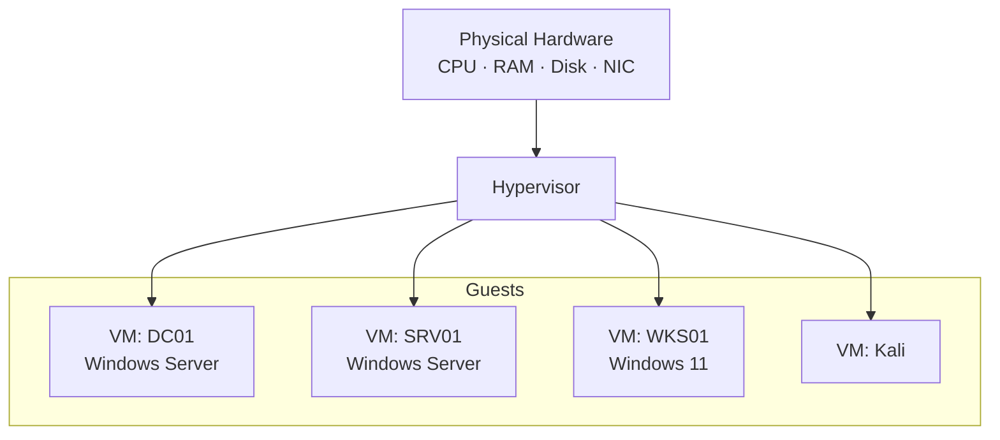

# Virtualization

Virtualization is the abstraction of physical compute, storage, and network resources into isolated virtual machines (VMs) managed by a hypervisor. It is the foundation of every lab in this course — an entire Windows enterprise (domain controllers, member servers, clients, and an attacker host) runs as VMs on a single workstation.

## Overview

A **hypervisor** (Virtual Machine Monitor) sits between physical hardware and guest operating systems, allocating CPU, memory, disk, and network to each VM while keeping them isolated from one another. This lets a single physical host run many independent operating systems simultaneously — ideal for building, breaking, and rebuilding an enterprise lab safely.

> [!NOTE]
> **Why virtualization matters for this course**
> The full `corp.local` domain lab (DC, member server, client, Kali) is impractical on physical hardware. Virtualization makes it repeatable: snapshot before a risky change, roll back in seconds, and clone servers from a template.

## Concepts

| Concept | Description |
|---|---|
| **Hypervisor** | Software layer that creates and runs VMs. |
| **Host** | The physical machine running the hypervisor. |
| **Guest** | The operating system running inside a VM. |
| **VM** | An emulated computer with virtual CPU, RAM, disk, and NICs. |
| **Snapshot** | A saved point-in-time state of a VM that can be restored. |
| **Template / Clone** | A reusable base image used to provision new VMs quickly. |
| **Paravirtualization** | Guest uses virtualization-aware drivers (e.g. VirtIO) for near-native I/O. |

### Type 1 vs Type 2 hypervisors

| | Type 1 (bare-metal) | Type 2 (hosted) |
|---|---|---|
| **Runs on** | Directly on hardware | On top of a host OS |
| **Performance** | Near-native | Slightly lower (host OS overhead) |
| **Examples** | Hyper-V, VMware ESXi, Proxmox VE, KVM | VMware Workstation, VirtualBox |
| **Best for** | Servers, always-on lab hosts | Desktop/workstation labs |

## Architecture



## Hardware Requirements

Hardware-assisted virtualization must be enabled in firmware before any 64-bit guest will run.

- **Intel VT-x** (plus **VT-d** for device/PCI passthrough)
- **AMD-V** (plus **AMD-Vi / IOMMU** for passthrough)

Verify support on a Linux host:

```bash
egrep -c '(vmx|svm)' /proc/cpuinfo
```

```text
0  -> Not supported or disabled in BIOS/UEFI
>0 -> Supported
```

> [!WARNING]
> **Enable virtualization in firmware first**
> If the count is `0`, reboot into BIOS/UEFI and enable Intel VT-x / AMD-V (and VT-d/IOMMU for passthrough). Nested virtualization must also be enabled if you plan to run Hyper-V inside a VM.

## Hypervisor Options

| Hypervisor | Type | Host OS | Notes in this module |
|---|---|---|---|
| VMware Workstation | 2 | Windows/Linux | [VMware-Workstation](VMware-Workstation.md) |
| VirtualBox | 2 | Windows/Linux/macOS | [VirtualBox-Network-Modes](VirtualBox-Network-Modes.md) |
| Hyper-V | 1 | Windows | [Hyper-V](Hyper-V.md) |
| Proxmox VE | 1 | Debian-based appliance | [Proxmox-Setup](Proxmox-Setup.md) |
| KVM/QEMU | 1 | Linux | [KVM(Kernel-based-Virtual-Machine)](KVM(Kernel-based-Virtual-Machine).md) · [KVM-and-QEMU-Setup-on-Kali-Linux](KVM-and-QEMU-Setup-on-Kali-Linux.md) |

## Security Considerations

- **Isolation is not a security boundary for malware analysis by default** — use host-only/internal networking so a compromised guest cannot reach the LAN or internet.
- Snapshot before running untrusted code so the VM can be rolled back to a clean state.
- Keep the hypervisor patched; VM-escape vulnerabilities target the virtual hardware layer.

## Best Practices

- Take a snapshot before every destabilizing change; name snapshots meaningfully.
- Build servers once, convert to a template, and clone the rest of the domain.
- Allocate resources conservatively — over-committing RAM degrades every guest.
- Isolate offensive labs on a dedicated internal/host-only network.

## Practical Lab

See [Lab-Design](Lab-Design.md) for a full multi-VM enterprise topology, and [Snapshots-and-Templates](Snapshots-and-Templates.md) for the snapshot/clone workflow that keeps it reproducible.

## References

- Microsoft — Virtualization documentation: <https://learn.microsoft.com/windows-server/virtualization/>
- Proxmox VE documentation: <https://pve.proxmox.com/pve-docs/>
- KVM project: <https://linux-kvm.org/>

## Related

- [Enterprise Windows Infrastructure Security](../Readme.md) — course hub and map of content
- [Lab-Design](Lab-Design.md) — how to lay out the full VM lab — related note
- [Virtual-Networking](Virtual-Networking.md) — connecting VMs to each other and the host — related note
- [Snapshots-and-Templates](Snapshots-and-Templates.md) — reproducible VM state and cloning — related note
- [Proxmox-Setup](Proxmox-Setup.md) — building a Proxmox hypervisor lab — related note
- [Vulnerable-Machines](Vulnerable-Machines.md) — running intentionally-vulnerable VMs — related note
- Docker — container-based virtualization — related note
