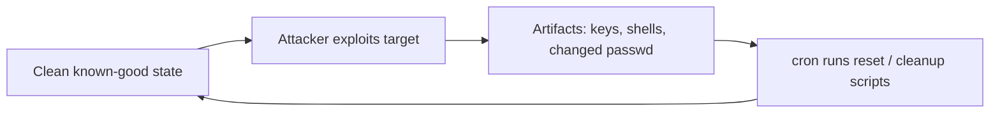

# Vulnerable Machines

Vulnerable machines are deliberately weakened hosts — full VMs or containers — that give you a legal, isolated target to practice enumeration, exploitation, and privilege escalation against. This note covers how to build a reusable Linux target, keep it self-resetting between attempts, and spin up containerised targets with Docker and Vulhub.

## Overview

A practice lab needs something to attack. Rather than touching production, you stand up intentionally vulnerable targets inside the isolated [virtualization](Virtualization.md) stack built earlier in this module — hosting them on [Proxmox](Proxmox-Setup.md), VirtualBox, or KVM and keeping them on a contained [host-only/internal network](VirtualBox-Network-Modes.md). Targets come in two broad forms: **full vulnerable VMs** (a whole OS you build or download) and **containerised targets** (per-application environments run with Docker). A well-built target is *repeatable*: you should be able to break it completely and get it back to a known-good state in seconds, either from a hypervisor snapshot or from a self-healing reset script.

## Types of Vulnerable Targets

| Type | What it is | Examples |
| --- | --- | --- |
| **Custom-built VM** | A base Linux/Windows install you deliberately misconfigure | The SSH/static-IP host built below |
| **Community VM images** | Prebuilt intentionally vulnerable OS images | VulnHub images, Metasploitable |
| **Vulnerable web apps** | A single insecure application to attack | DVWA, SeedDMS |
| **Containerised targets** | Per-CVE / per-app Docker environments | Vulhub |

> [!TIP]
> **Snapshot before you break it**
> Whichever target type you use, take a hypervisor snapshot of the clean state first. The reset scripts below are a second layer of repeatability, not a replacement for snapshots.

## Building a Vulnerable Target VM

The following builds a minimal Debian/Ubuntu-based target with remote access, a fixed address, and suppressed shell history so each attempt starts from the same state.

### Base Packages and SSH Access

Install a shell, editor, networking tools, and an SSH server so the target is reachable from the attacker box:

```bash
apt update
apt install bash*
apt install vim
apt install net-tools
apt install openssh-server ssh
```

Edit and review the SSH daemon configuration, then restart and enable the service:

```bash
vim /etc/ssh/sshd_config
grep -v "^#" /etc/ssh/sshd_config | sed '/^$/d'
systemctl restart ssh
systemctl enable ssh
```

Relevant `sshd_config` settings for a lab target (root login and password auth are intentionally permissive here — this is a practice box, never a production posture):

```text
PermitRootLogin yes
PasswordAuthentication yes
ChallengeResponseAuthentication no
UsePAM yes
X11Forwarding yes
PrintMotd no
AcceptEnv LANG LC_*
Subsystem	sftp	/usr/lib/openssh/sftp-server
```

### Credentials

Lab accounts and their passwords:

```text
Username	-	Password
root		-	root
sachin		-	root
```

### Static IP Address

Give the target a fixed address so lab tooling and notes stay consistent across reboots:

```bash
vim /etc/network/interfaces
```

Example `/etc/network/interfaces` for a host-only/internal lab segment:

```text
# This file describes the network interfaces available on your system
# and how to activate them. For more information, see interfaces(5).

source /etc/network/interfaces.d/*

# The loopback network interface
auto lo
iface lo inet loopback

# The primary network interface
allow-hotplug enp0s3
iface enp0s3 inet static
	address 192.168.1.220
	netmask 255.255.255.0
	network 192.168.1.0
	broadcst 192.168.1.255
	gateway 192.168.1.1
	dns-nameservers 8.8.8.8
```

### Suppress Shell History

Redirecting Bash history to `/dev/null` keeps each engagement clean and prevents one attempt from leaking hints (previously typed commands) into the next:

```bash
rm .bash_history
ln -s /dev/null ~/.bash_history
vim ~/.bashrc
```

Repeat for each user account:

```bash
su - sachin
rm .bash_history
ln -s /dev/null ~/.bash_history
vim ~/.bashrc
```

Append to `~/.bashrc` so history is never written to disk:

```bash
#Bash History Redirect to /dev/null
export HISTFILE=/dev/null
export HISTFILESIZE=0
```

## Keeping the Target Repeatable (Auto-Reset)

Intentionally vulnerable targets get modified, backdoored, and littered with attacker artifacts (uploaded keys, web shells, dropped files). Rather than rebuild by hand, schedule reset scripts with `cron` so the box heals itself on a timer. This is the software equivalent of rolling back a snapshot, useful for shared/always-on lab targets.



Example `crontab` for `root`:

```bash
crontab -l
```

```text
5 * * * * /root/reset.sh
* * * * * /root/cleanup.sh
*/3 * * * * rm /root/.ssh/authorized_keys
*/3 * * * * rm /dev/shm/*
```

> [!NOTE]
> **What each schedule does**
> The per-minute `cleanup.sh` scrubs application state, the hourly `reset.sh` restores core system files, and the every-3-minutes lines strip attacker-planted SSH keys (`authorized_keys`) and wipe shared memory (`/dev/shm`) — common persistence/dropper locations.

`reset.sh` — restore a clean `/etc/passwd` and wipe scratch directories:

```bash
#!/bin/bash

cp /root/passwd /etc/passwd
rm -rf /tmp/* /dev/shm/*
```

`cleanup.sh` — purge snap packages back to a known set:

```bash
#!/bin/bash

/usr/bin/snap list | tail -n +2 | grep -v '^core ' | awk '{print $1}' | while read s
do
  /usr/bin/snap remove --purge "$s"
done
```

`cleanup1.sh` — app-specific reset (here, a SeedDMS target): remove attacker-uploaded documents, restore monitoring scripts, clean `/tmp`, and restart the app:

```bash
#!/bin/bash

# Remove attached files (keep "Upgrade Note")
for d in `/usr/bin/find /var/www/html/seeddms51x/data/1048576/ -mindepth 1 -type d -mmin +5 -not -name 21`
do
  rm -rf $d
  id=${d##*/}
  /usr/bin/mysql -u root -p'ek)aizee^FaiModa~ce]z6c' seeddms <<DELETE_QUERY
DELETE FROM tblDocumentContent where id = $id;
DELETE FROM tblDocuments where id = $id;
DELETE_QUERY
done

# Restore monitoring scripts
/usr/bin/rm -rf /usr/local/monitoring/*
/usr/bin/cp /root/monitoring/* /usr/local/monitoring
/usr/bin/chmod 700 /usr/local/monitoring/*

# Clean /tmp directory
/usr/bin/rm -rf /tmp/*

# Restart php-fpm
/usr/bin/systemctl restart php-fpm.service

# Clean authorized_keys
> /root/.ssh/authorized_keys
```

## Containerised Targets with Docker and Vulhub

For per-application or per-CVE practice, Docker plus **Vulhub** (a curated collection of pre-built vulnerable environments) is faster than a full VM — each target is a `docker-compose` stack you bring up, attack, and tear down.

Install and enable Docker:

```bash
apt update
apt install docker*
apt install docker-compose docker
systemctl restart docker
systemctl enable docker
systemctl status docker
netstat -nltup | grep docker
```

Clone Vulhub (<https://github.com/vulhub/vulhub>) and launch a specific target — here the PHP 8.1 backdoor environment:

```bash
git clone https://github.com/vulhub/vulhub.git
cd /opt/vulhub/
cd /opt/vulhub/php/8.1.backdoor/
docker-compose build
docker-compose up -d
netstat -nltup
```

Tear the environment down (and remove its volumes) when finished:

```bash
docker-compose down -v
```

> [!TIP]
> **One target at a time**
> Bring up a single Vulhub stack at a time. Running many simultaneously overlaps ports and makes it unclear which service you are actually attacking.

## Security Considerations

> [!WARNING]
> **A vulnerable machine is hostile to everything around it**
> These targets are, by design, trivially exploitable and often run known malware, backdoors, or offensive tooling. Treat the whole target as compromised at all times.
> - **Never bridge** a vulnerable target onto your home/office LAN or expose it to the internet — keep it on an isolated host-only/internal segment.
> - Permissive settings shown here (`PermitRootLogin yes`, `root:root`, DNS to `8.8.8.8`) are lab conveniences and **must never** reach a real system.
> - The reset scripts run as `root` on a timer; understand exactly what they delete before deploying them, or they can wipe legitimate data.
> - Disable clipboard and shared-folder integration when detonating untrusted samples so nothing escapes the VM.

From the offensive side, these same reset mechanisms are worth studying: an attacker who gains a foothold must survive the box's self-healing (e.g. the every-3-minutes `authorized_keys` wipe), which is a realistic model of fighting defensive automation.

## Best Practices

- Snapshot the clean state in the hypervisor before every session; roll back rather than "cleaning" a used target.
- Keep targets on an isolated network with no route to production or the internet unless a specific lab requires it.
- Use reset scripts (cron) as a second layer on always-on/shared targets, but test them against a snapshot first.
- Document each target's IP, credentials, and exposed services so labs are reproducible.
- Rebuild from a golden image rather than trusting a target you have already exploited.

## Troubleshooting

| Symptom | Likely cause & fix |
| --- | --- |
| Attacker box can't reach the target | Wrong network mode or IP mismatch — confirm both VMs share the same host-only/internal segment and the static IP matches your notes |
| SSH login refused | `sshd` not enabled or `PermitRootLogin`/`PasswordAuthentication` not set — re-check `sshd_config`, then `systemctl restart ssh` |
| `docker-compose` command not found | Package missing — `apt install docker-compose`; on newer hosts use the `docker compose` plugin syntax |
| Vulhub stack won't bind ports | Another stack is already up — `docker-compose down -v` the previous target first |
| Reset script wiped something it shouldn't | Verify the golden copies exist (`/root/passwd`, `/root/monitoring/*`) before scheduling the cron jobs |

## References

- [Vulhub — pre-built vulnerable environments](https://github.com/vulhub/vulhub)
- [VulnHub — downloadable vulnerable VM images](https://www.vulnhub.com/)
- [Docker Compose documentation](https://docs.docker.com/compose/)

## Related

- [Enterprise Windows Infrastructure Security](../Readme.md) — course hub
- [Virtualization](Virtualization.md) — parent hub for the lab platform
- [Proxmox-Setup](Proxmox-Setup.md) — host these VMs on Proxmox
- [VirtualBox-Network-Modes](VirtualBox-Network-Modes.md) — isolate lab traffic with the right network mode
- Docker — containerised alternative targets
- DVWA-Lab-Setup — a vulnerable web app target
