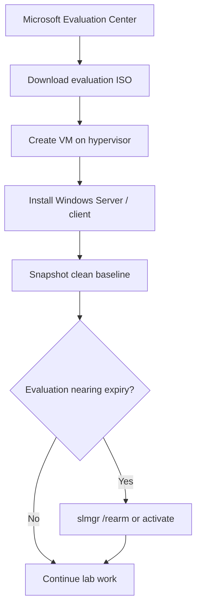

# Windows Evaluation Center

The Microsoft Evaluation Center is Microsoft's official portal for legally downloading and trialling full-featured evaluation editions of Windows Server, Windows client, and other Microsoft software. It is the correct, license-compliant way to source the Windows media used to build a home lab.

## Overview

When standing up a [virtualized](Virtualization.md) Windows/Active Directory lab you need real Windows media, but production keys and pirated ISOs are both off the table for study work. The Evaluation Center provides time-limited but otherwise complete builds — the same binaries as retail, activated under an evaluation license for a fixed number of days. This makes it the natural source for the Windows Server that becomes your future Domain Controller and the Windows client that joins the domain, alongside the [deliberately vulnerable targets](Vulnerable-Machines.md) you practise against. Evaluation editions can be rearmed to extend the window, or converted to a licensed edition later — see [Microsoft-Windows-Activation](Microsoft-Windows-Activation.md).

> [!NOTE]
> **Why evaluation media**
> Evaluation ISOs are free, legal, and rebuildable — exactly what a disposable, snapshot-driven lab needs. Pair them with [custom Windows 11 builds](Custom-build-Windows-11-ISO.md) when you need a tailored client image.

## Download Portal

Microsoft's Evaluation Center hosts server, client, and application evaluations behind a short registration form.

- [Microsoft Evaluation Center](https://www.microsoft.com/en-us/evalcenter/)
- [Microsoft Evaluation Center (India mirror)](https://www.microsoft.com/en-in/evalcenter)
- [Windows Server 2012 R2 Evaluation](https://www.microsoft.com/en-in/evalcenter/evaluate-windows-server-2012-r2)

For the range of editions you can pull down, see [Windows-Operating-System-Editions](../Fundamental-Of-Operating-System/Windows-Operating-System-Editions.md) (client) and [Windows-Server-Editions](../Windows-Server-Management/Windows-Server-Editions.md) (server).

## Evaluation Periods

Evaluation editions run for a fixed trial window, after which the OS begins nagging and eventually shuts down periodically until activated or rebuilt. Exact durations vary by product; the common cases are below.

| Product | Typical evaluation window |
|---------|---------------------------|
| Windows Server (Standard / Datacenter) evaluation | 180 days |
| Windows 10 / 11 Enterprise evaluation | 90 days |

> [!TIP]
> **Rearm to extend the trial**
> The evaluation clock can be reset a limited number of times with the built-in `slmgr` tool, buying more lab time without reinstalling. Check the remaining days and rearm count before it lapses.

Inspect the current licensing state and remaining rearm count:

```cmd
slmgr /dlv
```

Reset (rearm) the evaluation period when it nears expiry:

```cmd
slmgr /rearm
```

A reboot is required after a rearm for the reset to take effect. To convert an evaluation edition into a licensed one instead of rearming, follow [Microsoft-Windows-Activation](Microsoft-Windows-Activation.md).

## Sourcing Workflow

The end-to-end path from portal to a ready lab VM:



## Supplementary Tools & Resources

Additional references collected for lab building. These are third-party and unofficial unless noted.

### Version History & Archives

- [Windows Version History – Wikipedia](https://en.wikipedia.org/wiki/Microsoft_Windows_version_history)

### Network Monitoring (example tooling)

- [Wireshark 3.2.6 (64-bit) direct download](https://2.na.dl.wireshark.org/win64/all-versions/Wireshark-win64-3.2.6.exe)

### Windows Server Licenses & Deals

- [ServerBasket – Windows Server hosting, licensing & support](https://www.serverbasket.com/)

### Remove/Disable Windows Defender & Updates

> [!WARNING]
> **Use at your own risk**
> Disabling Windows Defender or updates weakens the host. These are **lab-only** conveniences for a contained, throwaway VM — never apply them to a machine with any route to production.

| Tool | Description | Link |
|------|-------------|------|
| **Windows Defender Remover** | Fully removes Windows Defender components. | [GitHub repo](https://github.com/jbara2002/windows-defender-remover) |
| **Windows Update Disabler** | Disables Windows automatic updates. | [GitHub repo](https://github.com/tsgrgo/windows-update-disabler) |
| **Update Notification Blocker** | Blocks Windows 10 update nags. | [GitHub repo](https://github.com/Voltstriker/Windows-10-Update-Notification-Blocker) |

These are third-party utilities not officially supported by Microsoft. Always snapshot the VM before modifying core system functions.

## Security Considerations

> [!WARNING]
> **Offensive and defensive relevance**
> Evaluation media is the *legal* way to build attack labs, but the tooling around it carries risk. Third-party "Defender remover" and "update disabler" utilities are downloaded and run with SYSTEM rights — they are unsigned binaries from untrusted repos and could themselves be trojanized. Run them only inside an isolated VM you are prepared to destroy, never on the hypervisor host or any networked machine. Deliberately disabling Defender and updates also mirrors what an attacker does post-compromise; it is realistic for a target VM, but it makes that VM a soft, un-patched host you must keep off any production-reachable network.

- Evaluation builds ship un-patched at whatever level the ISO was cut — treat a fresh eval VM as vulnerable until updated (or intentionally left un-patched as a practice target).
- Sourcing from the official Evaluation Center avoids the backdoored "activator" and tampered-ISO risk common to pirated media.

## Best Practices

- Download only from the official [Microsoft Evaluation Center](https://www.microsoft.com/en-us/evalcenter/); avoid third-party ISO mirrors and "activators".
- Verify the ISO before use and snapshot each VM in a clean, freshly-installed state before running any lab.
- Track the evaluation expiry per VM and rearm (or rebuild from snapshot) before it lapses rather than after.
- Confine Defender-removal and update-disabling tools to isolated, host-only lab networks — never the host or production.
- Prefer eval media plus rearm/activation over unlicensed keys to keep the lab license-compliant.

## Troubleshooting

| Symptom | Likely cause & fix |
| --- | --- |
| Server reboots periodically / "evaluation period expired" nag | Trial window elapsed — `slmgr /rearm` (if rearms remain) and reboot, activate a license, or rebuild from a clean snapshot |
| `slmgr /rearm` reports no rearms left | Rearm count exhausted — convert to a licensed edition ([Microsoft-Windows-Activation](Microsoft-Windows-Activation.md)) or reinstall from the eval ISO |
| Download requires sign-in / form | Evaluation Center gates ISOs behind a short registration — complete the form to reach the download link |

## References

- [Microsoft Evaluation Center](https://www.microsoft.com/en-us/evalcenter/)
- [Microsoft Learn — Windows Server evaluation versions and upgrades](https://learn.microsoft.com/windows-server/get-started/upgrade-conversion-options)
- [Microsoft Learn — Slmgr.vbs options for volume activation](https://learn.microsoft.com/windows-server/get-started/activation-slmgr-vbs-options)

## Related

- [Enterprise Windows Infrastructure Security](../Readme.md) — course hub
- [Virtualization](Virtualization.md) — hypervisor the eval VMs run on
- [Windows-Operating-System-Editions](../Fundamental-Of-Operating-System/Windows-Operating-System-Editions.md) — client trial editions
- [Windows-Server-Editions](../Windows-Server-Management/Windows-Server-Editions.md) — server trial editions
- [Microsoft-Windows-Activation](Microsoft-Windows-Activation.md) — evaluation activation and conversion
- [Custom-build-Windows-11-ISO](Custom-build-Windows-11-ISO.md) — building a tailored client image
- [Vulnerable-Machines](Vulnerable-Machines.md) — deliberately vulnerable practice targets
