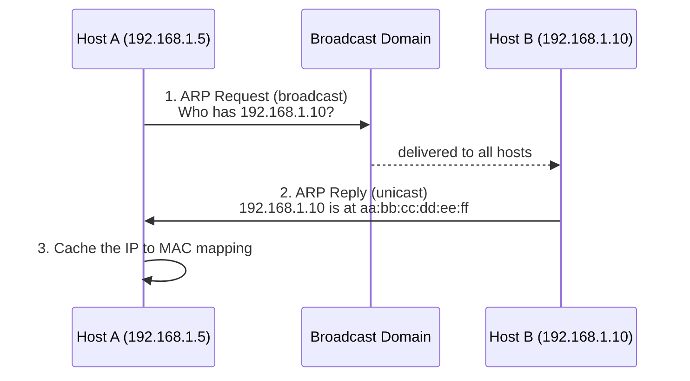

# Address Resolution Protocol (ARP)

The Address Resolution Protocol (ARP) maps a Layer 3 IPv4 address to the Layer 2 MAC (hardware) address of a host on the same local network. Hosts use it to answer the question "I know the IP — which physical NIC do I send this frame to?" before any IPv4 packet can leave the wire. ARP is defined in RFC 826.

## Overview

Two devices on the same Ethernet segment communicate by MAC address, but applications and routing work with IP addresses. ARP bridges that gap: given a target [IP-Address](IP-Address.md), it discovers the corresponding [Media-Access-Control(MAC)-Address](Media-Access-Control(MAC)-Address.md) so the sending host can build the Ethernet frame. It operates at the boundary of the Data Link and Network layers of the [The-OSI-Model-and-TCP-IP-Model](The-OSI-Model-and-TCP-IP-Model.md) and only resolves addresses **within a single broadcast domain** — a router, not ARP, moves traffic between subnets.

ARP is stateless and unauthenticated by design, which makes it simple and fast but also the root of several classic Layer 2 attacks discussed below. On [switched networks](Networking-Devices-and-Transmission-Media.md) the broadcast nature of ARP requests is what an attacker abuses to insert themselves between hosts.

> [!NOTE]
> **ARP is IPv4-only**
> ARP resolves **IPv4** to MAC. IPv6 does not use ARP at all — it uses the Neighbor Discovery Protocol (NDP) with ICMPv6 Neighbor Solicitation/Advertisement messages to achieve the same result.

## How It Works

Resolution is a two-message exchange scoped to the local link:

1. **ARP Request (broadcast)** — the source floods the segment with a frame addressed to `ff:ff:ff:ff:ff:ff`, asking *"Who has 192.168.1.10? Tell 192.168.1.5."* Every host in the broadcast domain receives it.
2. **ARP Reply (unicast)** — only the host that owns the queried IP answers, directly to the requester: *"192.168.1.10 is at aa:bb:cc:dd:ee:ff."*
3. **Caching** — the requester stores the IP-to-MAC pair in its **ARP cache** for a short time so it does not have to ask again for every packet. Entries age out after an OS-defined timeout.



If the destination IP is on a **different** subnet, the host does not ARP for the remote IP — it ARPs for its **default gateway's** MAC and hands the frame to the router.

## Packet Fields

ARP rides directly on top of Ethernet with EtherType `0x0806`. The key fields:

| Field | Meaning |
| --- | --- |
| Hardware Type | Link-layer type (1 = Ethernet) |
| Protocol Type | Layer 3 protocol being resolved (`0x0800` = IPv4) |
| Operation (Opcode) | 1 = Request, 2 = Reply |
| Sender Hardware Addr | Source MAC |
| Sender Protocol Addr | Source IP |
| Target Hardware Addr | Destination MAC (all zeros in a request) |
| Target Protocol Addr | IP being resolved |

## Types

- **Standard ARP** — the request/reply resolution described above.
- **Gratuitous ARP** — an unsolicited reply (or request) a host sends about **its own** IP-to-MAC binding. Used for duplicate-address detection and to update neighbors' caches after a failover or IP move (see RFC 5227).
- **Proxy ARP** — a router answers ARP requests on behalf of hosts on another segment, making separate networks appear as one. Largely legacy and often disabled for security.
- **Reverse ARP (RARP)** — obsolete predecessor that mapped MAC to IP; superseded by [DHCP](../Dynamic-Host-Configuration-Protocol-DHCP/Readme.md) and BOOTP.

## Configuration

Inspecting and managing the ARP cache is a routine troubleshooting task on both Windows and Linux.

View the current ARP cache on Windows:

```cmd
arp -a
```

Delete a specific cached entry (forces re-resolution) or the whole cache:

```cmd
arp -d 192.168.1.10
arp -d *
```

On modern Windows, prefer the `netsh` neighbor commands to view or add persistent entries:

```cmd
netsh interface ipv4 show neighbors
netsh interface ipv4 add neighbors "Ethernet" 192.168.1.10 aa-bb-cc-dd-ee-ff    # untested
```

On Linux, the `iproute2` `ip neigh` family has replaced the legacy `arp` tool:

```bash
ip neigh show
ip neigh add 192.168.1.10 lladdr aa:bb:cc:dd:ee:ff dev eth0 nud permanent    # untested
ip neigh flush all
```

> [!TIP]
> **Static entries harden a critical mapping**
> Pinning the default gateway's IP-to-MAC binding as a **static** ARP entry prevents an attacker's forged reply from overwriting it in the cache. It does not scale to every host, but it is a cheap protection for a handful of high-value targets.

## Security Considerations

Because ARP replies carry no authentication and hosts trust the last reply they receive, ARP is a foundational target on any LAN you can reach.

> [!WARNING]
> **ARP spoofing / ARP cache poisoning**
> An attacker on the same broadcast domain sends forged ARP replies binding the **gateway's IP to the attacker's MAC** (and vice versa). Both victim and gateway update their caches, and traffic silently flows through the attacker — a Layer 2 **man-in-the-middle** position enabling sniffing, session hijacking, credential capture, SSL-strip attempts, and selective packet manipulation or denial of service. Tools such as `arpspoof` (dsniff), Ettercap, and Bettercap automate this. It requires no exploit — only reachability — because it abuses ARP working exactly as designed.

Offensive relevance: ARP spoofing is often the first move to intercept plaintext or downgradeable traffic on a segment, and it pairs with rogue-DHCP and DNS-spoofing to fully control a victim's traffic path. Defensive relevance: detecting it means watching for a single MAC suddenly claiming multiple IPs, or the gateway IP mapping to an unexpected MAC.

> [!IMPORTANT]
> **Switches do not stop ARP spoofing by themselves**
> A switch segments **unicast** traffic, but ARP relies on broadcasts and cache trust, so a plain switch offers no protection. Mitigation requires switch features like **Dynamic ARP Inspection (DAI)**, which validates ARP packets against a trusted DHCP-snooping binding table.

## Best Practices

- Enable **Dynamic ARP Inspection (DAI)** together with **DHCP snooping** on managed switches to drop forged ARP replies.
- Use **static ARP entries** for critical hosts (gateways, servers) where practical.
- **Segment** the network with VLANs to shrink each broadcast domain and limit an attacker's spoofing reach.
- Deploy ARP-anomaly detection (for example, `arpwatch`) to alert on IP-to-MAC changes.
- Prefer authenticated, encrypted protocols so that even a successful MITM yields little usable data.

## Troubleshooting

| Symptom | Likely cause & fix |
| --- | --- |
| Host reachable by IP intermittently, wrong MAC in cache | Stale or poisoned ARP entry — flush with `arp -d` / `ip neigh flush`, then re-test |
| "Duplicate IP address" warning on the network | Two hosts share an IP, or a gratuitous-ARP conflict — locate and re-address the offender |
| Gateway IP maps to an unexpected MAC | Possible ARP spoofing — inspect the cache, correlate with `arpwatch`, enable DAI |
| Cannot reach a host on another subnet despite correct config | Missing/incorrect default gateway; the host cannot ARP across subnets — verify gateway and mask |

## References

- [RFC 826 — An Ethernet Address Resolution Protocol](https://www.rfc-editor.org/rfc/rfc826)
- [RFC 5227 — IPv4 Address Conflict Detection (gratuitous ARP)](https://www.rfc-editor.org/rfc/rfc5227)
- [Microsoft Learn — arp command reference](https://learn.microsoft.com/windows-server/administration/windows-commands/arp)
- [Cisco — Configuring Dynamic ARP Inspection](https://www.cisco.com/c/en/us/td/docs/switches/lan/catalyst4500/12-2/25ew/configuration/guide/conf/dynarp.html)

## Related

- [Enterprise Windows Infrastructure Security](../Readme.md) — course hub
- [Networking-Fundamentals](Networking-Fundamentals.md) — module overview
- [IP-Address](IP-Address.md) — the Layer 3 address ARP resolves from
- [Media-Access-Control(MAC)-Address](Media-Access-Control(MAC)-Address.md) — the Layer 2 address ARP resolves to
- [The-OSI-Model-and-TCP-IP-Model](The-OSI-Model-and-TCP-IP-Model.md) — where ARP sits in the stack
- [Networking-Devices-and-Transmission-Media](Networking-Devices-and-Transmission-Media.md) — switches and the broadcast domain ARP lives in
- [Dynamic Host Configuration Protocol (DHCP)](../Dynamic-Host-Configuration-Protocol-DHCP/Readme.md) — related module (address assignment)
- [Domain Name System (DNS)](../Domain-Name-System-DNS/Readme.md) — related module (name resolution)
