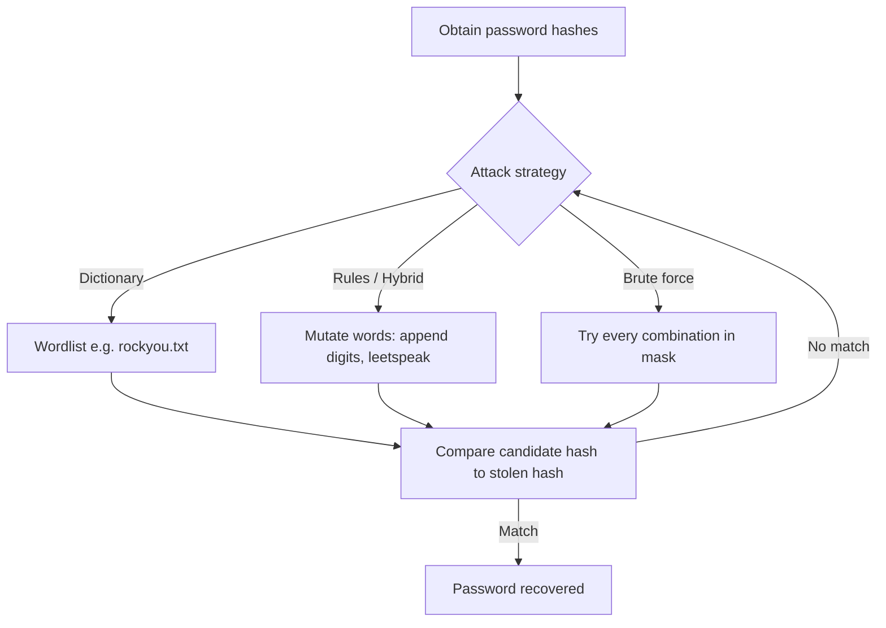

# How Secure Is My Password?

"How secure is my password?" is really a question about **how long it would take an attacker to guess it**. That time depends on the password's *entropy* (how unpredictable it is) and the *speed* at which an attacker can try candidates. This note explains how strength is estimated, points to trusted checkers, and connects the intuition to real offensive and defensive practice.

## Overview

A password's resistance to guessing is a function of two things: the **size of the search space** the attacker must cover, and the **rate** at which they can test candidates. The search space grows with both the character set used and, far more powerfully, the length of the password. Online strength meters simulate an attacker's guessing time to give a beginner-friendly sense of this trade-off.

In a Windows environment, passwords ultimately protect credentials that live as hashes in the [SAM and NTDS.dit](../Active-Directory-Domain-Services-AD-DS/SAM-vs-NTDS.dit.md) stores, and weak name-resolution protocols such as [NBNS](NetBIOS-Name-Service(NBNS).md)/LLMNR can leak those hashes to an attacker who then cracks them offline. Understanding password strength is therefore a foundational security topic, not just a usability tip. See also the parent [Networking-Fundamentals](Networking-Fundamentals.md) overview.

## How Password Strength Is Measured

Strength is commonly expressed as **entropy in bits** — the base-2 logarithm of the number of possible passwords of a given length and character set:

```text
entropy (bits) = length × log2(character_set_size)

Character set sizes:
  digits only            = 10
  lowercase letters      = 26
  lower + upper          = 52
  lower + upper + digits = 62
  + common symbols       ≈ 95
```

The takeaway is that **length dominates**. Adding one character to a password multiplies the search space by the size of the character set, whereas swapping in a symbol only widens the alphabet. This is why a long random *passphrase* usually beats a short "complex" password.

> [!TIP]
> **Length beats complexity**
> A 4-word random passphrase like `correct-horse-battery-staple` is far harder to brute-force than `P@ss1!` — and much easier for a human to remember. Prioritize length; use a password manager to reach it without memorizing junk.

### Password Strength Test Tools

These online tools estimate crack time and give improvement feedback. Treat them as **intuition builders**, never as a place to type a password you actually use.

| Tool Name | Description | Link |
|-----------|-------------|------|
| **Security.org – Password Checker** | Estimates how long it would take a hacker to crack your password. Very visual and beginner-friendly. | [Try it](https://www.security.org/how-secure-is-my-password/) |
| **Bitwarden Password Strength Tester** | Part of the Bitwarden password manager. Offers feedback on entropy and strength. | [Try it](https://bitwarden.com/password-strength/) |

> [!WARNING]
> **Never type a real password into a website**
> A strength checker cannot know whether it is trustworthy. Type a *pattern* of the same length and character mix instead, or use a checker that runs entirely in-browser (offline). Never paste a live credential.

## How Attackers Crack Passwords

An attacker rarely guesses passwords through a login form (that is slow and noisy). The high-value path is **offline cracking**: steal the password hashes, then test billions of candidates locally against them.



- **Dictionary attack** — test known words and previously breached passwords first; these fall almost instantly.
- **Rule / hybrid attack** — apply mutations (capitalize, append `123`, `!`, leetspeak) to dictionary words, catching the "predictable complexity" most humans use.
- **Brute force / mask attack** — exhaust a character set within a length; only feasible for short passwords, which is exactly why length matters.

An offline cracker such as `hashcat` runs these against captured hashes. For example, a dictionary attack against NTLM hashes:

```bash
hashcat -m 1000 -a 0 hashes.txt rockyou.txt   # NTLM, dictionary attack  # untested
```

> [!IMPORTANT]
> **Online vs offline speed**
> Online guessing is throttled by the target (lockouts, rate limits). Offline guessing is limited only by the attacker's hardware — modern GPUs test enormous numbers of fast hashes (like unsalted NTLM) per second. Design passwords to survive the *offline* case.

## Tips for Strong Passwords

- Use **at least 12 characters** — longer is better; mix uppercase, lowercase, numbers, and symbols.
- Avoid real words, names, dates, and keyboard patterns (`1234`, `qwerty`, `password`).
- Prefer a **random passphrase** of unrelated words (e.g. `correct-horse-battery-staple`).
- Use a **password manager** to generate and store unique, high-entropy passwords per site.
- Never reuse passwords — one breach then compromises every account (credential stuffing).
- Enable **multi-factor authentication (MFA)** wherever possible so a cracked password alone is not enough.

## Recommended Password Managers

- [Bitwarden](https://bitwarden.com/)
- [1Password](https://1password.com/)
- [KeePassXC (offline)](https://keepassxc.org/)

## Security Considerations

> [!WARNING]
> **A password is only as safe as its hash storage**
> Even a strong password can be stolen if the system stores it poorly (unsalted, fast hashes) or leaks it in transit. Offensive relevance: attackers who dump [SAM/NTDS.dit](../Active-Directory-Domain-Services-AD-DS/SAM-vs-NTDS.dit.md) or capture hashes via NBNS/LLMNR spoofing crack weak passwords in minutes and pivot with pass-the-hash. Defensive relevance: enforce length, screen against breached-password lists, and reduce the hash-exposure surface.

- **Reuse is the real killer** — breached credentials feed credential-stuffing attacks across unrelated sites.
- **Predictable complexity fails** — `Summer2024!` meets most complexity policies yet is caught by hybrid rules almost immediately.
- **Fast hashes accelerate cracking** — unsalted MD4/NTLM and unsalted MD5 crack orders of magnitude faster than slow, salted algorithms (bcrypt, Argon2).
- **MFA is the backstop** — it limits the damage when a password is eventually recovered.

## Best Practices

- Favor **length over forced complexity**; allow long passphrases (NIST SP 800-63B guidance).
- Screen new passwords against **known-breached password lists** and block them.
- Do **not** force arbitrary periodic rotation — it drives predictable, weaker passwords; rotate on evidence of compromise.
- Store secrets in a **password manager** and enforce **MFA** on all sensitive accounts.
- For systems you defend, store credentials with **slow, salted hashing** (bcrypt/Argon2) and minimize hash exposure.

## Troubleshooting

| Symptom | Likely cause & fix |
| --- | --- |
| Meter rates a "complex" password as weak | It matches a common pattern or breached password — choose a longer, unpredictable passphrase |
| Users keep picking guessable passwords | Complexity rules push predictable substitutions — switch to length + breached-list screening |
| Strong policy but accounts still compromised | Password reuse or missing MFA — enforce unique passwords via a manager and require MFA |

## References

- [NIST SP 800-63B — Digital Identity Guidelines (Authentication)](https://pages.nist.gov/800-63-3/sp800-63b.html)
- [Security.org — How Secure Is My Password?](https://www.security.org/how-secure-is-my-password/)
- [Have I Been Pwned — Pwned Passwords](https://haveibeenpwned.com/Passwords)

## Related

- [Enterprise Windows Infrastructure Security](../Readme.md) — course hub and map of content
- [Networking-Fundamentals](Networking-Fundamentals.md) — related note (module overview)
- [NetBIOS-Name-Service(NBNS)](NetBIOS-Name-Service(NBNS).md) — related note (name-resolution service abused to capture hashes for offline cracking)
