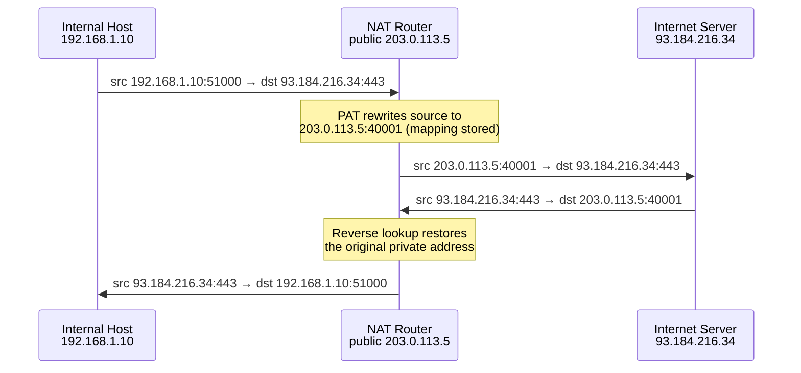

# IP Address

An **Internet Protocol Address (IP address)** is the fundamental identification label assigned to devices on IP-based networks to facilitate communication and location identification. IP addressing is central to the functioning of the Internet and private networks.

## Overview

An IP address serves two core functions: **host identification** (which device) and **location addressing** (which network). Two versions are in active use — **IPv4** (32-bit) and **IPv6** (128-bit) — and addresses are further divided into **public** (Internet-routable) and **private** (internal, non-routable) ranges.

> [!NOTE]
> **Layer context**
> IP addressing operates at the **Network Layer (Layer 3)** of the OSI model. Its Layer-2 counterpart is the [Media-Access-Control(MAC)-Address](Media-Access-Control(MAC)-Address.md), which IPs are resolved to via ARP.

## Concepts

### IP Address Versions

#### IPv4 (Internet Protocol Version 4)

- **Length:** 32 bits

- **Format:** Four decimal octets (e.g., `192.168.1.1`)

- **Address Space:** About 4.3 billion addresses

- **Historical Note:** Introduced in 1981 (RFC 791), IPv4 was designed during the early Internet era.

- **Limitation:** Limited address space has led to widespread **Network Address Translation (NAT)** usage.

- **Notation:** Dotted decimal notation (four numbers 0-255 separated by dots)

- **Example:** `172.16.254.1`

##### Table of binary numbers from 0 to 255 with their corresponding decimal values, following the pattern:

| Decimal | Binary | Decimal | Binary | Decimal | Binary | Decimal | Binary |
| :-- | :-- | :-- | :-- | :-- | :-- | :-- | :-- |
| 0 | 00000000 | 64 | 01000000 | 128 | 10000000 | 192 | 11000000 |
| 1 | 00000001 | 65 | 01000001 | 129 | 10000001 | 193 | 11000001 |
| 2 | 00000010 | 66 | 01000010 | 130 | 10000010 | 194 | 11000010 |
| 3 | 00000011 | 67 | 01000011 | 131 | 10000011 | 195 | 11000011 |
| 4 | 00000100 | 68 | 01000100 | 132 | 10000100 | 196 | 11000100 |
| 5 | 00000101 | 69 | 01000101 | 133 | 10000101 | 197 | 11000101 |
| 6 | 00000110 | 70 | 01000110 | 134 | 10000110 | 198 | 11000110 |
| 7 | 00000111 | 71 | 01000111 | 135 | 10000111 | 199 | 11000111 |
| 8 | 00001000 | 72 | 01001000 | 136 | 10001000 | 200 | 11001000 |
| 9 | 00001001 | 73 | 01001001 | 137 | 10001001 | 201 | 11001001 |
| 10 | 00001010 | 74 | 01001010 | 138 | 10001010 | 202 | 11001010 |
| 11 | 00001011 | 75 | 01001011 | 139 | 10001011 | 203 | 11001011 |
| 12 | 00001100 | 76 | 01001100 | 140 | 10001100 | 204 | 11001100 |
| 13 | 00001101 | 77 | 01001101 | 141 | 10001101 | 205 | 11001101 |
| 14 | 00001110 | 78 | 01001110 | 142 | 10001110 | 206 | 11001110 |
| 15 | 00001111 | 79 | 01001111 | 143 | 10001111 | 207 | 11001111 |
| 16 | 00010000 | 80 | 01010000 | 144 | 10010000 | 208 | 11010000 |
| 17 | 00010001 | 81 | 01010001 | 145 | 10010001 | 209 | 11010001 |
| 18 | 00010010 | 82 | 01010010 | 146 | 10010010 | 210 | 11010010 |
| 19 | 00010011 | 83 | 01010011 | 147 | 10010011 | 211 | 11010011 |
| 20 | 00010100 | 84 | 01010100 | 148 | 10010100 | 212 | 11010100 |
| 21 | 00010101 | 85 | 01010101 | 149 | 10010101 | 213 | 11010101 |
| 22 | 00010110 | 86 | 01010110 | 150 | 10010110 | 214 | 11010110 |
| 23 | 00010111 | 87 | 01010111 | 151 | 10010111 | 215 | 11010111 |
| 24 | 00011000 | 88 | 01011000 | 152 | 10011000 | 216 | 11011000 |
| 25 | 00011001 | 89 | 01011001 | 153 | 10011001 | 217 | 11011001 |
| 26 | 00011010 | 90 | 01011010 | 154 | 10011010 | 218 | 11011010 |
| 27 | 00011011 | 91 | 01011011 | 155 | 10011011 | 219 | 11011011 |
| 28 | 00011100 | 92 | 01011100 | 156 | 10011100 | 220 | 11011100 |
| 29 | 00011101 | 93 | 01011101 | 157 | 10011101 | 221 | 11011101 |
| 30 | 00011110 | 94 | 01011110 | 158 | 10011110 | 222 | 11011110 |
| 31 | 00011111 | 95 | 01011111 | 159 | 10011111 | 223 | 11011111 |
| 32 | 00100000 | 96 | 01100000 | 160 | 10100000 | 224 | 11100000 |
| 33 | 00100001 | 97 | 01100001 | 161 | 10100001 | 225 | 11100001 |
| 34 | 00100010 | 98 | 01100010 | 162 | 10100010 | 226 | 11100010 |
| 35 | 00100011 | 99 | 01100011 | 163 | 10100011 | 227 | 11100011 |
| 36 | 00100100 | 100 | 01100100 | 164 | 10100100 | 228 | 11100100 |
| 37 | 00100101 | 101 | 01100101 | 165 | 10100101 | 229 | 11100101 |
| 38 | 00100110 | 102 | 01100110 | 166 | 10100110 | 230 | 11100110 |
| 39 | 00100111 | 103 | 01100111 | 167 | 10100111 | 231 | 11100111 |
| 40 | 00101000 | 104 | 01101000 | 168 | 10101000 | 232 | 11101000 |
| 41 | 00101001 | 105 | 01101001 | 169 | 10101001 | 233 | 11101001 |
| 42 | 00101010 | 106 | 01101010 | 170 | 10101010 | 234 | 11101010 |
| 43 | 00101011 | 107 | 01101011 | 171 | 10101011 | 235 | 11101011 |
| 44 | 00101100 | 108 | 01101100 | 172 | 10101100 | 236 | 11101100 |
| 45 | 00101101 | 109 | 01101101 | 173 | 10101101 | 237 | 11101101 |
| 46 | 00101110 | 110 | 01101110 | 174 | 10101110 | 238 | 11101110 |
| 47 | 00101111 | 111 | 01101111 | 175 | 10101111 | 239 | 11101111 |
| 48 | 00110000 | 112 | 01110000 | 176 | 10110000 | 240 | 11110000 |
| 49 | 00110001 | 113 | 01110001 | 177 | 10110001 | 241 | 11110001 |
| 50 | 00110010 | 114 | 01110010 | 178 | 10110010 | 242 | 11110010 |
| 51 | 00110011 | 115 | 01110011 | 179 | 10110011 | 243 | 11110011 |
| 52 | 00110100 | 116 | 01110100 | 180 | 10110100 | 244 | 11110100 |
| 53 | 00110101 | 117 | 01110101 | 181 | 10110101 | 245 | 11110101 |
| 54 | 00110110 | 118 | 01110110 | 182 | 10110110 | 246 | 11110110 |
| 55 | 00110111 | 119 | 01110111 | 183 | 10110111 | 247 | 11110111 |
| 56 | 00111000 | 120 | 01111000 | 184 | 10111000 | 248 | 11111000 |
| 57 | 00111001 | 121 | 01111001 | 185 | 10111001 | 249 | 11111001 |
| 58 | 00111010 | 122 | 01111010 | 186 | 10111010 | 250 | 11111010 |
| 59 | 00111011 | 123 | 01111011 | 187 | 10111011 | 251 | 11111011 |
| 60 | 00111100 | 124 | 01111100 | 188 | 10111100 | 252 | 11111100 |
| 61 | 00111101 | 125 | 01111101 | 189 | 10111101 | 253 | 11111101 |
| 62 | 00111110 | 126 | 01111110 | 190 | 10111110 | 254 | 11111110 |
| 63 | 00111111 | 127 | 01111111 | 191 | 10111111 | 255 | 11111111 |

#### IPv6 (Internet Protocol Version 6)

- **Length:** 128 bits
- **Format:** Eight groups of four hexadecimal digits separated by colons (e.g., `2001:0db8:85a3:0000:0000:8a2e:0370:7334`)
- **Address Space:** Approximately $3.4 \times 10^{38}$ addresses — practically unlimited
- **Benefits:** Enhanced security (IPsec support), improved routing, and simpler address configuration with autoconfiguration features.
- **Adoption:** Increasing globally in mobile networks, cloud services, IoT, and next-gen networks.
- **Abbreviation:** Zero compression allowed (e.g., `2001:db8::1`)

> [!TIP]
> **Deep dive**
> See [IPv6](IPv6.md) for IPv6 address structure, notation rules, and autoconfiguration in detail.

### IPv4 Addressing: Classful vs. Classless

#### IP Address Classes

##### Class A

- Binary Range: `OFF0000000.00000000.00000000.00000000` to `OFF1111111.11111111.11111111.11111111`

- Representation: `OFFNNNNNNN.HHHHHHHH.HHHHHHHH.HHHHHHHH`

- Decimal Range: `0.0.0.0` to `127.255.255.255`

- No. of Network Bits: **7**

- No. of Host Bits: **24**

- No. of Networks: $2^7 - 2 = 128 - 2 = 126$

- No. of Hosts per Network: $2^{24} - 2 = 16777216 - 2 = 16777214$

- Usage: Reserved for Governments

##### Class B

- Binary Range: `ONOFF000000.00000000.00000000.00000000` to `ONOFF111111.11111111.11111111.11111111`

- Representation: `ONOFFNNNNNN.NNNNNNNN.HHHHHHHH.HHHHHHHH`

- Decimal Range: `128.0.0.0` to `191.255.255.255`

- No. of Network Bits: **14**

- No. of Host Bits: **16**

- No. of Networks: $2^{14} = 16384$

- No. of Hosts per Network: $2^{16} - 2 = 65536 - 2 = 65534$

- Usage: Reserved for Companies

##### Class C

- Binary Range: `ONONOFF00000.00000000.00000000.00000000` to `ONONOFF11111.11111111.11111111.11111111`

- Representation: `ONONOFFNNNNN.NNNNNNNN.NNNNNNNN.HHHHHHHH`

- Decimal Range: `192.0.0.0` to `223.255.255.255`

- No. of Network Bits: **21**

- No. of Host Bits: **8**

- No. of Networks: $2^{21} = 2097152$

- No. of Hosts per Network: $2^8 - 2 = 256 - 2 = 254$

- Usage: Reserved for Small Companies

##### Class D

- Binary Range: `ONONONOFF0000.00000000.00000000.00000000` to `ONONONOFF1111.11111111.11111111.11111111`

- Decimal Range: `224.0.0.0` to `239.255.255.255`

- Usage: Reserved for Multicasting

##### Class E

- Binary Range: `ONONONON00000.00000000.00000000.00000000` to `ONONONON1111.11111111.11111111.11111111`

- Decimal Range: `240.0.0.0` to `255.255.255.255`

- Usage: Reserved for Future Use

##### Classful IP Addressing with Bit Patterns, Binary Range, and Bit Partitioning

| Class | Starting Bits | Address Range (Decimal) | Address Range (Binary) | Network Bits | Host Bits | Number of Networks | Hosts per Network | Reserved For | Bit Partitioning Diagram |
| :--: | :--: | :-- | :-- | :--: | :--: | :--: | :--: | :--: | :--: |
| **A** | `0xxxxxxx` | 0.0.0.0 – 127.255.255.255 | `00000000.00000000.00000000.00000000` → `01111111.11111111.11111111.11111111` | 7 | 24 | $2^7 - 2 = 126$ <br>*(0.0.0.0 and 127.x.x.x reserved)* | $2^{24} - 2 = 16,777,214$ | Governments, very large orgs | `N N N N N N N . H H H H H H H H . H H H H H H H H . H H H H H H H H` |
| **B** | `10xxxxxx` | 128.0.0.0 – 191.255.255.255 | `10000000.00000000.00000000.00000000` → `10111111.11111111.11111111.11111111` | 14 | 16 | $2^{14} = 16,384$ | $2^{16} - 2 = 65,534$ | Large companies | `N N N N N N N N . N N N N N N N N . H H H H H H H H . H H H H H H H H` |
| **C** | `110xxxxx` | 192.0.0.0 – 223.255.255.255 | `11000000.00000000.00000000.00000000` → `11011111.11111111.11111111.11111111` | 21 | 8 | $2^{21} = 2,097,152$ | $2^8 - 2 = 254$ | Small companies | `N N N N N N N N . N N N N N N N N . N N N N N N N N . H H H H H H H H` |
| **D** | `1110xxxx` | 224.0.0.0 – 239.255.255.255 | `11100000.00000000.00000000.00000000` → `11101111.11111111.11111111.11111111` | – | – | – | – | Multicasting | *No network/host distinction* |
| **E** | `1111xxxx` | 240.0.0.0 – 255.255.255.255 | `11110000.00000000.00000000.00000000` → `11111111.11111111.11111111.11111111` | – | – | – | – | Experimental / Future use | *No network/host distinction* |

> [!NOTE]
> **Notes**
> - **N** = Network bit
> - **H** = Host bit
> - The subtraction of 2 from the total count of networks or hosts accounts for reserved network addresses (all 0s and all 1s subnet IDs).
> - The **127.x.x.x** range (loopback addresses) and **0.0.0.0** (source address) are reserved and not assignable to hosts in Class A.
> - Classes D and E do not have network/host division since Class D is for multicast groups and Class E is reserved for experimental use.

#### CIDR (Classless Inter-Domain Routing)

- Introduced in 1993 (RFC 1519) to improve IP address allocation efficiency.

- Allows flexible prefix lengths (e.g., `192.168.1.0/24`, where `/24` indicates the number of bits representing the network portion).

- Reduces waste of IP addresses and simplifies routing aggregation.

### IPv4 Public, Private and Reserved Addresses

#### Public IP Address Ranges

| Class | Address Range          |
|-------|-----------------------|
| A     | 1.0.0.0 – 126.255.255.255  |
| B     | 128.0.0.0 – 191.255.255.255|
| C     | 192.0.0.0 – 223.255.255.255|

#### Private Network Address Spaces (Non-Routable on Internet)

| Class | Address Range              | Typical Usage                 |
| :---- | :------------------------ | :----------------------------|
| A     | 10.0.0.0 – 10.255.255.255 | Large private networks        |
| B     | 172.16.0.0 – 172.31.255.255 | Medium-sized private networks |
| C     | 192.168.0.0 – 192.168.255.255 | Small private networks, home DSL |

#### Other Special Addresses

| Address Block       | CIDR Range               | Number of Addresses | Scope           | Description                                                                                   |
|---------------------|--------------------------|---------------------|-----------------|-----------------------------------------------------------------------------------------------|
| 0.0.0.0/8           | 0.0.0.0 – 0.255.255.255  | 16,777,216          | Software        | Current (local, "this") network                                                              |
| 10.0.0.0/8          | 10.0.0.0 – 10.255.255.255| 16,777,216          | Private Network | Used for local communications within a private network                                       |
| 100.64.0.0/10       | 100.64.0.0 – 100.127.255.255 | 4,194,304          | Private Network | Shared address space for provider-subscriber communication using carrier-grade NAT            |
| 127.0.0.0/8         | 127.0.0.0 – 127.255.255.255| 16,777,216          | Host            | Loopback addresses to the local host                                                         |
| 169.254.0.0/16      | 169.254.0.0 – 169.254.255.255 | 65,536             | Subnet          | Link-local addresses for communications on a single link without DHCP                         |
| 172.16.0.0/12       | 172.16.0.0 – 172.31.255.255 | 1,048,576           | Private Network | Used for local communications within a private network                                       |
| 192.0.0.0/24        | 192.0.0.0 – 192.0.0.255   | 256                 | Private Network | IETF Protocol Assignments such as DS-Lite                                                    |
| 192.0.2.0/24        | 192.0.2.0 – 192.0.2.255   | 256                 | Documentation   | TEST-NET-1: Reserved for documentation and examples                                          |
| 192.88.99.0/24      | 192.88.99.0 – 192.88.99.255| 256                 | Internet        | Reserved, formerly for IPv6 to IPv4 relay                                                    |
| 192.168.0.0/16      | 192.168.0.0 – 192.168.255.255 | 65,536             | Private Network | Used for local communications within a private network                                       |
| 198.18.0.0/15       | 198.18.0.0 – 198.19.255.255 | 131,072             | Private Network | Used for benchmark testing of inter-network communications between two subnets               |
| 198.51.100.0/24     | 198.51.100.0 – 198.51.100.255| 256                 | Documentation   | TEST-NET-2: Reserved for documentation and examples                                          |
| 203.0.113.0/24      | 203.0.113.0 – 203.0.113.255 | 256                 | Documentation   | TEST-NET-3: Reserved for documentation and examples                                          |
| 224.0.0.0/4         | 224.0.0.0 – 239.255.255.255 | 268,435,456         | Internet        | Multicast addresses (former Class D network)                                                 |
| 233.252.0.0/24      | 233.252.0.0 – 233.252.0.255 | 256                 | Documentation   | MCAST-TEST-NET: Documentation within multicast space                                        |
| 240.0.0.0/4         | 240.0.0.0 – 255.255.255.254 | 268,435,455         | Internet        | Reserved for future use (former Class E network)                                             |
| 255.255.255.255/32  | 255.255.255.255            | 1                   | Subnet          | Limited broadcast address                                                                    |

### IPv6 Address Types

| Type | Description | Example Address |
| :-- | :-- | :-- |
| **Unicast** | Identifies a single interface; one-to-one communication | `2001:db8::1` |
| **Multicast** | One-to-many communication | `ff02::1` (all nodes on local link) |
| **Anycast** | One-to-nearest communication among multiple interfaces | Same as unicast, assigned to multiple nodes |
| **Link-Local** | Valid only within a link or network segment | `fe80::abcd:1234` |
| **Unique Local Address (ULA)** | Private IPv6 address (similar to IPv4 private ranges) | `fd00::/8` |

## Administration

### IP Address Allocation and Management

- **IANA** manages global IP allocation.
- Regional Internet Registries (RIRs) handle regional delegations (e.g., ARIN, RIPE, APNIC).
- Organizations request blocks via RIRs to assign to ISPs or internal use.
- **Dynamic IPs:** Assigned temporarily (via DHCP) for flexible management.
- **Static IPs:** Manually assigned, persistent addresses for servers and essential devices.

### Network Address Translation (NAT)

- Allows multiple devices in private IP space to share a single public IP.
- Extends IPv4 usability despite address shortages.
- Types:
    - **Static NAT**: Maps one private IP to one public IP
    - **Dynamic NAT**: Maps private IPs to available public IPs dynamically
    - **PAT (Port Address Translation)** or NAT Overload: Multiple private IPs share a single public IP using port numbers.

The following sequence shows how PAT (NAT overload) rewrites a private source address on the way out and restores it on the way back.



> [!TIP]
> **Deep dive**
> See [Network-Address-Translation(NAT)](../Proxy-Server-Administration/Network-Address-Translation(NAT).md) for NAT/PAT configuration and behaviour in detail.

## Examples

### Useful IP Utilities and Commands

| Tool | Description | Examples |
| :-- | :-- | :-- |
| **ping** | Checks the reachability of a device | `ping 8.8.8.8` |
| **traceroute** | Traces packet path to destination | `traceroute google.com` / `tracert google.com` (Windows) |
| **nslookup** | Queries DNS for domain resolution | `nslookup example.com` |
| **ipconfig/ifconfig** | Shows IP configuration on local device | `ipconfig` (Windows), `ifconfig` or `ip addr` (Linux/macOS) |

```bash
# Show local IP configuration
ip addr                 # Linux
ipconfig /all           # Windows

# Test reachability and trace the path
ping 8.8.8.8
traceroute 8.8.8.8      # Linux/macOS
tracert 8.8.8.8         # Windows

# Resolve a name to an IP
nslookup example.com
```

## Security Considerations

> [!WARNING]
> **An IP is a signal, not a trust boundary**
> Source IP addresses are trivially spoofable on many paths and NAT hides many hosts behind a single public address, so never rely on an IP alone for authentication or access control. From an offensive perspective the addressing scheme itself leaks structure: private RFC 1918 ranges reveal internal segmentation, and reserved or documentation ranges (TEST-NET) seen in live traffic often indicate spoofing or misconfiguration.

### Modern IP Addressing and Security Considerations

- **IPv6 Adoption:** Encouraged to future-proof the Internet with virtually unlimited IPs.
- **Security:** IPv6 mandates IPsec integration; IPv4 uses optional IPsec.
- **Privacy Extensions:** Temporary IPv6 addresses to enhance user privacy.
- **Reverse DNS (rDNS):** Mapping IP addresses back to domain names, crucial for email servers and validation.
- **Reconnaissance value:** IP ranges are the first thing an attacker enumerates — see Network-Reconnaissance-Scanning for host discovery and scanning.

## Best Practices

- Plan address space with room to grow and document subnet boundaries before deploying services.
- Use RFC 1918 private ranges internally and translate to public addresses only at the network edge via NAT.
- Reserve static IPs for infrastructure (domain controllers, DNS, gateways) and use DHCP for general clients — keeping static assignments outside the DHCP scope.
- Adopt IPv6 deliberately (IPsec, privacy extensions, monitoring) rather than leaving it half-configured and unwatched.
- Filter reserved, bogon, and spoofed source ranges at network boundaries.

## Troubleshooting

| Symptom | Likely cause & fix |
| --- | --- |
| Two hosts on the same subnet can't communicate | Subnet mask or gateway mismatch — confirm both share the same network with `ipconfig` / `ip addr` |
| Host receives a `169.254.x.x` address | DHCP unreachable (APIPA / link-local fallback) — check the DHCP server, scope, and link connectivity |
| LAN works but public sites are unreachable | Gateway/NAT or DNS problem — verify the default gateway, `ping 8.8.8.8`, then `nslookup` a name |
| Intermittent connectivity / duplicate-IP warnings | A static IP collides with the DHCP pool — move static assignments outside the DHCP scope |

## References

- [RFC 791 — Internet Protocol (IPv4)](https://www.rfc-editor.org/rfc/rfc791)
- [RFC 8200 — Internet Protocol, Version 6 (IPv6) Specification](https://www.rfc-editor.org/rfc/rfc8200)
- [RFC 1918 — Address Allocation for Private Internets](https://www.rfc-editor.org/rfc/rfc1918)
- [IANA IPv4 Special-Purpose Address Registry](https://www.iana.org/assignments/iana-ipv4-special-registry/iana-ipv4-special-registry.xhtml)

## Related

- [Enterprise Windows Infrastructure Security](../Readme.md) — course hub and map of content
- [IP-Address-Versions](IP-Address-Versions.md) — IPv4 vs IPv6 forms of the IP address — related note
- [IPv6](IPv6.md) — 128-bit addressing in depth — related note
- [Network-Mask-Subnet-Mask-Net-Mask](Network-Mask-Subnet-Mask-Net-Mask.md) — splits an IP into network and host parts — related note
- [Media-Access-Control(MAC)-Address](Media-Access-Control(MAC)-Address.md) — layer-2 counterpart resolved to IPs via ARP — related note
- [ARP](ARP.md) — resolves IPv4 addresses to MAC addresses — related note
- [Network-Address-Translation(NAT)](../Proxy-Server-Administration/Network-Address-Translation(NAT).md) — sharing public IPs across private hosts — related note
- [Rules-for-Assigning-an-IP-Address-to-a-Device](Rules-for-Assigning-an-IP-Address-to-a-Device.md) — constraints on valid IP assignment — related note
- Network-Reconnaissance-Scanning — IP discovery and host scanning — related note
