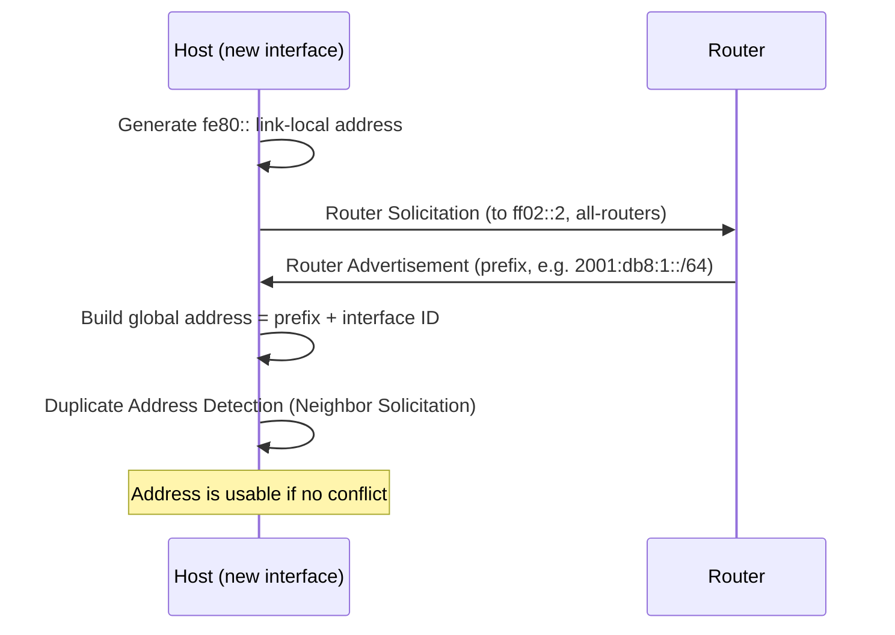

# IPv6 Addressing

**IPv6** (Internet Protocol version 6) is the 128-bit successor to IPv4, defined in **RFC 8200**. It expands the address space from ~4.3 billion to roughly 3.4 x 10^38 addresses and replaces IPv4 broadcast with a richer model of unicast, multicast, and anycast addressing.

## Overview

Where [IP-Address-Versions](IP-Address-Versions.md) compares the two protocols side by side, this note focuses on how an IPv6 address is actually built, written, and assigned. An IPv6 address is a 128-bit value split into a **network prefix** (which subnet the address belongs to) and an **interface identifier** (which host on that subnet) — the same conceptual split a [subnet mask](Network-Mask-Subnet-Mask-Net-Mask.md) provides for IPv4, but expressed as a prefix length. IPv6 sits at the Network / Internet layer of [the OSI / TCP-IP models](The-OSI-Model-and-TCP-IP-Model.md), the same layer as its predecessor.

A defining property of IPv6 is that an interface normally has **several addresses at once** — at minimum a link-local address plus one or more global or unique-local addresses — rather than the single primary address typical of IPv4.

> [!NOTE]
> **The standard subnet is a /64**
> In almost all IPv6 deployments a subnet is a **/64**: the first 64 bits are the network prefix and the last 64 bits are the interface identifier. This fixed boundary is what makes **SLAAC** (stateless address autoconfiguration) work, so avoid subnetting longer than /64 on links that use SLAAC.

## Address Structure

A 128-bit IPv6 address is written as **eight groups of four hexadecimal digits** (each group is a 16-bit "hextet"), separated by colons:

```text
2001:0db8:85a3:0000:0000:8a2e:0370:7334
```

Conceptually, for a typical /64 subnet:

```text
2001:0db8:85a3:1000 : 0000:0000:8a2e:7334
└──── prefix (64 bits) ────┘ └── interface ID (64 bits) ──┘
```

The prefix length is written in CIDR style (`/64`, `/48`, `/3`) and states how many leading bits are the network portion.

## Notation and Compression Rules

Two rules shorten the long form. They may be combined:

1. **Drop leading zeros** within each hextet: `0db8` -> `db8`, `0000` -> `0`.
2. **Collapse one run of consecutive all-zero hextets** to a double colon `::`.

```text
Full:        2001:0db8:85a3:0000:0000:8a2e:0370:7334
No leading0: 2001:db8:85a3:0:0:8a2e:370:7334
Compressed:  2001:db8:85a3::8a2e:370:7334
```

> [!WARNING]
> **Use :: only once**
> The `::` abbreviation may appear **at most once** in an address, because a parser expands it to however many zero hextets are needed to reach 128 bits. Two `::` would be ambiguous. `::1` is the loopback and `::` (all zeros) is the unspecified address.

## Address Types

IPv6 has **no broadcast**. Its address types are:

| Type | Purpose |
| --- | --- |
| **Unicast** | One-to-one; identifies a single interface. |
| **Multicast** | One-to-many; delivered to all interfaces in the group (replaces broadcast). |
| **Anycast** | One-to-nearest; a shared address routed to the closest of several interfaces. |

Unicast addresses are further scoped by their prefix:

| Prefix | Name | Scope / use |
| --- | --- | --- |
| `2000::/3` | **Global Unicast (GUA)** | Internet-routable; the public address of a host. |
| `fe80::/10` | **Link-Local (LLA)** | Auto-configured on every IPv6 interface; valid only on the local link, never routed. |
| `fc00::/7` | **Unique Local (ULA)** | Private, site-internal addressing (analogous to RFC 1918); `fd00::/8` in practice. |
| `::1/128` | **Loopback** | The host itself (IPv4 `127.0.0.1` equivalent). |
| `::/128` | **Unspecified** | "No address" — e.g. a source address before configuration. |
| `ff00::/8` | **Multicast** | Group destinations, e.g. `ff02::1` (all nodes), `ff02::2` (all routers) on the local link. |
| `2001:db8::/32` | **Documentation** | Reserved for examples and docs; never appears on a real network. |

> [!TIP]
> **Every interface has a link-local address**
> `fe80::/10` addresses are generated automatically whenever IPv6 is enabled, even on networks that "don't use IPv6." They are reachable by any host on the same segment, which is exactly why IPv6 is a common blind spot for defenders.

## How Addresses Are Assigned

A global or unique-local IPv6 address can be obtained two ways:

- **SLAAC (Stateless Address Autoconfiguration)** — the host derives its own address from the prefix advertised by a router. No server tracks the lease. This is the default on most networks and relies on **ICMPv6 Neighbor Discovery** (RFC 4861).
- **DHCPv6 (Stateful)** — a DHCPv6 server hands out addresses and options, analogous to IPv4 [DHCP](../Dynamic-Host-Configuration-Protocol-DHCP/Readme.md). Often used where central tracking of assignments is required.

The SLAAC exchange (Router Solicitation / Router Advertisement) works like this:



The 64-bit interface identifier is generated either from the MAC address via **EUI-64** (see [Media-Access-Control(MAC)-Address](Media-Access-Control(MAC)-Address.md)) or, on modern systems, as a random **privacy address** (RFC 8981) that rotates to limit tracking.

## Configuration

On **Windows**, list all IPv6 addresses and check the interface:

```cmd
ipconfig /all
netsh interface ipv6 show address
```

The equivalent PowerShell cmdlet:

```powershell
Get-NetIPAddress -AddressFamily IPv6
```

On **Linux**, show IPv6 addresses, the neighbor (ND) cache, and routes:

```bash
ip -6 addr
ip -6 neigh
ip -6 route
```

Test IPv6 reachability (add the zone/interface for link-local targets):

```bash
ping6 fe80::1%eth0    # untested
```

## Security Considerations

> [!WARNING]
> **IPv6 is the unwatched path**
> On **dual-stack** hosts IPv6 is usually enabled but unmonitored: firewall rules, IDS/IPS signatures, and ACLs are frequently written for IPv4 only. That gives IPv6 an unfiltered lane for lateral movement, C2, and exfiltration. The `fe80::/10` link-local reachability of every interface means an attacker on the segment can talk IPv6 to hosts that were never intended to route it.

- **Rogue Router Advertisements** — because SLAAC hosts trust whatever RA they receive, a spoofed RA can advertise the attacker as the default router or DNS server, redirecting traffic. This is the IPv6 analog of rogue-DHCP MITM. Tools such as **mitm6** exploit this to become the network's DNS server and then relay to services like LDAP.
- **RDNSS / DNS takeover** — an RA can also inject a malicious recursive DNS server, steering name resolution to the attacker.
- **Enumeration differs** — a /64 is far too large to sweep host-by-host, but IPv6 hosts are still discoverable via DNS `AAAA` records, multicast (`ff02::1`), and the neighbor cache. An IPv4-only scan simply misses them.
- **Address text is not identity** — like a MAC or IPv4 address, an IPv6 address can be spoofed and must never be an authentication boundary on its own.

## Best Practices

- Apply firewall, IDS/IPS, and ACL policy to **IPv6 with the same rigor as IPv4** — never leave one stack unmonitored.
- Enable **RA Guard** and **DHCPv6 Guard** on switches to block rogue router advertisements and rogue address assignment.
- If IPv6 is genuinely unused on a segment, disable it deliberately and consistently rather than leaving it half-enabled and unwatched.
- Keep subnets at **/64** where SLAAC is in use, and document which subnets/services are dual-stack.
- Prefer privacy (random) interface identifiers over EUI-64 where host tracking is a concern.

## Troubleshooting

| Symptom | Likely cause & fix |
| --- | --- |
| Host has only an `fe80::` address, no global one | No Router Advertisement received (or SLAAC disabled) — check router/RA config and that a /64 prefix is being advertised |
| `::` used more than once / address rejected | Only one `::` is legal per address — expand the extra zero run manually |
| Ping to a link-local address fails | Link-local pings need a zone index — use `ping6 fe80::1%eth0` (Linux) or `%<ifindex>` on Windows |
| Reachable over IPv4 but not IPv6 (or vice versa) | Only one stack routed/configured — verify with `ipconfig /all` or `ip -6 addr` and check the matching default route |

## References

- [RFC 8200 — Internet Protocol, Version 6 (IPv6) Specification](https://www.rfc-editor.org/rfc/rfc8200)
- [RFC 4291 — IP Version 6 Addressing Architecture](https://www.rfc-editor.org/rfc/rfc4291)
- [RFC 4861 — Neighbor Discovery for IP version 6](https://www.rfc-editor.org/rfc/rfc4861)
- [Microsoft Learn — Configure IPv6 for advanced users](https://learn.microsoft.com/troubleshoot/windows-server/networking/configure-ipv6-in-windows)

## Related

- [IP-Address-Versions](IP-Address-Versions.md) — IPv4-vs-IPv6 comparison and version history
- [IP-Address](IP-Address.md) — the addressing concept IPv6 implements
- [Network-Mask-Subnet-Mask-Net-Mask](Network-Mask-Subnet-Mask-Net-Mask.md) — prefix/host split, expressed for IPv6 as a prefix length
- [Rules-for-Assigning-an-IP-Address-to-a-Device](Rules-for-Assigning-an-IP-Address-to-a-Device.md) — assignment rules that also apply to IPv6
- [Media-Access-Control(MAC)-Address](Media-Access-Control(MAC)-Address.md) — source of the EUI-64 interface identifier
- [The-OSI-Model-and-TCP-IP-Model](The-OSI-Model-and-TCP-IP-Model.md) — where IP addressing sits in the network stack
- [Networking-Fundamentals](Networking-Fundamentals.md) — module overview
- [Enterprise Windows Infrastructure Security](../Readme.md) — course hub and map of content
