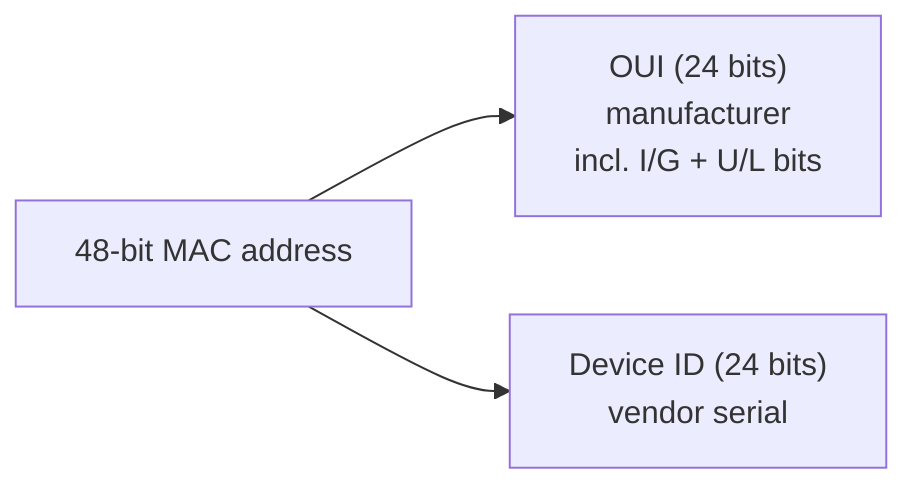

# MAC (Media Access Control) Address

A **MAC (Media Access Control) address** is a **48-bit hardware identifier** assigned to a network interface card (NIC). It operates at the **Data Link Layer (Layer 2)** of the OSI model and delivers frames between devices on the same **local area network (LAN)**.

## Overview

Where an [IP-Address](IP-Address.md) identifies a host logically at Layer 3 and can change as a device moves between networks, a MAC address identifies a NIC physically at Layer 2 and is (nominally) fixed to the hardware. Within a single broadcast domain, switches forward Ethernet frames using destination MAC addresses, while [IP](IP-Address.md)-to-MAC resolution is handled by ARP. See [The-OSI-Model-and-TCP-IP-Model](The-OSI-Model-and-TCP-IP-Model.md) for where Layer 2 sits, and [Networking-Devices-and-Transmission-Media](Networking-Devices-and-Transmission-Media.md) for the NICs and switches that rely on MAC addressing.


> [!NOTE]
> **Two addresses, two jobs**
> A packet keeps the same source/destination **IP** end to end, but its source/destination **MAC** is rewritten at every Layer-2 hop (each router re-frames it). MAC addressing is therefore only locally meaningful — it does not survive being routed.

## Address Format

- **Length:** 48 bits (6 bytes). Each byte ranges from `00` to `FF` (0–255).
- **Common representations** of the same address:

| Style | Example |
|-------|---------|
| Colon-separated | `00:1A:2B:3C:4D:5E` |
| Dash-separated | `00-1A-2B-3C-4D-5E` |
| Continuous | `001A2B3C4D5E` |

## Address Structure

A MAC address splits into two 24-bit halves: a manufacturer prefix and a device-specific portion.

| Part | Size | Description |
|------|------|-------------|
| OUI (Organizationally Unique Identifier) | 24 bits (3 B) | Identifies the manufacturer, assigned by the IEEE |
| Device-specific ID | 24 bits (3 B) | Unique serial assigned by the vendor to the NIC |

Two bits inside the **first octet** carry special meaning:

- **I/G bit** (least-significant bit of octet 1) — `0` = unicast, `1` = multicast/group.
- **U/L bit** (second-least-significant bit) — `0` = globally unique (OUI-based), `1` = locally administered (e.g. a spoofed or randomized address).



**Example:** `00:A0:C9:14:C8:29`

- `00:A0:C9` → manufacturer OUI
- `14:C8:29` → device-specific ID

An OUI therefore spans an address range from `00:A0:C9:00:00:00` to `00:A0:C9:FF:FF:FF`.

### Total address space

With 48 bits, the total number of addresses is 2⁴⁸ = 281,474,976,710,656 (≈ **281 trillion**).

### Static vs. changeable

- **Burned-in address (BIA):** factory-set in the NIC's ROM.
- **Spoofed / administratively set:** the OS can override the BIA in software (MAC spoofing), which sets the U/L bit.

## Types of MAC Addresses

| Type | Delivery | Example |
|------|----------|---------|
| Unicast | One-to-one | `00:1A:2B:3C:4D:5E` |
| Multicast | One-to-group | `01:00:5E:00:00:01` (IPv4 all-hosts 224.0.0.1), `33:33:00:00:00:02` (IPv6 all-routers FF02::2) |
| Broadcast | One-to-all on the LAN | `FF:FF:FF:FF:FF:FF` |

## Viewing MAC Addresses

Read the MAC (Physical) address of local interfaces:

```cmd
ipconfig /all
getmac /v
```

```bash
ip link show
ifconfig
```

View the local ARP cache (IP ↔ MAC mappings learned on the LAN):

```bash
arp -a
```

## Tracing a Device by MAC Address

| Situation | Trace by MAC? | How |
|-----------|---------------|-----|
| Local LAN | Yes | Router/switch CAM tables, ARP cache, network scans |
| Public Internet | No | MAC does not cross routers — not possible |
| Public Wi-Fi | Partial | Access points can detect nearby MACs (probe requests) |
| Corporate network | Yes | RADIUS/AAA logs, 802.1X, network monitoring |

- **On a LAN**, tools such as `nmap`, Angry IP Scanner, or Advanced IP Scanner map IP ↔ MAC; managed switches and routers list connected devices.
- **On public Wi-Fi**, access points can observe device MACs even before authentication and use them for analytics (e.g. crowd-movement tracking).
- **In corporate networks**, RADIUS servers log MACs during authentication so security teams can correlate them with user activity.

### Limitations of MAC tracing

- Works **only within the local network / broadcast domain**.
- Cannot trace a device across the **public Internet** (MAC is stripped/rewritten at each router).
- **Spoofable**, so it is unreliable as identity.
- Raises **privacy concerns** — unauthorized tracking may violate law or policy.

## Security Considerations

> [!WARNING]
> **MAC is not an authentication boundary**
> A MAC address is trivially changed in software, so any control that trusts it — Wi-Fi MAC filtering, "known device" allow-lists, MAC-based NAC — can be bypassed by cloning an authorized address. Never treat a MAC as proof of identity.

- **MAC spoofing** — an attacker sets their NIC to another device's MAC to bypass MAC filters, evade monitoring, or enable man-in-the-middle attacks (often paired with ARP spoofing; see [IP-Address](IP-Address.md) for the ARP relationship).
- **MAC filtering** — allow-listing MACs on an AP or switch gives only basic access control and is defeated by spoofing a permitted address.
- **MAC randomization** — modern OSes (Windows 10+, Android, iOS) present random, locally-administered MACs when probing Wi-Fi to reduce tracking; useful for privacy but it complicates asset inventory.

### Detection & defense

- Monitor for **duplicate MACs** in ARP/CAM tables — a classic sign of spoofing.
- Use switch **port security** to limit the number of MACs per port and shut/restrict a port when an unauthorized MAC appears.
- Enforce **802.1X** for real identity verification rather than relying on MAC filtering.

## Best Practices

- Treat MAC filtering as a nuisance control only; layer it behind 802.1X and WPA2/WPA3-Enterprise.
- Enable **port security** (and DHCP snooping / dynamic ARP inspection) on access switches to contain spoofing.
- Alert on ARP-cache anomalies (duplicate or rapidly changing IP↔MAC bindings).
- Keep an accurate NIC/asset inventory, and account for OS **MAC randomization** so it does not break monitoring.
- Segment LANs (VLANs) to shrink each broadcast domain and limit the reach of Layer-2 attacks.

## Troubleshooting

| Symptom | Likely cause & fix |
|---------|--------------------|
| Two hosts on the same subnet can't reach each other | Stale/incorrect ARP entry — clear the ARP cache and re-resolve |
| Device intermittently loses LAN connectivity | Duplicate MAC on the segment (spoofing or a misconfigured clone) — check switch CAM/ARP tables |
| Switch port keeps disabling | Port security tripped by an unexpected MAC — verify the authorized MAC or the allowed count |
| MAC changes on every reconnect | OS Wi-Fi MAC randomization is enabled — expected behavior; adjust per-network settings if needed |

## References

- [IEEE — Guidelines for Use of EUI, OUI, and CID](https://standards.ieee.org/products-programs/regauth/tut/)
- [IEEE 802 — Overview and Architecture](https://standards.ieee.org/ieee/802/6472/)
- [Microsoft Learn — ipconfig](https://learn.microsoft.com/windows-server/administration/windows-commands/ipconfig)

## Related

- [IP-Address](IP-Address.md) — layer-3 address mapped to the MAC via ARP
- [The-OSI-Model-and-TCP-IP-Model](The-OSI-Model-and-TCP-IP-Model.md) — places MAC at the data-link layer
- [Networking-Devices-and-Transmission-Media](Networking-Devices-and-Transmission-Media.md) — NICs and switches that use MAC addressing
- [Network-Protocol](Network-Protocol.md) — where Layer-2 addressing fits among network protocols
- [NetBIOS-Name-Service(NBNS)](NetBIOS-Name-Service(NBNS).md) — related LAN-local name/identity mechanism and spoofing vector
- [Enterprise Windows Infrastructure Security](../Readme.md) — course hub and map of content
