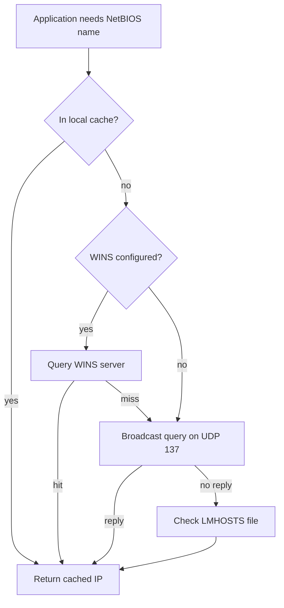

# NetBIOS Name Service (NBNS)

NetBIOS Name Service (NBNS) is a legacy protocol that resolves **NetBIOS names to IP addresses** within a Local Area Network (LAN). It fills a role similar to DNS but predates it, and it survives in modern Windows chiefly for backward compatibility — where it remains a reliable credential-theft vector on hostile segments.

## Overview

NBNS is the name-resolution component of **NetBIOS over TCP/IP (NBT)**, the mechanism that lets the older NetBIOS API run on top of a routable IP network. NetBIOS itself is an API that lets applications on different hosts talk over a LAN; it was designed for small networks that had no [directory or name protocol](Network-Protocol.md) of their own. Because NBNS resolution defaults to broadcast on the local segment and performs no authentication, any host can answer a query — the same property that makes it trivial to poison.

- **NetBIOS (Network Basic Input/Output System)** — an API allowing applications on different systems to communicate over a LAN.
- Originally designed for **small networks without DNS**.
- Still present in modern Windows systems for **backward compatibility**.

> [!NOTE]
> **Legacy, but not gone**
> Even in fully DNS-backed [Active Directory environments](Workgroup-vs-Peer-to-Peer-vs-Point-to-Point.md), NBNS (with its cousin LLMNR) is usually still enabled. It is queried as a *fallback* when DNS fails, and attackers deliberately trigger those failures to force a broadcast they can answer.

## NetBIOS Ports and Services

NBNS is one of three NetBIOS-over-TCP/IP services. See [TCP-vs-UDP](TCP-vs-UDP.md) for why name resolution uses UDP while the session service uses TCP.

| Protocol | Port | Service Name | Description |
| --- | --- | --- | --- |
| UDP | 137 | NetBIOS Name Service | Name resolution (NBNS) |
| UDP | 138 | NetBIOS Datagram Service | Connectionless communication (broadcasts) |
| TCP | 139 | NetBIOS Session Service | Stateful communication (SMB over NetBIOS) |

## How NBNS Works

1. **Name Registration** — a host registers its NetBIOS name on the network so others can find it.
2. **Name Query** — a client sends a request to **UDP port 137** to resolve a name to an [IP address](IP-Address.md).
3. **Response** — the target system (or a WINS server) responds with its IP address.

### NetBIOS Node Types

The **node type** determines *how* a host attempts to resolve a name — broadcast, server-based, or a mix.

| Mode | Description |
| --- | --- |
| **B-Node** | Broadcast only (no server) |
| **P-Node** | Uses NBNS server (e.g., WINS) |
| **M-Node** | Broadcast first, then NBNS server |
| **H-Node** | NBNS server first, then broadcast (**default in Windows when WINS is configured**) |

### Name Resolution Order

A typical resolution sequence on a Windows host:

1. Check **local NetBIOS cache**
2. Query **WINS server** (if configured)
3. Broadcast on LAN (UDP 137)
4. Check **LMHOSTS file**



> [!WARNING]
> **The broadcast step is the weak point**
> When resolution reaches the **broadcast** stage, the query goes to the whole segment and the *first* host to answer wins. There is no verification that the responder actually owns the name — this is exactly what NBNS spoofing exploits.

### NetBIOS Name Table Types

Registered NetBIOS names carry a one-byte **suffix** that identifies the service. These suffixes are what make `nbtstat -A` output so useful for enumeration — they reveal what roles a host plays.

| Suffix | Type | Meaning |
| --- | --- | --- |
| `<00>` | UNIQUE | Workstation name |
| `<00>` | GROUP | Workgroup name |
| `<20>` | UNIQUE | File server service (SMB) |
| `<1B>` | UNIQUE | Domain Master Browser |
| `<1C>` | GROUP | Domain Controllers |

## Enumeration

### Windows — nbtstat

The built-in `nbtstat` tool inspects local and remote NetBIOS name tables and cache state.

Show the **local** registered NetBIOS names (verify registration):

```cmd
nbtstat -n
```

Query a **remote system by IP** and retrieve its name table:

```cmd
nbtstat -A <IP>
```

```cmd
nbtstat -A 192.168.1.115
```

Same query, but **by hostname**:

```cmd
nbtstat -a <hostname>
```

Display the **NetBIOS name cache** (cached name-to-IP mappings):

```cmd
nbtstat -c
```

Purge the cache and reload **LMHOSTS** entries:

```cmd
nbtstat -R
```

Show **name-resolution statistics** (broadcast vs WINS counts, methods used):

```cmd
nbtstat -r
```

Release and refresh registered names with the WINS server:

```cmd
nbtstat -RR
```

Display active NetBIOS **sessions** — basic, then detailed:

```cmd
nbtstat -s
```

```cmd
nbtstat -S
```

> [!TIP]
> **Suffixes tell you the role**
> In `nbtstat -A` output, a `<1C>` group entry marks a **Domain Controller** and `<20>` marks an active **file/SMB server**. Reading suffixes lets you map roles across a subnet without touching the services themselves.

### Linux

Scan a subnet for NetBIOS names:

```bash
nbtscan 192.168.1.0/24
```

Retrieve the NetBIOS name table from a single host:

```bash
nmblookup -A 192.168.1.10
```

### Packet Filtering (Wireshark / tcpdump)

Capture NBNS traffic for analysis with this display/capture filter:

```text
nbns or udp.port == 137
```

Example name-table output:

```text
Name             Type   Status
----------------------------------------
WORKSTATION01    <00>   UNIQUE  Registered
```

## Security Considerations

NBNS is one of the most reliable footholds in an internal engagement precisely because it answers unauthenticated broadcast queries.

> [!WARNING]
> **NBNS poisoning leads to credential theft**
> - **NBNS spoofing** — an attacker replies to broadcast name queries with a **fake IP** (their own), impersonating the host the victim was looking for. `Responder` automates this.
> - **Man-in-the-Middle (MitM)** — once the victim connects to the attacker instead of the intended host, traffic can be intercepted and relayed.
> - **NTLM capture / relay** — the impersonated connection coaxes the victim into sending NTLM authentication; captured hashes are cracked offline or relayed to another service (e.g. SMB without signing) to authenticate as the victim.

Defensively, understand normal NBNS behavior so anomalous broadcast replies stand out, and treat any unexpected responder on UDP 137 as hostile.

## Best Practices

- Disable **NetBIOS over TCP/IP** on interfaces where it is not required.
- Prefer **DNS** for name resolution and retire NBNS/WINS where the environment allows.
- Block UDP ports **137–138** at network and segment boundaries.
- Enforce **SMB signing** to break NTLM relay following an NBNS spoof.
- Monitor for **unexpected NBNS traffic** and duplicate name-registration conflicts.

## Troubleshooting

| Symptom | Likely cause & fix |
| --- | --- |
| Name resolves to the wrong host intermittently | Possible NBNS spoofing on the segment, or a duplicate NetBIOS name — capture UDP 137 and identify the responder |
| Stale name-to-IP mapping after a host moves | Cached NBNS entry — clear with `nbtstat -R` |
| Host unreachable by NetBIOS name but reachable by IP | NetBIOS over TCP/IP disabled or UDP 137 blocked — verify the setting and firewall rules |
| Duplicate-name registration errors on boot | Two hosts claiming the same NetBIOS name — rename one or check for a spoofing host |

## Related Tools

| Tool | Purpose |
| --- | --- |
| `nbtscan` | NetBIOS network scanning |
| `nmblookup` | NetBIOS name resolution (Linux/Samba) |
| `Responder` | NBNS/LLMNR spoofing and hash capture |

## References

- [RFC 1001 — Protocol Standard for a NetBIOS Service on a TCP/UDP Transport: Concepts and Methods](https://www.rfc-editor.org/rfc/rfc1001)
- [RFC 1002 — NetBIOS Service on a TCP/UDP Transport: Detailed Specifications](https://www.rfc-editor.org/rfc/rfc1002)
- [The Hacker Recipes — LLMNR/NBT-NS/mDNS spoofing](https://www.thehacker.recipes/ad/movement/mitm-and-coerced-authentications/llmnr-nbtns-mdns-spoofing)

## Related

- [Enterprise Windows Infrastructure Security](../Readme.md) — course hub and map of content
- [Networking-Fundamentals](Networking-Fundamentals.md) — related note (networking overview)
- [Network-Protocol](Network-Protocol.md) — related note (what a network protocol is)
- [TCP-vs-UDP](TCP-vs-UDP.md) — related note (why NBNS uses UDP and NetBIOS sessions use TCP)
- [IP-Address](IP-Address.md) — related note (the address NBNS resolves names to)
- [Media-Access-Control(MAC)-Address](Media-Access-Control(MAC)-Address.md) — related note (layer-2 addressing on the same segment)
- [Workgroup-vs-Peer-to-Peer-vs-Point-to-Point](Workgroup-vs-Peer-to-Peer-vs-Point-to-Point.md) — related note (where NetBIOS name resolution is used)
