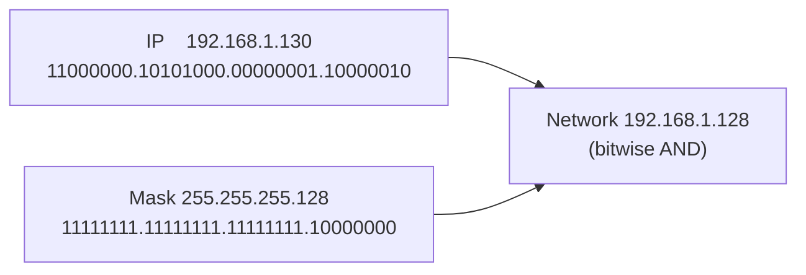

# Network Mask / Subnet Mask / Net Mask

A **Network Mask** (also called **Subnet Mask** or **Net Mask**) is a 32-bit value that determines which part of an IPv4 address refers to the **network portion** and which part refers to the **host portion**. It is essential for **subnetting**, **routing**, and efficient IP address allocation.

## Overview

Every IPv4 host is configured with both an [IP-Address](IP-Address.md) and a matching subnet mask. The mask tells the host where the network boundary falls inside the address: bits set to `1` mark the network prefix, bits set to `0` mark the host field. By applying the mask, a host can decide whether a destination is on the same local subnet (deliver directly) or on a remote network (send to the default gateway). Masks work hand-in-hand with the [Rules-for-Assigning-an-IP-Address-to-a-Device](Rules-for-Assigning-an-IP-Address-to-a-Device.md) and differ in form between IPv4 and IPv6 (see [IP-Address-Versions](IP-Address-Versions.md)). For the broader context of addressing and routing, see [Networking-Fundamentals](Networking-Fundamentals.md).

> [!NOTE]
> **The mask never travels on the wire**
> A subnet mask is **local configuration**, not part of the IP packet. Two hosts on the same wire can have different masks and reach different conclusions about who is "local" — a frequent cause of one-way connectivity problems.

## How a Subnet Mask Works

- **32 bits** long, the same width as an IPv4 address.
- Written in **dotted-decimal notation** (e.g., `255.255.255.0`).
- Divided into **4 octets** (8 bits each).
- **1s → network bits**, **0s → host bits** — and the `1`s are always contiguous, left-aligned.

**Example:**

```text
Subnet Mask:  255.255.255.0
Binary:       11111111.11111111.11111111.00000000
Network Bits: 24
Host Bits:    8
```

To find the network a host belongs to, the OS performs a **bitwise AND** of the IP address and the mask. Everything the mask covers with `1`s is kept; everything it covers with `0`s is zeroed to yield the network (subnet) address.



> [!TIP]
> **Read the mask, not just the class**
> The number of `1` bits (the prefix length, e.g. `/24`) is the fastest way to reason about a subnet: it fixes the network size, the host count (`2^host-bits − 2`), and the broadcast address. Learn to convert `/25 → 255.255.255.128` on sight.

## Default Subnet Masks by Class

### Class A

- Format: `N.H.H.H`
- Binary: `11111111.00000000.00000000.00000000`
- Default Mask: `255.0.0.0`
- Networks Available: `2^7 − 2 = 126`
- Hosts per Network: `2^24 − 2 = 16,777,214`

### Class B

- Format: `N.N.H.H`
- Binary: `11111111.11111111.00000000.00000000`
- Default Mask: `255.255.0.0`
- Networks Available: `2^14 − 2 = 16,382`
- Hosts per Network: `2^16 − 2 = 65,534`

### Class C

- Format: `N.N.N.H`
- Binary: `11111111.11111111.11111111.00000000`
- Default Mask: `255.255.255.0`
- Networks Available: `2^21 − 2 = 2,097,150`
- Hosts per Network: `2^8 − 2 = 254`

## Classful vs Classless Addressing

### Classful Addressing

**Classful addressing** is the original method of dividing IPv4 addresses into fixed-size **classes** (A, B, C, D, E) based on the leading bits of the address. It was used before **CIDR (Classless Inter-Domain Routing)** was introduced in 1993.

Key features:

1. **Fixed network and host portions** per class.
2. **No flexibility** in subnet size within a class.
3. **Subnet masks are implied** by class:
    - Class A → `/8` → `255.0.0.0`
    - Class B → `/16` → `255.255.0.0`
    - Class C → `/24` → `255.255.255.0`
4. Classes D and E have special purposes (multicast and experimental).

| Class | Leading Bits | Address Range | Default Mask | Usage |
|---|---|---|---|---|
| **A** | 0xxxxxxx | 0.0.0.0 – 127.255.255.255 | 255.0.0.0 (/8) | Very large networks, governments |
| **B** | 10xxxxxx | 128.0.0.0 – 191.255.255.255 | 255.255.0.0 (/16) | Medium to large companies |
| **C** | 110xxxxx | 192.0.0.0 – 223.255.255.255 | 255.255.255.0 (/24) | Small companies / LANs |
| **D** | 1110xxxx | 224.0.0.0 – 239.255.255.255 | N/A | Multicast |
| **E** | 1111xxxx | 240.0.0.0 – 255.255.255.255 | N/A | Experimental / future use |

Notes on classful addressing:

- **Network portion (N)**: the part of the IP identifying the network.
- **Host portion (H)**: the part identifying the individual host in that network.
- **Limitations:**
    - Wastes IP addresses (e.g., Class A networks are huge, even if only a few hosts are needed).
    - Inflexible subnetting.
    - Replaced largely by **CIDR** for efficient IP allocation.

### Classless Addressing (CIDR)

**Classless addressing** does **not rely on fixed classes (A, B, C)**. Instead, it allows **flexible subnet sizes** using a **prefix length** to specify the network portion. It was introduced with **CIDR** in 1993 to overcome the inefficiencies of classful addressing.

Key features:

1. **Flexible network sizes:** no fixed class restrictions.
2. **Prefix notation:** `/x` indicates the number of **network bits**.
    - Example: `192.168.1.0/24` → first 24 bits are network, remaining 8 bits are hosts.
3. **Efficient IP utilization:** minimizes wasted addresses.
4. **Supports route aggregation:** helps reduce the size of routing tables.

Example comparison:

| Network | Classful Mask | Classless Mask | Usable Hosts |
|---|---|---|---|
| 192.168.1.0 | /24 (Class C) | /26 | 62 |
| 10.0.0.0 | /8 (Class A) | /20 | 4094 |
| 172.16.0.0 | /16 (Class B) | /22 | 1022 |

> [!NOTE]
> **Variable Length Subnet Masking (VLSM)**
> Classless addressing lets **subnets of different sizes** coexist inside one network so each fits its actual host count — impossible with fixed classful masks. Advantages: efficient IP usage (no huge wasted networks), flexible subnetting (VLSM), simpler routing via aggregation, and forward compatibility with IPv4 and IPv6.

## Subnetting

Subnetting divides a large network into **smaller subnets** to improve efficiency, reduce broadcast congestion, and enhance security by segmenting broadcast domains.

### Example: Class A Network `10.0.0.0`

- Default Mask: `/8` → `255.0.0.0`
- Subnet Mask: `/25` → `255.255.255.128`
- Network Bits: 25
- Host Bits: 7
- Hosts per Subnet: `2^7 − 2 = 126`

**Subnets created:**

| Subnet | Usable IPs | Broadcast |
|---|---|---|
| 10.0.0.0/25 | 10.0.0.1 – 10.0.0.126 | 10.0.0.127 |
| 10.0.0.128/25 | 10.0.0.129 – 10.0.0.254 | 10.0.0.255 |

## CIDR (Classless Inter-Domain Routing)

CIDR allows **flexible IP allocation** beyond default class boundaries.

- **Slash notation:** `/x` → number of network bits.
- Examples:
    - `10.0.0.1/8` → Mask: `255.0.0.0`
    - `192.168.1.1/24` → Mask: `255.255.255.0`

### CIDR Table (Selected Values)

| CIDR | Subnet Mask | Usable Hosts |
|---|---|---|
| /8 | 255.0.0.0 | 16,777,214 |
| /16 | 255.255.0.0 | 65,534 |
| /24 | 255.255.255.0 | 254 |
| /25 | 255.255.255.128 | 126 |
| /26 | 255.255.255.192 | 62 |
| /27 | 255.255.255.224 | 30 |
| /28 | 255.255.255.240 | 14 |
| /29 | 255.255.255.248 | 6 |
| /30 | 255.255.255.252 | 2 |
| /32 | 255.255.255.255 | 1 |

Importance of subnetting and CIDR: prevents **IP wastage**, reduces **broadcast traffic**, enables **scalability**, and improves **routing efficiency** and **network security**.

## Security Considerations

The subnet mask defines the **broadcast domain** and, with routing, the **segmentation boundary** between trust zones. For an attacker it is the scoping primitive: the mask/CIDR of a compromised host reveals the size and shape of the surrounding network and directly drives host discovery.

> [!WARNING]
> **Masks define the attack surface**
> - **Scan scope** — the CIDR block is exactly what a scanner sweeps (`nmap 10.0.0.0/24`). A `/16` handed to an attacker is 65k targets; a `/24` is 254. An overly broad, flat subnet enlarges lateral-movement surface.
> - **Segmentation is only as good as the mask + ACLs** — a subnet boundary is a control only when routing/firewall rules enforce it. A misconfigured mask can silently place hosts in the same broadcast domain, exposing them to Layer-2 attacks (ARP spoofing, LLMNR/NBT-NS poisoning) they were meant to be isolated from.
> - **Broadcast-domain reach** — subnet-local attacks (rogue DHCP, ARP cache poisoning, name-service spoofing) are bounded by the broadcast domain the mask creates; smaller subnets shrink that blast radius.

- Segment sensitive assets into their own tightly-masked subnets and enforce the boundary with firewall/ACL rules, not the mask alone.
- Avoid oversized flat subnets; they maximize both broadcast noise and lateral movement.

## Best Practices

- Plan address space with room to grow and **document every subnet boundary** before deploying services.
- Use **VLSM** to size each subnet to its real host count rather than defaulting to `/24` everywhere.
- Reserve the **network address** (all host bits `0`) and **broadcast address** (all host bits `1`) — they are never usable host addresses.
- Keep management, server, and user populations in **separate subnets** to support segmentation and monitoring.
- Verify masks with a calculator (`ipcalc`, `sipcalc`) before rollout to catch overlap and off-by-one boundary errors.

## Troubleshooting

| Symptom | Likely cause & fix |
|---|---|
| Two hosts on the same wire can't reach each other | Mismatched subnet masks put them in different networks — align the mask on both. |
| Host reaches the LAN but not the internet | Gateway is outside the host's masked subnet — correct the mask or the gateway address. |
| "Duplicate/overlapping subnet" error on a router | Two subnets share address space — recompute non-overlapping ranges (watch VLSM boundaries). |
| Fewer usable hosts than expected | Network and broadcast addresses were counted — usable hosts = `2^host-bits − 2`. |

## References

- [RFC 950 — Internet Standard Subnetting Procedure](https://www.rfc-editor.org/rfc/rfc950)
- [RFC 4632 — Classless Inter-Domain Routing (CIDR)](https://www.rfc-editor.org/rfc/rfc4632)
- [RFC 1918 — Address Allocation for Private Internets](https://www.rfc-editor.org/rfc/rfc1918)
- [Microsoft Learn — TCP/IP addressing and subnetting](https://learn.microsoft.com/troubleshoot/windows-server/networking/tcpip-addressing-and-subnetting)

## Related

- [Enterprise Windows Infrastructure Security](../Readme.md) — course hub and map of content
- [IP-Address](IP-Address.md) — the address the mask partitions into network and host
- [IP-Address-Versions](IP-Address-Versions.md) — masking differs between IPv4 and IPv6
- [Rules-for-Assigning-an-IP-Address-to-a-Device](Rules-for-Assigning-an-IP-Address-to-a-Device.md) — subnet boundaries govern valid assignments
- [Networking-Fundamentals](Networking-Fundamentals.md) — module overview of addressing and routing
