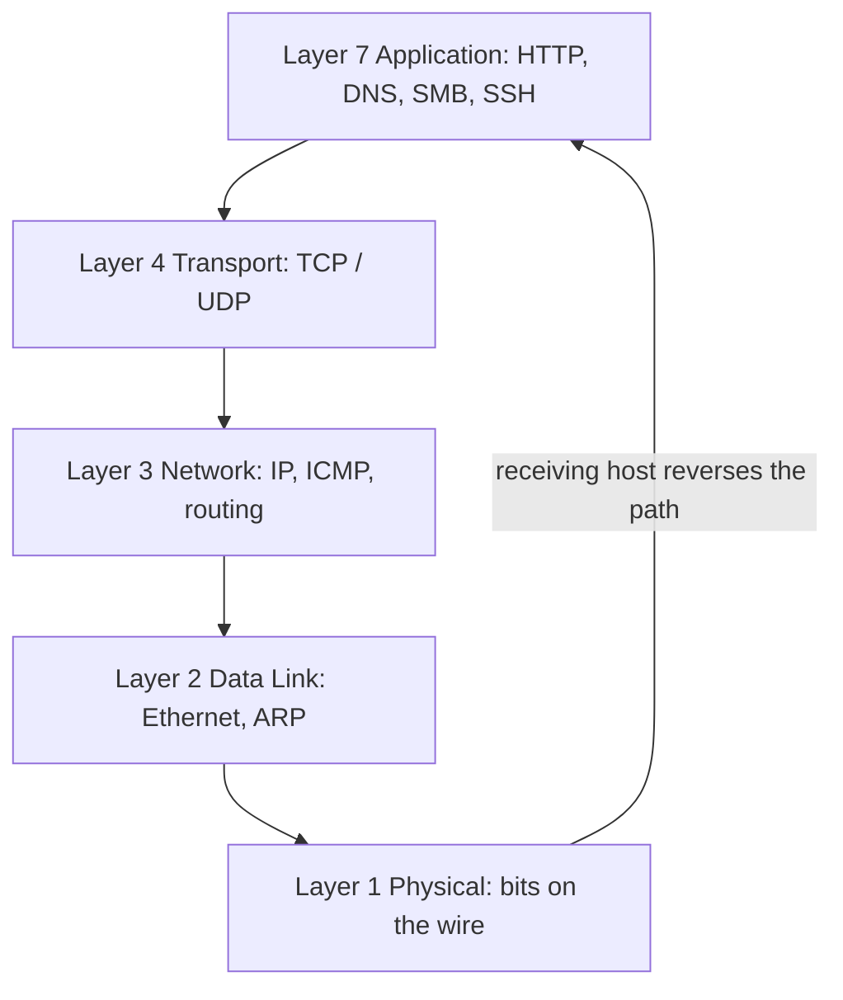

# Network Protocol

A network protocol is an agreed-upon set of rules that governs how devices format, address, transmit, receive, and interpret data across a network. Protocols let hardware and software from different vendors interoperate, and they are organized into layered stacks (OSI / TCP/IP) so each protocol solves one well-defined part of communication.

## Overview

Every conversation on a network — a web request, a DNS lookup, a file copy — is really a stack of protocols cooperating. Lower-layer protocols move raw bits and frames; higher-layer protocols give those bits meaning (a mail message, a directory query, a remote shell). Understanding which protocol operates at which layer is the foundation for reading traffic, enumerating services, and reasoning about attacks.

This note explains what a protocol *is* and what elements every protocol defines, then catalogs the common protocols organized by [OSI layer](The-OSI-Model-and-TCP-IP-Model.md). For the transport-layer distinction that most services build on, see [TCP-vs-UDP](TCP-vs-UDP.md); for addressing, see [IP-Address](IP-Address.md) and [Media-Access-Control(MAC)-Address](Media-Access-Control(MAC)-Address.md).

## Key Elements of a Protocol

Regardless of layer, a protocol specification pins down a common set of concerns:

- **Syntax** — the format and structure of messages: field order, header layout, and encoding.
- **Semantics** — the meaning of each field and what action a receiver takes in response.
- **Timing** — when a message may be sent and how fast, covering sequencing and rate.
- **Addressing** — how a sender identifies the intended recipient (MAC, IP address, port, hostname).
- **Error control** — detecting and (optionally) correcting corruption or loss, e.g. checksums and retransmission.
- **Flow & congestion control** — preventing a fast sender from overwhelming a slow receiver or the network.

> [!NOTE]
> **Protocols are contracts, not code**
> A protocol is a *specification* both endpoints agree to follow; many independent implementations of the same protocol interoperate precisely because they honour the same syntax, semantics, and timing rules.

## Protocol Layering

Protocols are stacked so each layer relies on the service below it and offers a service to the layer above. As data is sent, each layer wraps the payload from above in its own header — **encapsulation** — and the receiving stack strips those headers in reverse. This is why a single HTTP request rides inside TCP, inside IP, inside an Ethernet frame.

> [!TIP]
> **Map every service to a layer**
> When you see a port in a scan, ask "which protocol, which layer?" — it tells you what the service does, what a captured packet will look like, and which attacks apply (sniffing at L2, spoofing at L3, session hijacking at L4/7).

## Protocols by OSI Layer

### Network Layer (Layer 3)

The **Network Layer** handles logical addressing and routing of packets across internetworks.

| Protocol         | Full Form                                  | Purpose                                         |
|-----------------|--------------------------------------------|------------------------------------------------|
| **IPv4 / IPv6**  | Internet Protocol v4 / v6                  | Primary packet delivery and addressing         |
| **ICMP / ICMPv6**| Internet Control Message Protocol / for IPv6 | Error messaging & diagnostics (`ping`, `traceroute`) |
| **IGMP**         | Internet Group Management Protocol          | IPv4 multicast group membership management     |
| **ARP / NDP**    | Address Resolution Protocol / Neighbor Discovery Protocol | IPv4 address‑to‑MAC (ARP) & IPv6 neighbor discovery (NDP) |
| **IPsec**        | Internet Protocol Security                  | Authenticates & encrypts IP packets (AH/ESP) |
| **GRE**          | Generic Routing Encapsulation               | Generic encapsulation of Layer‑3 payloads     |
| **MPLS**         | Multiprotocol Label Switching               | Label-switched packet forwarding (L2.5 layer) |
| **OSPF**         | Open Shortest Path First                     | Link-state routing protocol                    |
| **IS‑IS**        | Intermediate System to Intermediate System | Link-state routing protocol                    |
| **RIP**          | Routing Information Protocol                 | Distance-vector routing protocol               |
| **EIGRP**        | Enhanced Interior Gateway Routing Protocol  | Hybrid routing protocol (Cisco proprietary)   |
| **BGP**          | Border Gateway Protocol                      | Path-vector routing protocol (Internet-wide)  |

### Transport Layer (Layer 4)

The **Transport Layer** provides end‑to‑end delivery, reliability, and flow control. See [TCP-vs-UDP](TCP-vs-UDP.md) for the core comparison.

| Protocol | Full Form | Connection Model | Key Features | Common Ports |
|---------|-----------|----------------|--------------|-------------|
| **TCP**  | Transmission Control Protocol | Connection-oriented | Reliable, ordered, congestion & flow control | Dynamic per service (HTTP 80, HTTPS 443, etc.) |
| **UDP**  | User Datagram Protocol        | Connectionless     | Low overhead, no delivery guarantee           | DNS 53, DHCP 67/68, others |
| **SCTP** | Stream Control Transmission Protocol | Connection-oriented | Multi-stream, multi-homing, message-oriented | 9899 (discovery), varies per app |
| **DCCP** | Datagram Congestion Control Protocol | Connection-oriented | Congestion-controlled, unreliable datagrams | 5678 (experimental), varies |
| **QUIC** | Quick UDP Internet Connections | Connection-oriented (over UDP) | TLS 1.3 integrated, 0‑RTT, multiplexed streams | UDP 443 |
| **SPX**  | Sequenced Packet Exchange     | Legacy (Novell NetWare) | Superseded by TCP/IP | — |

### Session Layer (Layer 5)

The **Session Layer** establishes, manages, and terminates logical sessions between two hosts.

| Protocol | Full Form | Typical Use | Notes |
|---------|-----------|------------|------|
| **NetBIOS** | Network Basic Input/Output System | Legacy Windows LAN sessions | Largely replaced by SMB over TCP 445 — see [NetBIOS-Name-Service(NBNS)](NetBIOS-Name-Service(NBNS).md) |
| **RPC**     | Remote Procedure Call            | Distributed computing / remote procedure calls | e.g., Microsoft DCOM, NFS Port-mapper |
| **SIP**     | Session Initiation Protocol      | Signalling for VoIP, video, IM, presence | Usually over UDP/TCP 5060 (unencrypted) or 5061 (TLS) |
| **RTSP**    | Real Time Streaming Protocol     | Control of streaming media servers | TCP 554; works with RTP at Transport layer |
| **PPTP***   | Point-to-Point Tunneling Protocol | VPN tunnelling (obsolete) | GRE IP proto 47 & TCP 1723; insecure, prefer L2TP/IPsec or OpenVPN |
| **L2TP**    | Layer 2 Tunneling Protocol       | VPN tunnelling | UDP 1701; normally combined with IPsec |

*Deprecated or discouraged for new deployments.*

### Application Layer (Layer 7) – Selected Protocols & Ports

#### File Services

| Protocol      | Full Form                     | Default Port(s)       | Notes |
|--------------|-------------------------------|---------------------|------|
| **SMB / CIFS** | Server Message Block / Common Internet File System | TCP 445 (UDP 137/138 legacy) | Windows file & printer sharing |
| **NFS**       | Network File System           | TCP/UDP 2049 (plus RPC 111) | Unix/Linux file sharing |
| **AFP**       | Apple Filing Protocol         | TCP 548 (SLP 427)    | Apple file sharing (deprecated macOS 11+) |
| **FTP**       | File Transfer Protocol        | TCP 21 (control), 20 (data – active mode) | Unencrypted; use **FTPS** or **SFTP** for security |
| **TFTP**      | Trivial File Transfer Protocol | UDP 69              | Simple, no authentication |

#### Web

| Protocol | Full Form | Port | Secure Variant |
|---------|-----------|------|----------------|
| **HTTP**  | Hypertext Transfer Protocol | TCP 80  | — |
| **HTTPS** | Hypertext Transfer Protocol Secure | TCP 443 | TLS-encrypted |

#### Email

| Protocol | Full Form | Port(s) | Function |
|---------|-----------|---------|---------|
| **SMTP** | Simple Mail Transfer Protocol | TCP 25 (relay), 587 (submission), 465 (SMTPS) | Sending mail |
| **POP3** | Post Office Protocol v3 | TCP 110 / 995 (SSL) | Downloading mail, deletes by default |
| **IMAP4** | Internet Message Access Protocol v4 | TCP 143 / 993 (SSL) | Synchronised mail access |

#### Remote Access

| Protocol | Full Form | Port | Notes |
|---------|-----------|------|------|
| **SSH**  | Secure Shell | TCP 22 | Secure shell, also SCP/SFTP |
| **Telnet** | Telecommunication Network | TCP 23 | Insecure, legacy CLI access |
| **RDP**  | Remote Desktop Protocol | TCP/UDP 3389 | Microsoft Remote Desktop |

#### Network & Voice Services

| Protocol | Full Form | Port(s) | Purpose |
|---------|-----------|---------|--------|
| **DNS**  | Domain Name System | UDP 53 (queries), TCP 53 (zone transfer) | Name resolution |
| **DHCPv4** | Dynamic Host Configuration Protocol for IPv4 | UDP 67 (server) / 68 (client) | Dynamic IP addressing |
| **NTP**  | Network Time Protocol | UDP 123 | Time synchronization |
| **SIP**  | Session Initiation Protocol | UDP/TCP 5060, TLS 5061 | VoIP session signalling |
| **RTP/RTCP** | Real-time Transport Protocol / Control | UDP 16384–32767 (dynamic) | Media stream transport/control |

> [!TIP]
> **Port ranges**
> Well-known ports: **0–1023**, Registered ports: **1024–49151**, Dynamic/private: **49152–65535**.

## Security Considerations

> [!WARNING]
> **Many classic protocols trust the network**
> A large share of the protocols above were designed for cooperative LANs and carry no authentication or encryption. On a hostile segment this is the vulnerability, not a footnote:
> - **Cleartext credentials** — FTP, Telnet, HTTP, POP3/IMAP (without TLS), and SNMPv1/2 leak data and passwords to anyone sniffing.
> - **Spoofable name resolution** — NetBIOS/NBNS, LLMNR, and mDNS responses can be forged to capture NTLM hashes (Responder-style attacks). See [NetBIOS-Name-Service(NBNS)](NetBIOS-Name-Service(NBNS).md).
> - **Layer-2/3 trust** — ARP has no authentication, enabling ARP spoofing / MITM; rogue DHCP and ICMP redirects reroute traffic.
> - **Downgrade & fallback** — attackers force a client off a secure protocol (e.g. HTTPS→HTTP, NTLMv2→NTLMv1) onto a weaker one.

For an attacker, the protocol on a port is an inventory of capabilities and weaknesses; for a defender, knowing each protocol's normal behavior is what makes anomalies (unexpected zone transfers, gratuitous ARP, off-hours SMB) stand out.

## Best Practices

- Prefer the encrypted variant of every protocol: SSH over Telnet, HTTPS over HTTP, SMTPS/STARTTLS, LDAPS over LDAP, SFTP/FTPS over FTP.
- Disable legacy broadcast name resolution (NetBIOS/LLMNR/mDNS) where DNS suffices — it is a common credential-theft vector.
- Segment the network (VLANs) and filter by protocol/port at boundaries so a compromised host cannot reach everything.
- Only expose the protocols a service actually needs; close or firewall the rest and monitor for unexpected ports.
- Baseline normal protocol behavior so spoofing, tunneling, and downgrade attempts are detectable.

## Troubleshooting

| Symptom | Likely cause & fix |
| --- | --- |
| Service reachable by IP but not by name | Name-resolution protocol issue — verify DNS; legacy NetBIOS/LLMNR may be racing or disabled |
| Connection resets or refused on a known port | Wrong transport (TCP vs UDP) or a firewall dropping the protocol — confirm the service's actual protocol/port |
| Traffic captured but unreadable | Protocol is encrypted (TLS/IPsec/SSH) — inspect at an endpoint, not on the wire |
| Intermittent delivery on UDP-based services | UDP has no retransmission — check for loss/MTU and whether the app expects reliability it doesn't get |

## References

- [RFC 791 — Internet Protocol](https://www.rfc-editor.org/rfc/rfc791)
- [RFC 793 — Transmission Control Protocol](https://www.rfc-editor.org/rfc/rfc793)
- [Cloudflare Learning — What is the OSI model?](https://www.cloudflare.com/learning/ddos/glossary/open-systems-interconnection-model-osi/)
- [IANA Service Name and Transport Protocol Port Number Registry](https://www.iana.org/assignments/service-names-port-numbers/service-names-port-numbers.xhtml)

## Related

- [The-OSI-Model-and-TCP-IP-Model](The-OSI-Model-and-TCP-IP-Model.md) — the layered models that organize these protocols
- [TCP-vs-UDP](TCP-vs-UDP.md) — the two core transport-layer protocols compared
- [IP-Address](IP-Address.md) — logical addressing that network-layer protocols carry
- [Media-Access-Control(MAC)-Address](Media-Access-Control(MAC)-Address.md) — link-layer hardware addressing
- [NetBIOS-Name-Service(NBNS)](NetBIOS-Name-Service(NBNS).md) — spoofable legacy name resolution
- [Networking Fundamentals](Readme.md) — parent module overview
- [Enterprise Windows Infrastructure Security](../Readme.md) — course hub and map of content
