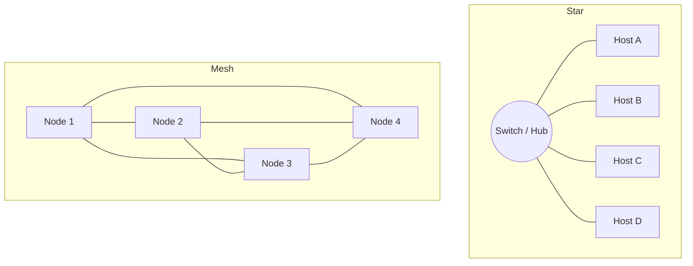

# Network Topology

Network topology is the physical or logical arrangement of devices (nodes) and the links that connect them in a network. The chosen layout determines a network's cost, performance, fault tolerance, and — critically for an attacker or defender — how far traffic and compromise can spread.

## Overview

A topology describes both *where* devices sit and *how* data moves between them. Cisco and IBM both distinguish two views of the same network:

- **Physical topology** (the underlay) — the real cabling, ports, and placement of switches, routers, and hosts.
- **Logical topology** (the overlay) — how data actually flows between devices, which may differ from the physical wiring. For example, hosts wired into a central switch (a physical star) can behave logically like a shared bus if that device floods traffic.

Topology choice is a trade-off between **cost**, **scalability**, **performance**, and **redundancy**. The physical layout is realized by the hardware and cabling covered in [Networking-Devices-and-Transmission-Media](Networking-Devices-and-Transmission-Media.md), while the [protocols](Network-Protocol.md) and addressing in [IP-Address](IP-Address.md) ride on top of it. Topology also underpins the organizational models in [Workgroup-vs-Peer-to-Peer-vs-Point-to-Point](Workgroup-vs-Peer-to-Peer-vs-Point-to-Point.md). See [Networking-Fundamentals](Networking-Fundamentals.md) for how this fits the wider module.

> [!NOTE]
> **Physical vs logical matters for attacks**
> The logical flow — not the wiring diagram — decides who can see whose traffic. A physical star built on a **hub** is a logical bus (every port sees every frame), whereas the same star on a **switch** isolates traffic per port. This distinction is the difference between trivial passive sniffing and needing active attacks like ARP spoofing.

## Topology Types

### Line Topology

Also described as a simple **bus**, a line topology uses a single central line that connects all devices; devices communicate by sending data over that shared line.

- Simple and easy to set up.
- Vulnerable to a single point of failure — if the central line is damaged, the network fails.
- Not scalable beyond a certain point.
- **Use case**: historically used in small, local networks.

### Bus Topology

In a bus topology all devices connect to a single central cable or backbone. Data sent by one device is **broadcast to all** other devices, but only the intended recipient accepts it.

- Easy to install and cost-effective for small networks.
- Single point of failure: if the backbone fails, the entire network fails.
- Performance degrades as more devices are added and contend for the shared medium.
- **Use case**: small office setups or legacy networks.

### Ring Topology

Devices are connected in a circular fashion, each with exactly two neighbors. Data travels around the ring (unidirectional or bidirectional), passing through each device until it reaches its destination.

- Often uses **token passing** to avoid data collisions.
- Can be disrupted by a single broken connection.
- **Use case**: legacy systems such as **Token Ring** networks.

### Star Topology

Devices connect to a central device — typically a **hub**, **switch**, or **router** — and all communication passes through it.

- Easy to install and manage; the dominant modern LAN layout.
- Central-device failure disrupts the whole segment (single point of failure).
- More scalable than bus or ring: new devices are added without affecting the rest.
- **Use case**: common in home and office networks with a central router or switch.

### Mesh Topology

Each device interconnects with many others, creating multiple paths between nodes.

- High fault tolerance: if one link fails, data reroutes through other paths.
- Expensive and complex — many cables and connections are required.
- Scalability can be challenging.
- **Use case**: large, high-availability networks such as **WANs** and data centers (the modern **spine-leaf** design is a partial full-mesh).

### Fully Connected Topology

A variant of mesh where **every device is directly connected to every other device**, so all nodes communicate without intermediate routers or switches.

- Maximum reliability and redundancy; highly fault-tolerant.
- Extremely costly — connections grow as *n(n−1)/2* with the number of nodes.
- **Use case**: rare, reserved for small, very high-reliability scenarios such as research networks.

### Comparison

| Topology | Fault tolerance | Cost | Scalability | Single point of failure |
|----------|-----------------|------|-------------|-------------------------|
| Bus / Line | Low | Very low | Poor | Backbone cable |
| Ring | Low–medium | Low | Moderate | Any broken link |
| Star | Medium | Medium | Good | Central device |
| Mesh | High | High | Moderate | None (redundant paths) |
| Fully connected | Very high | Very high | Poor | None |

## Topology Diagrams

The two most common modern layouts contrast sharply: a **star** centralizes all traffic through one device, while a **mesh** spreads it across redundant paths.



> [!TIP]
> **Recognizing topology from the wire**
> On an engagement you rarely get the network diagram. Infer the logical topology from behavior: run `arp -a` to enumerate neighbors on the segment, `tracert` to reveal path and intermediate hops, and `ipconfig /all` to see gateway and subnet placement.

```cmd
arp -a
tracert 8.8.8.8
ipconfig /all
```

## Security Considerations

Topology directly shapes both the **blast radius** of a compromise and the **visibility** an attacker gains from a single foothold.

> [!WARNING]
> **Topology is an attack surface**
> - **Shared-medium sniffing** — bus topologies and any star built on a **hub** broadcast every frame to every port, letting a single compromised host passively capture all segment traffic (credentials, hashes, tokens). Switched stars force the attacker into *active* attacks (ARP/MAC spoofing) instead.
> - **Single points of failure = DoS targets** — the backbone in a bus, or the central device in a star, is a high-value denial-of-service and pivot target. Taking it down or owning it partitions or dominates the whole segment.
> - **Flat networks have no blast-radius limit** — one big broadcast domain lets lateral movement, LLMNR/NBNS poisoning, and worm-style spread reach everything. Mesh redundancy improves availability but does **not** provide isolation.
> - **Logical ≠ physical** — never assume a physical star isolates traffic; verify whether the central device switches or floods.

Defensively, segment flat networks into VLANs to shrink broadcast domains and contain attacks, and prefer switched infrastructure over hubs. These concerns tie back to the layer-2 trust issues in [Networking-Fundamentals](Networking-Fundamentals.md) and the addressing boundaries set by [Network-Mask-Subnet-Mask-Net-Mask](Network-Mask-Subnet-Mask-Net-Mask.md).

## Best Practices

- **Segment, don't flatten** — split large broadcast domains into VLANs/subnets to limit broadcast traffic and contain lateral movement.
- **Use switches, not hubs** — eliminate shared-medium sniffing on the LAN.
- **Design for redundancy where uptime matters** — add mesh/redundant paths for critical links rather than relying on a single backbone or central device.
- **Plan address space to the topology** — document subnet boundaries before deploying services so the logical and physical layouts agree.
- **Diagram and maintain a current topology map** — accurate documentation speeds fault isolation and incident response.

## Troubleshooting

| Symptom | Likely cause & fix |
| --- | --- |
| Whole segment goes down at once | Bus backbone break or star central-device failure — check the shared cable / hub / switch |
| Intermittent drops as hosts are added | Bus/hub contention and collisions — migrate to a switched star |
| One host can reach the internet but not local peers | VLAN/segment isolation or wrong subnet mask — verify VLAN and mask/gateway |
| Traffic visible on a host that shouldn't see it | Central device is a hub, not a switch — replace with a switch |

## References

- [Cisco — What Is Network Topology?](https://www.cisco.com/site/us/en/learn/topics/networking/what-is-network-topology.html)
- [IBM — What Is Network Topology?](https://www.ibm.com/think/topics/network-topology)
- [GeeksforGeeks — Types of Network Topology](https://www.geeksforgeeks.org/types-of-network-topology/)

## Related

- [Networking-Devices-and-Transmission-Media](Networking-Devices-and-Transmission-Media.md) — devices and media that realize a topology
- [Network-Protocol](Network-Protocol.md) — protocols carried across the topology
- [Workgroup-vs-Peer-to-Peer-vs-Point-to-Point](Workgroup-vs-Peer-to-Peer-vs-Point-to-Point.md) — network organization models built on a topology
- [Networking-Fundamentals](Networking-Fundamentals.md) — module overview of networking concepts
- [Networking Fundamentals](Readme.md) — parent module hub
- [Enterprise Windows Infrastructure Security](../Readme.md) — course hub
