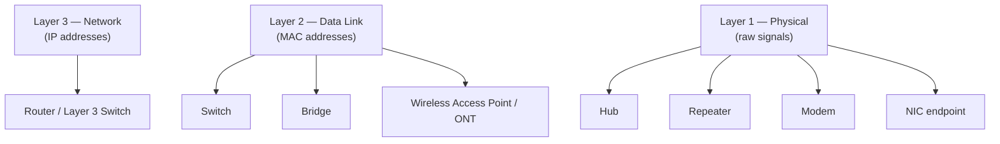

# Networking Devices and Transmission Media

Networking devices move and direct traffic across a network, while transmission media are the physical pathways that actually carry the signal. Together they form the physical and data-link foundation that every higher-layer service — DNS, DHCP, and Active Directory — depends on, and they map directly onto the lower layers of the [OSI model](The-OSI-Model-and-TCP-IP-Model.md).

## Overview

A network is built from two complementary building blocks: the **media** (copper, fiber, or air) that carries bits between points, and the **devices** (NICs, hubs, switches, routers, and access points) that terminate, regenerate, filter, and forward those bits. Each device operates at a specific OSI layer, which determines how "smart" it is about the traffic it handles — a hub blindly repeats electrical signals at Layer 1, a switch forwards frames by [MAC address](Media-Access-Control(MAC)-Address.md) at Layer 2, and a router makes decisions by IP address at Layer 3.

Understanding which device lives at which layer is essential for both administration and offense: the layer a device operates at defines what it can see, what it can filter, and how it can be attacked. This note is a companion to [Network-Topology](Network-Topology.md) (how these devices are arranged) and [The-OSI-Model-and-TCP-IP-Model](The-OSI-Model-and-TCP-IP-Model.md) (the reference model they slot into).

## Transmission Media

**Transmission media** refers to the physical pathways that carry data signals in a network. They facilitate communication between network devices, transmitting data through either electrical signals (copper cables), light signals (optical fibers), or electromagnetic waves (wireless).

### 1. Unshielded Twisted Pair Cable (UTP)

- **Structure**: UTP cables consist of pairs of insulated copper wires twisted together to reduce the impact of electromagnetic interference from external sources. The number of twists per inch can vary depending on the category of the cable.

- **Use**: UTP cables are the most common type of wiring used in local area networks (LANs) and telephone systems, including Ethernet and VoIP (Voice over Internet Protocol) services.

- **Pros**: Cost-effective, flexible, and easy to install, making it ideal for short to medium-distance communication.

- **Cons**: More susceptible to external interference (like electrical noise) and signal degradation over long distances. Performance can be affected by poor quality cables or excessive cable length.

- **Categories**:

    - **CAT5e**: Supports speeds up to 1000 Mbps (1 Gbps).

    - **CAT6**: Higher performance, supports speeds up to 10 Gbps for short distances.

    - **CAT6a**: Improved version of CAT6 with better shielding for higher performance over longer distances.

#### UTP Cable Color Coding for Sending and Receiving Data

In **Unshielded Twisted Pair (UTP)** cables like Cat5e or Cat6, the color usage for sending and receiving data depends on the Ethernet speed.

#### For 100 Mbps Ethernet (Fast Ethernet)

**Standard: T568B**

- **Transmit (TX) pair:**
  - Pin 1: **Orange/White**
  - Pin 2: **Orange**

- **Receive (RX) pair:**
  - Pin 3: **Green/White**
  - Pin 6: **Green**

> [!NOTE]
> **100 Mbps pair usage**
> Orange pair for sending, Green pair for receiving.

#### For 1 Gbps Ethernet (Gigabit Ethernet)

- **All four pairs (all 8 wires)** are used for simultaneous sending and receiving (full-duplex).
- Colors involved:
  - Orange/White & Orange
  - Green/White & Green
  - Blue/White & Blue
  - Brown/White & Brown

> [!NOTE]
> **1 Gbps pair usage**
> No single pair is dedicated to just sending or receiving at 1 Gbps — all four pairs carry data in both directions.

##### Quick Pinout Table (T568B)

| Pin | Color          | 100 Mbps Usage     |
|--|-|--|
| 1   | White/Orange    | TX+ (Transmit +)    |
| 2   | Orange          | TX− (Transmit −)    |
| 3   | White/Green     | RX+ (Receive +)     |
| 6   | Green           | RX− (Receive −)     |
| 4   | Blue            | Unused at 100 Mbps  |
| 5   | White/Blue      | Unused at 100 Mbps  |
| 7   | White/Brown     | Unused at 100 Mbps  |
| 8   | Brown           | Unused at 100 Mbps  |

##### Summary
- **100 Mbps:** Orange pair (send), Green pair (receive)
- **1 Gbps:** All pairs send and receive simultaneously

> [!TIP]
> **T568A vs T568B**
> The **T568A** standard swaps the green and orange pairs compared to **T568B**. Always terminate both ends of a cable to the same standard — unless you are deliberately making a crossover cable (one end T568A, the other T568B).

### 2. Shielded Twisted Pair Cable (STP)

- **Structure**: Like UTP, but STP cables include additional shielding around each wire pair or around the entire cable to reduce electromagnetic interference. The shielding can be a foil or braided mesh.

- **Use**: Typically used in environments with high interference, such as industrial settings, large office buildings, or areas with heavy electrical machinery.

- **Pros**: Offers superior protection from external interference, making it more reliable than UTP in noisy environments.

- **Cons**: Slightly more expensive, heavier, and less flexible than UTP cables; also requires proper grounding to be effective.

### 3. Coaxial Cable

- **Structure**: Coaxial cables consist of a central copper conductor surrounded by an insulating layer, a metallic shield to block interference, and an outer insulating layer for protection.

- **Use**: Historically used for cable TV connections and broadband internet, but now mostly replaced by newer technologies like fiber optics and wireless connections.

- **Pros**: Can carry a higher bandwidth and offers good resistance to interference over long distances.

- **Cons**: Bulkier, less flexible, and requires more complex installation compared to twisted pair cables. Also has a limited maximum data transmission speed compared to fiber optic cables.

### 4. Optical Fiber

- **Structure**: Optical fiber cables consist of one or more strands of glass or plastic fibers that transmit data as pulses of light. The light is guided through the core of the fiber by the principle of total internal reflection.

- **Use**: Used for long-distance and high-performance data transmission, often serving as the backbone of internet and telecommunications networks. Ideal for connecting data centers, transmitting internet traffic over large distances, or providing high-speed broadband to businesses and homes.

- **Pros**: Offers significantly higher data transmission speeds, greater bandwidth, and immunity to electromagnetic interference. Ideal for long-distance communication without significant signal loss.

- **Types**:

    - **Single-mode fiber**: Designed for long-distance transmission, using a single light path to minimize signal loss and distortion.

    - **Multi-mode fiber**: Used for shorter distances, where multiple light paths are used, and typically at lower speeds than single-mode.

## Networking Devices

Networking devices terminate the media and move traffic. The higher the OSI layer a device operates at, the more it understands about the traffic and the more selectively it can forward it.

### 1. Network Interface Card (NIC)

- **Function**: A NIC is a hardware component that enables computers or other devices to connect to a network, either through wired Ethernet connections or wirelessly via Wi-Fi.

- **Features**:

    - **MAC Address**: Each NIC has a unique identifier, allowing devices to be recognized on the network. See [Media-Access-Control(MAC)-Address](Media-Access-Control(MAC)-Address.md).

    - **Wired & Wireless**: NICs can be Ethernet-based for wired connections or Wi-Fi-based for wireless connectivity.

    - **Speeds**: Available in various speeds, ranging from 10 Mbps (older) to 10 Gbps (modern high-speed devices).

    - **Wake-on-LAN**: Some NICs support remote power-up of the device, a useful feature for remote management.

### 2. Repeater

- **Function**: Extends the range of a network by amplifying or regenerating weak signals and retransmitting them to the next segment.

- **OSI Layer**: Operates at the Physical Layer (Layer 1), often used in long-distance communications where signals can degrade over distance.

- **Use**: Commonly used to extend the reach of wireless networks or to cover large buildings with more wired Ethernet connections.

### 3. Hub

- **Function**: A basic networking device that broadcasts data to all connected devices, regardless of the destination.

- **OSI Layer**: Operates at the Physical Layer (Layer 1), often used in small, simple networks.

- **Use**: Largely obsolete now and replaced by switches, which are more efficient. Hubs cannot filter traffic or reduce network collisions — and because they repeat every frame to every port, any host can passively see all traffic on the segment.

### 4. Bridge

- **Function**: Connects multiple network segments, allowing them to communicate as a single network. It filters traffic based on MAC addresses, reducing collisions and improving performance.

- **OSI Layer**: Operates at the Data Link Layer (Layer 2).

- **Use**: Typically used to segment large networks to enhance performance or to connect different types of network media.

### 5. Switch

- **Function**: Connects devices in a network and forwards data only to the intended device based on the destination MAC address, using a MAC address table (CAM table).

- **OSI Layer**: Operates at the Data Link Layer (Layer 2); some advanced switches (Layer 3 switches) can also perform routing functions.

- **Use**: The most common networking device used in LANs today, improving performance by reducing collisions and ensuring efficient data transmission.

### 6. Router

- **Function**: Connects multiple networks and routes data packets between them based on the destination IP address.

- **OSI Layer**: Operates at the Network Layer (Layer 3).

- **Use**: Directs traffic between different networks (for example, between a local network and the internet) and provides functionality such as network address translation (NAT) and firewall protection.

### 7. Terminal Modem

- **Function**: Converts digital signals from a computer or device into analog signals for transmission over telephone lines, and vice versa, allowing digital devices to communicate over analog communication systems.

- **OSI Layer**: Operates at the Physical Layer (Layer 1).

- **Use**: Traditionally used for dial-up internet connections; still used in remote areas or legacy systems for low-speed connections.

### 8. Optical Network Terminal (ONT)

- **Function**: Converts optical signals (from fiber optic cables) into electrical signals that can be used by electronic devices.

- **OSI Layers**: Operates at both the Physical and Data Link Layers.

- **Use**: An essential component in Fiber-to-the-Home (FTTH) and Fiber-to-the-Premises (FTTP) broadband systems, enabling high-speed internet delivery to end-users.

### 9. Wireless Access Point (WAP)

- **Function**: Allows wireless devices, such as laptops and smartphones, to connect to a wired network via Wi-Fi.

- **OSI Layers**: Operates at both the Physical and Data Link Layers.

- **Use**: Commonly used in homes, offices, and public areas to provide Wi-Fi access, allowing users to connect to the network wirelessly.

## Device-to-OSI Layer Mapping

Which layer a device operates at determines what information it can act on — and, for an attacker, what it can observe. The diagram maps each device to the highest OSI layer at which it makes forwarding decisions.



## Device and Link Speeds

The maximum speed of routers and switches depends on the grade: **Home**, **Enterprise**, or **Data Center**.

### Routers

| Type | Max Speed | Example |
|:-|:|:--|
| Home Router (Wi-Fi 5 / Wi-Fi 6) | 1 Gbps (Ethernet), Wi-Fi around 600 Mbps–1 Gbps | TP-Link Archer, Netgear Nighthawk |
| Home Router (Wi-Fi 6E / Wi-Fi 7) | 2.5 Gbps Ethernet ports; Wi-Fi up to 5–10 Gbps | ASUS ROG Rapture GT-BE98 |
| Enterprise Router | 10 Gbps - 400 Gbps+ | Cisco Catalyst 8000, Juniper MX Series |
| Data Center Core Router | 400 Gbps - 1 Tbps per port | Cisco 8000 Series, Juniper PTX |

### Switches

| Type | Max Speed | Example |
|:-|:|:--|
| Unmanaged Home Switch | 100 Mbps - 1 Gbps | TP-Link 5-Port, Netgear GS305 |
| Managed Enterprise Switch | 1 Gbps - 10 Gbps per port | Cisco Catalyst, Aruba 2930F |
| Data Center Switch | 10 Gbps - 400 Gbps per port | Arista 7800R3, Cisco Nexus 9000 |

### Ethernet Standard Speeds (as of 2025)

- 100 Mbps (Fast Ethernet)
- 1 Gbps (Gigabit Ethernet)
- 10 Gbps (10 Gigabit Ethernet)
- 25 Gbps
- 40 Gbps
- 100 Gbps
- 200 Gbps
- 400 Gbps
- 800 Gbps (new)
- 1.6 Tbps (future systems)

### Wi-Fi (Wireless Router)

- Wi-Fi 6E: Up to 9.6 Gbps (theoretical)
- Wi-Fi 7: Up to 46 Gbps (theoretical, 2024–2025)

> [!NOTE]
> **Real-world vs advertised speed**
> Real-world throughput is usually **lower** than the maximum, due to network congestion, device limitations, cable quality, and router/switch CPU performance. Home gear typically maxes out at **1–2.5 Gbps per port**, while enterprise and data-center equipment reaches **400–800 Gbps** per port.

| Device Type | Typical Max Speed |
|:|:|
| Home Router | 1–2.5 Gbps |
| Enterprise Router | 10–400 Gbps |
| Home Switch | 1 Gbps |
| Enterprise Switch | 10–400 Gbps |
| Wi-Fi (Home Wireless) | Up to 46 Gbps (Wi-Fi 7) |

## Security Considerations

The layer a device operates at defines its attack surface. A hub sees and repeats everything; a switch is smarter but has finite state that can be exhausted; wireless media are broadcast by nature and reachable by anyone in range.

> [!WARNING]
> **Devices and media as an attack surface**
> - **Hubs enable passive sniffing** — because a hub floods every frame to every port, any host on that segment can capture all traffic without any active attack. This is why hubs are never used in security-sensitive networks.
> - **Switch CAM-table exhaustion** — a switch has a finite MAC address table. Flooding it with bogus source MACs can overflow the table and force the switch to fail open, broadcasting frames like a hub and re-enabling sniffing.
> - **MAC addresses are spoofable** — a MAC is set in software on the NIC and can be changed at will, so it must never be treated as an authentication boundary (for example, for MAC-based network access control).
> - **Wireless media are open** — Wi-Fi is a shared broadcast medium; rogue access points and evil-twin APs can lure clients into associating with attacker-controlled hardware.
> - **Physical media taps** — copper can be tapped inductively and even fiber can be tapped with a bend coupler, so physical access to cabling is a genuine interception risk.

Changing a NIC's MAC address is a routine first step in bypassing weak MAC filtering:

```bash
# Spoof a network interface's MAC address (Linux)
sudo ip link set dev eth0 down
sudo ip link set dev eth0 address 00:11:22:33:44:55   # untested
sudo ip link set dev eth0 up
```

## Best Practices

- Use **switches, not hubs** — hubs are obsolete and leak all traffic to every port; managed switches also give you port security and monitoring.
- Enable **port security** on access switches to limit the number of MAC addresses per port and mitigate CAM-table flooding.
- Segment the network with **VLANs and Layer 3 boundaries** rather than running one flat broadcast domain, to limit both broadcast noise and lateral attack scope. See [Network-Topology](Network-Topology.md).
- Terminate cabling to a consistent standard (**T568A or T568B**), keep runs within category length limits, and prefer fiber for long-distance or high-interference links.
- Treat wireless as untrusted: use strong Wi-Fi encryption, disable open guest bridging to the internal LAN, and monitor for rogue access points.

## Troubleshooting

| Symptom | Likely cause & fix |
| --- | --- |
| Link light off / no connectivity | Bad or wrong cable, incorrect T568A/T568B termination, or exceeded cable length limit — reterminate and verify with a cable tester |
| Intermittent errors on long copper runs | Electromagnetic interference or run beyond ~100 m for twisted pair — reroute away from interference or switch to STP/fiber |
| Whole segment sees each other's traffic | A hub is in the path, or a switch has failed open (CAM overflow) — replace the hub with a switch and enable port security |
| Negotiated speed lower than expected | Cable category too low (e.g. CAT5 on a Gigabit link) or a duplex/auto-negotiation mismatch — use CAT5e+ and confirm both ends auto-negotiate |
| Fiber link down | Mismatched fiber type (single-mode vs multi-mode) or dirty/bent connector — match fiber type and clean/inspect the endface |

## References

- [Cloudflare Learning — What is a network switch?](https://www.cloudflare.com/learning/network-layer/what-is-a-network-switch/)
- [Cloudflare Learning — What is a router?](https://www.cloudflare.com/learning/network-layer/what-is-a-router/)
- [Cloudflare Learning — OSI model](https://www.cloudflare.com/learning/ddos/glossary/open-systems-interconnection-model-osi/)
- [IEEE 802.3 — Ethernet standard](https://www.ieee802.org/3/)

## Related
- [Network-Topology](Network-Topology.md) — arrangements built from these devices and media
- [Media-Access-Control(MAC)-Address](Media-Access-Control(MAC)-Address.md) — addressing used by NICs and switches
- [The-OSI-Model-and-TCP-IP-Model](The-OSI-Model-and-TCP-IP-Model.md) — maps devices to OSI layers
- [Networking-Fundamentals](Networking-Fundamentals.md) — module overview of networking concepts
- [Enterprise Windows Infrastructure Security](../Readme.md) — course hub and map of content
