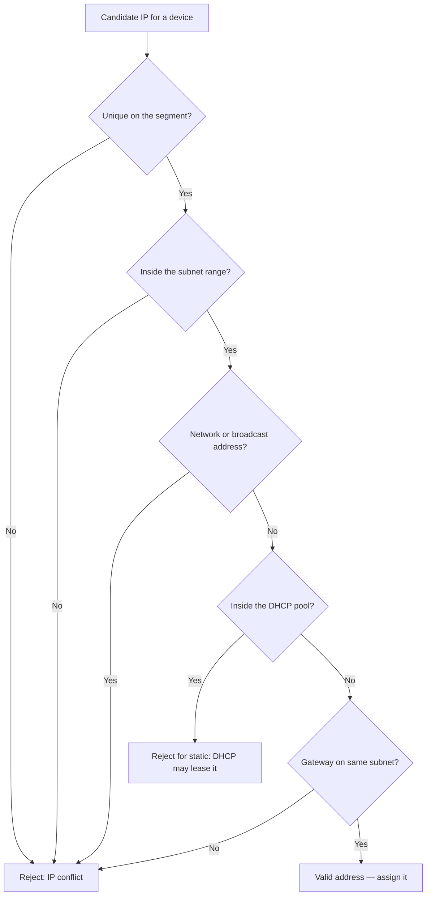

# Rules for Assigning an IP Address to a Device

Assigning an IP address to a device (computer, phone, printer, IoT sensor, etc.) is not arbitrary — the address must satisfy a set of rules so the device can actually communicate on its network. Breaking these rules produces IP conflicts, unreachable hosts, or a device that can talk locally but never reaches the Internet.

## Overview

Every device on an IP network needs an address that is **unique**, **inside the correct subnet**, **within a valid range**, and **consistent with the subnet mask and default gateway**. These rules apply whether the address is set **statically** by an administrator or handed out **dynamically** by DHCP. Understanding them is foundational for the rest of this module — see [IP-Address](IP-Address.md) for addressing basics, [Network-Mask-Subnet-Mask-Net-Mask](Network-Mask-Subnet-Mask-Net-Mask.md) for how masks draw subnet boundaries, and [IP-Address-Versions](IP-Address-Versions.md) for how the rules differ between IPv4 and IPv6.

The examples below use IPv4, but the same principles (uniqueness, correct prefix, reserved addresses) carry over to IPv6.

## The Rules

### 1. Uniqueness

- Every device must have a **unique IP address** on the network.
- Two devices **cannot share the same IP**. Duplicate addresses cause **IP conflicts** and communication failures — typically both hosts intermittently lose connectivity.

### 2. Same / Correct Network

- The IP must match the **network segment** (subnet) the device is physically attached to.

Example network `192.168.1.0/24`:

- Valid IPs: `192.168.1.2`, `192.168.1.3`
- Invalid IP: `192.168.2.5` (belongs to a different subnet)

### 3. Valid IP Range

The address must fall within an allowed range for its use.

**Private networks** (RFC 1918 — not routable on the public Internet):

| Class | Range |
| --- | --- |
| Class A | `10.0.0.0 – 10.255.255.255` |
| Class B | `172.16.0.0 – 172.31.255.255` |
| Class C | `192.168.0.0 – 192.168.255.255` |

**Public networks:** use public IPs provided by your ISP.

### 4. Avoid Reserved Addresses

Do **not** assign the two addresses reserved for every subnet:

- **Network address** — the first address (e.g., `192.168.1.0`)
- **Broadcast address** — the last address (e.g., `192.168.1.255`)

> [!IMPORTANT]
> **Reserved addresses are not hosts**
> The network and broadcast addresses identify the subnet itself and the "all hosts" target — they can never be assigned to a device. On a `/24` this costs you 2 of the 256 addresses, leaving 254 usable.

### 5. Consistency with Subnet Mask

The IP address, subnet mask, and gateway must all be compatible — they must resolve to the **same subnet**.

Example:

| Setting | Value |
| --- | --- |
| IP | `192.168.1.5` |
| Subnet Mask | `255.255.255.0` |
| Gateway | `192.168.1.1` |

All three belong to `192.168.1.0/24`, so the host can reach both local peers and the gateway.

### 6. Avoid Conflicts with DHCP

Static IPs should be assigned **outside the DHCP pool**, or DHCP may later lease the same address to another device and create a conflict.

Example:

- DHCP range: `192.168.1.100 – 192.168.1.200`
- Safe static IPs: `192.168.1.10` or `192.168.1.250` (outside the pool)

> [!TIP]
> **Reserve instead of guess**
> On a managed network, prefer a **DHCP reservation** (bind an address to the device's MAC) over a hand-picked static IP. The device still gets a fixed address, but the DHCP server tracks it and won't hand it to anyone else. See [Media-Access-Control(MAC)-Address](Media-Access-Control(MAC)-Address.md) for how the MAC identifies the device.

### 7. Consistent Gateway Setting

- The **default gateway** must be on the **same network** as the device.
- Devices send traffic destined for other networks (including the Internet) to the gateway; if the gateway is on a different subnet, the device is effectively isolated to its local segment.

## Network and Host Bits

An IPv4 address splits into two parts, determined by the subnet mask:

- **Network bits** identify the network.
- **Host bits** identify a device within that network.

### Network Address

All **host bits = 0** → the **network address**.

Example (`192.168.1.0/24`, mask `255.255.255.0`):

- Network address: `192.168.1.0` — indicates the **network itself**, not a device.

### Broadcast Address

All **host bits = 1** → the **broadcast address**.

Example (`192.168.1.0/24`):

- Broadcast: `192.168.1.255` — sends data to **all devices on the network**.

### Quick Example — `192.168.1.0/24`

| Type | Address |
| --- | --- |
| Network Address | `192.168.1.0` |
| Usable IPs | `192.168.1.1 – 192.168.1.254` |
| Broadcast Address | `192.168.1.255` |

## Validation Flow

The following decision flow captures how the rules combine when deciding whether a candidate address is valid to assign.



## Quick Checklist

| Rule | Description |
| --- | --- |
| **Unique** | No two devices can have the same IP |
| **Correct Network** | Must match the network/subnet |
| **Valid Range** | Must be within allowed private/public IP ranges |
| **No Reserved IPs** | Avoid network and broadcast addresses |
| **Consistent Subnet** | IP, subnet mask, and gateway must match |
| **Avoid DHCP Conflict** | Assign static IPs outside the DHCP range |
| **Gateway Correct** | Gateway must be reachable on the same network |

## Assigning an Address in Windows

### GUI — `ncpa.cpl`

`ncpa.cpl` opens the **Network Connections** window for managing adapters and IP settings.

1. Press `Win + R` to open **Run**.
2. Type `ncpa.cpl` and press **Enter**.
3. The Network Connections window lists all adapters.

From there you can right-click an adapter to view/edit its properties, enable or disable it, and set the IP, subnet mask, gateway, and DNS.

### Command line

Set a static IPv4 address, mask, and gateway on an adapter named `Ethernet`:

```cmd
netsh interface ipv4 set address name="Ethernet" static 192.168.1.10 255.255.255.0 192.168.1.1
```

Equivalent using PowerShell:

```powershell
New-NetIPAddress -InterfaceAlias "Ethernet" -IPAddress 192.168.1.10 -PrefixLength 24 -DefaultGateway 192.168.1.1
```

Verify the assignment and check for conflicts:

```cmd
ipconfig /all
```

## Security Considerations

> [!WARNING]
> **Addressing is an attacker's map**
> The same rules that keep a network working also tell an attacker how it is laid out. From a single host's IP, mask, and gateway, an attacker infers the subnet size and the likely range of live hosts to sweep — the first step of network reconnaissance. Predictable static schemes (servers always at `.1`–`.10`) make high-value targets trivial to locate.

- **Rogue DHCP / gateway spoofing** — an attacker who answers DHCP or advertises a false gateway can hand out addresses and steer traffic through a machine they control (man-in-the-middle). Legitimate assignment rules assume a cooperative network; a hostile segment breaks that assumption.
- **IP conflicts as a weapon** — deliberately claiming a server's or gateway's address (a form of ARP/IP spoofing) can knock it offline or redirect its traffic.
- **Reserved-address abuse** — traffic aimed at the broadcast address reaches every host, which is why broadcast-based amplification and discovery techniques exist.

## Best Practices

- Document your subnet boundaries and address plan **before** assigning anything; leave room to grow.
- Keep static assignments (servers, printers, network gear) in a reserved block **outside** the DHCP pool, and record them.
- Prefer **DHCP reservations** over manually configured static IPs so the DHCP server remains the single source of truth.
- Never assign the network or broadcast address, and confirm the gateway sits inside the same subnet.
- After assigning, verify with `ipconfig /all` (Windows) or `ip addr` (Linux) and confirm there is no conflict.

## Troubleshooting

| Symptom | Likely cause & fix |
| --- | --- |
| "IP address conflict" warning | Duplicate address — another host or a DHCP lease uses the same IP; pick a free address outside the DHCP pool |
| Device reaches local hosts but not the Internet | Wrong or missing default gateway, or gateway on a different subnet — correct the gateway to a same-subnet address |
| Device can't reach anything | IP not in the local subnet, or mask mismatch — align IP and subnet mask to the segment |
| Address assigned but no connectivity | Network or broadcast address mistakenly used, or DNS not set — choose a usable host address and set DNS |

## References

- [RFC 791 — Internet Protocol](https://www.rfc-editor.org/rfc/rfc791)
- [RFC 1918 — Address Allocation for Private Internets](https://www.rfc-editor.org/rfc/rfc1918)
- [Microsoft Learn — New-NetIPAddress cmdlet](https://learn.microsoft.com/powershell/module/nettcpip/new-netipaddress)

## Related

- [Enterprise Windows Infrastructure Security](../Readme.md) — course hub
- [IP-Address](IP-Address.md) — the address being assigned
- [IP-Address-Versions](IP-Address-Versions.md) — IPv4 vs IPv6 assignment differences
- [Network-Mask-Subnet-Mask-Net-Mask](Network-Mask-Subnet-Mask-Net-Mask.md) — subnet boundaries that constrain assignment
- [Media-Access-Control(MAC)-Address](Media-Access-Control(MAC)-Address.md) — MAC-based DHCP reservations
- [Networking-Fundamentals](Networking-Fundamentals.md) — module overview
