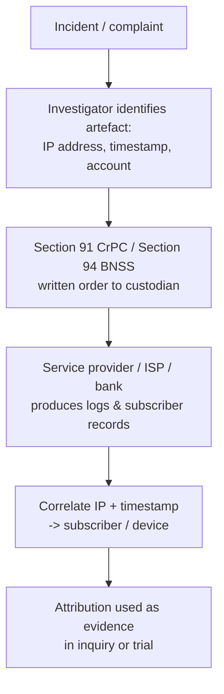

# Section 91 of the Code of Criminal Procedure (CrPC), 1973 (India)

**Title: Summons to produce document or other thing.** Section 91 empowers an Indian court or the officer in charge of a police station to compel any person to produce a document, electronic record, or other thing believed necessary or desirable for an investigation, inquiry, trial, or other proceeding. In digital investigations it is the routine legal instrument used to obtain logs, subscriber records, and stored data from service providers.

## Overview

Section 91 is the everyday "produce it" power in Indian criminal procedure. When investigators need evidence held by a third party — an email provider, a telecom operator, a hosting company, or a bank — they do not have to seize it by force; they issue a **summons** (to a person) or a **written order** (to a custodian) requiring the item to be handed over at a stated time and place. The person complies by causing the document or thing to be produced, and need not attend personally to do so.

For anyone tracing activity across a network, this is where the technical evidence chain — an [IP-Address](IP-Address.md) in a server log, a [Media-Access-Control(MAC)-Address](Media-Access-Control(MAC)-Address.md) recorded by a DHCP lease, a timestamp in a firewall record — becomes legally actionable subscriber attribution. See [Networking-Fundamentals](Networking-Fundamentals.md) for the addressing concepts that these records capture.

> [!IMPORTANT]
> **CrPC 1973 is superseded — use Section 94 BNSS**
> The **Bharatiya Nagarik Suraksha Sanhita (BNSS), 2023** replaced the CrPC, 1973 with effect from **1 July 2024**. Section 91 CrPC now corresponds to **Section 94 of the BNSS, 2023**, which retains the same production power while making its handling of digital and electronic evidence more explicit. Cite Section 94 BNSS for proceedings on or after that date; Section 91 CrPC remains relevant for older matters and as the historical reference.

## What Section 91 Says

- If a **court** or an **officer in charge of a police station** considers that a document, electronic record, or other thing is **necessary or desirable** for an investigation, inquiry, trial, or other proceeding,
- they may issue a **summons** (to a person) or a **written order** (to a person not in court),
- **requiring** that person to produce the document or thing at the time and place stated.

In plain terms: when the court or police need a document or object to properly investigate or conduct a trial, they can **legally order** the person who holds it to hand it over.

### Short text of Section 91 (paraphrased)

> _"Whenever any court or any police officer considers that the production of any document or other thing is necessary or desirable for any investigation, inquiry, trial, or other proceeding under this Code, such court may issue a summons, or such officer a written order, to the person in possession or control of such document or thing, requiring him to attend and produce it."_

## Key Points

| Topic | Details |
| :-- | :-- |
| **Who can issue?** | A court, or a police officer (typically the investigating officer) |
| **To whom?** | Any person believed to be in possession or control of the document or thing |
| **Purpose?** | Investigation, inquiry, trial, or any other legal proceeding under the Code |
| **Scope?** | Physical documents, digital evidence, electronic records, or any other "thing" |
| **Compliance** | Satisfied by causing the item to be produced — personal attendance is not always required |
| **Enforcement** | Non-compliance can attract legal consequences (e.g. contempt or obstruction of justice) |

## Conditions and Limits

- **Necessary or desirable** — the item must be genuinely relevant to the proceeding, not the subject of a speculative "fishing" inquiry. Courts have treated the power as **facilitative** (aiding truth-finding), not a licence for open-ended demands.
- **Self-incrimination** — it cannot be used to force an accused to produce self-incriminating material, which is protected under **Article 20(3)** of the Constitution of India (the right against self-incrimination).
- **Stage restrictions** — Indian courts have held that an accused cannot invoke this power to compel production at the stage of framing of charges.
- **Postal/telegraph carve-out** — letters, parcels, and telegrams in the custody of postal or telegraph authorities are dealt with **separately under Section 92 CrPC** (Section 95 BNSS), not Section 91.

> [!NOTE]
> **Section 91 vs a search warrant**
> Section 91 asks a known custodian to hand something over; it presumes cooperation and does not authorise entry or seizure. When investigators must search premises for an item whose location is unknown, or expect non-cooperation, a **search warrant** under other provisions of the Code is the appropriate instrument instead.

## How It Works in a Digital Investigation

A Section 91 / Section 94 notice is the bridge from a technical artefact to a named subscriber. The investigator starts from a network identifier recorded in a log, then compels the party that holds the mapping records to reveal who was behind it.

### Example

Suppose police are investigating a cybercrime case and believe an email record stored by a provider such as Google India contains crucial evidence. Under Section 91 (now Section 94 BNSS) they can issue a written order to the provider to produce that record — subscriber details, access logs, and the source [IP-Address](IP-Address.md) tied to the account activity — which they then correlate against a timeline to identify the responsible person.

## Security Considerations

For a penetration tester, red teamer, or defender, Section 91 is a reminder that network artefacts are not anonymous: the metadata your activity leaves behind is legally retrievable from the parties that log it.

> [!WARNING]
> **Everything you touch is logged and legally obtainable**
> During any authorised engagement, the source [IP-Address](IP-Address.md), DHCP/[Media-Access-Control(MAC)-Address](Media-Access-Control(MAC)-Address.md) leases, provider logs, and account records that record your actions can all be compelled from custodians under Section 91 / Section 94 BNSS. Operate **only within a signed scope and rules-of-engagement**; unauthorised access carries criminal liability under the IT Act and the penal code, and this exact production mechanism is how attribution is built. There is no "anonymous" test traffic once it crosses infrastructure you do not control.

- **Defenders** should retain authentication, DHCP, DNS, and firewall logs with accurate time synchronisation — they are what a lawful production order relies on, and gaps break attribution.
- **Chain of custody** matters: records produced under Section 91 must be preserved with integrity (hashes, access controls) to remain admissible.
- Treat MAC and IP records as **investigative leads, not proof of identity** — both are spoofable, so attribution should combine multiple correlated sources.

## Best Practices

- Cite the **current statute** — Section 94 BNSS, 2023 for proceedings from 1 July 2024 onward — and reference Section 91 CrPC only for the historical/legacy position.
- Frame requests narrowly: specify the exact records, accounts, and time window so the demand is clearly "necessary or desirable" and survives judicial scrutiny.
- Route provider requests through the correct legal channel and the provider's law-enforcement process; preserve served copies of every order.
- Synchronise and retain logs (NTP-accurate timestamps) so produced records can be reliably correlated to a subscriber or device.
- Respect the self-incrimination limit (Article 20(3)) and the postal/telegraph carve-out (Section 92 CrPC / Section 95 BNSS) when scoping what may be demanded.

## Troubleshooting

| Symptom | Likely cause & fix |
| :-- | :-- |
| Provider refuses or delays production | Notice too broad or served through the wrong channel — narrow the request and route it via the provider's law-enforcement process |
| Produced logs can't be tied to a subscriber | Missing or clock-skewed timestamps — insist on time-synchronised records and cross-correlate IP with session/lease logs |
| Accused invokes Section 91 at charge framing | Not permitted — established case law bars the accused from compelling production at the framing-of-charges stage |
| Order challenged as a "fishing inquiry" | Demonstrate specific relevance and necessity of each item requested |

## References

- [Section 91 in The Code of Criminal Procedure, 1973 — India Code (official)](https://www.indiacode.nic.in/show-data?actid=AC_CEN_5_23_000010_197402_1517807320555&sectionId=22468&sectionno=91&orderno=101)
- [Section 91 in The Code of Criminal Procedure, 1973 — Indian Kanoon](https://indiankanoon.org/doc/788840/)
- [Comparison summary: BNSS to CrPC (BPRD, Govt. of India)](https://bprd.nic.in/uploads/pdf/Comparison%20summary%20BNSS%20to%20CrPC.pdf)
- [Constitution of India, Article 20(3) — protection against self-incrimination (India Code)](https://www.indiacode.nic.in/handle/123456789/15240)

## Related

- [Enterprise Windows Infrastructure Security](../Readme.md) — course hub
- [IP-Address](IP-Address.md) — IP/log attribution requested under such legal notices
- [Media-Access-Control(MAC)-Address](Media-Access-Control(MAC)-Address.md) — device identification in investigations
- [Networking-Fundamentals](Networking-Fundamentals.md) — networking context for legal/forensic tracing
