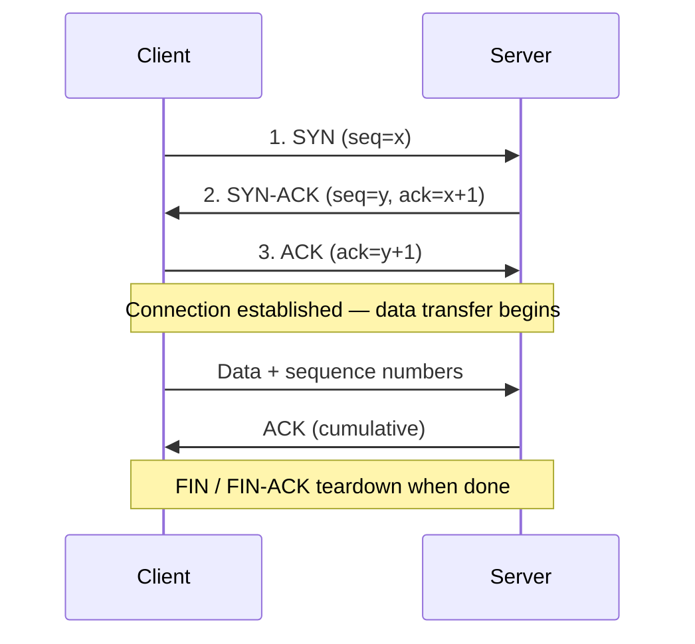

# TCP vs UDP

**TCP (Transmission Control Protocol)** and **UDP (User Datagram Protocol)** are the two core transport-layer protocols of the TCP/IP model. Both carry application data between hosts, but they trade off differently between reliability and speed: TCP is connection-oriented and guarantees ordered, error-checked delivery, while UDP is connectionless and prioritizes low latency over guarantees.

## Overview

Sitting at Layer 4 of the [OSI and TCP/IP models](The-OSI-Model-and-TCP-IP-Model.md), transport protocols multiplex data between applications using **port numbers** and hand segments/datagrams down to IP for routing. TCP adds a reliability layer on top of the unreliable IP network — sequencing, acknowledgements, retransmission, flow control, and congestion control — which is why the web, email, and file transfer depend on it. UDP deliberately omits that machinery, sending self-contained datagrams with minimal overhead, which suits real-time and query/response traffic like DNS, VoIP, and streaming.

Understanding both is a prerequisite for reading a packet capture, interpreting scan results, and reasoning about which [network protocols](Network-Protocol.md) ride on which transport. See [Networking-Fundamentals](Networking-Fundamentals.md) for the broader module context.

> [!NOTE]
> **Ports identify applications, not protocols**
> A port number (0–65535) identifies the *application endpoint*, not the transport. Port 53 exists for both TCP and UDP — DNS uses UDP for normal queries and TCP for zone transfers and large responses. TCP/80 and UDP/80 are entirely separate listeners.

## How TCP Works

TCP is a **connection-oriented** protocol: it establishes a session with a **3-way handshake** before any application data flows.

```text
Client                    Server
  | ---- SYN -----------> |
  | <--- SYN-ACK -------- |
  | ---- ACK -----------> |
```



After the handshake, each segment carries a **sequence number**; the receiver returns **acknowledgements**, and any unacknowledged data is **retransmitted**. Sequence numbers also let the receiver reorder segments that arrive out of order.

### TCP Features

- Connection-oriented communication
- Reliable, guaranteed delivery
- Ordered packet delivery (via sequence numbers)
- Error detection and recovery
- Flow control (receiver-advertised window)
- Congestion control
- Automatic retransmission of lost packets

### TCP Header

```text
0                   15 16                  31
+-------------------+----------------------+
| Source Port       | Destination Port     |
+-------------------+----------------------+
| Sequence Number                          |
+------------------------------------------+
| Acknowledgment Number                    |
+------------------------------------------+
| HLEN |Flags| Window Size                 |
+------------------------------------------+
| Checksum          | Urgent Pointer       |
+------------------------------------------+
| Options (Optional)                       |
+------------------------------------------+
```

### Common TCP Applications

| Protocol | Port |
| --- | --- |
| HTTP | 80 |
| HTTPS | 443 |
| SSH | 22 |
| FTP | 21 |
| SMTP | 25 |
| POP3 | 110 |
| IMAP | 143 |

## How UDP Works

UDP is a **connectionless** protocol: it sends **datagrams** with no handshake, no acknowledgement, and no session state.

```text
Client                    Server
  | ---- Data ----------> |
  | ---- Data ----------> |
  | ---- Data ----------> |
```

There is no setup and no delivery confirmation — the application (or a higher layer like QUIC/DTLS) is responsible for any reliability it needs. This makes UDP fast and cheap, and it is the only transport that natively supports **broadcast** and **multicast**.

### UDP Features

- Connectionless communication
- Low overhead (8-byte header)
- Fast transmission, low latency
- No delivery guarantee, no acknowledgement
- No packet ordering
- Supports broadcast and multicast

### UDP Header

```text
0                   15 16                  31
+-------------------+----------------------+
| Source Port       | Destination Port     |
+-------------------+----------------------+
| Length            | Checksum             |
+-------------------+----------------------+
```

### Common UDP Applications

| Protocol | Port |
| --- | --- |
| DNS | 53 |
| DHCP | 67/68 |
| TFTP | 69 |
| SNMP | 161 |
| NTP | 123 |
| VoIP | Various |
| Online Gaming | Various |

## Comparison

| Feature | TCP | UDP |
| --- | --- | --- |
| Communication Type | Connection-Oriented | Connectionless |
| Reliability | Guaranteed | Not Guaranteed |
| Packet Ordering | Yes | No |
| Acknowledgment | Yes | No |
| Retransmission | Yes | No |
| Flow Control | Yes | No |
| Congestion Control | Yes | No |
| Error Recovery | Yes | No |
| Header Size | 20–60 bytes | 8 bytes |
| Speed | Slower | Faster |
| Overhead | High | Low |
| Broadcast/Multicast | No | Yes |
| Streaming Suitable | No | Yes |
| File Transfer Suitable | Yes | No |

> [!TIP]
> **Rule of thumb**
> If **every byte matters** (files, web pages, remote shells) → **TCP**. If **every millisecond matters** (voice, video, gaming, quick lookups) → **UDP**. TCP is a registered courier — tracked, confirmed, re-sent if lost; UDP is a postal flyer — fast, cheap, and occasionally never arrives.

### When to Use Each

- **TCP** — web browsing (HTTP/HTTPS), email, file transfers, remote administration (SSH/RDP), database connections.
- **UDP** — live video streaming, VoIP, online gaming, DNS lookups, IPTV, video conferencing.

## Security Considerations

The transport differences directly shape how each protocol is attacked and defended.

> [!WARNING]
> **Offensive and defensive relevance**
> - **TCP SYN floods** — an attacker sends many SYNs without completing the handshake, exhausting the server's half-open connection table (a classic DoS). SYN cookies mitigate this.
> - **UDP is trivially spoofable** — with no handshake, source IPs are easy to forge. This enables **reflection/amplification** DDoS via DNS, NTP, SNMP, and other UDP services that return large responses to small spoofed requests.
> - **Scan behavior differs** — TCP scans infer state from handshake replies (SYN-ACK = open, RST = closed), so they are fast and reliable. **UDP scans are slow and ambiguous** because no response can mean *open* or *filtered*; see Network-Reconnaissance-Scanning.
> - **Firewall implications** — stateful firewalls track TCP connection state precisely; UDP has no state, so filtering relies on timeouts and application-layer inspection.

- Rate-limit and monitor UDP services that can amplify (DNS, NTP, SNMP, memcached).
- Enable SYN-cookie protection on internet-facing TCP services.
- Prefer TCP or authenticated/encrypted transports (TLS, DTLS, QUIC) where message integrity matters.

## Best Practices

- Match the transport to the workload: reliability-critical traffic on TCP, latency-critical traffic on UDP.
- Do not assume UDP delivery — build acknowledgement/retry into the application if it needs reliability.
- Scan both TCP **and** UDP during enumeration; UDP services (DNS, SNMP, TFTP) are frequently overlooked but high-value.
- Encrypt sensitive traffic regardless of transport — neither TCP nor UDP provides confidentiality on its own.
- Baseline normal transport behavior so anomalies (SYN floods, unexpected UDP volume) stand out in monitoring.

## Troubleshooting

| Symptom | Likely cause & fix |
| --- | --- |
| TCP connection hangs on "connecting" | Handshake blocked — a firewall is dropping SYN or SYN-ACK; verify port is open and reachable both directions |
| Frequent TCP retransmissions / slow throughput | Packet loss or congestion on the path — check for a lossy link, MTU/fragmentation issues, or duplex mismatch |
| UDP service "works sometimes" | Datagrams silently dropped (no retransmission) — check for loss, undersized buffers, or a stateful firewall timing out the flow |
| UDP port scan shows everything "open\|filtered" | Expected — no reply is ambiguous for UDP; confirm with a service-specific probe or application-layer response |

## References

- [RFC 9293 — Transmission Control Protocol (TCP)](https://www.rfc-editor.org/rfc/rfc9293)
- [RFC 768 — User Datagram Protocol (UDP)](https://www.rfc-editor.org/rfc/rfc768)
- [Cloudflare Learning — TCP vs UDP](https://www.cloudflare.com/learning/ddos/glossary/user-datagram-protocol-udp/)

## Related

- [Networking-Fundamentals](Networking-Fundamentals.md) — parent overview of networking concepts
- [The-OSI-Model-and-TCP-IP-Model](The-OSI-Model-and-TCP-IP-Model.md) — places TCP/UDP at the transport layer
- [Network-Protocol](Network-Protocol.md) — what a network protocol is, and which ride on TCP/UDP
- [IP-Address](IP-Address.md) — the network-layer addressing TCP/UDP segments ride on
- Network-Reconnaissance-Scanning — TCP vs UDP scan techniques
- [Enterprise Windows Infrastructure Security](../Readme.md) — course hub
