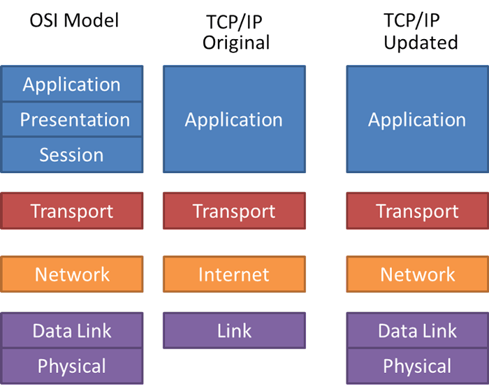
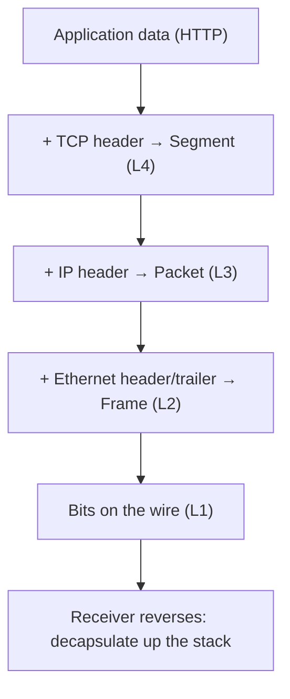

# The OSI Model and TCP/IP Model

The OSI Model (Open Systems Interconnection) and the TCP/IP Model (Transmission Control Protocol/Internet Protocol) are two conceptual frameworks that describe how data travels across a network. They break the communication process into layers, where each layer handles specific functions to ensure orderly, interoperable data transmission between devices.

## Overview

Layered models let independent vendors build interoperable software and hardware: each layer offers a well-defined service to the layer above and consumes the service of the layer below, so a change at one layer (for example, swapping copper cabling for Wi-Fi at the physical layer) does not force changes elsewhere. The **OSI model** is the seven-layer teaching and design reference; the **TCP/IP model** is the four-layer stack that the modern Internet actually runs on.

For a penetration tester, the layer model is a mental map: it tells you *where* a protocol lives, *what* attacks apply at that layer, and *which* tool operates at each level. ARP spoofing is Layer 2, IP spoofing and routing attacks are Layer 3, port scanning and TCP/UDP behaviour are Layer 4, and application exploits (HTTP, DNS, SMB) live at the top. See [Network-Protocol](Network-Protocol.md) for how individual protocols are organized by these models, [TCP-vs-UDP](TCP-vs-UDP.md) for the transport layer, and [Networking-Devices-and-Transmission-Media](Networking-Devices-and-Transmission-Media.md) for the devices that operate at each layer.

> [!TIP]
> **Remember the OSI layers**
> Bottom-to-top mnemonic (Layer 1 → 7): **P**lease **D**o **N**ot **T**hrow **S**ausage **P**izza **A**way — Physical, Data Link, Network, Transport, Session, Presentation, Application.

## OSI Model (7 Layers)

The OSI Model is a theoretical framework with 7 layers, used mainly for teaching, design, and understanding networking concepts.

1. **Physical Layer** — Transmits raw binary data over physical mediums (cables, radio waves, etc.).
2. **Data Link Layer** — Ensures reliable node-to-node delivery, error detection, and MAC addressing.
3. **Network Layer** — Handles logical addressing (IP addresses), routing, and path determination.
4. **Transport Layer** — Provides end-to-end communication, flow control, segmentation, and error recovery.
5. **Session Layer** — Establishes, manages, and terminates communication sessions between applications.
6. **Presentation Layer** — Translates, encrypts, and compresses data for the application layer.
7. **Application Layer** — Provides user-facing services such as web browsing, email, and file transfer.

The table below adds the **PDU** (Protocol Data Unit — the name for the chunk of data at that layer) and typical protocols/devices for quick reference:

| # | Layer | Function | PDU | Example protocols / devices |
|---|-------|----------|-----|------------------------------|
| 7 | Application | User-facing services | Data | HTTP, FTP, SMTP, DNS, SMB |
| 6 | Presentation | Translation, encryption, compression | Data | TLS/SSL, JPEG, ASCII, UTF-8 |
| 5 | Session | Session setup/teardown | Data | NetBIOS, RPC, PPTP |
| 4 | Transport | End-to-end delivery, flow control | Segment (TCP) / Datagram (UDP) | TCP, UDP |
| 3 | Network | Logical addressing, routing | Packet | IP, ICMP, routers |
| 2 | Data Link | Node-to-node delivery, MAC addressing | Frame | Ethernet, ARP, switches |
| 1 | Physical | Raw bit transmission | Bit | Cables, hubs, radio |

## TCP/IP Model (4 Layers)

The TCP/IP Model is a practical, real-world framework with 4 layers. It serves as the foundation of the modern Internet.

1. **Link Layer (Network Access Layer)** — Combines OSI's Physical + Data Link layers; manages hardware addressing and media access.
2. **Internet Layer** — Equivalent to OSI's Network layer; responsible for logical addressing (IP) and routing.
3. **Transport Layer** — Same as OSI's Transport layer; ensures reliable communication (TCP) or fast, connectionless communication (UDP).
4. **Application Layer** — Combines OSI's Application, Presentation, and Session layers; supports protocols like HTTP, FTP, SMTP, and DNS.

## How Data Flows Through the Layers

When a host sends data, each layer wraps the data from the layer above with its own header (and sometimes trailer) — this is **encapsulation**. The receiving host reverses the process (**decapsulation**), stripping one header per layer on the way up. This is why a single web request becomes an HTTP message inside a TCP segment inside an IP packet inside an Ethernet frame on the wire.

> [!NOTE]
> **Encapsulation is where attacks hide**
> Each header added on the way down is a place an attacker can read, spoof, or tamper with on a shared segment. Sniffing tools like `tcpdump` and Wireshark reconstruct these layers so you can inspect every field — MAC, IP, ports, and payload — of a captured frame.

## Key Comparisons

### 1. Definition

- **OSI Model** — A conceptual standard created for understanding and designing networks.
- **TCP/IP Model** — A practical protocol suite used in real-world networking and the Internet.

### 2. Number of Layers

| OSI Model | TCP/IP Model |
|-----------|--------------|
| 7 Layers  | 4 Layers     |

### 3. Layers (Top to Bottom)

| OSI Model       | TCP/IP Model          |
|-----------------|-----------------------|
| 7. Application  | Application           |
| 6. Presentation | Application           |
| 5. Session      | Application           |
| 4. Transport    | Transport             |
| 3. Network      | Internet              |
| 2. Data Link    | Network Access / Link |
| 1. Physical     | Network Access / Link |

### 4. Purpose and Use

- **OSI Model** — Used for learning and designing networks; rarely implemented directly.
- **TCP/IP Model** — Used in practice; forms the basis of Internet communication.

### 5. Protocol Support

- **OSI** — Does not define protocols (conceptual only).
- **TCP/IP** — Defines and supports standard protocols like TCP, IP, HTTP, FTP, SMTP, DNS, SSH.

### 6. Layer Independence

- **OSI** — Layers are independent and modular.
- **TCP/IP** — Layers are interdependent and more tightly coupled.

### 7. Development

- **OSI** — Developed by ISO (International Organization for Standardization).
- **TCP/IP** — Developed by the U.S. Department of Defense (DoD).

## Summary Table

| Feature           | OSI Model                 | TCP/IP Model             |
|-------------------|---------------------------|--------------------------|
| Layers            | 7                         | 4                        |
| Approach          | Theoretical / Conceptual  | Practical / Real-world   |
| Use               | Standard design guide     | Basis of the Internet    |
| Protocols Defined | No                        | Yes (TCP, IP, HTTP, etc.)|
| Common Today      | Rarely used in practice   | Widely used everywhere   |

## Security Considerations

The layer model doubles as an attack surface map — every layer has its own class of weaknesses, and defenders and attackers both reason about traffic in these terms.

> [!WARNING]
> **Attacks map to layers**
> - **Layer 2 (Data Link)** — ARP spoofing, MAC flooding, and rogue switches enable man-in-the-middle on a local segment; MAC addresses are trivially spoofed and must never be treated as authentication.
> - **Layer 3 (Network)** — IP spoofing, ICMP abuse, and routing manipulation.
> - **Layer 4 (Transport)** — port scanning, TCP SYN floods, and session hijacking rely on transport-layer behaviour.
> - **Layer 7 (Application)** — the richest attack surface: web, DNS, and SMB exploitation. Cleartext application protocols leak credentials to anyone sniffing lower layers.

- Because each layer trusts the one below it, a compromise low in the stack (for example, a poisoned ARP cache) undermines everything above it, even encrypted application traffic if certificate validation is weak.
- Legacy name resolution (NetBIOS/LLMNR) sits high in the stack but is a common credential-theft vector — spoofed responses capture authentication hashes.
- Understanding normal per-layer behaviour is what lets you spot the abnormal: unexpected ARP replies, rogue DHCP, or DNS tampering.

## Best Practices

- Use the layer model to scope tests and triage findings — know which layer a vulnerability lives at before choosing a tool or fix.
- Prefer switched, segmented networks (VLANs) to shrink the Layer 2 broadcast/attack domain.
- Encrypt at the layer that matters: TLS at the presentation/application boundary protects payloads even on a hostile lower layer.
- Retire legacy protocols (NetBIOS, LLMNR, plaintext HTTP/FTP/Telnet) where possible.
- Learn each layer's normal traffic in a capture tool so anomalies stand out during an engagement.

## Troubleshooting

| Symptom | Likely cause & fix |
| --- | --- |
| No link / no traffic at all | Layer 1 — bad cable, port, or NIC; check physical connectivity and link lights |
| Host reachable by IP but ARP fails | Layer 2 — wrong VLAN or ARP issue; confirm both hosts share a broadcast domain |
| Cannot reach another subnet | Layer 3 — missing/incorrect default gateway or route; verify routing and subnet mask |
| Port open but service refuses | Layer 4/7 — firewall, wrong port, or application-level rejection; confirm the listening service |
| Name won't resolve | Layer 7 — DNS misconfiguration (or legacy NetBIOS/LLMNR racing DNS); test with a direct IP |

## References

- [ISO/IEC 7498-1 — The Basic Reference Model (OSI)](https://www.iso.org/standard/20269.html)
- [RFC 1122 — Requirements for Internet Hosts (TCP/IP layering)](https://www.rfc-editor.org/rfc/rfc1122)
- [Cloudflare Learning — What is the OSI model?](https://www.cloudflare.com/learning/ddos/glossary/open-systems-interconnection-model-osi/)

## Related
- [Network-Protocol](Network-Protocol.md) — protocols organized by these models
- [TCP-vs-UDP](TCP-vs-UDP.md) — transport-layer protocols within the model
- [IP-Address](IP-Address.md) — network-layer (Layer 3) addressing
- [Networking-Devices-and-Transmission-Media](Networking-Devices-and-Transmission-Media.md) — devices mapped to model layers
- [Networking-Fundamentals](Networking-Fundamentals.md) — module overview of networking concepts
- [Enterprise Windows Infrastructure Security](../Readme.md) — course hub and map of content
