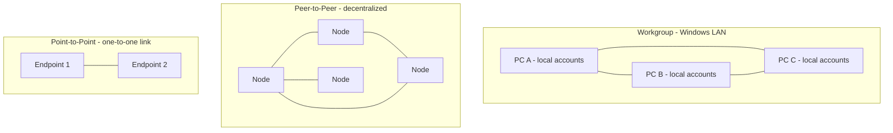

# Workgroup vs Peer-to-Peer vs Point-to-Point

Three network-organization models that are easy to confuse because two of them share the abbreviation **P2P**. A **workgroup** is a decentralized Windows LAN model, **peer-to-peer (P2P)** is a general decentralized architecture where every node is both client and server, and **point-to-point (P2P)** is a single dedicated link between exactly two endpoints.

## Overview

None of these models uses a central authority the way a domain does — there is no Domain Controller issuing single sign-on or centrally enforcing policy (contrast this with [Networking-Fundamentals](Networking-Fundamentals.md) and domain-based Active Directory design). The distinction matters both operationally (how identity, sharing, and routing work) and offensively (a flat, trust-by-default LAN is a very different attack surface from a hardened, centrally managed domain).

> [!IMPORTANT]
> **Two different "P2P" meanings**
> **Peer-to-Peer** describes a *many-node decentralized architecture* (BitTorrent, blockchain). **Point-to-Point** describes a *one-to-one link* between two devices (a VPN tunnel, a leased line). Same abbreviation, unrelated concepts — always disambiguate from context.

## Workgroup (Windows Networking)

A **workgroup** is a simple local Windows network configuration. It operates on a peer-to-peer model with **no central Domain Controller**, and is suited to small-scale networks such as homes or small offices.

### Characteristics

- Each computer manages its **own local users and permissions** — there is no centralized authentication, so an account must exist on every PC a user wants to reach.
- Computers can **share files, printers**, and other local resources.
- Members must reside on the **same local network / subnet** (see [Network-Mask-Subnet-Mask-Net-Mask](Network-Mask-Subnet-Mask-Net-Mask.md)).
- Discovery relies on legacy name-resolution services such as NetBIOS — see [NetBIOS-Name-Service(NBNS)](NetBIOS-Name-Service(NBNS).md).

Example use case: a home with three PCs sharing folders and a printer.

### Configuring a Workgroup on Windows

**Step 1 — Set the same workgroup name.** All participating computers must use the **same workgroup name**. On Windows 10/11:

1. Press `Windows + R`, type `sysdm.cpl`, press **Enter**.
2. On the **Computer Name** tab, click **Change**.
3. Under **Workgroup**, enter a name (for example, `WORKGROUP`).
4. Click **OK**, then restart. Repeat on every other computer with the same name.

**Step 2 — Create identical user accounts (optional).** Creating the **same username and password** on each computer allows seamless access and prevents repeated password prompts when reaching shared files.

**Step 3 — Share a folder.** Right-click the folder → **Properties** → **Sharing** tab → **Share…**. Select the user (`Everyone` for open access), set the permission level (Read / Read & Write), and click **Share**. For finer control, use **Advanced Sharing** to set permissions manually.

**Step 4 — Enable network discovery and file sharing.** Open **Control Panel → Network and Sharing Center → Change advanced sharing settings** and enable **Network discovery** and **File and printer sharing**. (Optionally turn off password-protected sharing for easier — but less secure — access.)

**Step 5 — Access shared folders.** From another PC in the same workgroup, press `Windows + R` and enter a UNC path:

```text
\\ComputerName
\\IP_Address
```

You can also map a network drive from **File Explorer → This PC → Map network drive**:

```text
\\PC-NAME\SharedFolder
```

To list the computers currently visible in the workgroup:

```cmd
net view
```

**Step 6 — Browse workgroup devices.** Open **File Explorer → Network** to list other online computers in the same workgroup that have sharing enabled.

> [!TIP]
> **Firewall / AV can silently block sharing**
> Ensure Windows Firewall or third-party security software is not blocking **File and Printer Sharing** or the **SMB** protocol. Allow File and Printer Sharing in the firewall. Very old systems may request SMBv1 — avoid enabling it where possible, as it is deprecated and insecure.

| Task | Action |
| --- | --- |
| Set same workgroup | Use `sysdm.cpl` |
| Share folders | Use folder Properties → Sharing |
| Enable discovery | Use advanced sharing settings |
| Access other PCs | Use `\\ComputerName` or `\\IP` |
| Map drive | Map via File Explorer |

## Peer-to-Peer (P2P)

A **decentralized network model** in which each node (peer) can act as both **client and server**, with **no central authority** managing communication or access. It is designed for resource sharing, distributed computing, and file exchange.

### Characteristics

- Highly **scalable** and **resilient**.
- Communication is **direct between peers**.
- More resistant to single points of failure.
- Often used in distributed or trustless environments.

### Examples

- **BitTorrent** — each user shares parts of files (seeds / leechers).
- **Blockchain** — a distributed ledger (for example, Bitcoin, Ethereum).
- **IPFS** — a decentralized file system.
- **Skype (classic)** — historically used P2P technology for calls.

The abbreviation **P2P** is also used for P2P applications (torrents, wallets), P2P protocols (Gnutella, DHT), and P2P payment systems (Venmo, PayPal P2P).

## Point-to-Point

A **point-to-point** connection is a **one-to-one communication path** between exactly two devices. It is common in networking, telecommunications, and VPNs. Do not confuse it with peer-to-peer.

### Characteristics

- Often **dedicated** and **secure** (for example, a leased line or an encrypted tunnel).
- Supports **high reliability** and **fixed routing**.
- Frequently used for VPN tunnels (IPsec, OpenVPN), serial links (modem to router), and site-to-site communication.

### Examples

- A **leased line** from an ISP to a corporate office.
- A **GRE/IPsec tunnel** between two firewalls.
- **PPP** (Point-to-Point Protocol) in DSL modems.

## Comparing the Three Models

The following diagram contrasts the connection shape and trust model of each.



| Feature | Workgroup | Peer-to-Peer (P2P) | Point-to-Point (P2P) |
| --- | --- | --- | --- |
| Model | Local peer-to-peer | Decentralized | One-to-one direct link |
| Server required? | No | No | No |
| Central authentication? | Local only | None | Depends (VPN/etc.) |
| Use case | Home / small office | File sharing, blockchain | VPNs, WAN links |
| Examples | Windows Workgroup | BitTorrent, Bitcoin | IPsec tunnel, PPP link |

## Security Considerations

> [!WARNING]
> **Workgroups are trust-by-default and hard to secure at scale**
> With no central authority, every workgroup host authenticates independently, so there is no single place to enforce password policy, disable an account, or audit access. Credentials are commonly reused across machines for convenience, meaning one compromised local account (or its NTLM hash) can often be replayed to others.

- **Legacy name resolution** — workgroup discovery leans on NetBIOS/LLMNR, which are trivially spoofed to capture authentication material (Responder-style attacks). Disable them where possible. See [NetBIOS-Name-Service(NBNS)](NetBIOS-Name-Service(NBNS).md).
- **SMB exposure** — file sharing exposes SMB on the LAN; never enable SMBv1, and avoid disabling password-protected sharing outside of trusted, isolated segments.
- **Peer-to-peer applications** on a corporate network can bypass egress controls and exfiltrate data over many peers, and are a common malware C2 pattern.
- **Point-to-point links** concentrate trust in two endpoints — a compromised endpoint or weak tunnel crypto exposes the whole channel, so authentication and cipher choice matter.

## Best Practices

- For anything beyond a handful of hosts, prefer a **domain** over a workgroup so identity, policy, and auditing are centralized.
- If a workgroup is unavoidable, use **unique strong passwords per host**, keep sharing scoped (avoid `Everyone`), and segment the workgroup off the rest of the network.
- **Disable NetBIOS/LLMNR** and SMBv1; rely on DNS for name resolution.
- For point-to-point links, terminate tunnels with **modern, authenticated crypto** (IPsec/IKEv2 or WireGuard/OpenVPN) rather than legacy PPP-only links.
- Restrict or block unsanctioned **peer-to-peer applications** at the network egress.

## Troubleshooting

| Symptom | Likely cause & fix |
| --- | --- |
| Can't see other workgroup PCs in Network | Network discovery or File and Printer Sharing disabled — enable them in advanced sharing settings |
| Prompted for credentials on every share | No matching local account on the target — create an identical username/password, or supply the remote host's credentials |
| `\\ComputerName` fails but `\\IP` works | NetBIOS/DNS name resolution issue — verify the name resolves or use the IP |
| Share unreachable despite correct settings | Firewall/AV blocking SMB — allow File and Printer Sharing in the firewall |

## References

- [Microsoft Learn — Overview of File Sharing (SMB)](https://learn.microsoft.com/windows-server/storage/file-server/file-server-smb-overview)
- [Microsoft Learn — Join a computer to a domain (workgroup vs domain context)](https://learn.microsoft.com/windows-server/identity/ad-fs/deployment/join-a-computer-to-a-domain)
- [RFC 1661 — The Point-to-Point Protocol (PPP)](https://www.rfc-editor.org/rfc/rfc1661)

## Related

- [Networking-Fundamentals](Networking-Fundamentals.md) — module overview and the domain-vs-workgroup distinction
- [NetBIOS-Name-Service(NBNS)](NetBIOS-Name-Service(NBNS).md) — legacy name resolution used for workgroup discovery
- [Network-Mask-Subnet-Mask-Net-Mask](Network-Mask-Subnet-Mask-Net-Mask.md) — subnet boundaries that scope a workgroup
- [Network-Topology](Network-Topology.md) — physical/logical layouts these models map onto
- [The-OSI-Model-and-TCP-IP-Model](The-OSI-Model-and-TCP-IP-Model.md) — where these connection models sit in the stack
- [Enterprise Windows Infrastructure Security](../Readme.md) — course hub
