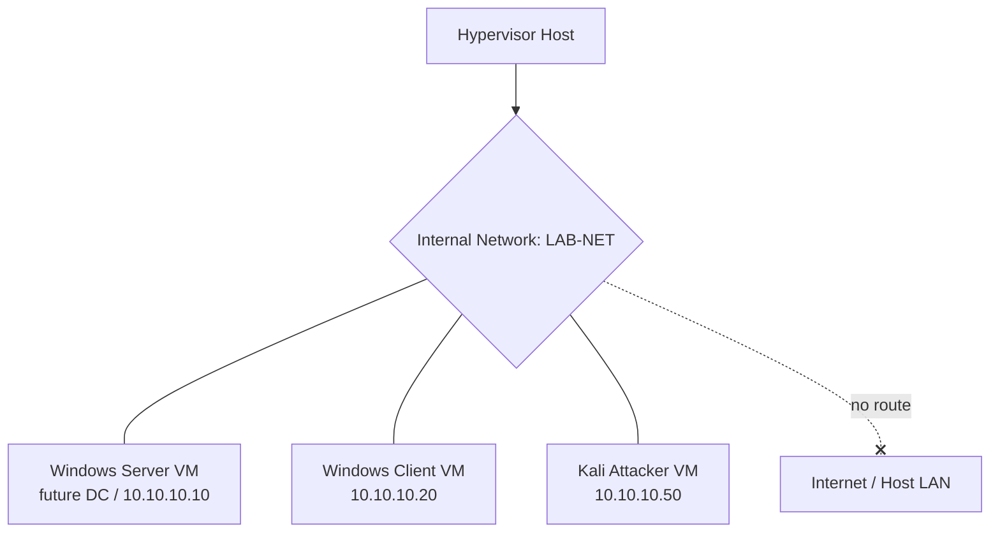

# Lab 01 — Lab Foundations

The first practical lab of the course: stand up the disposable, isolated environment every later lab depends on — a hypervisor, an internal-only virtual network, three VMs (Windows Server, Windows client, Kali attacker), and a clean snapshot of each. Get this right once and every module after it becomes reproducible.

## Overview

This lab turns the theory from the [Lab Setup and Virtualization](../Lab-Setup-and-Virtualization/Readme.md) module into a working baseline. You install a Type-2 hypervisor, create a single isolated virtual network so lab traffic never touches production, build the three VMs the rest of the course reuses, confirm they can reach each other but nothing else, and capture a named clean snapshot per VM. Every sibling lab — [Lab-02-Core-Services](Lab-02-Core-Services.md) onward — assumes this environment already exists.

> [!NOTE]
> **Where this fits**
> This is the foundation lab. It builds nothing offensive on its own; it produces the sandbox in which [Lab-05-Attack-and-Defense](Lab-05-Attack-and-Defense.md) and the rest are safely detonated and rolled back.

## Objective

Build a repeatable, fully isolated three-VM lab and prove two things: (1) the VMs can communicate with each other on an internal network, and (2) they have **no** route to the internet or your host LAN. Finish with one clean, named snapshot per VM so any later lab can reset in seconds.

## Environment and Setup

Prerequisites and components — see [Lab Setup and Virtualization](../Lab-Setup-and-Virtualization/Readme.md) for hypervisor choice and media sourcing, [Virtualization](../Lab-Setup-and-Virtualization/Virtualization.md) for concepts, and [VirtualBox-Network-Modes](../Lab-Setup-and-Virtualization/VirtualBox-Network-Modes.md) / [Virtual-Networking](../Lab-Setup-and-Virtualization/Virtual-Networking.md) for the network modes referenced below.

| Component | Role | Source |
| --- | --- | --- |
| Hypervisor | Host for all VMs (VirtualBox, VMware Workstation, or KVM/QEMU) | Vendor download |
| Windows Server VM | Future Domain Controller / services host | [Windows-Evaluation-Center](../Lab-Setup-and-Virtualization/Windows-Evaluation-Center.md) eval ISO |
| Windows client VM | Domain-joined workstation / attack target | Eval or custom build |
| Kali Linux VM | Attacker workstation | kali.org |

> [!IMPORTANT]
> **Host requirements**
> Enable hardware virtualization (**VT-x / AMD-V**) in firmware before you start, allocate at least 8 GB RAM to the host with room to run 2–3 guests, and reserve ~120 GB of disk. Prefer an **internal / host-only** network mode so lab traffic is contained by default; see [VirtualBox-Network-Modes](../Lab-Setup-and-Virtualization/VirtualBox-Network-Modes.md).

The topology this lab produces:



## Walkthrough

1. **Install the hypervisor.** Install VirtualBox, VMware Workstation, or KVM/QEMU on the host and confirm nested/hardware virtualization is active. On a Linux/KVM host you can verify support quickly:

    ```bash
    egrep -c '(vmx|svm)' /proc/cpuinfo   # non-zero means VT-x/AMD-V is present
    ```

2. **Create the isolated network.** Define a single **internal** (or host-only) network named `LAB-NET`. Do not attach a NAT or bridged adapter to lab VMs at this stage — the goal is zero egress. In VirtualBox this is an "Internal Network"; in VMware a "LAN Segment" / host-only network.

3. **Build the Windows Server VM.** Create the VM from the eval ISO, give it 2 vCPU / 4 GB RAM, attach the `LAB-NET` adapter only, and install Windows Server. Set a static IP so services stay reachable across reboots:

    ```powershell
    New-NetIPAddress -InterfaceAlias "Ethernet" -IPAddress 10.10.10.10 -PrefixLength 24   # untested
    Set-DnsClientServerAddress -InterfaceAlias "Ethernet" -ServerAddresses 127.0.0.1      # untested
    ```

4. **Build the Windows client VM.** Install a Windows client (eval or custom build), attach only `LAB-NET`, and give it a static address in the same subnet, pointing DNS at the server:

    ```powershell
    New-NetIPAddress -InterfaceAlias "Ethernet" -IPAddress 10.10.10.20 -PrefixLength 24   # untested
    Set-DnsClientServerAddress -InterfaceAlias "Ethernet" -ServerAddresses 10.10.10.10    # untested
    ```

5. **Build the Kali attacker VM.** Import or install Kali, attach only `LAB-NET`, and set a static address in the same subnet:

    ```bash
    sudo ip addr add 10.10.10.50/24 dev eth0
    sudo ip link set eth0 up
    ```

6. **Verify intra-lab connectivity.** From Kali, confirm the two Windows hosts respond (Windows Firewall may block ICMP by default — allow it temporarily or fall back to a TCP port check):

    ```bash
    ping -c 3 10.10.10.10
    ping -c 3 10.10.10.20
    ```

7. **Verify isolation.** Confirm there is **no** route out. Both of the following should fail (no reply / name resolution failure):

    ```bash
    ping -c 3 8.8.8.8
    ping -c 3 example.com
    ```

8. **Snapshot each VM clean.** With all three powered off (or in a known-good running state), take a named snapshot per VM — e.g. `clean-baseline`. This is the state every later lab rolls back to. See [Snapshots-and-Templates](../Lab-Setup-and-Virtualization/Snapshots-and-Templates.md).

    ```bash
    # VirtualBox example
    VBoxManage snapshot "WinServer" take "clean-baseline"   # untested
    VBoxManage snapshot "WinClient" take "clean-baseline"   # untested
    VBoxManage snapshot "Kali"      take "clean-baseline"   # untested
    ```

## Expected Result

- Three VMs exist, each attached only to the `LAB-NET` internal network with static addresses in `10.10.10.0/24`.
- Kali can reach `10.10.10.10` and `10.10.10.20` (ICMP or a TCP port check), confirming intra-lab connectivity.
- Every attempt to reach the internet (`8.8.8.8`, `example.com`) fails, confirming the lab is isolated.
- Each VM has a named `clean-baseline` snapshot you can restore in seconds.

> [!TIP]
> **Prove it before you build on it**
> Do not start [Lab-02-Core-Services](Lab-02-Core-Services.md) until both checks pass. A lab that can "sometimes" reach the internet is a lab that can leak — re-verify isolation after any network change.

## Security Considerations

> [!WARNING]
> **Keep the lab isolated**
> These VMs will soon run intentionally weak configurations and offensive tooling. Never attach a bridged or NAT adapter that reaches your home/office LAN or the internet unless a specific lab requires it — and revert it immediately after. Rebuild from the `clean-baseline` snapshot rather than "cleaning" a machine you have attacked.

The isolation-verification step (Walkthrough 7) is dual-use: the same "can this box reach the outside?" check an attacker runs to find egress paths is exactly what you run defensively here to *prove there are none*. Treat the whole environment as hostile to everything outside it. Never reuse lab credentials, keys, or certificates anywhere real.

## Troubleshooting

| Symptom | Likely cause & fix |
| --- | --- |
| VMs can't ping each other | Adapters on different networks, or Windows Firewall dropping ICMP — put all on `LAB-NET` and allow ICMP or use a TCP port check |
| VM still reaches the internet | A leftover NAT/bridged adapter — remove all adapters except the internal `LAB-NET` one |
| VM won't boot / nested virt fails | VT-x/AMD-V disabled in firmware, or nested virtualization off on the host |
| Static IP lost after reboot | Address applied to a transient interface or via a shell that doesn't persist — configure it in the OS network settings, not just at runtime |
| Snapshot restore missing later work | You snapshotted before finishing setup — take `clean-baseline` only once the VM is fully built and verified |

## References

- [Microsoft Evaluation Center](https://www.microsoft.com/en-us/evalcenter/) — legally sourced Windows Server and client media
- [VirtualBox networking modes](https://www.virtualbox.org/manual/ch06.html) — internal vs host-only vs NAT vs bridged
- [Get Kali Linux](https://www.kali.org/get-kali/) — official attacker VM images
- [VMware Workstation networking documentation](https://docs.vmware.com/en/VMware-Workstation-Pro/index.html) — LAN segments and host-only networks

## Related

- [Lab Setup and Virtualization](../Lab-Setup-and-Virtualization/Readme.md) — the module this lab operationalizes
- [Virtualization](../Lab-Setup-and-Virtualization/Virtualization.md) — hypervisor concepts and types
- [VirtualBox-Network-Modes](../Lab-Setup-and-Virtualization/VirtualBox-Network-Modes.md) — network modes used to isolate the lab
- [Virtual-Networking](../Lab-Setup-and-Virtualization/Virtual-Networking.md) — virtual network design
- [Windows-Evaluation-Center](../Lab-Setup-and-Virtualization/Windows-Evaluation-Center.md) — sourcing Windows media legally
- [Snapshots-and-Templates](../Lab-Setup-and-Virtualization/Snapshots-and-Templates.md) — the snapshot/rollback workflow
- [Lab-Design](../Lab-Setup-and-Virtualization/Lab-Design.md) — lab topology planning
- [Lab-02-Core-Services](Lab-02-Core-Services.md) — next lab (DNS/DHCP/IIS build-and-verify)
- [Lab-03-Active-Directory](Lab-03-Active-Directory.md) — sibling lab (DC promotion, OU/GPO)
- [Lab-04-Remote-Access](Lab-04-Remote-Access.md) — sibling lab (VPN/RRAS, RDP hardening)
- [Lab-05-Attack-and-Defense](Lab-05-Attack-and-Defense.md) — sibling lab (Kerberoasting, LLMNR)
- [Lab-06-Backup-and-Recovery](Lab-06-Backup-and-Recovery.md) — sibling lab (restore drills)
- [Lab-07-Monitoring](Lab-07-Monitoring.md) — sibling lab (audit policy, Sysmon)
- [Enterprise Windows Infrastructure Security](../Readme.md) — course hub
