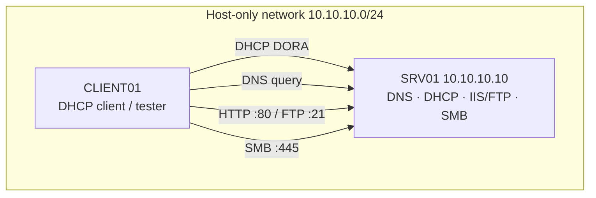

# Lab 02 — Core Services

A build-and-verify lab that stands up the four core Windows Server infrastructure services on a single member server — **DNS**, **DHCP**, **IIS (with FTP)**, and **File Services** — and confirms each one works before moving on. This is the "make the network usable" step that later labs (Active Directory, Remote Access) depend on.

## Overview

This lab turns the theory from the core-service modules into a working, testable stack. You install each role, configure the minimum needed to serve a client, and then *verify* it from a second VM rather than assuming it works. The emphasis is discipline: every service is proven with a concrete check before you snapshot and move on.

> [!NOTE]
> **Where this fits**
> Lab 01 gave you an isolated network and clean VMs. Lab 02 makes that network functional. Lab 03 (Active Directory) assumes a working DNS server, so get DNS right here first.

It exercises these modules:

- [Domain Name System (DNS)](../Domain-Name-System-DNS/Readme.md)
- [Dynamic Host Configuration Protocol (DHCP)](../Dynamic-Host-Configuration-Protocol-DHCP/Readme.md)
- [Web Server (IIS)](../Web-Server-IIS/Readme.md) and [FTP Server Administration](../FTP-Server-Administration/Readme.md)
- [File Services and DFS](../File-Services-and-DFS/Readme.md)

## Objective

Install and configure DNS, DHCP, IIS/FTP, and an SMB file share on one Windows Server VM, then verify each service end-to-end from a separate client VM. You should finish able to resolve a name, lease an address, load a web page, transfer a file over FTP, and read/write a network share — all inside an isolated lab.

## Environment and Setup

Build on the baseline from [Lab Setup and Virtualization](../Lab-Setup-and-Virtualization/Readme.md) and start from clean snapshots.

| VM | Role | Network | Notes |
| --- | --- | --- | --- |
| `SRV01` | Windows Server (core services) | Host-only / internal | Static IP `10.10.10.10/24` |
| `CLIENT01` | Windows 10/11 client | Same host-only / internal | DHCP-assigned (Step 3 test) |

Prerequisites:

- Both VMs on the **same** host-only/internal network with **no** route to the internet or a real LAN.
- `SRV01` has a static IP and hostname set (a static IP is mandatory for DNS and DHCP servers).
- Local administrator PowerShell on `SRV01`.

> [!TIP]
> **Snapshot first**
> Snapshot both VMs clean before you start. This lab installs four roles; if a step wedges, roll back rather than untangling half-configured services.



Build order matters: **DNS → DHCP → IIS/FTP → File Services**. DHCP hands clients the DNS server address, so DNS goes first.

## Walkthrough

Run all server steps in an elevated PowerShell session on `SRV01`.

### 1. DNS — install and create a forward zone

```powershell
Install-WindowsFeature -Name DNS -IncludeManagementTools
Add-DnsServerPrimaryZone -Name "lab.local" -ZoneFile "lab.local.dns"
Add-DnsServerResourceRecordA -Name "www" -ZoneName "lab.local" -IPv4Address "10.10.10.10"
```

See [PowerShell-script-to-create-DNS-zones](../Domain-Name-System-DNS/PowerShell-script-to-create-DNS-zones.md) and [Forward-and-Reverse-DNS-Zones](../Domain-Name-System-DNS/Forward-and-Reverse-DNS-Zones.md) for the record types and reverse-zone follow-up.

### 2. DHCP — install, authorize, and scope

```powershell
Install-WindowsFeature -Name DHCP -IncludeManagementTools
# Authorize the server in AD if domain-joined; standalone labs can skip authorization
Add-DhcpServerv4Scope -Name "LabScope" -StartRange 10.10.10.100 -EndRange 10.10.10.200 -SubnetMask 255.255.255.0
Set-DhcpServerv4OptionValue -Router 10.10.10.1 -DnsServer 10.10.10.10 -DnsDomain "lab.local"
```

The DORA lease exchange is covered in [DORA-Process](../Dynamic-Host-Configuration-Protocol-DHCP/DORA-Process.md); scope/server options in [DHCP-Scope-Options](../Dynamic-Host-Configuration-Protocol-DHCP/DHCP-Scope-Options.md).

### 3. Confirm a client lease (on `CLIENT01`)

Set `CLIENT01`'s adapter to DHCP, then:

```cmd
ipconfig /release
ipconfig /renew
ipconfig /all
```

The client should receive an address in `10.10.10.100–200` with DNS `10.10.10.10`.

### 4. IIS — install and publish a test site

```powershell
Install-WindowsFeature -Name Web-Server -IncludeManagementTools
"<h1>Lab 02 IIS OK</h1>" | Out-File C:\inetpub\wwwroot\index.html -Encoding utf8
```

The default site listens on port 80. Site bindings are explained in [Types-of-Site-Binding-in-IIS](../Web-Server-IIS/Types-of-Site-Binding-in-IIS.md) and the role in [Internet-Information-Services(IIS)](../Web-Server-IIS/Internet-Information-Services(IIS).md).

### 5. FTP — add the FTP service and a site

```powershell
Install-WindowsFeature -Name Web-FTP-Server -IncludeManagementTools
New-Item -Path C:\ftproot -ItemType Directory
New-WebFtpSite -Name "LabFTP" -Port 21 -PhysicalPath "C:\ftproot"   # untested
```

Configure basic authentication and SSL as described in [FTP-Setup-in-IIS](../FTP-Server-Administration/FTP-Setup-in-IIS.md); keep anonymous access **off** unless the lab step requires it. User isolation is in [FTP-User-Isolation](../FTP-Server-Administration/FTP-User-Isolation.md).

### 6. File Services — create and share a folder

```powershell
Install-WindowsFeature -Name FS-FileServer
New-Item -Path C:\Shares\Data -ItemType Directory
New-SmbShare -Name "Data" -Path "C:\Shares\Data" -FullAccess "Administrators"
```

Tighten NTFS permissions afterward — see [NTFS-Permissions-Setup-with-PowerShell](../File-Services-and-DFS/NTFS-Permissions-Setup-with-PowerShell.md) and [Share-Permissions](../File-Services-and-DFS/Share-Permissions.md) (share vs NTFS ACL interaction).

### 7. Verify everything from `CLIENT01`

```powershell
Resolve-DnsName www.lab.local -Server 10.10.10.10
Invoke-WebRequest http://10.10.10.10 -UseBasicParsing
Test-NetConnection -ComputerName 10.10.10.10 -Port 21
Test-NetConnection -ComputerName 10.10.10.10 -Port 445
```

```cmd
net use Z: \\10.10.10.10\Data
```

## Expected Result

- `Resolve-DnsName` returns `10.10.10.10` for `www.lab.local`.
- `CLIENT01` holds a lease in the scope range with the correct DNS/router options.
- `Invoke-WebRequest` returns HTTP 200 with your "Lab 02 IIS OK" body.
- `Test-NetConnection` reports `TcpTestSucceeded : True` for ports 21 and 445.
- The mapped drive `Z:` opens and you can create a file in it.

> [!IMPORTANT]
> **Verify, don't assume**
> A green install prompt is not proof a service works. The lab is only complete when all five client-side checks pass. Snapshot the VMs as "Lab 02 core services" once they do.

## Security Considerations

> [!WARNING]
> **Keep this lab isolated**
> This build uses intentionally weak defaults — a wide-open SMB share, plaintext FTP, an unauthenticated web root, and a DHCP server that will answer any client on the segment. Never place these VMs on a production or home network. A rogue DHCP or DNS server on a real LAN is a live man-in-the-middle vector.

- Dual-use framing: the same DHCP and DNS you just built are what attackers *spoof* to redirect victims — see [Rogue-DHCP-Server](../Dynamic-Host-Configuration-Protocol-DHCP/Rogue-DHCP-Server.md), [DHCP-Starvation-Attack](../Dynamic-Host-Configuration-Protocol-DHCP/DHCP-Starvation-Attack.md), and [DHCP-Security-Issues-and-Attacks](../Dynamic-Host-Configuration-Protocol-DHCP/DHCP-Security-Issues-and-Attacks.md). Building it here teaches you what a poisoned response looks like on the wire.
- Plaintext FTP exposes credentials; prefer [FTPS](../FTP-Server-Administration/FTPS.md) and enable [FTP-Logging](../FTP-Server-Administration/FTP-Logging.md) even in the lab so you learn the audit trail.
- Reset by rolling back to the clean snapshot — never reuse lab credentials, shares, or certificates anywhere real.

## Troubleshooting

| Symptom | Likely cause & fix |
| --- | --- |
| Client gets a `169.254.x.x` address | DHCP not authorized/serving, or client on the wrong virtual network — confirm both VMs share the host-only network and the scope is active |
| `Resolve-DnsName` times out | Query the DNS server explicitly with `-Server 10.10.10.10`; confirm the zone and A record exist |
| Web page unreachable but service running | Windows Firewall blocking port 80 — allow the "World Wide Web Services (HTTP)" rule |
| FTP connects but no directory listing | Passive-mode data ports blocked, or FTP site bindings/auth not configured — revisit [FTP-Setup-in-IIS](../FTP-Server-Administration/FTP-Setup-in-IIS.md) |
| Share visible but access denied | Share ACL and NTFS ACL differ — the effective permission is the *more restrictive* of the two |

## References

- [Microsoft Learn — DNS Server role](https://learn.microsoft.com/windows-server/networking/dns/dns-top)
- [Microsoft Learn — Deploy DHCP](https://learn.microsoft.com/windows-server/networking/technologies/dhcp/dhcp-deploy-wps)
- [Microsoft Learn — Install IIS and FTP](https://learn.microsoft.com/iis/get-started/whats-new-in-iis-85/installing-iis-85-on-windows-server-2012-r2)
- [Microsoft Learn — SMB file server (New-SmbShare)](https://learn.microsoft.com/powershell/module/smbshare/new-smbshare)

## Related

- [Domain Name System (DNS)](../Domain-Name-System-DNS/Readme.md) — module this lab exercises
- [Dynamic Host Configuration Protocol (DHCP)](../Dynamic-Host-Configuration-Protocol-DHCP/Readme.md) — module this lab exercises
- [Web Server (IIS)](../Web-Server-IIS/Readme.md) — module this lab exercises
- [FTP Server Administration](../FTP-Server-Administration/Readme.md) — module this lab exercises
- [File Services and DFS](../File-Services-and-DFS/Readme.md) — module this lab exercises
- [Lab Setup and Virtualization](../Lab-Setup-and-Virtualization/Readme.md) — prerequisite environment
- [Lab-01-Lab-Foundations](Lab-01-Lab-Foundations.md) — prior lab (hypervisor, isolated network, VMs)
- [Lab-03-Active-Directory](Lab-03-Active-Directory.md) — next lab (depends on this DNS server)
- [Lab-04-Remote-Access](Lab-04-Remote-Access.md) — sibling lab
- [Lab-05-Attack-and-Defense](Lab-05-Attack-and-Defense.md) — sibling lab
- [Lab-06-Backup-and-Recovery](Lab-06-Backup-and-Recovery.md) — sibling lab
- [Lab-07-Monitoring](Lab-07-Monitoring.md) — sibling lab
- [Enterprise Windows Infrastructure Security](../Readme.md) — course hub
