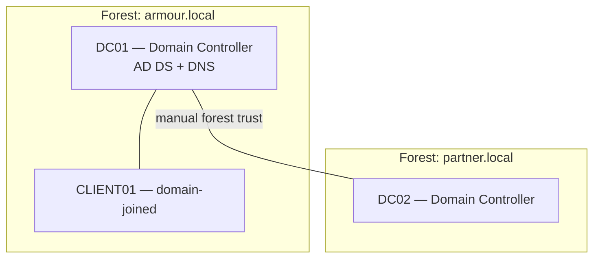

# Lab 03 — Active Directory

Build a single-domain Active Directory forest from bare Windows Server, then layer on the organizing structures a real domain needs — organizational units, a Group Policy Object, users and groups — and finish by wiring a manual trust to a second forest. This lab turns the theory in the AD DS and GPO modules into a working, breakable domain.

## Overview

This is the Active Directory track of the [Practical Labs](Readme.md) collection. It exercises the core administrative lifecycle of a domain: promoting the first Domain Controller, designing an OU hierarchy, applying policy through a linked GPO, provisioning identities, and establishing a cross-forest trust. Everything built here becomes the foundation the later attack-and-defense and backup labs stand on, so keep the finished VMs snapshotted.

> [!NOTE]
> **Where this fits**
> Labs 01–02 gave you a hypervisor, an isolated network, and core services (DNS/DHCP). This lab adds identity. [Lab-04-Remote-Access](Lab-04-Remote-Access.md) and [Lab-05-Attack-and-Defense](Lab-05-Attack-and-Defense.md) both assume the `armour.local` domain from here already exists.

## Objective

Stand up a new forest (`armour.local`), promote a server to Domain Controller, and produce a minimally realistic domain: at least two OUs, one GPO linked to an OU, a security group with members, and a manual one-way or two-way trust to a second forest — all verified with PowerShell.

## Environment and Setup

Follow the baseline in [Lab Setup and Virtualization](../Lab-Setup-and-Virtualization/Readme.md) and snapshot every VM clean before you start.

| VM | Role | Notes |
| --- | --- | --- |
| DC01 | Windows Server → Domain Controller for `armour.local` | Static IP; will host AD DS + DNS |
| DC02 (optional) | Windows Server → DC for a second forest `partner.local` | Only needed for the trust step |
| CLIENT01 | Windows 10/11 | Domain-join target to sanity-check the domain |

- **Network mode**: host-only / internal only — no route to a production LAN or the internet.
- **Prerequisites**: static IPv4 on DC01; the DC must point DNS at **itself** (its own static IP) before promotion.
- **Modules exercised**: [Active Directory Domain Services](../Active-Directory-Domain-Services-AD-DS/Readme.md), [Group Policy Objects](../Group-Policy-Objects-GPO/Readme.md), and DNS from the Core Services module (a DC is authoritative for its domain zone).



## Walkthrough

**1. Set the DC's networking (on DC01).** Give the server a static address and point it at itself for DNS — AD DS promotion needs a stable name and working DNS.

```powershell
# Adjust InterfaceAlias / addresses to your lab subnet
New-NetIPAddress -InterfaceAlias "Ethernet" -IPAddress 10.10.10.10 -PrefixLength 24 -DefaultGateway 10.10.10.1
Set-DnsClientServerAddress -InterfaceAlias "Ethernet" -ServerAddresses 10.10.10.10
Rename-Computer -NewName "DC01" -Restart
```

**2. Install the AD DS role.**

```powershell
Install-WindowsFeature AD-Domain-Services -IncludeManagementTools
```

**3. Promote the server to the first DC of a new forest.** This creates `armour.local` and installs an integrated DNS zone. You will be prompted for the DSRM (Directory Services Restore Mode) password.

```powershell
Import-Module ADDSDeployment
Install-ADDSForest `
  -DomainName "armour.local" `
  -DomainNetbiosName "ARMOUR" `
  -DomainMode "WinThreshold" `
  -ForestMode "WinThreshold" `
  -InstallDns:$true `
  -DatabasePath "C:\WINDOWS\NTDS" `
  -LogPath "C:\WINDOWS\NTDS" `
  -SysvolPath "C:\WINDOWS\SYSVOL" `
  -NoRebootOnCompletion:$false `
  -Force:$true
```

> [!TIP]
> **Domain and forest functional level**
> `WinThreshold` is the functional-level string for Server 2016 and works on later versions; if all your DCs are newer you can raise the level afterward. Match the level to the **oldest** DC you plan to run.

**4. Design an OU structure.** OUs are the unit of delegation and GPO linking — mirror how the org is administered, not the org chart.

```powershell
New-ADOrganizationalUnit -Name "ARMOUR-Corp" -Path "DC=armour,DC=local"
New-ADOrganizationalUnit -Name "Workstations" -Path "OU=ARMOUR-Corp,DC=armour,DC=local"
New-ADOrganizationalUnit -Name "Staff"        -Path "OU=ARMOUR-Corp,DC=armour,DC=local"
```

**5. Create a group and users, then add membership.**

```powershell
$ouPath = "OU=Staff,OU=ARMOUR-Corp,DC=armour,DC=local"

New-ADGroup -Name "Helpdesk" -GroupScope Global -GroupCategory Security -Path $ouPath

New-ADUser -Name "j.doe" -SamAccountName "j.doe" -UserPrincipalName "j.doe@armour.local" `
  -Path $ouPath `
  -AccountPassword (Read-Host -AsSecureString "Password") `
  -ChangePasswordAtLogon $true -Enabled $true

Add-ADGroupMember -Identity "Helpdesk" -Members "j.doe"
```

**6. Create and link a GPO.** Create the policy object, link it to the OU whose objects it should apply to, then let it replicate.

```powershell
New-GPO -Name "Staff-Baseline"
New-GPLink -Name "Staff-Baseline" -Target "OU=Staff,OU=ARMOUR-Corp,DC=armour,DC=local"
# Configure settings in the Group Policy Management Console, then force a refresh on a client:
gpupdate /force
```

> [!IMPORTANT]
> **GPO scope**
> A GPO does nothing until it is **linked** to a site, domain, or OU. Link scope + security filtering + [GPO-Processing-Order](../Group-Policy-Objects-GPO/GPO-Processing-Order.md) (LSDOU) decide who actually gets it — see [Group Policy Objects](../Group-Policy-Objects-GPO/Readme.md).

**7. Establish a trust to a second forest (optional).** On DC01, create a forest trust to `partner.local` (DC02 must be reachable and DNS-resolvable — a conditional forwarder or stub zone is the usual fix).

```powershell
# Enumerate existing trusts first
Get-ADTrust -Filter *

# Create the trust interactively (prompts for the partner-side credentials / trust password)
netdom trust armour.local /Domain:partner.local /add /twoway   # untested
```

**8. Verify.** Confirm the domain, OUs, group membership, GPO link, and trust from PowerShell.

```powershell
Get-ADDomain | Select-Object Name, DomainMode, DNSRoot
Get-ADOrganizationalUnit -Filter * | Select-Object Name, DistinguishedName
Get-ADGroupMember -Identity "Helpdesk"
Get-GPO -All | Select-Object DisplayName
Get-ADTrust -Filter * | Select-Object Name, Direction, TrustType
```

## Expected Result

- `Get-ADDomain` returns `armour.local` with the functional level you set, and DC01 answers DNS for the zone.
- The OU tree (`ARMOUR-Corp > Staff`, `Workstations`) exists, and `j.doe` lives in `Staff` and is a member of `Helpdesk`.
- `Staff-Baseline` shows a link on the `Staff` OU, and `gpupdate /force` on a domain-joined client completes without policy errors.
- CLIENT01 can join the domain and authenticate as `j.doe`.
- If you built the trust, `Get-ADTrust` lists `partner.local` with the direction you chose, and a user from one forest can be resolved across the trust.

## Security Considerations

> [!WARNING]
> **Keep this domain isolated**
> This lab deliberately builds a domain you will later attack (Kerberoasting, LLMNR poisoning, credential dumping in [Lab-05-Attack-and-Defense](Lab-05-Attack-and-Defense.md)). Never bridge it to a real network, never reuse its passwords or the DSRM password anywhere real, and rebuild from snapshot rather than "cleaning" a DC you have compromised.

- **Trusts widen the attack surface.** A forest trust is a legitimate admin tool *and* a pivot for cross-forest SID-history and Kerberos attacks. Keep **SID filtering** on and use **selective authentication** for anything but the fullest-trust case — see [Trust-Relationships](../Active-Directory-Domain-Services-AD-DS/Trust-Relationships.md).
- **Dual-use enumeration.** `Get-ADTrust`, `Get-ADOrganizationalUnit`, and `Get-ADGroupMember` are the same commands an attacker runs after landing on a domain host; learn to read the output from both sides.
- Treat the DSRM password with the same care as a domain admin credential — it grants offline access to NTDS.dit.

## Troubleshooting

| Symptom | Likely cause & fix |
| --- | --- |
| `Install-ADDSForest` fails on a DNS check | DC01's DNS isn't pointing at itself — set `Set-DnsClientServerAddress` to its own static IP, then retry |
| Promotion fails: name/network not stable | Rename and set the static IP **before** promoting; reboot in between |
| New OU/user cmdlet: "Directory object not found" | Wrong `-Path` DN — verify with `Get-ADDomain` and copy the exact `DistinguishedName` |
| GPO settings never apply to a client | GPO not linked, blocked by inheritance, or filtered out — check the link scope and run `gpresult /r` on the client |
| Trust creation fails to resolve `partner.local` | No cross-forest name resolution — add a conditional forwarder or stub zone on each DC first |

## References

- [Microsoft Learn — Install a new Windows Server AD forest (PowerShell)](https://learn.microsoft.com/windows-server/identity/ad-ds/deploy/install-active-directory-domain-services--level-100-)
- [Microsoft Learn — Create Organizational Units](https://learn.microsoft.com/windows-server/identity/ad-ds/deploy/create-an-organizational-unit)
- [Microsoft Learn — How domain and forest trusts work](https://learn.microsoft.com/windows-server/identity/ad-ds/manage/how-domain-and-forest-trusts-work)

## Related

- [Active Directory Domain Services](../Active-Directory-Domain-Services-AD-DS/Readme.md) — the module this lab builds
- [Organizational-Units-OU](../Active-Directory-Domain-Services-AD-DS/Organizational-Units-OU.md) — OU design and delegation
- [Trust-Relationships](../Active-Directory-Domain-Services-AD-DS/Trust-Relationships.md) — trust direction, transitivity, and types
- [Managing-Domain-Users-and-Groups-with-PowerShell](../Active-Directory-Domain-Services-AD-DS/Managing-Domain-Users-and-Groups-with-PowerShell.md) — user/group cmdlets used here
- [Group Policy Objects](../Group-Policy-Objects-GPO/Readme.md) — creating, linking, and scoping GPOs
- [Lab Setup and Virtualization](../Lab-Setup-and-Virtualization/Readme.md) — baseline lab environment
- [Lab-01-Lab-Foundations](Lab-01-Lab-Foundations.md) — sibling lab (hypervisor and isolated network)
- [Lab-02-Core-Services](Lab-02-Core-Services.md) — sibling lab (DNS/DHCP the DC depends on)
- [Lab-04-Remote-Access](Lab-04-Remote-Access.md) — sibling lab (uses this domain)
- [Lab-05-Attack-and-Defense](Lab-05-Attack-and-Defense.md) — sibling lab (attacks this domain)
- [Enterprise Windows Infrastructure Security](../Readme.md) — course hub
