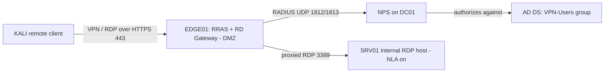

# Lab 04 — Remote Access

This lab builds a secure remote-access edge: an **RRAS VPN gateway** whose users are authorized by **NPS (RADIUS)** against Active Directory, plus a **hardened RDP** path fronted by an **RD Gateway** (RDP-over-HTTPS) with **Network Level Authentication (NLA)** enforced. It turns the theory in the Remote Access module into a working, testable edge you can attack and defend.

## Overview

Remote access is where the internet meets the internal network, so it is both the most useful edge service and the most exposed. This lab has you stand up the two canonical Windows remote-access paths — a VPN tunnel terminated by [RRAS](../Remote-Access-and-VPN-Configuration/RRAS.md) and centrally authorized by NPS, and internal RDP reachable only through an [RD Gateway](../Remote-Access-and-VPN-Configuration/Remote-Desktop-Gateway.md) on TCP 443 — then verify each works and is hardened. It sits in the [Practical Labs](Readme.md) arc after the core-services and Active Directory labs, because both paths depend on a working domain for identity.

## Objective

Configure and validate a remote-access edge end to end:

- Enable RRAS as a VPN server and delegate authentication to NPS/RADIUS scoped to an AD security group.
- Front internal RDP with an RD Gateway on 443 and prove that raw 3389 is no longer needed from outside.
- Enforce NLA on the RDP host and confirm authentication happens *before* a session is built.

## Environment and Setup

Build on the baseline from [Lab Setup](../Lab-Setup-and-Virtualization/Readme.md) and the domain from [Lab-03-Active-Directory](Lab-03-Active-Directory.md). Use an **isolated host-only/internal** network — nothing here should touch a real LAN or the internet.

| VM | Role | Notes |
|---|---|---|
| `DC01` | AD DS + NPS | Domain controller from [Lab-03-Active-Directory](Lab-03-Active-Directory.md); hosts the RADIUS/NPS policy |
| `EDGE01` | RRAS VPN + RD Gateway | Two NICs (simulated "external" + internal), domain-joined |
| `SRV01` | Internal RDP target | Domain member; only reachable via VPN or the gateway |
| `KALI` | Remote client / attacker | Simulates the internet-side client |

Prerequisites: DC01 promoted with DNS; an AD security group (e.g. `VPN-Users`) with a test member; a TLS server certificate on EDGE01 whose subject/SAN matches the external FQDN clients dial. See [RRAS](../Remote-Access-and-VPN-Configuration/RRAS.md), [Remote-Desktop-Gateway](../Remote-Access-and-VPN-Configuration/Remote-Desktop-Gateway.md), and [RDP](../Remote-Access-and-VPN-Configuration/RDP.md) for the underlying mechanics.



## Walkthrough

> [!NOTE]
> **Snapshot first**
> Snapshot every VM clean before you start so you can roll back and repeat the lab.

1. **Install the roles.** On EDGE01 add Remote Access (with routing), the RD Gateway role service, and on DC01 add NPS (Network Policy and Access Services).

    ```powershell
    # On EDGE01
    Install-WindowsFeature -Name RemoteAccess -IncludeManagementTools   # untested
    Install-WindowsFeature -Name RDS-Gateway   -IncludeManagementTools   # untested

    # On DC01
    Install-WindowsFeature -Name NPAS -IncludeManagementTools            # untested
    ```

2. **Enable RRAS as a VPN server.** Either use the *Configure and Enable Routing and Remote Access* wizard (**Custom configuration → VPN access**) or PowerShell, then confirm.

    ```powershell
    Install-RemoteAccess -VpnType Vpn                                    # untested
    Get-RemoteAccess                                                     # untested
    ```

3. **Point RRAS authentication at NPS.** In the RRAS console set the **Authentication provider** to **RADIUS**, add DC01 as the RADIUS server, and share a strong secret. On DC01, register EDGE01 as a **RADIUS client** and create a **Network Policy** that grants access to the `VPN-Users` group only.

    ```cmd
    :: Inspect the resulting NPS configuration on DC01
    netsh nps show config
    ```

4. **Pin strong tunnel/auth types.** Disable PPTP ports; standardize on **IKEv2/SSTP** with EAP or certificate auth so weak protocols cannot be negotiated.

    ```powershell
    # Restrict accepted user-auth protocols (verify values with Get-Help)
    Set-VpnAuthProtocol -UserAuthProtocolAccepted Eap,Certificate       # untested
    ```

5. **Harden the internal RDP host (SRV01).** Enable RDP and require NLA on the `RDP-Tcp` listener.

    ```powershell
    # Enable RDP and open the firewall group
    Set-ItemProperty -Path 'HKLM:\System\CurrentControlSet\Control\Terminal Server' -Name "fDenyTSConnections" -Value 0   # untested
    Enable-NetFirewallRule -DisplayGroup "Remote Desktop"                                                                  # untested

    # Force Network Level Authentication (1 = required) on the listener
    (Get-WmiObject -class "Win32_TSGeneralSetting" -Namespace root\cimv2\terminalservices -Filter "TerminalName='RDP-tcp'").SetUserAuthenticationRequired(1)   # untested
    ```

6. **Publish RDP through the gateway.** In **RD Gateway Manager** on EDGE01, bind the TLS certificate, then create an **RD CAP** (who may connect — the `VPN-Users` group) and an **RD RAP** (which hosts they may reach — a group containing SRV01). Both must pass. For scale, set the CAP store to a **central NPS** on DC01.

7. **Connect as the remote client.** From KALI (or the mstsc gateway setting), route RDP to SRV01 *through* EDGE01 on 443 — never dialing 3389 directly.

    ```cmd
    :: Windows client: set the RD Gateway server in mstsc Advanced tab, then connect to the internal host
    mstsc /v:SRV01.lab.local
    ```

    ```bash
    # Linux client via the gateway (FreeRDP)
    xfreerdp /v:SRV01.lab.local /g:edge01.lab.local /u:vpnuser /d:LAB   # untested
    ```

## Expected Result

- The VPN client authenticates and receives an internal IP; NPS on DC01 logs a **grant** only for `VPN-Users` members and a **deny** for anyone outside the group.
- RDP to SRV01 succeeds **only** through EDGE01 on 443; a direct attempt to 3389 from the client network is blocked/unreachable.
- With NLA on, credentials are demanded before the desktop is built — no session appears for an unauthenticated client.
- On SRV01, a successful remote logon appears as Security event **4624** with **LogonType 10** (RemoteInteractive); gateway activity logs to `Microsoft-Windows-TerminalServices-Gateway/Operational`.

> [!TIP]
> **Prove the negative**
> Success is not just "it connected." Explicitly try to reach 3389 directly and to VPN in with a non-`VPN-Users` account — both should fail. That is what confirms the controls, not the happy path.

## Security Considerations

> [!WARNING]
> **Keep this lab isolated and treat the edge as hostile**
> - Run everything on a **host-only/internal** network. The "external" NIC is simulated — never bridge EDGE01 to a real network. Rebuild from snapshot after any offensive testing rather than cleaning in place.
> - RRAS and RD Gateway both sit in the DMZ and answer **unauthenticated, internet-facing** requests by design. Historically both have shipped critical pre-auth RCEs — RD Gateway's **BlueGate (CVE-2020-0609 / CVE-2020-0610)** in the UDP 3391 transport, and RDP's **BlueKeep (CVE-2019-0708)**. Patch, and block UDP 3391 if unused.
> - **Dual-use framing:** enumerating an exposed RD Gateway (`/remoteDesktopGateway/`, RDWeb) or password-spraying 443/3389 is exactly what an attacker does to find this edge — practice it here only to validate that lockout, NLA, and least-privilege CAP/RAP scoping actually stop it. Never point these techniques at systems you do not own.
> - Never reuse lab credentials, the RADIUS shared secret, or the TLS certificate anywhere real.

## Troubleshooting

| Symptom | Likely cause & fix |
|---|---|
| VPN client authenticates but gets no IP | RRAS address pool / DHCP relay not set — configure under RRAS → IPv4 → Address Assignment |
| All VPN logons denied | NPS network policy missing or EDGE01 not registered as a RADIUS client with the matching shared secret |
| Reaches gateway but "not authorized to connect" | RD **CAP** denies the user — add them to the CAP group or fix the required auth method |
| Authorized but cannot reach SRV01 | No matching RD **RAP** for that host — add SRV01 to a managed group referenced by an RAP |
| RDP "connects then drops" | Account lacks *Allow log on through Remote Desktop Services* rights, or a CredSSP patch-level mismatch between client and server |
| Certificate warning on connect | Self-signed/name-mismatched TLS cert — deploy a trusted cert whose SAN matches the external FQDN |

## References

- [Remote Access (RRAS) overview — Microsoft Learn](https://learn.microsoft.com/en-us/windows-server/remote/remote-access/remote-access)
- [Network Policy Server (NPS) — Microsoft Learn](https://learn.microsoft.com/en-us/windows-server/networking/technologies/nps/nps-top)
- [Remote Desktop Services / RD Gateway deployment — Microsoft Learn](https://learn.microsoft.com/en-us/windows-server/remote/remote-desktop-services/remotepc/remote-desktop-services)
- [CVE-2019-0708 (BlueKeep) — MSRC](https://msrc.microsoft.com/update-guide/vulnerability/CVE-2019-0708)

## Related

- [RRAS](../Remote-Access-and-VPN-Configuration/RRAS.md) — Routing and Remote Access Service, the VPN gateway built here
- [Remote-Desktop-Gateway](../Remote-Access-and-VPN-Configuration/Remote-Desktop-Gateway.md) — RDP-over-HTTPS gateway and CAP/RAP policy
- [RDP](../Remote-Access-and-VPN-Configuration/RDP.md) — Remote Desktop Protocol and NLA hardening
- [Remote-Access-and-VPN](../Remote-Access-and-VPN-Configuration/Remote-Access-and-VPN.md) — module overview and the NPS/RADIUS central store
- [Group-Policy(GPO)](../Group-Policy-Objects-GPO/Group-Policy(GPO).md) — pushing NLA, lockout, and logon rights centrally
- [Windows-Event-Logs](../Windows-Operating-System-Administration/Windows-Event-Logs.md) — remote-access logon detection and log handling
- [Lab-03-Active-Directory](Lab-03-Active-Directory.md) — prerequisite domain and identity this lab authorizes against
- [Lab-02-Core-Services](Lab-02-Core-Services.md) — sibling lab (DNS/DHCP/IIS core services)
- [Lab-05-Attack-and-Defense](Lab-05-Attack-and-Defense.md) — sibling lab (attacking and defending these services)
- [Lab Setup](../Lab-Setup-and-Virtualization/Readme.md) — baseline lab environment
- [Enterprise Windows Infrastructure Security](../Readme.md) — course hub
