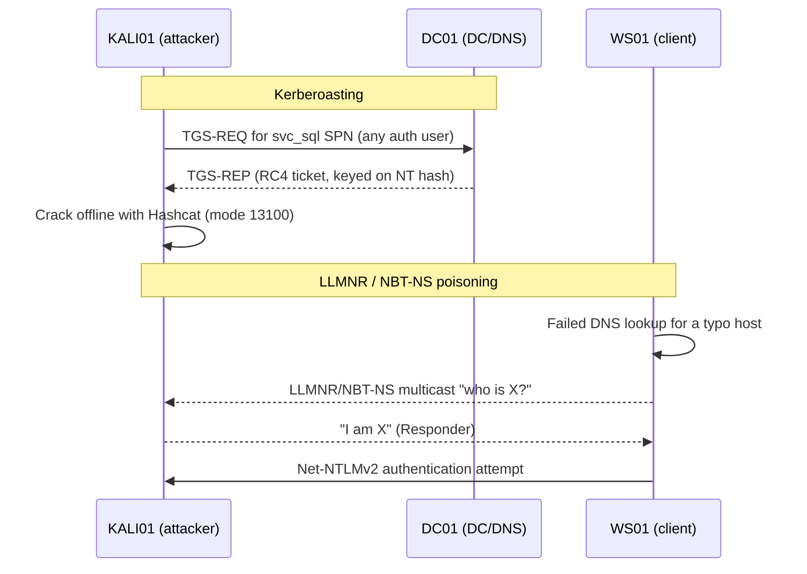

# Lab 05 — Attack & Defense

This lab pairs two classic Active Directory credential-theft techniques — **Kerberoasting** and **LLMNR/NBT-NS poisoning** — with the concrete controls that stop them. You run each attack once on a disposable lab, then apply and re-test the defensive configuration so the attack fails the second time.

## Overview

This is the Attack & Defense track of the [Practical Labs](Readme.md) collection. It turns the theory in [Kerberos-and-NTLM-Hardening](../Enterprise-Security/Kerberos-and-NTLM-Hardening.md) and [Kerberos-Authentication](../Active-Directory-Domain-Services-AD-DS/Kerberos-Authentication.md) into muscle memory: request a Kerberoastable service ticket and crack it offline, capture domain credentials by answering broadcast name-resolution queries, and then verify that AES enforcement, strong service-account passwords, and disabling multicast name resolution close both doors. The goal is not the exploit but the **attack → control → re-test** loop that proves a hardening change actually works.

> [!NOTE]
> **Where this fits**
> Runs after [Lab-03-Active-Directory](Lab-03-Active-Directory.md) (you need a working domain, users, and an OU/GPO structure). It feeds detection material into [Lab-07-Monitoring](Lab-07-Monitoring.md), where the same 4769 and name-resolution events become alerts.

## Objective

Practise the full defensive loop for two attacks:

- **Kerberoasting** — enumerate SPNs, request an RC4 service ticket, crack it offline, then enforce AES + strong passwords so the crack fails.
- **LLMNR/NBT-NS poisoning** — capture a Net-NTLMv2 hash by answering multicast name-resolution requests, then disable multicast name resolution so nothing is captured.

## Environment and Setup

Build on the baseline from [Lab Setup and Virtualization](../Lab-Setup-and-Virtualization/Readme.md) and the domain from [Lab-03-Active-Directory](Lab-03-Active-Directory.md). All VMs sit on a single **host-only / internal** virtual network with no route to the internet or any real LAN.

| VM | Role | Notes |
| --- | --- | --- |
| `DC01` | Domain Controller | `armour.local`, DNS, and the logging source (see [AD DS](../Active-Directory-Domain-Services-AD-DS/Readme.md), [DNS](../Domain-Name-System-DNS/Readme.md)) |
| `WS01` | Domain-joined Windows client | Generates the "mistyped share" traffic that LLMNR poisoning abuses |
| `KALI01` | Attacker (Kali Linux) | Impacket + Responder + Hashcat |

Prerequisites on `DC01`, created in Lab 03:

- A service account (for example `svc_sql`) with a **registered SPN** and a deliberately **weak, dictionary-based password** — the Kerberoasting target.
- A standard domain user you can authenticate as (any authenticated user can Kerberoast).

> [!IMPORTANT]
> **Snapshot first**
> Snapshot every VM clean before starting. This lab captures credentials and changes GPO; roll back to the snapshot between runs rather than "cleaning up" by hand.



## Walkthrough

### Part A — Kerberoasting (attack)

1. From `KALI01`, enumerate accounts that have an SPN. Impacket's `GetUserSPNs` lists Kerberoastable accounts using any valid domain credential:

   ```bash
   GetUserSPNs.py armour.local/lowpriv:'Password123' -dc-ip 192.168.56.10
   ```

2. Request the service ticket(s) and write the crackable hash to a file:

   ```bash
   GetUserSPNs.py armour.local/lowpriv:'Password123' -dc-ip 192.168.56.10 -request -outputfile kerb_hashes.txt
   ```

3. Crack the RC4 (`etype 23`) TGS-REP offline. Hashcat mode **13100** targets Kerberoast TGS-REP tickets:

   ```bash
   hashcat -m 13100 kerb_hashes.txt /usr/share/wordlists/rockyou.txt
   ```

   Because `svc_sql` has a weak password, it falls to the wordlist. That cracked password is the whole point — it is a domain credential obtained without touching the DC's disk.

### Part B — Kerberoasting (defense)

4. On `DC01`, replace the weak service account with a **group Managed Service Account (gMSA)** so the password is 120+ characters and machine-managed, or at minimum set a 25+ character random password. Confirm which accounts still allow RC4/DES:

   ```powershell
   # Find accounts whose declared Kerberos etypes still allow RC4/DES
   Get-ADUser -Filter * -Properties msDS-SupportedEncryptionTypes |
     Where-Object { $_.'msDS-SupportedEncryptionTypes' -band 0x4 }   # untested
   ```

5. Enforce **AES** and disable **RC4/DES** for Kerberos via Group Policy (see [Kerberos-and-NTLM-Hardening](../Enterprise-Security/Kerberos-and-NTLM-Hardening.md) and [Group Policy Objects (GPO)](../Group-Policy-Objects-GPO/Readme.md)):

   ```text
   Computer Configuration > Policies > Windows Settings > Security Settings >
     Local Policies > Security Options >
     "Network security: Configure encryption types allowed for Kerberos"
   -> select AES128_HMAC_SHA1 and AES256_HMAC_SHA1 (and Future encryption types); clear RC4 and DES
   ```

6. Refresh policy and **re-run Part A**. With a gMSA/long password there is nothing crackable, and with AES enforced the ticket is no longer RC4-encrypted, so the offline crack fails.

### Part C — LLMNR / NBT-NS poisoning (attack)

7. On `KALI01`, run Responder to answer LLMNR (UDP 5355) and NBT-NS (UDP 137) broadcasts on the lab interface:

   ```bash
   sudo responder -I eth0
   ```

8. On `WS01`, trigger a lookup that DNS cannot resolve — the everyday trigger is a mistyped UNC path — for example browse to `\\fileserv1` (a host that does not exist). The client falls back to LLMNR/NBT-NS multicast; Responder answers and captures the resulting **Net-NTLMv2** hash for the logged-in user.

9. Crack the captured Net-NTLMv2 hash offline (Hashcat mode **5600**), or relay it — cracking is enough to demonstrate the exposure here:

   ```bash
   hashcat -m 5600 responder_ntlmv2.txt /usr/share/wordlists/rockyou.txt
   ```

### Part D — LLMNR / NBT-NS poisoning (defense)

10. Disable multicast name resolution (LLMNR) domain-wide via GPO:

    ```text
    Computer Configuration > Policies > Administrative Templates >
      Network > DNS Client > "Turn off multicast name resolution" -> Enabled
    ```

    This sets the registry value on clients:

    ```text
    HKLM\SOFTWARE\Policies\Microsoft\Windows NT\DNSClient\EnableMulticast = 0
    ```

11. Disable NetBIOS over TCP/IP (NBT-NS) on client adapters — set it per-adapter, via the DHCP scope option, or with PowerShell:

    ```powershell
    # Disable NetBIOS over TCP/IP on all adapters (SetTcpipNetbios: 2 = disabled)
    Get-CimInstance Win32_NetworkAdapterConfiguration |
      ForEach-Object { $_ | Invoke-CimMethod -MethodName SetTcpipNetbios -Arguments @{TcpipNetbios=2} }   # untested
    ```

12. Refresh policy on `WS01`, re-trigger the failed lookup, and confirm Responder captures **nothing** — with both LLMNR and NBT-NS off, the client no longer broadcasts a name-resolution request for the attacker to answer.

## Expected Result

- **Part A/B:** the first Kerberoast crack recovers `svc_sql`'s password from the wordlist; after AES enforcement and a strong/gMSA password, the re-run yields no crackable RC4 ticket and Hashcat exhausts the wordlist without a hit.
- **Part C/D:** Responder captures a Net-NTLMv2 hash on the first run; after disabling multicast name resolution and NBT-NS, the re-triggered lookup produces no capture and Responder stays idle.
- On `DC01`, the Kerberoasting activity is visible as **Event ID 4769** (TGS requested) — a burst of requests with **Ticket Encryption Type 0x17 (RC4)** from a single account is the signature (see [Key-Security-Event-IDs](../Windows-Monitoring-and-Logging/Key-Security-Event-IDs.md)).

## Security Considerations

> [!WARNING]
> **Isolated lab only — dual-use tooling**
> Responder, Impacket, and Hashcat are offensive tools and the configurations here are intentionally weak. Run every step only against your own lab on a host-only/internal network. **Never** answer broadcast name-resolution traffic, request tickets, or crack hashes on a network you do not own and have written authorization to test — LLMNR poisoning in particular intercepts other users' credentials and is illegal off a consented engagement. Rebuild from snapshot rather than reusing an attacked machine, and never reuse lab passwords, tickets, or hashes anywhere real. The offensive half exists only to prove the defensive half works.

## Troubleshooting

| Symptom | Likely cause & fix |
| --- | --- |
| `GetUserSPNs` returns no accounts | The target account has no SPN, or the domain user is wrong — confirm the SPN was registered in Lab 03 (`setspn -L svc_sql`) |
| Hashcat never cracks the ticket after hardening | Working as intended — AES/gMSA removed the crackable RC4 material; confirm you are cracking a fresh post-hardening ticket, not the old one |
| Responder captures nothing even before hardening | Attacker and client are on different virtual networks — put both on the same host-only/internal segment; also confirm the lookup truly fails in DNS |
| No 4769 events on `WS01` | Kerberos events log on **Domain Controllers**, not member hosts — query `DC01` |
| Clients still broadcast after the GPO | Policy not applied — run `gpupdate /force` on the client and re-check the `EnableMulticast` registry value |

## References

- Microsoft Learn — Kerberos encryption type settings / "Network security: Configure encryption types allowed for Kerberos": https://learn.microsoft.com/windows/security/threat-protection/security-policy-settings/network-security-configure-encryption-types-allowed-for-kerberos
- Microsoft Learn — Group Managed Service Accounts overview: https://learn.microsoft.com/windows-server/security/group-managed-service-accounts/group-managed-service-accounts-overview
- MITRE ATT&CK — Steal or Forge Kerberos Tickets: Kerberoasting (T1558.003): https://attack.mitre.org/techniques/T1558/003/
- MITRE ATT&CK — Adversary-in-the-Middle: LLMNR/NBT-NS Poisoning and SMB Relay (T1557.001): https://attack.mitre.org/techniques/T1557/001/

## Related

- [Kerberos-Authentication](../Active-Directory-Domain-Services-AD-DS/Kerberos-Authentication.md) — how TGS tickets are issued (the mechanism Kerberoasting abuses)
- [NTLM](../Active-Directory-Domain-Services-AD-DS/NTLM.md) — the challenge/response protocol behind captured Net-NTLMv2 hashes
- [Kerberos-and-NTLM-Hardening](../Enterprise-Security/Kerberos-and-NTLM-Hardening.md) — the attack→control mapping this lab exercises
- [Key-Security-Event-IDs](../Windows-Monitoring-and-Logging/Key-Security-Event-IDs.md) — 4769/4768 detection for the attacks above
- [Windows Monitoring and Logging](../Windows-Monitoring-and-Logging/Readme.md) — turning these events into alerts
- [Enterprise Security](../Enterprise-Security/Readme.md) — hardening module this lab validates
- [Group Policy Objects (GPO)](../Group-Policy-Objects-GPO/Readme.md) — how the defensive settings are deployed
- [Lab Setup and Virtualization](../Lab-Setup-and-Virtualization/Readme.md) — baseline environment
- [Lab-01-Lab-Foundations](Lab-01-Lab-Foundations.md) · [Lab-02-Core-Services](Lab-02-Core-Services.md) · [Lab-03-Active-Directory](Lab-03-Active-Directory.md) · [Lab-04-Remote-Access](Lab-04-Remote-Access.md) · [Lab-06-Backup-and-Recovery](Lab-06-Backup-and-Recovery.md) · [Lab-07-Monitoring](Lab-07-Monitoring.md) — sibling labs
- [Enterprise Windows Infrastructure Security](../Readme.md) — course hub
