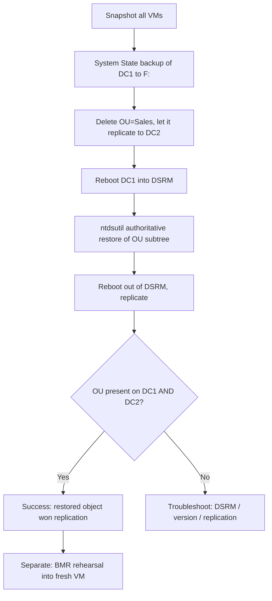

# Lab 06 — Backup & Recovery

A hands-on drill that takes a domain controller's **System State** backup, deliberately breaks Active Directory by deleting an OU, and recovers it with an **authoritative restore** via **DSRM** and `ntdsutil`. It closes with a **Bare-Metal Recovery (BMR)** rehearsal to prove a backup is actually restorable, not just present.

## Overview

This lab turns the theory in [Backup, Restore and Recovery](../Windows-Server-Backup-Restore-and-Recovery/Readme.md) into muscle memory. You learn the difference between a backup that merely *exists* and one that *restores*, and you practise the single most consequential AD recovery skill: making a restored object **win** replication after it has already been deleted domain-wide. It sits in the course arc after the Active Directory build labs — you need a working domain before you can break and recover one.

> [!NOTE]
> **Where this fits**
> Prerequisite reading: [Backup, Restore and Recovery](../Windows-Server-Backup-Restore-and-Recovery/Readme.md) and [Active-Directory-Domain-Services](../Active-Directory-Domain-Services-AD-DS/Active-Directory-Domain-Services.md). Prerequisite lab: [Lab-03-Active-Directory](Lab-03-Active-Directory.md) (you need a promoted DC with at least one test OU).

## Objective

Practise, on a disposable lab DC, the full recover-from-disaster loop:

- Take a **System State** backup that includes `NTDS.dit` and `SYSVOL`.
- Simulate data loss by deleting a test OU and letting the deletion replicate.
- Boot into **DSRM**, perform an **authoritative restore** of the OU subtree with `ntdsutil`, and confirm it survives replication.
- Rehearse a **BMR** restore of the whole server into a fresh VM.

## Environment and Setup

> [!NOTE]
> **Lab topology**
> Two or more Windows Server VMs on an **isolated host-only / internal** network, plus a spare disk/volume for backup targets. A second DC is strongly recommended so authoritative restore has a healthy replication partner and so you can observe an object being overwritten and then win again.

- **DC1** — promoted domain controller for `corp.local` (from [Lab-03-Active-Directory](Lab-03-Active-Directory.md)), with a test OU such as `OU=Sales,DC=corp,DC=local`.
- **DC2** — second DC in the same domain (replication partner), optional but recommended.
- **Backup target** — a dedicated second virtual disk (e.g. presented as `F:`) attached to DC1. Never back a DC up to its own OS volume.
- **BMR target** — a brand-new empty VM with a disk **at least as large** as DC1's critical volumes.
- **Feature** — install Windows Server Backup on DC1 before starting (it is a Feature, not a Role, and not installed by default).

See [Lab Setup and Virtualization](../Lab-Setup-and-Virtualization/Readme.md) for building the baseline VMs, isolated networking, and clean snapshots.

```powershell
# On DC1: install the backup feature and its tools, then confirm
Install-WindowsFeature -Name Windows-Server-Backup -IncludeManagementTools
Get-WindowsFeature -Name Windows-Server-Backup
```

> [!IMPORTANT]
> **Snapshot first**
> Take a clean snapshot of **every** VM before starting. This lab is intentionally destructive; rolling back to a snapshot is how you re-run it, not by trying to "undo" changes.

The end-to-end flow of the lab:



## Walkthrough

1. **Take a System State backup of DC1.** From an elevated command prompt, target the dedicated backup volume. System State on a DC captures boot files, the registry, `SYSVOL`, and **Active Directory / `NTDS.dit`**.

   ```cmd
   :: Back up System State only, to volume F:
   wbadmin start systemstatebackup -backupTarget:f:
   ```

2. **Confirm the backup exists and note its version identifier.** You need the `-version:` string for any restore.

   ```cmd
   wbadmin get versions -backupTarget:f:
   ```

3. **Simulate data loss.** Delete the test OU and let normal replication carry the deletion to DC2, so the "damage" is domain-wide (this is what makes an *authoritative* restore necessary).

   ```powershell
   # Remove protection then delete the test OU (lab data only)
   Set-ADOrganizationalUnit -Identity "OU=Sales,DC=corp,DC=local" -ProtectedFromAccidentalDeletion $false
   Remove-ADOrganizationalUnit -Identity "OU=Sales,DC=corp,DC=local" -Recursive -Confirm:$false
   ```

   ```powershell
   # Force replication so DC2 also loses the OU, then confirm the deletion propagated
   repadmin /syncall /AdeP   # untested
   ```

4. **Reboot DC1 into DSRM.** Authoritative restores run only while the DC is booted into Directory Services Restore Mode, where AD DS is offline and you log in with the **local DSRM Administrator** password set at promotion time.

   ```cmd
   bcdedit /set safeboot dsrepair   # untested
   shutdown /r /t 0                 # untested
   ```

5. **Restore System State (non-authoritatively) inside DSRM.** This brings `NTDS.dit` back to backup-time state on DC1; on its own it would just get re-overwritten by DC2, which is why step 6 follows.

   ```cmd
   :: Use the version string from step 2
   wbadmin start systemstaterecovery -version:MM/DD/YYYY-HH:MM
   ```

6. **Mark the OU authoritative with `ntdsutil`.** Still in DSRM, increment the version stamps on the restored subtree so it **overwrites** the (deleted) copies on every other DC at the next replication cycle.

   ```cmd
   ntdsutil
   activate instance ntds
   authoritative restore
   restore subtree "OU=Sales,DC=corp,DC=local"
   quit
   quit
   ```
   `# untested — sequence follows documented ntdsutil authoritative-restore syntax; validate the DN and instance name before running`

7. **Leave DSRM and replicate.** Clear the safe-boot flag, reboot into normal operation, and let the version-incremented OU propagate outward.

   ```cmd
   bcdedit /deletevalue safeboot   # untested
   shutdown /r /t 0                # untested
   ```

8. **BMR rehearsal (separate exercise).** To prove restorability end-to-end, take a BMR-capable backup (`-allCritical`), then restore it into the fresh target VM from WinRE. Boot the target VM from Windows Server installation media → **Repair your computer → Troubleshoot → System Image Recovery**, and point it at the backup location.

   ```cmd
   :: BMR-capable one-time backup of all critical volumes to F:
   wbadmin start backup -backupTarget:f: -allCritical -vsscopy -quiet   # untested
   ```

## Expected Result

- `wbadmin get versions` lists your backup with a time, storage location, a version identifier, and the recovery types it supports.
- After step 3, the `Sales` OU is gone from **both** DC1 and DC2.
- After the authoritative restore and post-DSRM reboot, the `Sales` OU (and its child objects) reappears on DC1 and, once replication runs, **persists** on DC2 rather than being re-deleted — that persistence is the proof the restore won.
- Post-restore health checks come back clean: `dcdiag` reports no failures and `repadmin /replsummary` shows healthy replication.
- The BMR rehearsal boots the fresh target VM into a working copy of DC1, demonstrating the backup is genuinely recoverable to bare metal.

> [!TIP]
> **A backup is a hypothesis until restored**
> `wbadmin get versions` proving a backup *exists* is not proof it *restores*. The whole point of this lab is to convert that hypothesis into evidence on disposable hardware, before a real incident.

## Security Considerations

> [!WARNING]
> **Keep this lab fully isolated**
> Authoritative restore, DSRM boots, and `ntdsutil` manipulate the trust core of a domain. Run only on disposable lab DCs on a host-only/internal network — never against production AD, and never bridge these VMs to a real network. Restore only backups within the domain's **tombstone lifetime** (default 180 days); restoring older backups is unsupported and can corrupt replication.

- **Dual-use framing.** The same `ntdsutil` authoritative-restore and DSRM skills a defender uses to recover deleted objects are also how an attacker with DC access can manipulate AD replication or roll a DC back to reintroduce removed objects. Practising them teaches you both the recovery procedure and the IOCs to alert on (unexpected DSRM boots, out-of-window authoritative restores).
- **Backup Operators is a privilege path.** A Backup Operator can back up — and therefore read — `NTDS.dit` and the registry hives on any reachable machine. Treat the backup target volume in this lab as sensitive as the live directory; a stolen System State backup enables offline hash extraction just like [SAM-vs-NTDS.dit](../Active-Directory-Domain-Services-AD-DS/SAM-vs-NTDS.dit.md) describes for the live database.
- **Never reuse lab DSRM passwords or credentials anywhere real**, and rebuild from snapshot rather than "cleaning" a DC you have deliberately broken.

## Troubleshooting

| Symptom | Likely cause & fix |
| --- | --- |
| Can't log in after reboot into DSRM | You need the **local DSRM Administrator** password (set at promotion), not a domain account; reset it from a live DC with `ntdsutil "set dsrm password"`. |
| Restored OU gets deleted again after reboot | Restore was **non-authoritative** — DC2's newer (deleted) copy overwrote it. Redo step 6 so `ntdsutil` marks the subtree authoritative. |
| `wbadmin start systemstatebackup` fails | Backup target is the DC's own OS volume or is full; use a dedicated separate volume with enough free space. |
| Restore refused / warns about age | Backup is older than the tombstone lifetime — take a fresh backup; old backups must not be restored. |
| DC won't leave DSRM | Safe-boot flag still set — from an elevated prompt run `bcdedit /deletevalue safeboot` and reboot. |
| BMR fails on the target VM | Target disk smaller than the source critical volumes, or the backup wasn't `-allCritical`; use a disk at least as large and a BMR-capable backup. |

## References

- [wbadmin command reference (Microsoft Learn)](https://learn.microsoft.com/en-us/windows-server/administration/windows-commands/wbadmin)
- [AD forest recovery guide (Microsoft Learn)](https://learn.microsoft.com/en-us/windows-server/identity/ad-ds/manage/ad-forest-recovery-guide)
- [wbadmin start systemstatebackup (Microsoft Learn)](https://learn.microsoft.com/en-us/windows-server/administration/windows-commands/wbadmin-start-systemstatebackup)
- [Windows Server Backup (Microsoft Learn)](https://learn.microsoft.com/en-us/windows-server/administration/windows-server-backup/)

## Related

- [Backup, Restore and Recovery](../Windows-Server-Backup-Restore-and-Recovery/Readme.md) — module this lab exercises
- [Active-Directory-Domain-Services](../Active-Directory-Domain-Services-AD-DS/Active-Directory-Domain-Services.md) — the AD DS this lab breaks and recovers
- [SAM-vs-NTDS.dit](../Active-Directory-Domain-Services-AD-DS/SAM-vs-NTDS.dit.md) — why a stolen System State backup is a credential-theft risk
- [Windows Monitoring and Logging](../Windows-Monitoring-and-Logging/Readme.md) — detecting DSRM boots and backup-deletion IOCs
- [Lab Setup and Virtualization](../Lab-Setup-and-Virtualization/Readme.md) — building the baseline lab environment
- [Lab-01-Lab-Foundations](Lab-01-Lab-Foundations.md) — sibling lab
- [Lab-02-Core-Services](Lab-02-Core-Services.md) — sibling lab
- [Lab-03-Active-Directory](Lab-03-Active-Directory.md) — sibling lab (prerequisite domain build)
- [Lab-04-Remote-Access](Lab-04-Remote-Access.md) — sibling lab
- [Lab-05-Attack-and-Defense](Lab-05-Attack-and-Defense.md) — sibling lab
- [Lab-07-Monitoring](Lab-07-Monitoring.md) — sibling lab
- [Enterprise Windows Infrastructure Security](../Readme.md) — course hub
