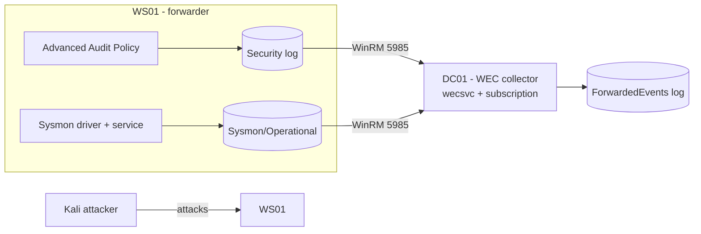

# Lab 07 — Monitoring

Build a working endpoint-visibility pipeline: turn on the right **advanced audit policy**, deploy **Sysmon** for high-fidelity process telemetry, and centralise both with **Windows Event Forwarding (WEF/WEC)** so a compromised host cannot erase its own evidence. This lab turns the [Windows Monitoring and Logging](../Windows-Monitoring-and-Logging/Readme.md) module from theory into a repeatable drill.

## Overview

This is the **Monitoring track** of the [Practical Labs](Readme.md) collection. It closes the loop opened by [Lab-05-Attack-and-Defense](Lab-05-Attack-and-Defense.md): there you *ran* the attacks; here you make sure they leave a durable trail. You will configure the detection layer bottom-up — first deciding *what* Windows records ([advanced audit policy](../Windows-Monitoring-and-Logging/Windows-Advanced-Audit-Policy.md)), then adding the endpoint sensor that fills the gaps ([Sysmon](../Windows-Monitoring-and-Logging/Sysmon-Deployment-and-Configuration.md)), then shipping it all off-host ([WEF/WEC](../Windows-Monitoring-and-Logging/Windows-Event-Forwarding-WEF-WEC.md)) so tampering on the endpoint cannot retract a record already on the collector.

> [!NOTE]
> **Where this fits**
> Audit policy is the front of the telemetry pipeline, Sysmon is the deep endpoint sensor, and WEF is the transport that moves evidence out of the attacker's reach. All three are wasted effort if any one is missing — this lab wires them together end to end.

## Objective

Stand up a three-part visibility pipeline in the lab domain and prove it works:

- Enable and verify a security audit baseline (including **Process Creation with command line**) on domain hosts.
- Deploy Sysmon with a curated config to a member workstation and confirm it logs to `Microsoft-Windows-Sysmon/Operational`.
- Configure a **source-initiated** WEF subscription so the workstation forwards its Security and Sysmon events to a collector, then confirm attacker-generated events survive a local log clear.

## Environment and Setup

Build on the baseline from [Lab Setup and Virtualization](../Lab-Setup-and-Virtualization/Readme.md) and the domain from [Lab-03-Active-Directory](Lab-03-Active-Directory.md). All VMs sit on the same **host-only / internal** network — no route to the internet or any real LAN.

| VM | Role | Notes |
| --- | --- | --- |
| `DC01` | Domain controller + WEC collector | `armour.local` (ARMOUR); runs `wecsvc` and holds the subscription |
| `WS01` | Domain-joined workstation (forwarder) | Sysmon sensor + WEF source; generates the telemetry |
| `KALI` | Attacker | Generates the events to detect (from [Lab-05-Attack-and-Defense](Lab-05-Attack-and-Defense.md)) |

Prerequisites: the domain from [Lab-03-Active-Directory](Lab-03-Active-Directory.md) is up, a [Group Policy](../Group-Policy-Objects-GPO/Default-Domain-Policy.md) refresh path works, and every VM has a **clean snapshot** before you start. Download Sysmon (Sysinternals) and a curated config (e.g. SwiftOnSecurity's `sysmonconfig.xml`) onto `WS01` in advance.



## Walkthrough

### 1. Set the audit baseline on WS01

Inspect the live policy, then enable the high-value subcategories. In a real deployment this is a GPO; for the lab, `auditpol` on the host is fine for inspection and quick iteration (see [Windows-Advanced-Audit-Policy](../Windows-Monitoring-and-Logging/Windows-Advanced-Audit-Policy.md)).

```cmd
auditpol /get /category:*
auditpol /set /subcategory:"Process Creation" /success:enable /failure:enable
auditpol /set /subcategory:"Logon" /success:enable /failure:enable
auditpol /set /subcategory:"Security Group Management" /success:enable /failure:enable
```

Enable command-line capture in event **4688** — one of the highest-value settings for detection. Deploy it via GPO in the domain, or set the backing registry value locally in the lab:

```cmd
reg add "HKLM\SOFTWARE\Microsoft\Windows\CurrentVersion\Policies\System\Audit" /v ProcessCreationIncludeCmdLine_Enabled /t REG_DWORD /d 1 /f
```

> [!IMPORTANT]
> **Enable the subcategory override**
> Advanced audit policy is silently ignored if legacy basic auditing wins the tie. Ensure **Audit: Force audit policy subcategory settings … to override audit policy category settings** is on (`SCENoApplyLegacyAuditPolicy = 1` under `HKLM\System\CurrentControlSet\Control\Lsa`).

### 2. Deploy Sysmon on WS01

From an elevated prompt, install Sysmon with a curated config (see [Sysmon-Deployment-and-Configuration](../Windows-Monitoring-and-Logging/Sysmon-Deployment-and-Configuration.md)):

```cmd
sysmon -accepteula -i sysmonconfig.xml
```

Confirm the service is running and events are landing in the Sysmon channel:

```powershell
Get-Service Sysmon64
Get-WinEvent -LogName "Microsoft-Windows-Sysmon/Operational" -MaxEvents 5
```

Update the config in place later without reinstalling:

```cmd
sysmon -c sysmonconfig.xml
```

### 3. Prepare the collector on DC01

Enable WinRM and the Windows Event Collector service, then register a source-initiated subscription (see [Windows-Event-Forwarding-WEF-WEC](../Windows-Monitoring-and-Logging/Windows-Event-Forwarding-WEF-WEC.md)):

```cmd
winrm qc -q
wecutil qc /q
wecutil cs subscription.xml
```

The `subscription.xml` uses `<SubscriptionType>SourceInitiated</SubscriptionType>`, targets `<LogFile>ForwardedEvents</LogFile>`, and its `<Query>` XPath selects the Security channel and `Microsoft-Windows-Sysmon/Operational`. Use `MinLatency` for the security-critical channels.

### 4. Point WS01 at the collector via GPO

On `WS01`, configure the target Subscription Manager. In the domain this is a GPO (see [Group Policy Objects](../Group-Policy-Objects-GPO/Readme.md)); the setting lives at:

```text
Computer Configuration > Administrative Templates > Windows Components >
Event Forwarding > Configure target Subscription Manager
```

Set the connection string to the collector:

```text
Server=http://DC01.armour.local:5985/wsman/SubscriptionManager/WEC,Refresh=60
```

To forward the **Security** log, add `NETWORK SERVICE` to the local **Event Log Readers** group on the source, then refresh policy:

```cmd
net localgroup "Event Log Readers" "NETWORK SERVICE" /add
gpupdate /force
```

### 5. Generate telemetry and confirm forwarding

From `KALI`, run one of the noisy techniques from [Lab-05-Attack-and-Defense](Lab-05-Attack-and-Defense.md) against `WS01` (e.g. a failed-then-successful logon spray, or spawning a process). Then verify on the collector:

```cmd
wecutil gr SubscriptionName
```

```powershell
Get-WinEvent -LogName ForwardedEvents -MaxEvents 20 |
  Format-Table TimeCreated, Id, MachineName -AutoSize
```

### 6. Prove the tamper-resistance property

On `WS01`, clear the local Security log (this is itself audited as event **1102**):

```cmd
wevtutil cl Security
```

Back on `DC01`, confirm the forwarded copies — including the `1102` clear event — are still present in `ForwardedEvents`. That is the whole point of the pipeline.

## Expected Result

- `auditpol /get /category:*` on `WS01` shows Process Creation, Logon, and Security Group Management set to Success/Failure, and new 4688 events include a command line.
- The `Microsoft-Windows-Sysmon/Operational` channel is populating with Event ID 1 (process creation) records carrying parent process, hashes, and full command line.
- `wecutil gr SubscriptionName` reports `WS01` as **Active**, and event **100** appears on the source in `Microsoft-Windows-Eventlog-ForwardingPlugin/Operational`.
- After you clear the Security log on `WS01`, the attacker-generated events and the `1102` clear event remain visible in `ForwardedEvents` on `DC01` — local tampering did not erase the record.

## Security Considerations

> [!WARNING]
> **Keep the lab isolated and treat the collector as sensitive**
> This lab runs offensive tooling against a deliberately-watched host. Keep every VM on a host-only/internal network with no route to production or the internet, and roll back from snapshot rather than "cleaning" a machine you have attacked. The **collector holds many hosts' evidence** — in a real estate it is a Tier-0-adjacent asset that the endpoints' own credentials must not be able to reach or modify. The tampering steps here (`auditpol` disable, service stop, `wevtutil cl`) are dual-use: you run them to *understand and detect* defense evasion (MITRE ATT&CK T1562.002 / T1070.001), never against a system you are not authorised to test.

> [!TIP]
> **Detect the sensor going dark**
> A blinded host looks *quiet*, not broken. Alert on Sysmon Event ID 4 (service state change) and 16 (config change), on `wecsvc`/WinRM stops, on audit event **4719** (audit policy changed), on **1102** (Security log cleared), and on a source that stops heart-beating in `wecutil gr`. Absence of expected noise is the signal.

## Troubleshooting

| Symptom | Likely cause & fix |
| --- | --- |
| No Sysmon events after install | Check the `Microsoft-Windows-Sysmon/Operational` channel (not Security); confirm the `Sysmon64` service is running |
| 4688 events have no command line | `ProcessCreationIncludeCmdLine_Enabled` not set / GPO not applied — verify the registry value and `gpupdate /force` |
| Source shows 0 active in `wecutil gr` | Wrong `SubscriptionManager` URL/port or GPO not applied — confirm WinRM reachable on 5985, then `gpupdate /force` |
| Everything forwards except the Security log | `NETWORK SERVICE` not in **Event Log Readers** on `WS01` |
| Subscription active but no events | XPath `<Query>` matches nothing, or the audit subcategory is disabled — see [Windows-Advanced-Audit-Policy](../Windows-Monitoring-and-Logging/Windows-Advanced-Audit-Policy.md) |

## References

- [Sysmon — Sysinternals (Microsoft Learn)](https://learn.microsoft.com/en-us/sysinternals/downloads/sysmon)
- [Setting up a Source Initiated Subscription (Microsoft Learn)](https://learn.microsoft.com/en-us/windows/win32/wec/setting-up-a-source-initiated-subscription)
- [Advanced security audit policy settings (Microsoft Learn)](https://learn.microsoft.com/en-us/windows/security/threat-protection/auditing/advanced-security-audit-policy-settings)
- [MITRE ATT&CK T1562.002 — Impair Defenses: Disable Windows Event Logging](https://attack.mitre.org/techniques/T1562/002/)

## Related

- [Windows Monitoring and Logging](../Windows-Monitoring-and-Logging/Readme.md) — the module this lab exercises
- [Windows-Advanced-Audit-Policy](../Windows-Monitoring-and-Logging/Windows-Advanced-Audit-Policy.md) — deciding what Windows records
- [Sysmon-Deployment-and-Configuration](../Windows-Monitoring-and-Logging/Sysmon-Deployment-and-Configuration.md) — the endpoint sensor
- [Windows-Event-Forwarding-WEF-WEC](../Windows-Monitoring-and-Logging/Windows-Event-Forwarding-WEF-WEC.md) — centralising logs off-host
- [Key-Security-Event-IDs](../Windows-Monitoring-and-Logging/Key-Security-Event-IDs.md) — the event IDs this pipeline produces
- [Querying-Logs-with-Get-WinEvent](../Windows-Monitoring-and-Logging/Querying-Logs-with-Get-WinEvent.md) — reading the forwarded logs
- [Group Policy Objects](../Group-Policy-Objects-GPO/Readme.md) — how the baseline and subscription enrol at scale
- [Lab-05-Attack-and-Defense](Lab-05-Attack-and-Defense.md) — generates the attacks this lab detects
- [Lab-03-Active-Directory](Lab-03-Active-Directory.md) — the domain this lab builds on
- [Lab-01-Lab-Foundations](Lab-01-Lab-Foundations.md) — sibling lab (environment fundamentals)
- [Lab-02-Core-Services](Lab-02-Core-Services.md) — sibling lab
- [Lab-04-Remote-Access](Lab-04-Remote-Access.md) — sibling lab
- [Lab-06-Backup-and-Recovery](Lab-06-Backup-and-Recovery.md) — sibling lab
- [Lab Setup](../Lab-Setup-and-Virtualization/Readme.md) — prerequisite environment
- [Enterprise Windows Infrastructure Security](../Readme.md) — course hub
