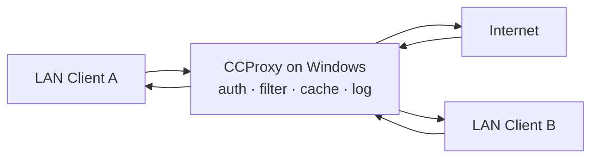

# CCProxy

CCProxy is a lightweight, easy-to-use proxy server for Windows produced by Youngzsoft. It supports multiple proxy protocols and is commonly deployed in small networks, schools, and internet cafés to share a single connection and to control, cache, and monitor client internet access.

## Overview

CCProxy is a concrete Windows implementation of the concepts covered in [Proxy-Servers](Proxy-Servers.md). It acts primarily as a **forward proxy**: LAN clients point their applications at the CCProxy host, and CCProxy relays their requests out to the internet on their behalf, applying authentication, filtering, caching, and logging along the way. It can also serve several of the proxy categories described in [Types-of-Proxies](Types-of-Proxies.md) (HTTP, HTTPS, SOCKS, FTP), and it is often paired with edge mechanisms such as [Network-Address-Translation(NAT)](Network-Address-Translation(NAT).md) and [Port-Forwarding](Port-Forwarding.md) to determine which internal services are reachable.

Its appeal is simplicity — a GUI-driven install with per-protocol ports and per-user rules — which also makes it a frequent teaching example for how a proxy concentrates and controls client traffic.

> [!NOTE]
> **Where it fits**
> CCProxy is a small-network / lab-grade tool. In enterprise environments a hardened proxy (Squid, a commercial secure web gateway, or a reverse proxy in front of published services) is the norm; CCProxy is best understood as a hands-on way to see proxy behavior end to end.

## Key Features

- HTTP, FTP, Gopher, SOCKS, Telnet, and HTTPS proxy support
- Web caching to improve performance
- Bandwidth control per user or per IP
- Account management with user authentication (by IP, MAC, or username/password)
- Access control by content, IP, time schedule, or domain
- Logging and monitoring of internet activity
- Automatic dial-up, auto-disconnect, and auto-reconnect
- Remote management support
- Runs on Windows XP and later, including Windows Server editions

## Typical Use Cases

- Sharing a single internet connection across multiple LAN devices
- Restricting and monitoring employee or student internet usage
- Setting up a basic SOCKS5 or HTTP proxy for internal use
- Creating a proxy tunnel for applications that do not support a proxy natively

## How It Works

Clients are configured with the CCProxy server's IP and the port for the protocol they need; CCProxy authenticates the client, applies filter and bandwidth rules, optionally serves a cached copy, and otherwise forwards the request upstream and returns the response.



## Basic Setup Steps

1. Download and install from Youngzsoft's official website.
2. Launch CCProxy and configure the port numbers for each protocol (for example, HTTP: 808, SOCKS: 1080).
3. Under **Account**, create user rules (for example, IP-based or username-based).
4. Optionally enable web cache, logging, or access control.
5. Configure client devices to use the server IP and the corresponding proxy port.

## Web Filter Rules

CCProxy's **Web Filter** feature manages which sites clients may reach. The examples below manage access to Google and YouTube.

### Block All Google and YouTube Domains

To block all Google- and YouTube-related domains, including subdomains, add entries to the filter's blocked list. Several pattern styles exist:

```text
google.com;www.google.com;youtube.com;www.youtube.com;
```

```text
google.com;
youtube.com;
```

```text
???.google.com;
???.youtube.com;
```

```text
*.google.com;
*.youtube.com;
```

### Allow Only Google and YouTube (Block Everything Else)

To allow only Google and YouTube and block all other sites:

1. Enable **Web Filter**.
2. Add the following to the **Permit Sites** section:

```text
google.com;
youtube.com;
*.google.com;
*.youtube.com;
```

3. Check the option **Permit only the above sites**.

### Explanation of Pattern Differences

| Pattern | Matches | Use Case |
| --- | --- | --- |
| `www.google.com` | Only the main Google homepage | Very limited |
| `???.google.com` | Subdomains with a 3-character label | Rarely useful |
| `*.google.com` | All Google subdomains | Recommended for full control |

> [!TIP]
> **Cover base domain and subdomains**
> Always list both the base domain and the wildcard subdomain, separated by semicolons, and omit the scheme:
> ```text
> google.com;
> *.google.com;
> ```
> There is no need to include `http://` or `https://` in domain entries.

## Security Considerations

A proxy sits in the path of every client session, so a misconfigured CCProxy instance is both a control point and a high-value target. It is designed for trusted LAN use and has limited security hardening compared with enterprise gateways.

> [!WARNING]
> **Do not expose CCProxy to the public internet**
> An unauthenticated or internet-facing CCProxy becomes an **open proxy (open relay)**: attackers can route traffic through it to launder their origin, pivot toward internal hosts, and bypass egress controls. Require authentication, restrict source IPs with ACLs, and keep it behind a firewall in a trusted LAN only.

From an offensive perspective, CCProxy is also notable as a classic **buffer-overflow exploit-development target**: older CCProxy releases contained memory-corruption vulnerabilities in their proxy service handling that have been used as teaching cases for stack overflow exploitation and appear as ready-made framework modules. Running an outdated, exposed CCProxy is therefore a direct path to remote code execution on the Windows host, not just proxy abuse.

- Treat every published/forwarded proxy port as new attack surface to inventory.
- NAT in front of the proxy hides addresses but is **not** a security control — the host still needs hardening and patching.
- Enable logging so that abuse and policy violations are attributable to a client.

## Best Practices

- Enforce authentication (IP, MAC, or username/password) and never run it as an anonymous open relay.
- Restrict inbound access with ACLs and keep the proxy behind a perimeter firewall.
- Keep CCProxy patched to the latest version and prefer a hardened proxy for anything beyond a lab or small trusted LAN.
- Enable and review access logs to monitor and attribute client activity.
- Combine base-domain and wildcard entries in filter rules so subdomains cannot be used to bypass a block.

## Troubleshooting

| Symptom | Likely cause & fix |
| --- | --- |
| Clients cannot browse through the proxy | Wrong server IP or protocol port in the client config; verify the per-protocol port set in CCProxy. |
| Client blocked unexpectedly | Account rule or Web Filter ACL denies the source IP/MAC — check **Account** and **Web Filter** rules. |
| A subdomain slips past a block | Base domain listed without the wildcard; add `*.domain.com` alongside `domain.com`. |
| Site filter changes have no effect | **Permit only the above sites** / filter not enabled, or client using a cached response — enable the filter and clear the cache. |

## References

- [Youngzsoft CCProxy — official product page](https://www.youngzsoft.net/ccproxy/)
- [What is a proxy server? (Cloudflare Learning)](https://www.cloudflare.com/learning/cdn/glossary/reverse-proxy/)
- [Microsoft Learn — WinHTTP proxy configuration](https://learn.microsoft.com/windows/win32/winhttp/winhttp-autoproxy-support)

## Related

- [Enterprise Windows Infrastructure Security](../Readme.md) — course hub and map of content
- [Proxy-Servers](Proxy-Servers.md) — proxy server concepts CCProxy implements
- [Types-of-Proxies](Types-of-Proxies.md) — proxy categories CCProxy can act as
- [Network-Address-Translation(NAT)](Network-Address-Translation(NAT).md) — address translation at the network edge
- [Port-Forwarding](Port-Forwarding.md) — exposing internal services through the perimeter
