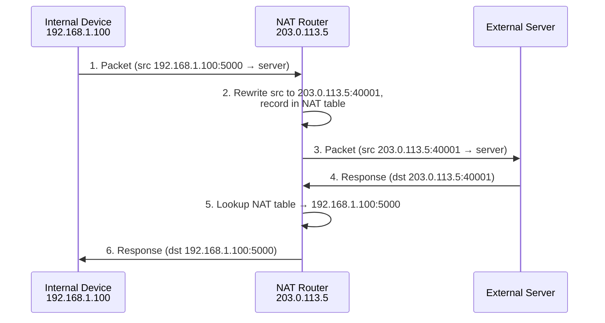

# Network Address Translation (NAT)

**Network Address Translation (NAT)** is a networking technique that translates one IP address space into another by rewriting IP packet headers while they are in transit. It lets many devices inside a private network share a single public IP address for internet access.

## Overview

NAT sits at the network edge — typically on a router or firewall — and maps internal, non-routable addresses (RFC 1918 ranges such as `192.168.0.0/16`) to one or more public addresses. It is the mechanism that allowed IPv4 to survive address exhaustion, and it is the reason a home or office full of hosts can reach the internet behind one ISP-assigned address.

In this module NAT is the counterpart to explicit proxying: where a [proxy server](Proxy-Servers.md) brokers traffic at the application layer, NAT rewrites addresses transparently at Layer 3. NAT and [port forwarding](Port-Forwarding.md) together decide which internal services are reachable from outside — port forwarding is essentially a manually configured inbound NAT rule.

Key benefits of NAT:

- Conserves the limited pool of public IPv4 addresses.
- Hides internal IP addresses from external networks, adding a privacy layer.
- Enables connectivity between multiple office locations through address translation.

> [!NOTE]
> **NAT is not a firewall**
> NAT obscures internal structure and blocks unsolicited inbound connections as a side effect, but it is **not** a security control. Internal hosts still need host-level hardening — see [Security Considerations](#security-considerations).

## How It Works

When a device inside a private network (for example `192.168.1.0/24`) sends a request:

- The NAT-enabled router replaces the private source IP and source port with its own public IP and a unique port number.
- The router keeps a **translation table** mapping the internal device's private IP and port to the public IP and external port.

For incoming response packets:

- They arrive at the router's public IP and the assigned external port.
- The router consults the translation table and forwards the packet to the correct internal device, restoring the original private IP and port.

This is what lets multiple devices share a single public IP while maintaining unique sessions distinguished by port mapping.

### NAT Request and Response Flow



The step-by-step translation, matching the diagram:

| Step | Action | Source IP/Port | Destination IP/Port |
| :-- | :-- | :-- | :-- |
| Request from device | Packet sent to NAT router | Private IP/Port | External server IP/Port |
| NAT translation | Source rewritten to public IP/port | Public IP/External port | External server IP/Port |
| Response from server | Packet arrives at NAT router | External server IP/Port | Public IP/External port |
| NAT reverse translation | Destination rewritten to private IP | External server IP/Port | Private IP/Port |
| Packet delivered inside | Packet forwarded to internal device | External server IP/Port | Private IP/Port |

## Types of NAT

1. **Static NAT** — one-to-one mapping between a private and a public IP address. Commonly used to publish an internal server on a fixed public address.
2. **Dynamic NAT** — maps private IPs to a pool of available public IPs, assigned on demand.
3. **PAT (Port Address Translation) / NAT Overload** — maps many private IP addresses to a single public IP using distinct source port numbers. This is the most widely used form in home and small-office routers.

### Port Address Translation (PAT) Capacity

PAT is the most common NAT implementation in home and enterprise networks: multiple private IPs share one public IP, and NAT tracks each connection by its unique source port.

A TCP or UDP port number is **16 bits**, giving:

```text
2^16 = 65,536 ports  (range 0 – 65,535)
```

Some ports are reserved, so the practical ceiling is slightly lower:

```text
≈ 64,000 simultaneous connections per public IP
```

The number of *clients* is not strictly limited by NAT — only the number of simultaneous connections is. Clients can share one public IP as long as total active connections do not exhaust the available ports:

| Clients | Connections per Client | Total Connections |
| --- | --- | --- |
| 100 | 100 | 10,000 |
| 1,000 | 50 | 50,000 |
| 10,000 | 5 | 50,000 |

A simple rule of thumb:

```text
Maximum Clients ≈ Available NAT Ports ÷ Average Concurrent Connections per Client

Example: 64,000 ports ÷ 100 connections/client ≈ 640 clients
```

> [!TIP]
> **When one public IP is not enough**
> For high-traffic environments, administrators assign **multiple public IPs** to avoid port exhaustion. ISPs solve the same problem at scale with **Carrier-Grade NAT (CGNAT)**, allocating port ranges of a shared public IP to many subscribers (see RFC 6598 shared address space).

### Deployment scale examples

```text
Home Router:        1 Public IP  ↔  10–100 devices          (no issue)
Enterprise Network: 1 Public IP  ↔  500–5,000 users          (if few concurrent connections)
ISP CGNAT:          1 Public IP  ↔  hundreds/thousands of customers (port-range allocation)
```

Factors that reduce effective capacity: browsers opening many parallel connections, video streaming and gaming, long-lived connections holding ports open, and NAT-table memory or router CPU limits.

## NAT and IPv6

- NAT is primarily an IPv4 solution, driven by IPv4 address exhaustion.
- IPv6's vast address space minimizes the need for NAT and promotes end-to-end connectivity.
- Some enterprise and cloud environments still use NAT-like techniques (for example NPTv6) for policy, privacy, and segmentation reasons.

## NAT vs Proxy Server

| Feature | NAT (Network Address Translation) | Proxy Server |
| :-- | :-- | :-- |
| **Function** | Translates IP addresses | Acts as an intermediary for client requests |
| **Layer** | Network Layer (Layer 3 – IP) | Application Layer (Layer 7 – HTTP, FTP, etc.) |
| **Purpose** | IP sharing, basic obscurity | Content filtering, anonymity, authentication |
| **Common Use** | Home/office routers, enterprise firewalls | Web proxies, corporate networks, content filters |
| **Traffic Coverage** | All IP-based protocols | Protocol-specific (e.g., HTTP, FTP) |
| **Visibility** | Transparent to end users | User-configurable or visible in client apps |
| **Security** | Hides internal IPs, basic barrier | Can enforce user authentication and traffic policy |
| **Performance** | Minimal overhead | Can improve (caching) or degrade (extra hop) |

See [Types-of-Proxies](Types-of-Proxies.md) for the forward/reverse/transparent/anonymous distinctions that complement NAT at the application layer.

## Security Considerations

NAT shapes attack surface at the network edge, so it matters to both defenders and attackers.

> [!WARNING]
> **NAT hides hosts — it does not protect them**
> - **Not a security boundary.** NAT blocks *unsolicited* inbound connections as a side effect of having no translation-table entry, but it performs no authentication, filtering, or inspection. Treat it as address plumbing, not a firewall.
> - **Inbound NAT / port forwarding is new attack surface.** Every static NAT or port-forward rule exposes an internal service directly to the internet. Inventory each one — misconfigured forwards are a classic pivot into a flat internal network.
> - **NAT slipstreaming / pinholing.** Crafted traffic can trick some NAT/ALG implementations into opening unintended inbound pinholes, letting an attacker reach otherwise-hidden internal ports.
> - **Outbound is wide open.** NAT rarely restricts outbound connections, so compromised internal hosts can freely reach attacker command-and-control. Egress filtering, not NAT, is what limits this.
> - **CGNAT and attribution.** Because many subscribers share one public IP under CGNAT, source-IP-based logging and blocking become unreliable — relevant to both incident response and evasion.

Defensively, NAT's obscurity is useful for network segmentation across sites, but it must be paired with real controls: stateful firewalling, egress filtering, and host hardening.

## Best Practices

- Treat NAT as address management, not security — layer a stateful firewall and egress filtering on top.
- Expose services with **static NAT / port forwarding** only when necessary, restricting source addresses where possible.
- Inventory and periodically review every inbound NAT rule; remove forwards for decommissioned services.
- Provision **multiple public IPs** for high-connection environments to avoid PAT port exhaustion.
- Log translations where the platform supports it, so outbound sessions can be attributed to internal hosts.

## Troubleshooting

| Symptom | Likely cause & fix |
| :-- | :-- |
| Internal hosts cannot reach the internet | Missing/incorrect NAT (overload) rule, or wrong default gateway on clients |
| Published service unreachable from outside | Static NAT / port-forward rule missing, or edge firewall blocking the inbound port — verify the mapping and allow the port |
| Intermittent connection drops under load | PAT port exhaustion or NAT-table overflow — add public IPs or raise translation-table limits |
| Some apps (VoIP, FTP, games) misbehave behind NAT | Protocol embeds IPs/ports in payload — enable the relevant ALG, or use STUN/UPnP for the application |

## References

- [RFC 3022 — Traditional IP Network Address Translator (NAT)](https://www.rfc-editor.org/rfc/rfc3022)
- [RFC 2663 — IP NAT Terminology and Considerations](https://www.rfc-editor.org/rfc/rfc2663)
- [RFC 6598 — IANA-Reserved IPv4 Prefix for Shared Address Space (CGNAT)](https://www.rfc-editor.org/rfc/rfc6598)
- [Cloudflare — What is NAT?](https://www.cloudflare.com/learning/network-layer/what-is-nat/)

## Related

- [Enterprise Windows Infrastructure Security](../Readme.md) — course hub and map of content
- [Port-Forwarding](Port-Forwarding.md) — related note (exposing internal services through NAT)
- [Proxy-Servers](Proxy-Servers.md) — related note (application-layer traffic brokering)
- [Types-of-Proxies](Types-of-Proxies.md) — related note (forward, reverse, transparent, anonymous)
- [CCProxy](CCProxy.md) — related note (a Windows proxy deployment)
