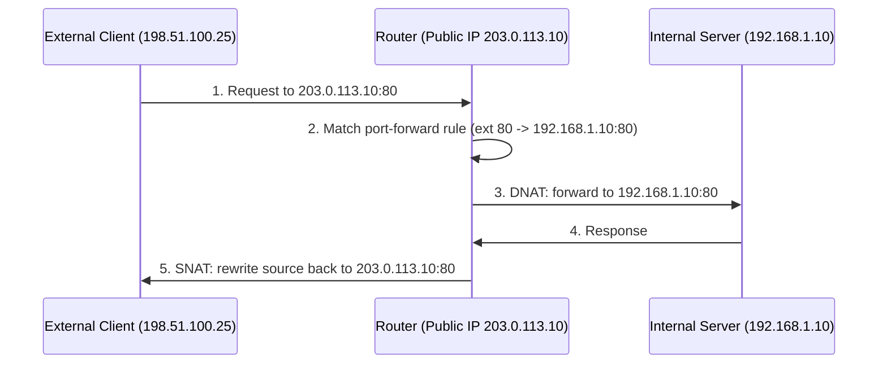

# Port Forwarding

Port forwarding is a networking technique that lets devices on the Internet reach services running on hosts inside a private network, by mapping a public IP address and port to a private IP address and port. It is a feature of [Network-Address-Translation(NAT)](Network-Address-Translation(NAT).md) and is the mechanism that decides which internal services are reachable from outside.

## Overview

By default, [Network-Address-Translation(NAT)](Network-Address-Translation(NAT).md) lets internal hosts initiate outbound connections but blocks unsolicited inbound traffic, because the router has no mapping telling it where to send it. Port forwarding creates that mapping ahead of time: an inbound packet arriving at the router's public IP on a chosen external port is rewritten (destination NAT) and delivered to a specific internal host and port. The return traffic is rewritten back (source NAT) so the external client only ever sees the public address.

Port forwarding is commonly used to publish:

- Web servers (HTTP/HTTPS)
- Remote Desktop (RDP) and SSH for remote administration
- Game servers
- Security cameras and IoT devices
- File-transfer services (FTP)
- VPN endpoints

> [!NOTE]
> **NAT is not a firewall**
> Port forwarding does not add security — it removes the incidental protection NAT provided by default. Every forwarded port is a service you have deliberately exposed to the Internet and must now harden and monitor.

## How It Works

When an external client initiates a connection to the public IP, the router consults its port-forwarding table and translates the destination to the mapped internal host.



### Step by step

1. **Incoming request** — an external client sends traffic to the public IP.

```text
Source IP:        198.51.100.25
Destination IP:   203.0.113.10
Destination Port: 80
```

2. **Router checks rules** — the router searches its port-forwarding table for a matching external port and protocol.

| External Port | Internal IP | Internal Port | Protocol |
|---|---|---|---|
| 80 | 192.168.1.10 | 80 | TCP |
| 3389 | 192.168.1.20 | 3389 | TCP |
| 25565 | 192.168.1.100 | 25565 | TCP/UDP |

3. **Traffic is forwarded** — the destination address/port is translated (DNAT) to the internal host.

```text
203.0.113.10:80  ->  192.168.1.10:80
```

4. **Response is returned** — the router rewrites the source (SNAT) back to the public IP before replying to the client.

```text
192.168.1.10:80  ->  203.0.113.10:80  ->  198.51.100.25
```

### NAT with vs. without port forwarding

- **Without port forwarding** — an internal host initiates the connection, the router creates a temporary NAT entry automatically, and return traffic is matched back to it. Inbound-only connections have no entry and are dropped.
- **With port forwarding** — a predefined rule tells the router where to send inbound traffic for a given external port, so externally initiated connections succeed.

## Types of Port Forwarding

| Type | Mechanism | Typical use |
|---|---|---|
| **Static** | Permanent, manually configured mapping of an external port to a fixed internal host | Publishing a web/RDP server |
| **Dynamic** | Ports are assigned on demand rather than fixed | SOCKS proxies, VPNs, SSH `-D` tunnels |
| **Local (SSH)** | A local port is tunnelled through SSH to a remote destination | Reaching a remote service via `localhost` |
| **Remote (SSH)** | A local service is exposed through a remote SSH server | Publishing an internal service outward |

### Static port forwarding

A permanent mapping between an external port and an internal host, for example `203.0.113.10:443 -> 192.168.1.50:443`.

### Dynamic port forwarding

Ports are allocated as needed. This is how SOCKS proxies, many VPN solutions, and `ssh -D` build a general-purpose tunnel rather than a single fixed mapping.

### Local port forwarding (SSH)

Forwards a port on the local machine to a destination reachable from the SSH server.

```bash
ssh -L 8080:192.168.1.100:80 user@server
```

Traffic to `localhost:8080` is tunnelled to `192.168.1.100:80` as seen from `server`.

### Remote port forwarding (SSH)

Exposes a local service through a remote SSH server, so the remote side can reach back into the local network.

```bash
ssh -R 8080:localhost:80 user@server
```

> [!TIP]
> **SSH forwarding is the pentester's pivot**
> Local, remote, and dynamic (SOCKS) SSH forwarding are the core building blocks of tunnelling and pivoting through a compromised host. Dynamic `-D` forwarding turns a single foothold into a SOCKS proxy for the whole internal network.

## Configuration

### Common service ports

| Service | Port |
|---|---|
| HTTP | 80 |
| HTTPS | 443 |
| FTP | 20, 21 |
| SSH | 22 |
| DNS | 53 |
| SMTP | 25 |
| RDP | 3389 |
| Minecraft | 25565 |
| Xbox Live | 3074 |

### Example — publish a web server

```text
Internet
   |
Public IP 203.0.113.10
   |
Router (port-forward rule)
   |
Web Server 192.168.1.10
```

| Parameter | Value |
|---|---|
| External Port | 80 |
| Internal IP | 192.168.1.10 |
| Internal Port | 80 |
| Protocol | TCP |

### Example — publish a game server

| Parameter | Value |
|---|---|
| External Port | 25565 |
| Internal IP | 192.168.1.100 |
| Internal Port | 25565 |
| Protocol | TCP/UDP |

## Common ISP-Related Issues

Even a correct rule can fail because of how the ISP delivers connectivity.

| Issue | Problem | Solution |
|---|---|---|
| **Double NAT** | Two devices (ISP router + your router) both perform NAT, so inbound traffic never reaches the inner network | Put the ISP router in bridge mode, or configure forwarding on both routers |
| **Carrier-Grade NAT (CGNAT)** | Many customers share one public IPv4 address, so no direct inbound connectivity exists | Request/purchase a public or static IPv4, use IPv6, or use a VPN that supports port forwarding |
| **ISP port blocking** | Common ports (25, 80, 443) are blocked | Use alternative ports (e.g. `8080` for HTTP, `8443` for HTTPS) |
| **ISP firewalls** | The ISP filters inbound traffic before it reaches the customer | Contact the ISP to verify inbound filtering policies |

## Security Considerations

Port forwarding places an internal service directly on the public Internet, where it is continuously scanned and attacked.

> [!WARNING]
> **Every forward is new attack surface**
> A forwarded port bypasses the perimeter that NAT provided by default. Exposed services face brute-force attacks, exploitation of unpatched vulnerabilities, malware and botnet recruitment, and data breaches. Management protocols such as RDP (3389) and SSH (22) are among the most heavily attacked and should almost never be exposed directly.

Offensive/defensive relevance:

- **Offensive** — attackers enumerate forwarded ports with tools like `nmap` to find exposed RDP, SSH, databases, and web apps. On the inside, `ssh -L/-R/-D` and SOCKS-based dynamic forwarding are primary techniques for tunnelling and pivoting deeper into a network after gaining a foothold.
- **Defensive** — inventory every forward, restrict source addresses where possible, and prefer a [reverse proxy](Types-of-Proxies.md) or VPN in front of exposed services rather than publishing them raw.

## Best Practices

- Open only the specific ports a service actually requires; remove unused rules.
- Enforce strong authentication (keys/MFA) on any exposed service.
- Prefer VPN access over exposing management services (RDP, SSH) directly.
- Keep exposed hosts and services patched, and enable host and network firewalls.
- Restrict inbound source addresses and consider non-default external ports for management access.

## Troubleshooting

| Symptom | Likely cause & fix |
|---|---|
| Public IP differs from router WAN IP | CGNAT is in use — request a public/static IP or use IPv6 |
| Rule set but service still unreachable | Service not listening, or host firewall blocking the port — verify with `ss`/`netstat` and firewall rules |
| Works internally, not externally | Double NAT or ISP filtering — check for a second NAT device or blocked port |

Verify the public IP and compare it to the router's WAN address:

```bash
curl ifconfig.me
```

Verify the service is actually listening:

```bash
ss -tulpn        # Linux
```

```powershell
netstat -ano     # Windows
```

Check firewall configuration:

```bash
sudo ufw status  # Linux
```

```powershell
Get-NetFirewallRule   # Windows
```

Test port accessibility from outside:

```bash
nc -zv public-ip 80
nmap -Pn -p 80 public-ip
```

## References

- [RFC 3022 — Traditional IP Network Address Translator (Traditional NAT)](https://www.rfc-editor.org/rfc/rfc3022)
- [OpenSSH ssh(1) manual — port forwarding (`-L`, `-R`, `-D`)](https://man.openbsd.org/ssh)
- [RFC 6598 — IANA-Reserved IPv4 Prefix for Shared Address Space (CGNAT)](https://www.rfc-editor.org/rfc/rfc6598)
- [Cloudflare Learning — What is a proxy server?](https://www.cloudflare.com/learning/cdn/glossary/reverse-proxy/)

## Related

- [Network-Address-Translation(NAT)](Network-Address-Translation(NAT).md) — port forwarding maps ports through NAT
- [Proxy-Servers](Proxy-Servers.md) — proxy server concepts and purpose
- [Types-of-Proxies](Types-of-Proxies.md) — forward, reverse, transparent, anonymous proxies
- [CCProxy](CCProxy.md) — deploying a proxy on Windows
- [Enterprise Windows Infrastructure Security](../Readme.md) — course hub
