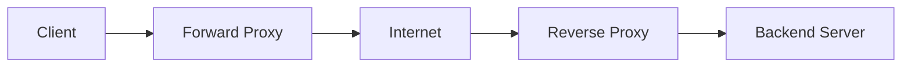

# Proxy Servers

A **proxy server** is an intermediary between a **client** (your device) and the **destination server** (such as a website). It receives requests from the client, forwards them to the destination, and then returns the response back to the client. Proxies serve many purposes including privacy enhancement, content filtering, caching, access control, and load balancing.

## Overview

Proxy servers sit in the request/response path and can inspect, cache, filter, or anonymize the traffic that passes through them. Because every session flows through the proxy, it becomes both a powerful control point and a high-value target. See [Types-of-Proxies](Types-of-Proxies.md) for the full taxonomy of proxy categories, and [CCProxy](CCProxy.md) for a concrete Windows proxy deployment.

- The concept dates back to the **early 1990s** with the growth of the World Wide Web.
- One of the first widely used proxy programs, **Squid**, appeared in **1996**.
- Since then, proxies have evolved alongside internet technologies, adapting to new needs such as mobile devices, streaming, and cloud computing.

> [!NOTE]
> **Summary**
> Proxy servers, born in the early internet era, have evolved into crucial network tools enabling performance optimization, security enforcement, privacy protection, and internet sharing in both personal and enterprise contexts. The variety of proxy types and their modern applications continue to support the complex demands of today's interconnected digital world.

## Why Proxies Are Used

- **Bandwidth Management** — proxies cache frequently visited content to reduce redundant data transfers, improving speed and lowering bandwidth usage.
- **Security** — act as a shield between internal networks and external threats, providing an additional layer of defense.
- **Access Control** — enforce organizational policies by blocking or permitting specific websites or types of content.
- **Privacy & Anonymity** — hide user IP addresses, helping protect identity and bypass censorship or geographic restrictions.
- **Load Balancing** — distribute client requests across multiple servers to improve responsiveness and reliability.

## Proxy Types

| Proxy Type | Description |
| :-- | :-- |
| **Forward Proxy** | Sits between the client and the internet; used for filtering and anonymity. |
| **Reverse Proxy** | Sits between the internet and internal servers; used for load balancing and security. |
| **Transparent Proxy** | Intercepts requests without client configuration; used in ISPs and corporations. |
| **Anonymous Proxy** | Conceals the client's IP from the destination server. |
| **Elite Proxy** | Hides both the client's IP and the fact that it is a proxy server. |
| **SOCKS Proxy** | Works at the transport layer (TCP/UDP); supports all types of traffic beyond HTTP. |
| **HTTP/HTTPS Proxy** | Specifically for web traffic; can inspect and filter requests/responses. |
| **Distorting Proxy** | Sends a fake IP address but reveals the use of a proxy. |

> [!TIP]
> **Full breakdown**
> See [Types-of-Proxies](Types-of-Proxies.md) for a complete taxonomy of proxy categories, protocols, and anonymity levels.

## How It Works

A **forward proxy** represents the client, while a **reverse proxy** represents the server. The client's request terminates at the proxy, which then opens its own connection onward — so the destination sees the proxy's address rather than the original client's.



### Advanced Proxy Features

- **SSL/TLS Interception** — some proxies decrypt and inspect HTTPS traffic for security or compliance.
- **Authentication** — require users to authenticate before accessing the internet through the proxy.
- **Load Balancing & Failover** — reverse proxies distribute incoming requests among multiple backend servers.
- **Content Modification** — proxies may inject or remove ads, or alter web page contents dynamically.
- **Integration with VPNs and Firewalls** — enhancing layered network security and user anonymity.

## Configuration

### Browser Proxy Configuration

Most modern browsers allow manual proxy configuration via settings or extensions to route traffic through a proxy server.

> [!NOTE]
> **Screenshot**
> 

### Command-Line and Application Configuration

Route a single `curl` request through a proxy:

```bash
curl -x http://proxy_ip:port http://example.com
```

Set proxy environment variables for the whole shell session (Linux):

```bash
export http_proxy=http://proxy_ip:port
export https_proxy=https://proxy_ip:port
```

Use a proxy from the Python `requests` library:

```python3
import requests

proxies = {
    'http': 'http://proxy_ip:port',
    'https': 'https://proxy_ip:port',
}

response = requests.get('http://example.com', proxies=proxies)
print(response.text)
```

## Enterprise Deployment

### Proxy Usage for Internet Sharing in LANs

Before widespread use of NAT-enabled routers, proxies were the primary means to share one public internet connection among multiple devices inside a LAN. See [Network-Address-Translation(NAT)](Network-Address-Translation(NAT).md) for the router-based mechanism that largely replaced this role.

How it works:

1. Devices inside the LAN send requests to the proxy server.
2. The proxy uses its single public IP to communicate with the internet.
3. Responses from the internet are received by the proxy and forwarded internally.

| Feature | Benefit |
| :-- | :-- |
| **Single Internet Connection** | Efficiently share one internet line among many devices. |
| **Content Filtering** | Block unwanted or inappropriate sites (common in offices and schools). |
| **Access Control** | Schedule or restrict internet use by user, device, or time. |
| **Caching** | Store popular content locally to reduce latency and bandwidth usage. |
| **Monitoring** | Log and analyze traffic for network management, security auditing, or compliance. |

Popular proxy software for LANs:

- **Squid** (Linux/macOS/Windows)
- **CCProxy** (Windows) — see [CCProxy](CCProxy.md)
- **WinGate** (Windows)

### Modern Real-World Applications

- **Privacy & Anonymity** — used by individuals to surf anonymously and bypass censorship or geo-blocks.
- **Corporate Networks** — filter internet usage, cache content to save bandwidth, and monitor user activity for security.
- **Content Delivery Networks (CDNs)** — reverse proxies are integral in CDNs to load balance and cache content closer to users.
- **Web Scraping & SEO Tools** — rotate proxy IPs to avoid bans while collecting data.
- **Cloud & Microservices Architectures** — reverse proxies facilitate secure and scalable access to backend services.
- **Gaming & Streaming** — proxies reduce latency, bypass regional restrictions, and manage traffic loads.

## Security Considerations

From an offensive standpoint, proxies are dual-use: defenders deploy them to filter and log egress traffic, while attackers abuse open or misconfigured proxies to launder traffic, pivot into internal networks, and mask the true source of an attack. A SOCKS proxy tunnelled through a compromised host is a classic pivoting primitive during post-exploitation.

> [!WARNING]
> **SSL interception has legal and privacy implications**
> Decrypting HTTPS traffic exposes user data to the proxy operator. Deploy interception only with clear policy, user awareness, and where it is lawful.

- Require proxy authentication so only authorized users route traffic through the proxy.
- Never expose a proxy openly to the internet; open proxies are frequently abused and blacklisted.
- Combine proxies with firewalls and VPNs for layered defense rather than relying on the proxy alone.
- Log and review proxy access — the proxy is often the single best vantage point for detecting data exfiltration and command-and-control beaconing.

## Best Practices

- Authenticate and log every client; an anonymous, unauthenticated proxy is effectively an open relay.
- Restrict which source subnets may use the proxy with access-control lists (ACLs).
- Terminate TLS at a reverse proxy to shield origin servers rather than exposing them directly.
- Keep proxy software patched — caching and interception engines have historically been rich targets for vulnerabilities.
- Cache only what is safe to cache, and never cache authenticated or sensitive responses across users.

## Troubleshooting

| Symptom | Likely cause & fix |
| :-- | :-- |
| Clients cannot browse through the proxy | Wrong proxy address/port in client config, or the proxy ACL is blocking the source subnet. |
| HTTPS sites fail but HTTP works | TLS interception misconfigured or the proxy's CA certificate is not trusted by the client. |
| Requests bypass the proxy entirely | Environment variables or browser settings not applied, or a `no_proxy`/exception list is too broad. |
| Slow responses despite caching | Cache disabled, too small, or responses marked non-cacheable by upstream headers. |

## References

- [What is a proxy server? (Cloudflare Learning)](https://www.cloudflare.com/learning/cdn/glossary/reverse-proxy/)
- [Squid — official caching-proxy documentation](http://www.squid-cache.org/)
- [RFC 9110 — HTTP Semantics: Intermediaries](https://www.rfc-editor.org/rfc/rfc9110#name-intermediaries)

## Related

- [Enterprise Windows Infrastructure Security](../Readme.md) — course hub and map of content
- [Types-of-Proxies](Types-of-Proxies.md) — related note (forward, reverse, transparent, anonymous)
- [CCProxy](CCProxy.md) — related note (deploying a Windows proxy)
- [Network-Address-Translation(NAT)](Network-Address-Translation(NAT).md) — related note (NAT and address translation)
- [Port-Forwarding](Port-Forwarding.md) — related note (exposing internal services)
