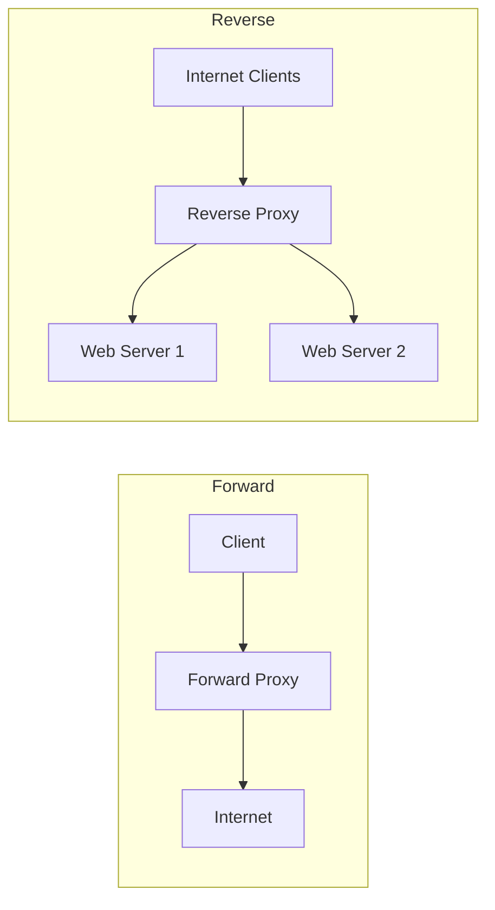

# Types of Proxies

Proxy servers come in many forms, each designed for a specific function based on its **placement** (which side of the connection it fronts), **traffic handling**, **anonymity level**, and **protocol support**. This note classifies the common proxy types and how they are used in operations and security testing.

## Overview

A proxy sits between a client and a destination, brokering traffic on behalf of one side. Understanding the type of proxy matters because placement and visibility determine what it protects: a client-facing proxy hides users and controls their access, while a server-facing proxy shields backends and balances load. See [Proxy-Servers](Proxy-Servers.md) for core proxy concepts, [CCProxy](CCProxy.md) for a concrete Windows deployment, and [Network-Address-Translation(NAT)](Network-Address-Translation(NAT).md) and [Port-Forwarding](Port-Forwarding.md) for the network-edge mechanisms that shape reachability alongside proxies.

Proxies are commonly grouped along five axes: **direction**, **anonymity/visibility**, **protocol**, **IP source**, and **function**. The same product often fits several categories at once (for example, Squid is both a forward proxy and a caching proxy).

> [!TIP]
> **Classify by the question it answers**
> When you meet a proxy in an engagement, ask: *Who is it fronting?* (client vs. server → forward vs. reverse), *Does it hide the client?* (visibility), and *What does it inspect?* (protocol/OSI layer). Those three answers place almost any proxy.

## By Direction

### Forward Proxy

- **Position:** Between the client and the internet.
- **Purpose:** Acts on behalf of the client to reach external resources.
- **Use cases:** Enterprise/school internet access control, content filtering and malware scanning, user anonymity and privacy, caching frequently accessed content.
- **Example:** A corporate proxy blocking social media during work hours.

```text
Client → Forward Proxy → Internet
```

### Reverse Proxy

- **Position:** In front of one or more web servers.
- **Purpose:** Acts on behalf of backend servers, handling incoming client requests.
- **Use cases:** Load balancing, SSL/TLS termination, Web Application Firewall (WAF), content caching, API gateway.
- **Example:** NGINX distributing traffic across multiple application servers.

```text
Internet → Reverse Proxy → Web Server(s)
```



## By Anonymity / Visibility

### Transparent Proxy (Intercepting Proxy)

- **Behavior:** Intercepts traffic without requiring client configuration.
- **Use cases:** ISP content filtering, corporate monitoring, bandwidth optimization via caching.
- **Privacy:** Does **not** hide the client's IP address.
- **Example:** ISP-enforced website blocking.

### Anonymous Proxy

- **Behavior:** Hides the client's IP but reveals that a proxy is in use.
- **Use cases:** Basic online privacy, circumventing simple IP-based restrictions.
- **Limitation:** Easily detected as a proxy.
- **Example:** Public web proxy services.

### Distorting Proxy

- **Behavior:** Reveals proxy usage but supplies a fake IP to the destination.
- **Use cases:** Basic location masking, circumventing region-based restrictions.
- **Example:** A proxy presenting a spoofed IP from another country.

### Elite Proxy (High-Anonymity Proxy)

- **Behavior:** Hides both the client IP **and** the fact that a proxy is being used.
- **Use cases:** High-anonymity browsing, web scraping, accessing geo-restricted content.
- **Example:** Rotating residential proxy networks.

### Open Proxy

- **Behavior:** Publicly accessible proxy that accepts connections from anyone.
- **Use cases:** Anonymous browsing, circumventing access restrictions.
- **Risks:** Frequently abused by attackers; often blacklisted by websites and services.
- **Example:** A misconfigured proxy server exposed to the public internet.

> [!WARNING]
> **Open proxies are a liability**
> An open proxy is effectively an open relay: it lets arbitrary third parties launder traffic through your infrastructure, which attracts abuse, blacklisting, and attribution. Always enforce authentication and source-address ACLs.

## By Protocol

### SOCKS Proxy

- **OSI layer:** Transport Layer (Layer 4).
- **Protocol support:** TCP and UDP.
- **Use cases:** Torrenting, gaming, SSH tunneling, email protocols, non-web applications.
- **SOCKS5 features:** Authentication support, UDP forwarding, DNS resolution through the proxy.
- **Example:** SOCKS5 proxy used with a torrent client.

### HTTP Proxy

- **OSI layer:** Application Layer (Layer 7).
- **Protocol support:** HTTP.
- **Use cases:** Web filtering, content caching, traffic monitoring.
- **Limitation:** Cannot securely handle encrypted HTTPS traffic without interception.
- **Example:** Enterprise web filtering proxy.

### HTTPS Proxy (SSL Proxy)

- **Protocol support:** HTTPS traffic.
- **Use cases:** Secure web browsing, SSL/TLS inspection, threat detection and compliance monitoring.
- **Consideration:** SSL interception may raise privacy and legal concerns.
- **Example:** Corporate SSL inspection gateway.

## By IP Source

### Residential Proxy

- **Source:** Real IP addresses assigned by ISPs to residential users.
- **Advantages:** Difficult to detect, lower blocking rates, appears as legitimate user traffic.
- **Use cases:** Market research, ad verification, geo-targeted testing.
- **Example:** Residential IP pool used for location-specific testing.

### Datacenter Proxy

- **Source:** Cloud providers and data centers.
- **Advantages:** Fast, cost-effective, highly scalable.
- **Limitation:** Easier to identify and block.
- **Use cases:** Large-scale automation, vulnerability scanning, performance testing.
- **Example:** Cloud-hosted proxy servers used for SEO analysis.

## By Function

### Caching Proxy

- **Behavior:** Stores frequently requested content locally.
- **Benefits:** Reduces bandwidth usage, improves response times, decreases load on origin servers.
- **Example:** Squid caching web pages for a corporate network.

```text
Client → Cache Proxy → Internet
         ↑
      Cached Data
```

### Application Proxy

- **OSI layer:** Application Layer (Layer 7).
- **Behavior:** Understands specific application protocols and can inspect application data.
- **Use cases:** Deep packet inspection, content filtering, authentication enforcement, malware scanning.
- **Examples:** HTTP proxy, FTP proxy, SMTP proxy.

### Circuit-Level Proxy

- **OSI layer:** Session Layer (Layer 5).
- **Behavior:** Creates TCP sessions on behalf of clients without inspecting application data.
- **Use cases:** Network address hiding, connection forwarding, lightweight proxying.
- **Example:** SOCKS proxy.

## Forward Proxy vs Reverse Proxy

| Feature | Forward Proxy | Reverse Proxy |
|---|---|---|
| Represents | Client | Server |
| Located near | Client | Server |
| Hides | Client identity | Server identity |
| Primary purpose | Privacy and access control | Performance and security |
| Common users | Enterprises, schools | Web applications |
| Examples | Squid, browser proxy | NGINX, HAProxy |

## Proxy Classification

```text
Proxy Servers
│
├── By Direction
│   ├── Forward Proxy
│   └── Reverse Proxy
│
├── By Visibility
│   ├── Transparent Proxy
│   ├── Anonymous Proxy
│   ├── Distorting Proxy
│   ├── Elite Proxy
│   └── Open Proxy
│
├── By Protocol
│   ├── HTTP Proxy
│   ├── HTTPS Proxy
│   └── SOCKS Proxy
│
├── By IP Source
│   ├── Residential Proxy
│   └── Datacenter Proxy
│
└── By Function
    ├── Caching Proxy
    ├── Application Proxy
    └── Circuit-Level Proxy
```

## Emerging Trends and Technologies

- **Zero Trust security** — proxies are integrated into Secure Web Gateways (SWGs) and Zero Trust architectures to dynamically enforce access policies.
- **Service mesh proxies** — cloud-native environments use sidecar proxies (Envoy, Istio sidecar, Linkerd) for traffic management, security, and observability.
- **Rotating proxy networks** — automatically rotate IP addresses to distribute traffic and reduce rate-limiting.
- **Privacy-focused proxies** — growing adoption of encrypted and decentralized proxy solutions designed to enhance privacy and resist censorship.
- **AI-driven traffic filtering** — modern platforms use machine learning to detect malicious traffic, improve content filtering, optimize caching, and identify anomalous behavior.

## Common Proxy Software

| Software | Type |
|---|---|
| Squid | Forward proxy, caching proxy |
| NGINX | Reverse proxy |
| HAProxy | Reverse proxy, load balancer |
| Envoy | Service mesh proxy, reverse proxy |
| Traefik | Cloud-native reverse proxy |
| Dante | SOCKS proxy |
| Burp Suite | Intercepting proxy |
| OWASP ZAP | Intercepting proxy |
| mitmproxy | HTTPS intercepting proxy |

## Security Considerations

Proxy servers are heavily used in penetration testing and security assessments for intercepting and modifying HTTP/HTTPS requests, testing authentication and authorization controls, manipulating session tokens and cookies, API security testing, traffic analysis and debugging, and SSL/TLS inspection. Common security-testing proxies include **Burp Suite**, **OWASP ZAP**, and **mitmproxy** — all intercepting (transparent-style) proxies the tester positions between a client and target.

> [!WARNING]
> **Anonymity level is not a security guarantee**
> "Elite" or "high-anonymity" only describes what the *destination* sees — it does not encrypt traffic end-to-end, and the proxy operator can still read and log everything that passes through. Untrusted public/open proxies can inject content, strip TLS, and harvest credentials. Never route sensitive traffic through a proxy you do not control.

- SSL/TLS interception by HTTPS proxies breaks end-to-end confidentiality by design; it must be governed by policy and disclosed, and it raises privacy/legal concerns.
- Distorting and anonymous proxies leak the fact that a proxy is present, so they are weak evasion primitives against monitoring that fingerprints proxy behavior.
- Datacenter proxy ranges are widely known and blocklisted, so they are poor for stealth compared with residential IP space.

## Best Practices

- Choose the proxy type by intent: a **reverse proxy** to shield and load-balance servers, a **forward proxy** to control and log client egress.
- Authenticate and log proxy clients; never run an **open proxy** — restrict by source-address ACL.
- Terminate TLS at a **reverse proxy** to centralize certificate management rather than exposing origin servers directly.
- Prefer a **SOCKS5** proxy for non-web/UDP traffic and to resolve DNS through the proxy (avoiding DNS leaks).
- Match the OSI layer to the need: use an **application/HTTP proxy** when you need content inspection, a **circuit-level proxy** when you only need session forwarding.

## Troubleshooting

| Symptom | Likely cause & fix |
|---|---|
| Clients can't browse through the proxy | Wrong proxy address/port in client config, or an ACL blocking the source subnet |
| HTTPS sites show certificate errors | HTTPS/SSL-inspecting proxy without its CA trusted on the client — install the proxy CA or exclude the host |
| DNS leaks despite using a proxy | HTTP proxy resolving names client-side — use SOCKS5 with remote DNS resolution |
| Traffic reaches the site but destination still sees real IP | Transparent proxy (by design does not hide client IP) — use an anonymous/elite proxy if masking is required |
| Proxy gets blocked frequently | Datacenter IP range is blacklisted — switch to residential/rotating IPs |

## Summary Table

| Type | Anonymity | Protocols | Common use cases |
|---|---|---|---|
| Forward Proxy | Medium | HTTP/HTTPS/SOCKS | Privacy, filtering, access control |
| Reverse Proxy | N/A | HTTP/HTTPS | Load balancing, WAF, SSL offloading |
| Transparent Proxy | Low | HTTP/HTTPS | Monitoring, filtering |
| Anonymous Proxy | Medium | HTTP/HTTPS | IP masking |
| Elite Proxy | High | HTTP/HTTPS/SOCKS | Stealth browsing, scraping |
| Distorting Proxy | Medium | HTTP/HTTPS | Location masking |
| Open Proxy | Varies | HTTP/HTTPS/SOCKS | Public proxy access |
| SOCKS Proxy | High | TCP/UDP | Gaming, P2P, SSH |
| HTTP Proxy | Low | HTTP | Web filtering |
| HTTPS Proxy | Medium/High | HTTPS | Secure browsing |
| Residential Proxy | High | HTTP/HTTPS/SOCKS | Geo-targeting, research |
| Datacenter Proxy | Medium | HTTP/HTTPS/SOCKS | Automation, scanning |
| Caching Proxy | N/A | HTTP/HTTPS | Performance optimization |
| Application Proxy | Medium | Application specific | DPI, filtering |
| Circuit-Level Proxy | Medium | TCP | Session forwarding |

## References

- Cloudflare Learning — What is a reverse proxy? https://www.cloudflare.com/learning/cdn/glossary/reverse-proxy/
- Cloudflare Learning — Forward proxy vs. reverse proxy: https://www.cloudflare.com/learning/cdn/glossary/forward-proxy/
- MDN Web Docs — Proxy servers and tunneling: https://developer.mozilla.org/en-US/docs/Web/HTTP/Proxy_servers_and_tunneling
- RFC 1928 — SOCKS Protocol Version 5: https://www.rfc-editor.org/rfc/rfc1928

## Related

- [Enterprise Windows Infrastructure Security](../Readme.md) — course hub
- [Proxy-Servers](Proxy-Servers.md) — related note (overarching proxy server concepts)
- [CCProxy](CCProxy.md) — related note (deploying CCProxy on Windows)
- [Network-Address-Translation(NAT)](Network-Address-Translation(NAT).md) — related note (address translation at the edge)
- [Port-Forwarding](Port-Forwarding.md) — related note (exposing internal services)
