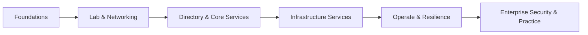

# Enterprise Windows Infrastructure & Security

> A four-month, lab-driven curriculum that takes a learner from first logon to designing, running, and hardening a full stack of enterprise Windows services — the operating system and command line, Active Directory, Group Policy, DNS, DHCP, file and web services, remote access, backup, monitoring, and the security and purple-team practice that keep a production Windows estate defensible.

**Curriculum home:** Repository README

---

## Course Information

| Property | Value |
|----------|-------|
| **Course Title** | Enterprise Windows Infrastructure & Security |
| **Folder** | `Enterprise-Windows-Infrastructure-Security/` |
| **Tag** | Windows Server Administration & Security |
| **Slug** | `windows-infra` |
| **Level** | Beginner to Advanced |
| **Duration** | 4 Months (16 Weeks · 1 Hour/Day · ~120 Hours) |
| **Focus** | Windows Server Administration & Enterprise Hardening |
| **Reference Systems** | Windows Server 2019 / 2022 / 2025 · Windows 10 / 11 |
| **Modules** | 20 |
| **Delivery** | Self-paced notes + hands-on labs |
| **Language** | English |

> [!NOTE]
> **What this course is**
> A study-and-practice track built as an Obsidian knowledge base and published as GitHub-flavored Markdown. Each module is a folder with its own `Readme` hub and a set of deep-dive notes containing tagged, copy-ready commands and configuration. It is designed to be read in order but is fully cross-linked for reference use.

---

## Course Description

Master Windows Server administration and defensive hardening end to end: the operating system, the command line, and PowerShell; virtualization and lab setup; networking fundamentals; then the core enterprise identity and infrastructure services — Active Directory Domain Services, Group Policy, DNS, and DHCP — followed by file services and DFS, IIS web hosting, FTP, proxy, and remote-access/VPN. The program closes with server management, backup and disaster recovery, monitoring and logging, and a dedicated enterprise-security and purple-team practice.

The course is delivered through extensive, reproducible hands-on labs modelled on a real `corp.local` domain, so every concept is paired with a working configuration you can build, break, attack, and harden.

---

## Overview

The **Enterprise Windows Infrastructure & Security** program provides practical, enterprise-ready skills across Windows system administration, directory services, networking, security hardening, and detection. It assumes no prior Windows Server experience and progresses to advanced multi-service, adversary-tested deployments.

By the end of the course, students will be able to:

- Administer Windows from the GUI, the command line, and PowerShell
- Stand up an isolated multi-VM lab and a `corp.local` Active Directory forest
- Manage users, groups, OUs, and policy at scale with Group Policy
- Deploy and integrate DNS, DHCP, file/DFS, IIS, FTP, proxy, and VPN services
- Operate, back up, and recover an enterprise Windows estate
- Build monitoring, logging, and detection pipelines
- Apply a hardening baseline and validate it against real attacks (purple team)

> [!TIP]
> Administration and security are taught together — every service module ends with a hardening pass (least privilege, secure configuration, auditing, and firewalling) rather than treating security as an afterthought.

---

## Learning Path

The 20 modules are sequenced into six progressive stages. Complete each stage before advancing; later service and security modules assume the fundamentals from earlier stages.

```text
Stage 1  Foundations ............ OS Fundamentals · Windows OS Administration · Windows Commands · PowerShell
Stage 2  Lab & Networking ....... Lab Setup & Virtualization · Networking Fundamentals
Stage 3  Directory & Core ....... Active Directory (AD DS) · Group Policy (GPO) · DNS · DHCP
Stage 4  Infrastructure ......... File Services & DFS · IIS · FTP · Proxy · Remote Access & VPN
Stage 5  Operate & Resilience ... Server Management · Backup/Restore/Recovery · Monitoring & Logging
Stage 6  Security & Practice ..... Enterprise Security (purple team) · Software Development Life Cycle
```



> [!IMPORTANT]
> Prerequisite chaining — the infrastructure services (Stage 4) depend on Directory & Core Services (Stage 3) and Networking (Stage 2). Attempting an IIS, DFS, or VPN lab without a working domain, DNS, and DHCP will leave gaps in authentication and name resolution.

---

## Prerequisites

| Requirement | Level | Notes |
|-------------|-------|-------|
| Basic computer literacy | Required | File management, installing software |
| Operating-system familiarity | Required | Any desktop OS is sufficient |
| Basic networking concepts | Recommended | IP addressing, DNS, ports — reinforced in-course |
| Prior Windows Server experience | Not required | Course starts from first logon |
| A machine capable of virtualization | Required | See Hardware & Virtualization Requirements |

> [!TIP]
> No Windows Server background is needed. If you already administer Windows, you can skim Stage 1 and start at Lab Setup & Virtualization.

---

## Software Requirements

| Component | Recommended | Purpose |
|-----------|-------------|---------|
| **Primary server OS** | Windows Server 2022 (2019/2025 also covered) | Domain controller and member-server roles |
| **Client OS** | Windows 10 / 11 | Domain-joined workstation for testing |
| **Attacker OS** | Kali Linux | Attack & defense / purple-team exercises |
| **Hypervisor** | VirtualBox 7.x, Hyper-V, or VMware Workstation | Building the multi-VM lab |
| **Management tools** | RSAT, Windows Admin Center, PowerShell 5.1 / 7.x | Remote administration |
| **Optional** | Wireshark | Traffic analysis for networking/service labs |

> [!WARNING]
> Track version differences deliberately. Roles, defaults, and security baselines differ across Windows Server 2019/2022/2025 — labs note where they diverge; do not assume a step on 2022 is identical on 2019.

---

## Hardware Requirements

| Resource | Minimum | Recommended |
|----------|---------|-------------|
| **CPU** | 4 cores with VT-x/AMD-V | 6+ cores with virtualization enabled |
| **RAM** | 8 GB | 16 GB+ (to run 3–4 VMs concurrently) |
| **Disk** | 120 GB free | 250 GB+ SSD |
| **Network** | 1 host-only + 1 NAT adapter | Additional internal networks for multi-VM labs |

> [!IMPORTANT]
> Hardware virtualization (Intel VT-x / AMD-V) must be enabled in BIOS/UEFI. Without it, hypervisors fall back to slow emulation or fail to start 64-bit guests.

---

## Virtualization Requirements

The lab is a small virtual network of guests on a single host. Later phases add an attacker VM and expand into multi-service topologies.

| Item | Detail |
|------|--------|
| **Hypervisor** | VirtualBox 7.x, Hyper-V, or VMware Workstation |
| **Guest count** | 1 DC + 1 member server + 1 client minimum; add Kali for attack labs |
| **Networking** | Host-only/internal network (`10.10.10.0/24`) for isolated service testing; NAT for updates |
| **Snapshots** | Take a clean baseline snapshot per VM before each lab |

> [!TIP]
> Snapshot before you harden. Take a snapshot after a clean install and again after base configuration — hardening steps (GPO, LAPS, firewall, LSA protection) are the most common source of lockouts, and snapshots make recovery instant.

---

## Lab Environment

A reference topology used across the infrastructure modules — the `corp.local` domain on an isolated internal network:

```text
                    ┌─────────────────────────┐
                    │   Host (Hypervisor)     │
                    └───────────┬─────────────┘
                                │  internal net 10.10.10.0/24  ·  corp.local
        ┌───────────────┬───────┴───────┬────────────────┐
        │               │               │                │
  ┌───────────┐   ┌───────────┐   ┌───────────┐   ┌──────────────┐
  │   DC01    │   │   SRV01   │   │   WKS01   │   │    Kali      │
  │ Win Server│   │ Win Server│   │ Win 10/11 │   │  attacker    │
  │ AD DS·DNS │   │ IIS·FS/DFS│   │  domain   │   │ (red team)   │
  │ DHCP·GPO  │   │ FTP·Proxy │   │  client   │   │              │
  └───────────┘   └───────────┘   └───────────┘   └──────────────┘
```

| Role | Guest | Services exercised |
|------|-------|--------------------|
| Domain controller | `DC01` (Windows Server) | AD DS, DNS, DHCP, Group Policy |
| Member server | `SRV01` (Windows Server) | IIS, File Services/DFS, FTP, Proxy, Remote Access |
| Client | `WKS01` (Windows 10/11) | Domain join, policy testing, resource access |
| Attacker | `Kali` | Enumeration, attack & defense, purple-team validation |

> [!NOTE]
> Keep the lab on an isolated internal/host-only network. Standing up a rogue DHCP or DNS server, or running attack tooling, on a shared LAN will disrupt other devices.

---

## Course Modules

20 teaching modules grouped into six logical tracks, each linking to the module's own `Readme` hub — plus the [Practical Labs](Practical-Labs/Readme.md) and [Enterprise Projects](Enterprise-Projects/Readme.md) collections (below).

### Foundations

| # | Module | Focus |
|---|--------|-------|
| 1 | [Fundamentals of the Operating System](Fundamental-Of-Operating-System/Readme.md) | How Windows works: kernel, processes, services, the registry, file systems |
| 2 | [Windows OS Administration](Windows-Operating-System-Administration/Readme.md) | Users, groups, permissions, features, and day-to-day administration |
| 3 | [Windows Commands](Windows-Commands/Readme.md) | Core CMD utilities for administration and troubleshooting |
| 4 | [Windows PowerShell](Windows-PowerShell/Readme.md) | Cmdlets, pipelines, scripting, and administration automation |

### Lab & Networking

| # | Module | Focus |
|---|--------|-------|
| 5 | [Lab Setup & Virtualization](Lab-Setup-and-Virtualization/Readme.md) | Building the isolated multi-VM lab and base VM images |
| 6 | [Networking Fundamentals](Networking-Fundamentals/Readme.md) | IP addressing, routing, name resolution, ports, and firewalls |

### Directory & Core Services

| # | Module | Focus |
|---|--------|-------|
| 7 | [Active Directory Domain Services (AD DS)](Active-Directory-Domain-Services-AD-DS/Readme.md) | Forests, domains, OUs, users/groups, replication, FSMO, Kerberos |
| 8 | [Group Policy Objects (GPO)](Group-Policy-Objects-GPO/Readme.md) | Centralized policy, security settings, and configuration at scale |
| 9 | [Domain Name System (DNS)](Domain-Name-System-DNS/Readme.md) | AD-integrated DNS, zones, records, forwarders, and DNSSEC |
| 10 | [Dynamic Host Configuration Protocol (DHCP)](Dynamic-Host-Configuration-Protocol-DHCP/Readme.md) | Scopes, reservations, options, and failover |

### Infrastructure Services

| # | Module | Focus |
|---|--------|-------|
| 11 | [File Services & DFS](File-Services-and-DFS/Readme.md) | Shares, NTFS/share permissions, DFS namespaces and replication |
| 12 | [Web Server (IIS)](Web-Server-IIS/Readme.md) | Sites, bindings, TLS, application pools, and hardening |
| 13 | [FTP Server Administration](FTP-Server-Administration/Readme.md) | Secure FTP/FTPS, isolation, and access control |
| 14 | [Proxy Server Administration](Proxy-Server-Administration/Readme.md) | Forward proxy, filtering, and access policy |
| 15 | [Remote Access & VPN](Remote-Access-and-VPN-Configuration/Readme.md) | RRAS, VPN protocols, NPS, and remote-desktop services |

### Operate & Resilience

| # | Module | Focus |
|---|--------|-------|
| 16 | [Windows Server Management](Windows-Server-Management/Readme.md) | Roles/features, Server Manager, Windows Admin Center, remote management |
| 17 | [Backup, Restore & Recovery](Windows-Server-Backup-Restore-and-Recovery/Readme.md) | Windows Server Backup, system state, and disaster recovery |
| 18 | [Monitoring & Logging](Windows-Monitoring-and-Logging/Readme.md) | Event logs, performance, auditing, and detection pipelines |

### Security & Practice

| # | Module | Focus |
|---|--------|-------|
| 19 | [Enterprise Security](Enterprise-Security/Readme.md) | Hardening baseline, attack surface, detection, and purple-team practice |
| 20 | [Software Development Life Cycle](Software-Development-Life-Cycle/Readme.md) | Secure SDLC concepts underpinning the tooling and automation used |

> [!WARNING]
> The security module includes offensive techniques for validation only. Run enumeration and attack tooling exclusively against your own isolated lab — never against production or third-party systems.

---

## Practical Labs

**7 standalone labs** — each self-contained (objective, requirements, topology, setup, validation, cleanup, troubleshooting). Start at the [Practical Labs](Practical-Labs/Readme.md) index.

| # | Lab | Primary track |
|---|-----|---------------|
| 01 | [Lab Foundations](Practical-Labs/Lab-01-Lab-Foundations.md) | Lab Setup & Virtualization |
| 02 | [Core Services](Practical-Labs/Lab-02-Core-Services.md) | DNS · DHCP |
| 03 | [Active Directory](Practical-Labs/Lab-03-Active-Directory.md) | AD DS · Group Policy |
| 04 | [Remote Access](Practical-Labs/Lab-04-Remote-Access.md) | Remote Access & VPN |
| 05 | [Attack & Defense](Practical-Labs/Lab-05-Attack-and-Defense.md) | Enterprise Security |
| 06 | [Backup & Recovery](Practical-Labs/Lab-06-Backup-and-Recovery.md) | Backup, Restore & Recovery |
| 07 | [Monitoring](Practical-Labs/Lab-07-Monitoring.md) | Monitoring & Logging |

---

## Enterprise Projects

**10 multi-service capstone projects** — each combines several modules into a realistic, hardened production build with architecture, deployment, security controls, and validation. Start at the [Enterprise Projects](Enterprise-Projects/Readme.md) index.

| # | Project | Integrates |
|---|---------|------------|
| 01 | [Build a Single-DC Domain](Enterprise-Projects/Project-01-Single-DC-Domain.md) | AD DS, DNS, base GPO |
| 02 | [Core Network Services (DHCP + DNS)](Enterprise-Projects/Project-02-Core-Network-Services.md) | DHCP, DNS, reservations |
| 03 | [Publish Web + Database](Enterprise-Projects/Project-03-Publish-Web-and-Database.md) | IIS, TLS, app/data tier |
| 04 | [File Services & DFS Namespace](Enterprise-Projects/Project-04-File-Services-and-DFS.md) | File Services, DFS, permissions |
| 05 | [Remote Access for a Branch](Enterprise-Projects/Project-05-Remote-Access-for-a-Branch.md) | RRAS, VPN, NPS |
| 06 | [Backup & Disaster Recovery Drill](Enterprise-Projects/Project-06-Backup-and-Disaster-Recovery.md) | Windows Server Backup, system state, DR |
| 07 | [Monitoring & Detection Pipeline](Enterprise-Projects/Project-07-Monitoring-and-Detection-Pipeline.md) | Event logging, auditing, alerting |
| 08 | [Harden the Enterprise](Enterprise-Projects/Project-08-Harden-the-Enterprise.md) | GPO baseline, LAPS, firewall, CIS |
| 09 | [Attack the Lab](Enterprise-Projects/Project-09-Attack-the-Lab.md) | Enumeration, exploitation, lateral movement |
| 10 | [Purple-Team Capstone](Enterprise-Projects/Project-10-Purple-Team-Capstone.md) | Attack + detect + harden, end to end |

---

## Learning Outcomes

On completion, a student can:

| Domain | Outcome |
|--------|---------|
| **Administration** | Administer Windows Server from the GUI, CMD, and PowerShell |
| **Directory** | Design and manage an AD forest, OUs, groups, and Group Policy |
| **Services** | Deploy DNS, DHCP, File/DFS, IIS, FTP, proxy, and VPN |
| **Operations** | Manage, back up, and recover an enterprise Windows estate |
| **Detection** | Build monitoring, logging, and auditing/detection pipelines |
| **Hardening** | Apply and validate a security baseline against real attacks |
| **Infrastructure** | Stand up and interconnect a multi-server `corp.local` domain |

---

## Certification Mapping

This course's content aligns with the objectives of major Windows administration and security certifications. It is exam-relevant preparation, not a guarantee of passing.

| Certification | Alignment | Strongly covered | Partially covered |
|---------------|-----------|------------------|-------------------|
| **Microsoft AZ-800** (Windows Server Hybrid Administrator) | ⭐⭐⭐⭐ High | AD DS, DNS, DHCP, file/storage, Group Policy, remote access | Azure hybrid/cloud integration |
| **Microsoft AZ-801** (Configuring Windows Server Hybrid Advanced) | ⭐⭐⭐⭐ High | Security, hardening, monitoring, backup/DR, high availability | Azure-specific migration |
| **Microsoft SC-300 / SC-400** (Identity & Information Protection) | ⭐⭐⭐ Medium | Directory identity, authentication | Cloud identity & data governance |
| **CompTIA Server+** | ⭐⭐⭐⭐ High | Server hardware, OS, storage, disaster recovery | Vendor-specific hardware |
| **CompTIA Network+** | ⭐⭐⭐ Medium | Networking fundamentals stage | Deeper WAN/cloud networking |

> [!TIP]
> The directory- and services-depth here maps most directly to **AZ-800/AZ-801**; the security, attack, and purple-team practice reinforces the defensive side of those exams.

---

## References

- Microsoft Learn — Windows Server — <https://learn.microsoft.com/windows-server/>
- Microsoft Learn — Active Directory Domain Services — <https://learn.microsoft.com/windows-server/identity/ad-ds/>
- Windows Security Configuration Framework — <https://learn.microsoft.com/windows/security/threat-protection/windows-security-configuration-framework/>
- CIS Benchmarks (hardening baselines) — <https://www.cisecurity.org/cis-benchmarks>
- MITRE ATT&CK (adversary techniques) — <https://attack.mitre.org>

---

## Related Courses

- [Linux Administration & Server Hardening](https://github.com/armourinfosec/Linux-Administration-and-Server-Hardening) — the Linux counterpart to this course.

---

## Contribution

Contributions that improve accuracy, add labs, or deepen module notes are welcome.

| Guideline | Detail |
|-----------|--------|
| **Conventions** | Follow vault house style: one H1 per note (= filename), intro sentence, standard sections, tagged code fences |
| **Links** | Use **relative Markdown links** (`[text](../Folder/Note.md)`, `[text](Note.md#heading-slug)`) — they render on GitHub and still resolve in Obsidian. Avoid `[[wikilinks]]` |
| **Callouts** | Use **GitHub alert** syntax — `> [!NOTE]`, `> [!TIP]`, `> [!IMPORTANT]`, `> [!WARNING]`, `> [!CAUTION]` (marker alone on its line; a title on the next line as `> **Title**`) |
| **Scope** | Keep each note single-topic; wire new notes into the relevant module `Readme` hub |
| **Accuracy** | Prefer tested commands and cite upstream docs for configuration claims |
| **Safety** | Offensive techniques are for the isolated lab only; never target production or third-party systems |

---

## License

Educational use. These notes are a personal study knowledge base compiled from public documentation and hands-on labs. Third-party trademarks (Microsoft, Windows, Windows Server, Active Directory, and others) belong to their respective owners and are referenced for identification only. Verify every command in an isolated lab before using it in production. Licensed under [CC BY 4.0](LICENSE).
