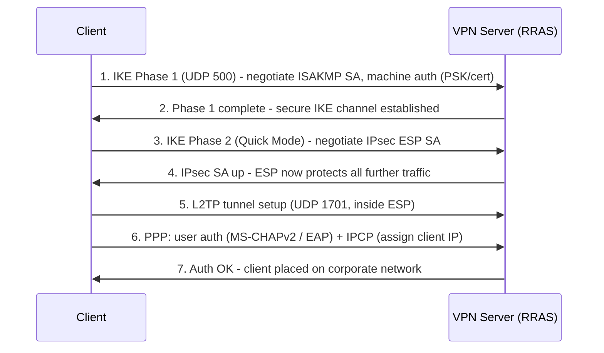

# L2TP/IPsec VPN

**L2TP/IPsec** is a layered VPN tunnelling method that pairs the **Layer 2 Tunneling Protocol (L2TP)** — which carries the PPP session but provides **no encryption on its own** — with **IPsec**, which supplies confidentiality, integrity, and machine authentication. Windows Server RRAS supports it as one of its four native VPN tunnel types, sitting between broken legacy PPTP and the preferred modern IKEv2.

## Overview

On its own L2TP is just an unencrypted tunnelling protocol: it encapsulates a PPP frame so it can be carried across an IP network, but anyone on the path could read it. To make it a real VPN, Windows wraps the L2TP traffic inside an **IPsec ESP transport-mode** association — hence the compound name **L2TP/IPsec**. IPsec handles the *machine-level* trust and the on-the-wire crypto; L2TP/PPP then handles the *user-level* login (MS-CHAPv2 or EAP) inside that protected channel.

L2TP/IPsec is one entry in the wider protocol comparison in [VPN-Types](VPN-Types.md), is terminated by the [RRAS](RRAS.md) role, and is a peer to the TLS-based [SSTP](SSTP.md) tunnel. See [Remote-Access-and-VPN](Remote-Access-and-VPN.md) for the module-level overview of how these fit together.

> [!NOTE]
> **Two protocols, two jobs**
> Think of L2TP/IPsec as a stack: **IPsec** authenticates the *machines* and encrypts the packets; **L2TP over PPP** authenticates the *user* and carries their traffic. A failure in either layer breaks the connection, which is why troubleshooting means asking "did IPsec negotiate, or did the user login fail?"

## How It Works

### Protocol layering (encapsulation)

From the innermost payload outward, a client packet is wrapped like this:

```text
[ User IP packet ]
  -> PPP frame            (user authentication + IPCP address negotiation)
    -> L2TP header        (UDP 1701)
      -> IPsec ESP        (transport mode: encrypts + authenticates the L2TP/UDP payload)
        -> UDP 4500       (only when NAT-T is in use, to cross NAT devices)
          -> Outer IP
```

Because the L2TP payload is encapsulated inside IPsec ESP, the UDP 1701 traffic is never exposed in cleartext on the wire — an observer sees only ESP (IP protocol 50) or NAT-T UDP 4500.

### Ports and protocols

| Component | Port / protocol | Purpose |
|---|---|---|
| IKE / ISAKMP | UDP 500 | Negotiates the IPsec security associations (Phase 1 + Phase 2) |
| NAT-T | UDP 4500 | Encapsulates ESP in UDP so IPsec can traverse NAT |
| ESP | IP protocol 50 | The encrypted IPsec payload (used directly when no NAT is present) |
| L2TP | UDP 1701 | The tunnelling layer — carried *inside* IPsec, not exposed raw |

### Two authentication layers

- **IPsec machine authentication** — proves the two endpoints to each other before any tunnel is built. Uses either a **pre-shared key (PSK)** or a **machine/computer certificate**. Certificates are strongly preferred (see Security Considerations).
- **PPP user authentication** — happens *inside* the protected L2TP tunnel: **MS-CHAPv2** or, preferably, an **EAP** method (e.g. EAP-MSCHAPv2, PEAP, EAP-TLS) validated locally or via NPS/RADIUS.

## Connection Establishment

The following sequence shows the order IKE and L2TP negotiate — IPsec first, then the L2TP/PPP session inside it.



## Configuration

### Server side (RRAS)

L2TP/IPsec is enabled when RRAS is configured for VPN access (see [RRAS](RRAS.md)). If using a **pre-shared key** instead of certificates, it is set in the RRAS console under **server Properties → Security → "Allow custom IPsec policy for L2TP/IKEv2 connection"**, or via PowerShell:

```powershell
# Set a machine-wide L2TP pre-shared key on the RRAS server
Set-VpnServerConfiguration -TunnelType L2TP -CustomPolicy -SharedSecret "REPLACE-WITH-STRONG-PSK"   # untested — confirm parameters with Get-Help Set-VpnServerConfiguration
```

Prefer machine-certificate auth (issued from an internal CA) over a PSK wherever the client fleet supports it.

### Client side (Windows built-in)

```powershell
# Create an L2TP/IPsec connection using a pre-shared key
Add-VpnConnection -Name "Corp L2TP" -ServerAddress "vpn.contoso.com" `
    -TunnelType L2tp -L2tpPsk "REPLACE-WITH-STRONG-PSK" `
    -AuthenticationMethod MSChapv2 -EncryptionLevel Required -Force   # untested

# Pin a strong IPsec cipher suite for that connection
Set-VpnConnectionIPsecConfiguration -ConnectionName "Corp L2TP" `
    -AuthenticationTransformConstants GCMAES256 -CipherTransformConstants GCMAES256 `
    -EncryptionMethod AES256 -IntegrityCheckMethod SHA256 -DHGroup Group14 -PfsGroup PFS2048 `
    -Force   # untested
```

GUI path: **Settings → Network & Internet → VPN → Add a VPN connection**, VPN type **"L2TP/IPsec with pre-shared key"** (or "…with certificate").

> [!IMPORTANT]
> **L2TP behind NAT needs a registry change on Windows**
> By default, Windows will not establish an L2TP/IPsec connection when the **server is behind a NAT device**. Enable NAT-T by creating the DWORD value `AssumeUDPEncapsulationContextOnSendRule` (set to `2`, meaning both client and server may be behind NAT) under the IPsec Policy Agent key, then reboot:
> ```text
> HKLM\SYSTEM\CurrentControlSet\Services\PolicyAgent
>   AssumeUDPEncapsulationContextOnSendRule (DWORD) = 2
> ```

## Security Considerations

> [!WARNING]
> **Pre-shared keys are the weak link**
> The single biggest risk with L2TP/IPsec is deploying it with a **group pre-shared key**:
> - **Shared secret** — the *same* PSK is baked into every client, so a leak from one laptop compromises IPsec machine auth for the whole fleet.
> - **Offline PSK cracking** — if IKE is (mis)configured for **aggressive mode**, a captured handshake yields an offline-crackable PSK hash (tools like `ike-scan` / `psk-crack`). Main mode with a strong PSK is far more resistant, but still a shared secret.
> - **Weak DH groups** — legacy IKE profiles negotiating **DH Group 1/2 (768/1024-bit)** are vulnerable to precomputation (Logjam-style) attacks; require **Group 14 (2048-bit)** or higher.
> - **Weak inner auth** — MS-CHAPv2 as the PPP method is offline-crackable if the outer IPsec layer is ever defeated; prefer **EAP**.

Offensive/defensive relevance:

- Attackers fingerprint IKE endpoints with `nmap -sU -p 500 --script ike-version <target>` or `ike-scan` to detect the VPN, identify the vendor, and probe for aggressive mode + a grabbable PSK hash. # untested
- Because the useful ports are **UDP 500/4500**, restrictive firewalls (outbound UDP blocked) often break L2TP/IPsec — this is a common reason organisations fall back to the TLS/443-based [SSTP](SSTP.md).
- Defensively, terminate L2TP/IPsec on hardened, patched [RRAS](RRAS.md), require **certificate machine auth**, disable aggressive mode, and gate user login through NPS network policies rather than "any domain user".

## Best Practices

- Use **machine-certificate authentication** instead of a group pre-shared key; if a PSK is unavoidable, make it long/random and rotate it.
- Require **EAP** (ideally EAP-TLS/certificate) for the inner PPP user login rather than MS-CHAPv2.
- Enforce a modern IPsec suite: **AES-GCM/AES-256**, **SHA-256+**, and **DH Group 14 or higher** with PFS; disable 3DES, DES, MD5, and DH Group 1/2.
- Prefer **IKEv2** (also IPsec-based, with MOBIKE roaming) or **SSTP** for new deployments; keep L2TP/IPsec only for interop with clients that lack them.
- Front remote access with **MFA** (e.g. NPS Extension for Azure MFA) and scope dial-in rights to a dedicated AD security group.

## Troubleshooting

| Symptom (Windows RAS error) | Likely cause & fix |
|---|---|
| **Error 809** — connection could not be established | NAT in the path blocking IKE/NAT-T; set the `AssumeUDPEncapsulationContextOnSendRule` registry value and reboot; ensure UDP 500 + 4500 are open end-to-end |
| **Error 789** — L2TP failed because the security layer encountered an error | IPsec negotiation failed: PSK mismatch, machine cert missing/expired, mismatched IKE/IPsec policy, or the **IKE and AuthIP IPsec Keying Modules** service is stopped |
| **Error 691** — access denied | PPP *user* credentials wrong, or NPS/RADIUS policy rejected the account (IPsec succeeded, user auth did not) |
| **Error 812** — connection prevented by policy | Authentication protocol mismatch between client and the NPS network policy (e.g. client offers MS-CHAPv2 but policy requires EAP) |
| Works on LAN, fails from internet | UDP 500/4500 filtered by an intermediate firewall — consider SSTP (TCP 443) as a fallback |

## References

- RFC 3193 — Securing L2TP using IPsec: https://www.rfc-editor.org/rfc/rfc3193
- RFC 2661 — Layer Two Tunneling Protocol "L2TP": https://www.rfc-editor.org/rfc/rfc2661
- Microsoft Learn — VPN connection types (L2TP/IPsec): https://learn.microsoft.com/en-us/windows-server/remote/remote-access/vpn/vpn-map-da
- Microsoft Support — Configure a Windows-based computer for L2TP/IPsec behind a NAT-T device: https://learn.microsoft.com/en-us/troubleshoot/windows-server/networking/configure-l2tp-ipsec-server-behind-nat-t-device

## Related

- [Enterprise Windows Infrastructure Security](../Readme.md) — course hub
- [Remote Access and VPN Configuration](../Readme.md) — module hub
- [Remote-Access-and-VPN](Remote-Access-and-VPN.md) — integrative module overview
- [VPN-Types](VPN-Types.md) — where L2TP/IPsec sits among the tunnel protocols
- [RRAS](RRAS.md) — the Windows role that terminates the tunnel
- [SSTP](SSTP.md) — TLS/443 alternative when UDP is blocked
