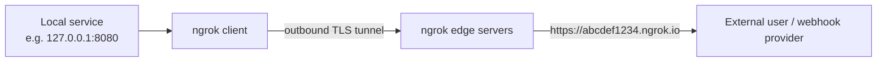

# Ngrok - A Local Development Tool

**Ngrok** is a tool that exposes a local server to the internet by creating a secure tunnel between a local machine and a public URL. It is commonly used for testing, collaboration, and sharing work-in-progress applications without deploying them to a live server.

## Overview

Ngrok runs a lightweight client on your machine that opens an outbound connection to the ngrok service, which then publishes a public URL and relays inbound traffic back down the tunnel to your local port. Because the tunnel is client-initiated and outbound, it works from behind NAT and most firewalls without any inbound port-forwarding.

- **Tunnel local services** — expose local development servers to the internet; useful for sharing work or receiving webhooks from third-party services.
- **Secure connections** — all traffic is forwarded through encrypted tunnels.
- **Easy to use** — simple CLI commands generate a public URL in seconds.

## Concepts

### How Ngrok works



1. **Ngrok client** — run ngrok locally and specify the port or service to expose (e.g. `80`, `8080`, `3306`).
2. **Ngrok tunnel** — ngrok connects to its servers and provides a public URL such as:

   ```text
   https://abcdef1234.ngrok.io
   ```

3. **Public access** — anyone with the URL can access the local service.

### Common use cases

- **Webhook testing** — receive webhooks locally from services like Stripe, GitHub, or PayPal.
- **Sharing work in progress** — share local applications with clients or team members.
- **Remote access** — securely access local services from external networks.

## Installation

1. Download ngrok from the official website.
2. Extract the binary.
3. Authenticate using your authtoken.
4. Start exposing local services using ngrok commands.

## Configuration

Authenticate your ngrok client with your account:

```bash
ngrok config add-authtoken <your-auth-token>
```

> [!NOTE]
> **Authtoken required**
> This step is required to unlock advanced features and persistent tunnels.

## Examples

### HTTP tunnels

Expose a local HTTP service:

```bash
ngrok http 8080
```

Expose a service running on port 80:

```bash
ngrok http 80
```

Expose a service bound to a local IP:

```bash
ngrok http http://192.168.1.207
```

Expose a network device or router interface:

```bash
ngrok http http://192.168.1.1
```

### TCP tunnels

Expose a MySQL database:

```bash
ngrok tcp 3306
```

Expose Remote Desktop (RDP):

```bash
ngrok tcp 3389
```

Expose SSH:

```bash
ngrok tcp 22
```

Expose FTP:

```bash
ngrok tcp 21
```

Expose Telnet:

```bash
ngrok tcp 23
```

## Enterprise Deployment

Ngrok's advantages in a dev/test context are also its risks in production:

- **Custom subdomains** — available on paid plans (e.g. `myapp.ngrok.io`).
- **Web inspection dashboard** — inspect and replay HTTP requests.
- **HTTP and TCP support** — expose web servers, databases, SSH, RDP, and more.

| Plan | Features |
|---|---|
| **Free** | Single tunnel, randomly generated URL |
| **Paid** | Custom subdomains, multiple tunnels, reserved domains, advanced features |

## Security Considerations

> [!WARNING]
> **Ngrok bypasses perimeter controls**
> An ngrok tunnel punches an outbound hole that publishes an internal service to the public internet, bypassing the corporate firewall, NAT, and inbound-filtering controls. Exposing RDP (`3389`), databases (`3306`), or SSH (`22`) this way is a common data-exfiltration and initial-access vector abused by attackers and insiders.

- Treat unexpected `ngrok.exe` / outbound tunnels on managed hosts as an IOC; block or monitor the ngrok domains at the egress proxy.
- Never expose management protocols (RDP/SSH/DB) through ngrok on production or domain-joined machines — use a proper VPN or [Remote-Desktop-Gateway](Remote-Desktop-Gateway.md) instead.
- Prefer application-allowlisting to prevent unsanctioned tunneling tools from running.

## Best Practices

- Use ngrok only for short-lived development and webhook testing, not as durable remote access.
- Always authenticate with an authtoken and use HTTPS tunnels.
- Tear down tunnels when finished; do not leave them running unattended.

## References

- [Ngrok — official website and documentation](https://ngrok.com)

## Related

- [Enterprise Windows Infrastructure Security](../Readme.md) — course hub and map of content
- [Remote Access and VPN Configuration](../Readme.md) — module hub — related note
- [Port-Forwarding](../Proxy-Server-Administration/Port-Forwarding.md) — ngrok exposes local ports publicly — related note
- [Network-Address-Translation(NAT)](../Proxy-Server-Administration/Network-Address-Translation(NAT).md) — ngrok tunnels outbound through NAT — related note
- [Remote-Desktop-Gateway](Remote-Desktop-Gateway.md) — sanctioned way to publish RDP instead of tunneling it — related note
