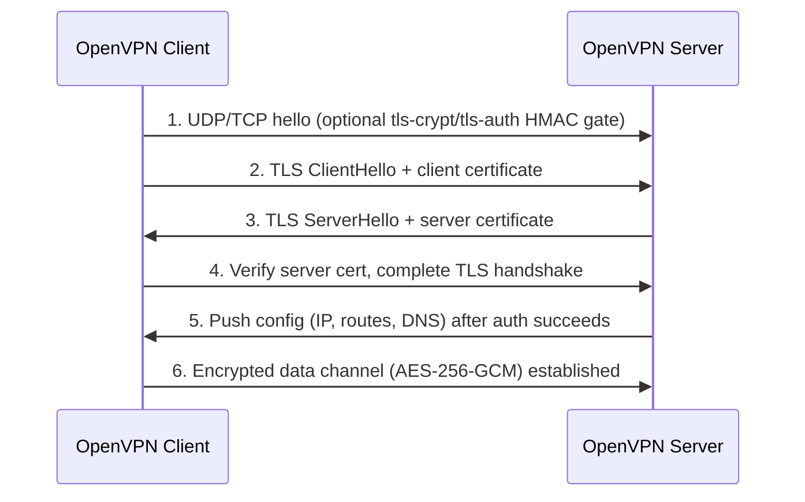

# OpenVPN

OpenVPN is an open-source (GPLv2) TLS-based VPN solution that builds encrypted point-to-point or site-to-site tunnels using the OpenSSL library and a custom SSL/TLS security protocol. It runs in userspace on a virtual TUN/TAP adapter and is fully cross-platform (Windows, Linux, macOS, BSD, mobile), which is why it is a common third-party alternative to the tunnel protocols built into Windows RRAS.

## Overview

Unlike the four native RRAS tunnel types described in [VPN-Types](VPN-Types.md) (PPTP, L2TP/IPsec, [SSTP](SSTP.md), IKEv2), OpenVPN is **not** part of the Windows Remote Access role — it is a separate daemon you install and configure by hand or via a management product. It occupies the same "TLS-wrapped VPN" niche as SSTP: it can run over **TCP 443** and be very hard to distinguish from ordinary HTTPS, giving it excellent firewall and NAT traversal. Its main peer in the modern open-source world is [WireGuard](WireGuard.md), which is faster and simpler but younger; OpenVPN trades some performance for maturity, flexibility, and broad platform support. See [Remote-Access-and-VPN](Remote-Access-and-VPN.md) for how VPN remote access fits into the wider Windows infrastructure picture.

OpenVPN ships in two flavours:

- **OpenVPN Community Edition** — the free CLI daemon (`openvpn`) plus the `easy-rsa` PKI helper. You write the config files yourself.
- **OpenVPN Access Server** — a commercial server bundle with a web admin UI, user management, and auto-generated client profiles.

## How It Works

OpenVPN multiplexes two logical channels over a single UDP or TCP socket:

- **Control channel** — a TLS session that authenticates the peers and negotiates the session keys (the same TLS you know from HTTPS, using X.509 certificates).
- **Data channel** — the encrypted tunnel that carries the actual IP packets, protected by a symmetric cipher (modern default **AES-256-GCM**) with keys derived from the control-channel handshake and periodically re-keyed.

Traffic is encapsulated on a virtual **TUN** (routed, layer 3) or **TAP** (bridged, layer 2) interface, so applications see an ordinary network adapter while OpenVPN encrypts and ships the frames to the peer.



> [!NOTE]
> **tls-auth vs tls-crypt**
> `tls-auth` adds an HMAC signature to every control-channel packet using a shared static key, so packets without the correct HMAC are dropped before any TLS processing — a cheap DoS and port-scan shield. `tls-crypt` goes further and **encrypts** the control channel with that key, hiding the certificate exchange as well. Prefer `tls-crypt` on internet-facing servers.

## Components

| Component | Role |
|---|---|
| `openvpn` daemon | The core binary; runs as server (`--server`) or client (`--client`) from a config file |
| PKI (CA + certs) | Certificate Authority signs one server certificate and per-user client certificates; the basis of mutual TLS auth |
| `easy-rsa` | Helper scripts to build and manage the CA and issue/revoke certificates |
| `.ovpn` / `.conf` file | Client (`.ovpn`) or server (`.conf`) config; can inline `<ca>`, `<cert>`, `<key>`, `<tls-crypt>` blocks |
| TUN/TAP driver | Virtual adapter (on Windows historically the **TAP-Windows** adapter; newer builds use **Wintun**) |
| CRL | Certificate Revocation List — lets the server reject certs of decommissioned/compromised clients |

## Configuration

Install the community daemon and PKI helper on Linux:

```bash
sudo apt install openvpn easy-rsa
```

Build a minimal PKI with `easy-rsa` (server side):

```bash
make-cadir ~/openvpn-ca && cd ~/openvpn-ca
./easyrsa init-pki
./easyrsa build-ca                 # creates the CA (prompts for a passphrase)
./easyrsa gen-req server nopass    # server key + CSR
./easyrsa sign-req server server   # CA signs the server certificate
./easyrsa gen-dh                   # Diffie-Hellman parameters
openvpn --genkey secret ta.key     # tls-auth/tls-crypt shared key
```

A minimal, reasonably hardened server config (`server.conf`):

```text
port 1194
proto udp
dev tun
ca ca.crt
cert server.crt
key server.key
dh dh.pem
tls-crypt ta.key
cipher AES-256-GCM
auth SHA256
server 10.8.0.0 255.255.255.0
push "redirect-gateway def1 bypass-dhcp"
push "dhcp-option DNS 10.8.0.1"
keepalive 10 120
user nobody
group nogroup
persist-key
persist-tun
verb 3
```

Start the server, then connect a client with its profile:

```bash
sudo openvpn --config server.conf              # server
sudo openvpn --config client.ovpn              # client
```

On Windows, install the official **OpenVPN GUI/Connect** client, drop the `.ovpn` profile into `%USERPROFILE%\OpenVPN\config\`, and connect from the tray icon.

> [!TIP]
> **Run over TCP 443 to beat restrictive firewalls**
> Setting `proto tcp` and `port 443` makes OpenVPN traffic ride the same port as HTTPS. Combined with `tls-crypt`, this is hard to block or fingerprint — the same firewall-traversal advantage SSTP enjoys. UDP 1194 is faster and the default; fall back to TCP 443 only where UDP is blocked.

## Security Considerations

OpenVPN's cryptography is sound when configured correctly, but its flexible config file format is itself an attack surface — and on pentests you frequently *find* `.ovpn` files rather than attack the protocol.

> [!WARNING]
> **Untrusted `.ovpn` files can execute code**
> OpenVPN config files support directives like `up`, `down`, `route-up`, and `tls-verify` that run **arbitrary local scripts/commands** when the tunnel connects. Importing or running an attacker-supplied `.ovpn` (or one dropped into a config directory a low-privileged user can write) can lead to **command execution or privilege escalation**, since the client often runs elevated. Never import a VPN profile from an untrusted source, and treat writable OpenVPN config directories as a privesc vector. Harden real clients with `--script-security` kept at the default and avoid `2`/`3` unless required.

Additional offensive/defensive notes:

- **Credential and cert theft** — `.ovpn` profiles frequently inline the CA, client certificate, private key, and `tls-crypt` key, and sometimes an `auth-user-pass` file with plaintext creds. Recovered from a share or backup, these can hand an attacker working VPN access. Treat found `.ovpn` files as loot.
- **VORACLE** — pre-authentication TLS-layer compression (`comp-lzo`) is vulnerable to a compression-oracle attack that can leak plaintext; disable VPN compression.
- **Weak legacy crypto** — old configs using `cipher BF-CBC` (Blowfish) or no `tls-auth`/`tls-crypt` are exposed; standardize on AES-256-GCM and an HMAC/encrypted control channel.
- **Certificate revocation** — a lost/leaked client cert stays valid until you revoke it and the server loads a **CRL** (`crl-verify`); without revocation, offboarded users keep access.

## Best Practices

- Use **mutual TLS with a proper PKI** (per-user client certificates), not a single shared static key, so individual clients can be revoked.
- Enable **`tls-crypt`** (or at minimum `tls-auth`) to gate and hide the control channel and blunt DoS/scanning.
- Standardize on **AES-256-GCM** data-channel encryption and **SHA256** HMAC; disable compression to avoid VORACLE.
- Drop privileges after startup (`user nobody` / `group nogroup`) and keep `--script-security` at its default; audit any `up`/`down` scripts.
- Maintain and publish a **CRL**, and add **MFA** (e.g. TOTP via a plugin, or certificate + password) for internet-facing servers.

## Troubleshooting

| Symptom | Likely cause & fix |
|---|---|
| `TLS Error: TLS handshake failed` | Wrong/missing certs, clock skew, or a `tls-crypt`/`tls-auth` key mismatch between client and server — verify all four match and NTP is synced |
| `TLS key negotiation failed to occur within 60 seconds` | Firewall/NAT dropping UDP 1194, or wrong `proto`/`port` — confirm the port is open and client `proto` matches the server |
| Connected but no internet / DNS | Missing `redirect-gateway` push or DNS not applied — check pushed routes and `dhcp-option DNS`; on Linux verify the resolver hook ran |
| `VERIFY ERROR ... certificate has expired` / revoked | Client cert expired or on the CRL — reissue the certificate or update the client date |
| Windows client: `There are no TAP-Windows adapters` | Virtual adapter driver not installed — reinstall the OpenVPN client / TAP or Wintun driver |

## References

- OpenVPN Community Documentation and manual: https://openvpn.net/community-resources/
- OpenVPN reference manual (config directives): https://openvpn.net/community-resources/reference-manual-for-openvpn-2-6/
- easy-rsa project (PKI tooling): https://github.com/OpenVPN/easy-rsa
- OpenVPN Security Advisories: https://openvpn.net/security-advisories/

## Related

- [Enterprise Windows Infrastructure Security](../Readme.md) — course hub and map of content
- [Remote-Access-and-VPN](Remote-Access-and-VPN.md) — the module overview OpenVPN slots into
- [VPN-Types](VPN-Types.md) — how OpenVPN compares to the native RRAS tunnel protocols
- [SSTP](SSTP.md) — Microsoft's TLS-over-443 VPN, OpenVPN's closest native analogue
- [WireGuard](WireGuard.md) — the modern minimalist open-source VPN alternative
- [RRAS](RRAS.md) — the Windows Routing and Remote Access Service OpenVPN sits alongside
