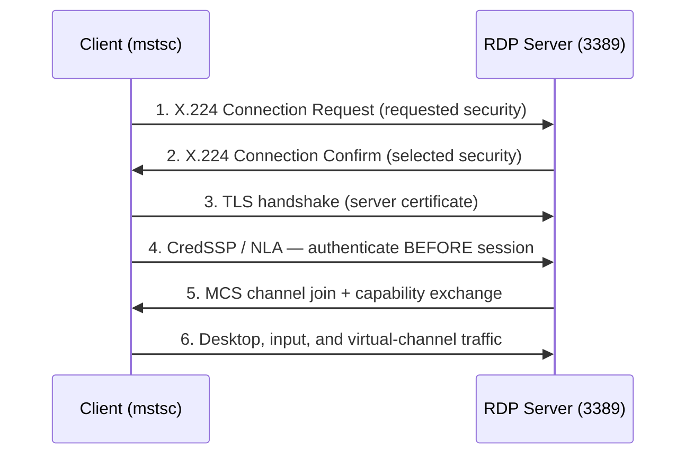

# Remote Desktop Protocol (RDP)

Remote Desktop Protocol (RDP) is Microsoft's proprietary protocol for remote graphical access to a Windows machine, letting a client see the remote desktop and send keyboard/mouse input over the network. It is the transport behind the built-in **Remote Desktop** feature and the multi-user **Remote Desktop Services (RDS)** platform, and it is one of the most heavily targeted services in Windows environments.

## Overview

RDP provides the display and input channel for both single-session **Remote Desktop for Administration** and full multi-session [Remote Access](Remote-Access-and-VPN.md) deployments via RDS. It builds on the ITU-T **T.120 / T.128 (T.share)** application-sharing family, running virtual channels over a Multipoint Communication Service (MCS) layer on top of TCP/IP. The default listener is **TCP/UDP 3389**.

Because RDP grants an interactive logon, it is a prime target for credential attacks and, historically, for pre-authentication remote-code-execution flaws. Hardening it (Network Level Authentication, not exposing it directly to the internet) overlaps heavily with the [remote access](Remote-Access-and-VPN.md) guidance in this module. For granting a specific domain account the right to sign in this way, see [Remote-Desktop-Access-to-a-Domain-User](Remote-Desktop-Access-to-a-Domain-User.md).

> [!NOTE]
> **Two things called "RDP"**
> **Remote Desktop for Administration** is RDP enabled on any Windows host for a couple of concurrent admin sessions — no role installation needed. **Remote Desktop Services (RDS)** is the full session/virtual-desktop delivery platform (Connection Broker, Session Host, Web Access, Gateway, Licensing). They share the same protocol; most hardening below applies to both.

## How It Works

RDP is a stack of layered protocols. Graphics, input, clipboard, drive redirection, printing, and audio each ride in their own **virtual channel**, multiplexed together, compressed, encrypted, and sent over the transport:

- **Client** — `mstsc.exe` (Microsoft Terminal Services Client) on Windows; `xfreerdp` / `rdesktop` on Linux.
- **Server** — the Remote Desktop Services / Terminal Server component listening on the `RDP-Tcp` WinStation.
- **Transport** — TCP 3389 (classic) with an optional UDP 3389 path for lower-latency graphics on newer clients/servers.



With **Network Level Authentication (NLA)** the client must prove credentials (step 4) before the server builds a full session — removing the unauthenticated attack surface that pre-NLA RDP exposed.

## Security Layers and Authentication

RDP can negotiate one of three security postures during the connection handshake:

| Security layer | How it works | Notes |
|---|---|---|
| **RDP Security Layer (native)** | Legacy RC4-based encryption built into RDP | Weak; no strong server identity — avoid |
| **TLS / SSL** | The RDP session is wrapped in TLS using the server's certificate | Encrypts the channel and authenticates the server |
| **CredSSP (with NLA)** | Uses the **Credential Security Support Provider** to authenticate the user *before* a session is created | Recommended; combine with TLS |

> [!IMPORTANT]
> **Turn on Network Level Authentication**
> NLA (implemented over CredSSP) forces authentication before the RDP session is established. This blocks pre-auth protocol attacks and denial-of-service against the session stack, and it is the single most important RDP hardening toggle. Leave it enabled unless a legacy client genuinely cannot support it.

## Configuration

Enable Remote Desktop and open the firewall (registry value `fDenyTSConnections = 0` toggles the listener):

```powershell
# Enable RDP and allow it through Windows Firewall
Set-ItemProperty -Path 'HKLM:\System\CurrentControlSet\Control\Terminal Server' -Name "fDenyTSConnections" -Value 0   # untested
Enable-NetFirewallRule -DisplayGroup "Remote Desktop"                                                                  # untested
```

Require Network Level Authentication on the `RDP-Tcp` listener:

```powershell
# Force NLA on the RDP listener (1 = required)
(Get-WmiObject -class "Win32_TSGeneralSetting" -Namespace root\cimv2\terminalservices -Filter "TerminalName='RDP-tcp'").SetUserAuthenticationRequired(1)   # untested
```

Connect from a client:

```cmd
mstsc /v:server.contoso.local
```

```bash
# Linux client (FreeRDP)
xfreerdp /u:alice /d:CONTOSO /v:server.contoso.local   # untested
```

At scale, enabling RDP, enforcing NLA, and restricting who may log on are best pushed centrally through [Group-Policy(GPO)](../Group-Policy-Objects-GPO/Group-Policy(GPO).md) rather than host by host.

### Ports

| Protocol | Port | Purpose |
|---|---|---|
| RDP (TCP) | 3389 | Primary RDP listener |
| RDP (UDP) | 3389 | Optional UDP transport for graphics (newer clients) |
| RD Gateway | 443 | RDP tunnelled inside HTTPS/TLS for secure internet publishing |

## Security Considerations

RDP exposes an interactive logon, so a working credential (or a stealable session) equals full control of the host. Firewall rules that RDP depends on can be inspected with [Windows-Firewall-and-AV-Commands](../Windows-Commands/Windows-Firewall-and-AV-Commands.md).

> [!WARNING]
> **RDP is a top attack surface**
> - **Brute force / password spraying** — internet-exposed 3389 is scanned constantly; tools like Hydra, Ncrack, and Crowbar target it. Enforce account lockout and never expose 3389 directly.
> - **Pre-auth RCE — BlueKeep (CVE-2019-0708)** — a wormable, pre-authentication remote-code-execution flaw in RDP on Windows 7 / Server 2008 R2 and earlier. NLA mitigated it; patching removed it. It is the textbook reminder to keep the RDP stack patched.
> - **Pass-the-Hash over RDP** — Restricted Admin / Remote Credential Guard modes let a client authenticate without sending a password, but Restricted Admin also lets an attacker RDP in using only an [NTLM](../Active-Directory-Domain-Services-AD-DS/NTLM.md) hash. Understand the trade-off before enabling it.
> - **Credential exposure** — without NLA and TLS, sessions are vulnerable to man-in-the-middle and to the older weak native encryption.

Defensively, RDP logons are one of the highest-signal events to monitor. Successful remote logons appear as Security event **4624** with **LogonType 10** (RemoteInteractive); failures as **4625**; and RDP connection attempts (even those that later fail full logon) as event **1149** in `Microsoft-Windows-TerminalServices-RemoteConnectionManager/Operational`. See [Windows-Event-Logs](../Windows-Operating-System-Administration/Windows-Event-Logs.md) for log-handling practice.

## Best Practices

- **Never expose TCP 3389 directly to the internet** — front it with an **RD Gateway** (RDP over HTTPS/443) or require a VPN first (see [Remote-Access-and-VPN](Remote-Access-and-VPN.md)).
- **Require Network Level Authentication** and use **TLS** for the security layer; disable the legacy native RC4 layer.
- **Enforce account lockout and strong/MFA authentication** to blunt brute-force and spraying against the endpoint.
- **Restrict logon rights** to a specific AD security group via [Group-Policy(GPO)](../Group-Policy-Objects-GPO/Group-Policy(GPO).md) instead of allowing any domain user to RDP in.
- **Patch the RDP/RDS stack promptly** — it has a history of critical pre-auth CVEs (e.g. BlueKeep); track current advisories rather than assuming a fixed list.

## Troubleshooting

| Symptom | Likely cause & fix |
|---|---|
| "Remote Desktop can't connect" / port refused | RDP disabled (`fDenyTSConnections`) or firewall rule off — re-enable both |
| Connects then immediately drops | NLA/credential mismatch, or the account lacks "Allow log on through Remote Desktop Services" rights |
| "An authentication error… CredSSP encryption oracle" | CredSSP patch-level mismatch between client and server — patch both to the same level |
| Certificate warning on connect | Server using a self-signed RDP cert — deploy a trusted certificate for TLS |
| Only one user can connect at a time | Expected on non-RDS Windows (2 admin sessions max); full multi-user use requires RDS with licensing |

## References

- Microsoft Learn — Understanding the Remote Desktop Protocol (RDP): https://learn.microsoft.com/en-us/troubleshoot/windows-server/remote/understanding-remote-desktop-protocol
- Microsoft Learn — Allow access to use Remote Desktop / Network Level Authentication: https://learn.microsoft.com/en-us/windows-server/remote/remote-desktop-services/remotepc/remote-desktop-allow-access
- Microsoft Security Response Center — CVE-2019-0708 (BlueKeep): https://msrc.microsoft.com/update-guide/vulnerability/CVE-2019-0708

## Related

- [Enterprise Windows Infrastructure Security](../Readme.md) — course hub
- [Remote-Access-and-VPN](Remote-Access-and-VPN.md) — remote access and VPN concepts, RDP hardening context
- [Remote-Desktop-Access-to-a-Domain-User](Remote-Desktop-Access-to-a-Domain-User.md) — granting a domain user rights to RDP in
- [RRAS](RRAS.md) — Routing and Remote Access Service
- [VPN-Types](VPN-Types.md) — VPN tunnel protocol comparison
- [Group-Policy(GPO)](../Group-Policy-Objects-GPO/Group-Policy(GPO).md) — centrally enforcing NLA, lockout, and logon rights
- [Windows-Event-Logs](../Windows-Operating-System-Administration/Windows-Event-Logs.md) — RDP logon detection and log handling
- [Windows-Firewall-and-AV-Commands](../Windows-Commands/Windows-Firewall-and-AV-Commands.md) — inspecting the firewall rules RDP depends on
- [NTLM](../Active-Directory-Domain-Services-AD-DS/NTLM.md) — hash-based auth relevant to Restricted Admin / pass-the-hash over RDP
