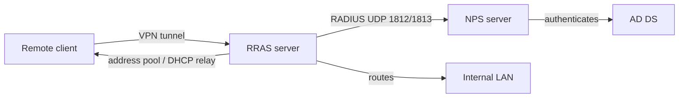

# RRAS

**Routing and Remote Access Service (RRAS)** is the Windows Server role service that turns a server into a software router and VPN gateway. It is installed as part of the **Remote Access** server role and provides VPN remote access, site-to-site (demand-dial) routing, NAT, and LAN routing (RIP/IGMP), with authentication delegated to Windows or to [NPS](Remote-Access-and-VPN.md) RADIUS.

## Overview

RRAS delivers three broad capabilities:

| Capability | What it does |
|---|---|
| **VPN remote access** | Terminates PPTP / L2TP-IPsec / SSTP / IKEv2 tunnels from remote clients |
| **Routing** | LAN/WAN routing, NAT, RIP, IGMP proxy, demand-dial (site-to-site) interfaces |
| **Dial-up** | Legacy modem/ISDN remote access (rare today) |

RRAS is managed through the **Routing and Remote Access** MMC snap-in (`rrasmgmt.msc`), the `RemoteAccess` PowerShell module, and `netsh ras` / `netsh routing`.

## Architecture



## Installation

Install the Remote Access role with its management tools:

```powershell
Install-WindowsFeature -Name RemoteAccess -IncludeManagementTools   # untested
Install-WindowsFeature -Name Routing -IncludeManagementTools        # untested
```

## Configuration

### Enable RRAS for VPN

GUI: open **Routing and Remote Access** → right-click the server → **Configure and Enable Routing and Remote Access** → **Custom configuration → VPN access** → finish and start the service.

> [!NOTE]
> **Screenshot**
> 

PowerShell:

```powershell
# Enable RRAS as a VPN server
Install-RemoteAccess -VpnType Vpn                                   # untested

# Provision as a LAN router only (no VPN)
Install-RemoteAccess -VpnType RoutingOnly

# Inspect current server-side VPN configuration
Get-VpnServerConfiguration                                          # untested
Get-RemoteAccess                                                    # untested
```

### Authentication and accepted tunnel types

```powershell
# Restrict accepted user-auth protocols and pin a root cert for machine/EAP auth
Set-VpnAuthProtocol -UserAuthProtocolAccepted Eap,Certificate `
    -RootCertificateNameToAccept (Get-ChildItem Cert:\LocalMachine\Root)[0]   # untested — verify accepted values with Get-Help Set-VpnAuthProtocol
```

Key decisions in the RRAS console:

- **IPv4 → Address Assignment** — static pool vs DHCP relay for client IPs.
- **Ports** — enable/disable and cap the number of PPTP/L2TP/SSTP/IKEv2 WAN Miniports.
- **Authentication provider** — Windows Authentication or **RADIUS (NPS)**; choose NPS to centralise policy.

## Administration

```powershell
# Site-to-site / demand-dial interface (high level — parameters vary by build)
Add-VpnS2SInterface -Name "HQ-to-Branch" -Protocol IKEv2 `
    -Destination 203.0.113.10 -AuthenticationMethod PSKOnly `
    -SharedSecret "REPLACE_ME" -IPv4Subnet "10.20.0.0/16:100"   # untested
```

```cmd
:: Enable verbose connection tracing for troubleshooting, then disable when done
netsh ras set tracing * enabled
netsh ras set tracing * disabled
```

## Security Considerations

> [!WARNING]
> - Disable **PPTP** ports entirely; standardise on IKEv2/SSTP with certificate or EAP auth.
> - Point RRAS authentication at **NPS** so remote-access authorisation is governed by centrally-managed network policies scoped to security groups.
> - RRAS has had critical RCE CVEs historically — patch promptly and track current advisories.
> - Place the RRAS server in a hardened DMZ; expose only the required VPN ports at the perimeter.

## Troubleshooting

| Symptom | Action |
|---|---|
| Service won't start | Check the System log (source **RemoteAccess**); confirm the role and ports are configured |
| Clients authenticate but get no IP | Verify the IPv4 address pool or DHCP relay under RRAS → IPv4 → Address Assignment |
| Intermittent connection failures | `netsh ras set tracing * enabled`, reproduce, inspect `%windir%\tracing`, then disable |

## References

- [Remote Access (RRAS) overview — Microsoft Learn](https://learn.microsoft.com/en-us/windows-server/remote/remote-access/remote-access)
- [Install-RemoteAccess — Microsoft Learn](https://learn.microsoft.com/en-us/powershell/module/remoteaccess/install-remoteaccess)

## Related

- [Enterprise Windows Infrastructure Security](../Readme.md) — course hub and map of content
- [Remote Access and VPN Configuration](../Readme.md) — module hub — related note
- [Remote-Access-and-VPN](Remote-Access-and-VPN.md) — integrative module overview — related note
- [VPN-Types](VPN-Types.md) — protocols RRAS can terminate — related note
- [SSTP](SSTP.md) — TLS tunnel type served by RRAS — related note
- [L2TP-IPsec](L2TP-IPsec.md) — L2TP/IPsec tunnel type served by RRAS — related note
- [Windows-Server](../Windows-Server-Management/Windows-Server.md) — role/feature model RRAS installs into — related note
- [Active-Directory-Domain-Services](../Active-Directory-Domain-Services-AD-DS/Active-Directory-Domain-Services.md) — identity backing RADIUS/NPS authentication — related note
