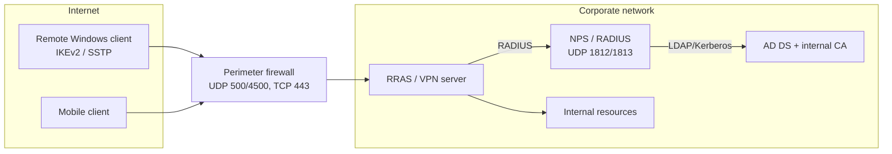

# Remote Access and VPN

Windows Server's **Remote Access** server role (RRAS — Routing and Remote Access Service) provides the platform for VPN remote access, dial-up / site-to-site routing, and — paired with **Network Policy Server (NPS)** — centralized RADIUS authentication for VPN, RDS, and 802.1X connections. This note is the integrative overview for the module: it covers the RRAS role, the classic VPN tunneling protocols, VPN server/client configuration, RDP/RDS remote access, NPS, and the hardening needed to run remote access safely on the open internet.

> [!NOTE]
> **Module overview**
> This is the broad survey note. Each protocol and component has its own focused note — see [VPN-Types](VPN-Types.md), [RRAS](RRAS.md), [SSTP](SSTP.md), [L2TP-IPsec](L2TP-IPsec.md), [OpenVPN](OpenVPN.md), [WireGuard](WireGuard.md), [RDP](RDP.md), and [Remote-Desktop-Gateway](Remote-Desktop-Gateway.md) — linked in the `## Related` footer.

## Overview

The **Remote Access** server role in Server Manager installs one or more of three role services:

| Role service | Purpose |
|---|---|
| DirectAccess and VPN (RAS) | Always-on (DirectAccess, legacy) or on-demand (VPN) remote connectivity for clients |
| Routing | LAN routing — NAT, BGP, RIP, IGMP multicast, demand-dial routing between subnets |
| Web Application Proxy | Reverse proxy / AD FS proxy for publishing internal web apps externally |

> [!TIP]
> **Modern guidance**
> Microsoft's current recommendation is to use **Always On VPN** (IKEv2-based, works with Windows 10/11 clients) rather than DirectAccess for anything newer than legacy Windows 7/8 estates.

## Architecture



## Concepts

A VPN tunnel wraps private (often unencrypted) traffic inside an encrypted, authenticated envelope across an untrusted network (the internet). RRAS supports four tunnel types, each with a very different security and firewall-traversal story:

| Protocol | Transport / Ports | Encryption & Auth | NAT traversal | Firewall friendliness | Security posture |
|---|---|---|---|---|---|
| **PPTP** | TCP 1723 (control) + GRE, IP protocol 47 (data) | MPPE (RC4, up to 128-bit) over MS-CHAPv2 | Poor — GRE is frequently blocked/mangled by NAT/firewalls | Poor | **Broken.** MS-CHAPv2 is crackable offline; treat as legacy-only, disable if not required |
| **L2TP/IPsec** | UDP 500 (IKE) + UDP 4500 (NAT-T) + UDP 1701 (L2TP, inside IPsec ESP) | IPsec ESP (AES/3DES) protects the tunnel; PPP auth (MS-CHAPv2/EAP) runs inside it | Works via NAT-T | Good | Solid **only** with certificate-based IKE auth — pre-shared-key deployments are common and much weaker |
| **SSTP** | TCP 443 (SSL/TLS) | PPP fully wrapped in an HTTPS/TLS channel | Excellent — looks like ordinary HTTPS | Excellent — traverses almost any firewall/proxy | Strong; security rides on the TLS certificate; Windows-centric client support |
| **IKEv2** | UDP 500 + UDP 4500 (NAT-T); ESP for data | IPsec (AES-CBC/AES-GCM) with certificate or EAP auth; native **MOBIKE** (seamless reconnect across network changes, e.g. Wi-Fi → cellular) | Works via NAT-T | Good | **Preferred modern default** for Windows clients; combine with certificate auth for best assurance |

> [!TIP]
> **Practical protocol choice**
> Prefer **IKEv2** for native Windows/mobile clients and **SSTP** as the firewall-friendly fallback where UDP is blocked outbound. Disable PPTP, and avoid L2TP/IPsec with pre-shared keys. See [VPN-Types](VPN-Types.md) for a deeper comparison.

## Installation

Install the Remote Access role and inspect it:

```powershell
Install-WindowsFeature -Name RemoteAccess -IncludeManagementTools   # untested
Install-WindowsFeature -Name Routing -IncludeManagementTools        # untested
```

```powershell
# Provision as a LAN router only (no VPN) — cmdlet/value confirmed via Microsoft Learn
Install-RemoteAccess -VpnType RoutingOnly
```

Install NPS (RADIUS) with the **Network Policy and Access Services** role:

```powershell
Install-WindowsFeature -Name NPAS -IncludeManagementTools   # untested
```

## Configuration

### VPN server (RRAS)

Classic path (GUI): **Server Manager → Add Roles and Features → Remote Access → DirectAccess and VPN (RAS)** → open the **Routing and Remote Access** MMC snap-in → right-click the server → **Configure and Enable Routing and Remote Access** → choose **Custom configuration → VPN access** → finish the wizard and start the service.

> [!NOTE]
> **Screenshot**
> 

PowerShell equivalents (RemoteAccess module):

```powershell
# Enable RRAS for VPN remote access (value name may differ slightly by build — confirm with Get-Help)
Install-RemoteAccess -VpnType Vpn                                   # untested

# Choose which tunnel types the server accepts and disable weak ones
Set-VpnAuthProtocol -UserAuthProtocolAccepted Eap,MSChapv2 -RootCertificateNameToAccept (Get-ChildItem Cert:\LocalMachine\Root)[0]   # untested — verify accepted values with Get-Help Set-VpnAuthProtocol

# Confirm current server-side VPN configuration
Get-VpnServerConfiguration                                          # untested
```

Key server-side decisions:

- **Static address pool vs DHCP relay** for assigning client IPs — configured in the RRAS console under *IPv4 → Address Assignment*.
- **Authentication method** — prefer EAP (certificate-based, e.g. PEAP/EAP-TLS) over MS-CHAPv2 wherever client hardware supports it.
- **Point RRAS at NPS** for RADIUS-based authentication/authorization instead of local Windows auth, so all remote-access policy lives centrally (see the NPS section below).

### VPN client

From an already-domain-joined or standalone Windows client:

```powershell
# Create an IKEv2 VPN connection with certificate/EAP auth
Add-VpnConnection -Name "Corp VPN" -ServerAddress "vpn.contoso.com" `
    -TunnelType Ikev2 -EncryptionLevel Required -AuthenticationMethod Eap `
    -SplitTunneling -RememberCredential                              # untested

# Harden the IKEv2 IPsec proposal used by that connection (custom cipher suite)
Set-VpnConnectionIPsecConfiguration -ConnectionName "Corp VPN" `
    -AuthenticationTransformConstants GCMAES128 -CipherTransformConstants GCMAES128 `
    -EncryptionMethod AES256 -IntegrityCheckMethod SHA256 -DHGroup Group14 -PfsGroup PFS2048 `
    -Force                                                             # untested
```

GUI path: **Settings → Network & Internet → VPN → Add a VPN connection**, choose VPN provider "Windows (built-in)", set server address, VPN type (IKEv2/SSTP/L2TP/PPTP/Automatic), and sign-in method (EAP-based certificate is preferred over username/password).

### Remote Desktop Services (RDS) / RDP

Two very different things share the "RDP" name:

- **Remote Desktop for Administration** — RDP enabled on any server/workstation for a couple of concurrent admin sessions, no extra role required. This is what most hardening guidance below targets.
- **Remote Desktop Services (RDS)** — a full multi-user session/virtual-desktop delivery platform: Connection Broker, Session Host, Web Access, Gateway, and Licensing role services, used to publish full desktops or individual RemoteApps to many users.

Enable basic RDP:

```powershell
Set-ItemProperty -Path 'HKLM:\System\CurrentControlSet\Control\Terminal Server' -Name "fDenyTSConnections" -Value 0   # untested
Enable-NetFirewallRule -DisplayGroup "Remote Desktop"                                                                  # untested
```

Deploy full RDS (high level, RemoteDesktop module):

```powershell
New-RDSessionDeployment -ConnectionBroker "rds-cb.contoso.local" `
    -WebAccessServer "rds-web.contoso.local" -SessionHost "rds-sh01.contoso.local"   # untested — confirm exact parameters for your Windows Server build
```

> [!WARNING]
> **Do not expose 3389 directly**
> RDP listens on **TCP/UDP 3389** by default. If publishing RDP externally, route it through an **RD Gateway** (wraps RDP in HTTPS/443, see [Remote-Desktop-Gateway](Remote-Desktop-Gateway.md)) or a VPN rather than exposing 3389 directly to the internet.

## Administration

### Network Policy Server (NPS)

NPS is Microsoft's RADIUS server/proxy implementation (RFC 2865/2866), and is the standard way to centralize authentication, authorization, and accounting for VPN, RDS, and 802.1X wired/wireless access.

- **RADIUS server mode** — NPS authenticates connection attempts directly against AD DS/local SAM and applies **network policies** to authorize (or reject) the request.
- **RADIUS proxy mode** — NPS forwards requests to other RADIUS servers/groups (e.g. cross-forest, outsourced access, load balancing) based on **connection request policies**.
- A server can be RADIUS server and proxy simultaneously; policies are evaluated in order and the first match wins.

| Policy type | Evaluated by | Purpose |
|---|---|---|
| **Connection request policy** | NPS (always, first) | Decides whether to process the request locally or forward it to a remote RADIUS server/group |
| **Network policy** | NPS, when processed locally | Authorizes the connection: conditions (group membership, time of day, NAS type) + constraints (allowed auth methods, session timeout) |

Register the server as authorized to read AD DS dial-in properties (GUI: NPS console → right-click server root → *Register server in Active Directory*, or):

```cmd
netsh nps add registeredserver
```

RADIUS clients (the VPN server, wireless controllers, RD Gateway, switches) are configured in the NPS console with a shared secret; the standard RADIUS ports are **UDP 1812** (authentication) and **UDP 1813** (accounting) — legacy Microsoft deployments sometimes still use **UDP 1645/1646**.

> [!NOTE]
> **MFA integration**
> The **NPS Extension for Azure MFA** installs on the NPS server and intercepts RADIUS authentication to add a cloud MFA challenge (push/call/OTP) before NPS grants access — useful for adding MFA to VPN or RD Gateway logons without changing the RADIUS client. Installation/registration steps are environment-specific (Azure AD app registration + extension MSI); verify current steps against Microsoft's own guide before deploying.

Export/import NPS configuration between servers for backup or replication:

```cmd
netsh nps export filename="C:\nps-backup.xml" exportPSK=YES
netsh nps import filename="C:\nps-backup.xml"
```

### Logging and monitoring

- **RRAS event/verbose tracing**: `netsh ras set tracing * enabled` writes detailed `.log` files under `%windir%\tracing` for troubleshooting connection failures. Disable again after diagnosis (`netsh ras set tracing * disabled`) — it is verbose and not meant to run permanently.
- **System event log**, source **RemoteAccess**, records service start/stop and high-level connection summary events for the RRAS service.
- **RRAS/NPS accounting**: point RRAS authentication at NPS and enable RADIUS accounting there — every connection attempt, success, and disconnect is then logged centrally instead of per-server.
- Review connections and logs regularly via the RRAS MMC **Remote Access Clients** node and Event Viewer, or ship logs to a SIEM for correlation.

### What a working deployment looks like

- The RRAS console shows the server icon with a **green "up" arrow** and status "Running".
- `Get-RemoteAccess` (or the RRAS console *Remote Client Status* view) reports the service healthy and lists active client sessions.
- A test client using the configured protocol receives an IP from the defined pool, can resolve and reach internal-only resources, and drops the tunnel cleanly on disconnect.
- Each successful connection produces a corresponding **NPS Event ID 6272** (or a line in the RRAS/NPS accounting log) tying the session to an authenticated identity.

## Security Considerations

### Hardening

- **Protocol selection**: disable PPTP; avoid L2TP/IPsec with a pre-shared key; standardize on IKEv2 or SSTP with certificate/EAP auth.
- **Certificate-based auth over passwords**: use EAP-TLS/PEAP so compromised passwords alone can't establish a tunnel; issue client certs from an internal CA (see [Active-Directory-Domain-Services](../Active-Directory-Domain-Services-AD-DS/Active-Directory-Domain-Services.md) for AD context).
- **NLA for RDP**: require Network Level Authentication so the pre-auth attack surface (unauthenticated RDP protocol handling) is removed — authentication happens before a full session is built.

```powershell
(Get-WmiObject -class "Win32_TSGeneralSetting" -Namespace root\cimv2\terminalservices -Filter "TerminalName='RDP-tcp'").SetUserAuthenticationRequired(1)   # untested
```

- **Account lockout policy** on accounts that can authenticate remotely, to blunt password spraying against VPN/RDP:

```cmd
net accounts /lockoutthreshold:5 /lockoutduration:30 /lockoutwindow:30
```

- **Restrict access via NPS network policies**: gate VPN/RDP logon rights to a specific AD security group and add day/time or NAS-port-type conditions, rather than allowing "any domain user" to dial in.
- **Don't expose RDP (3389) directly to the internet** — front it with an RD Gateway (HTTPS/443) or require VPN first.
- **MFA** on remote access wherever feasible (NPS Extension for Azure MFA, or a third-party RADIUS-compatible MFA proxy).
- **Least privilege on VPN routes**: use split-tunneling and scoped network policies instead of granting full internal-network reachability to every remote client.
- **Patch RRAS/NPS and the RDP stack promptly** — both have had critical remote-code-execution CVEs historically; track current advisories rather than assuming a fixed CVE list here.

### Detection and blue-team monitoring

| Event ID | Log / Channel | Meaning |
|---|---|---|
| 4624 (LogonType 10) | Security | Successful **RemoteInteractive** (RDP-style) logon |
| 4625 | Security | Failed logon — watch for volume against RDP/VPN-facing accounts (password spraying) |
| 1149 | Microsoft-Windows-TerminalServices-RemoteConnectionManager/Operational | RDP **network-level authentication succeeded** — fires even for sessions that later fail full logon, useful as a connection-attempt IOC |
| 6272 | Security | **NPS granted access** to a connection request |
| 6273 | Security | **NPS denied access** to a connection request — spikes indicate brute-force/spray against VPN or 802.1X |

Additional sources:

- **NPS RADIUS accounting logs** — by default, flat IAS-format text logs named `IN<date>.log` under `%SystemRoot%\System32\LogFiles` (or a SQL Server database if configured) capture every authentication/accounting record.
- **RRAS `netsh ras` tracing logs** (see above) for connection-level troubleshooting, not routine monitoring — enable only when investigating.
- Forward Security, System, and the TerminalServices/NPS operational channels to a central SIEM; correlate 6273/4625 bursts with source IP/NAS to catch credential-stuffing against remote access before it succeeds. See [Windows-Event-Logs](../Windows-Operating-System-Administration/Windows-Event-Logs.md) for general log-handling practice.

## Best Practices

- Standardize on **IKEv2 (certificate auth)** with **SSTP** as the firewall-friendly fallback.
- Centralize all remote-access authorization in **NPS network policies** scoped to security groups.
- Require **MFA** and **NLA**; enforce account lockout to blunt spraying.
- Never expose RDP/3389 to the internet — use RD Gateway or VPN.
- Enable **RADIUS accounting** and forward logs to a SIEM.

## Troubleshooting

| Symptom | Likely cause | Action |
|---|---|---|
| Client cannot connect over IKEv2/L2TP | UDP 500/4500 blocked | Verify perimeter firewall; fall back to SSTP (TCP 443) |
| SSTP connection fails with certificate error | Server TLS cert not trusted / CRL unreachable | Ensure client trusts the issuing CA and can reach the CRL distribution point |
| Authentication denied (NPS 6273) | No matching network policy / wrong group | Review NPS network policy conditions and constraints |
| Need connection-level detail | — | `netsh ras set tracing * enabled`, reproduce, inspect `%windir%\tracing`, then disable |

## References

- [Remote Access overview — Microsoft Learn](https://learn.microsoft.com/en-us/windows-server/remote/remote-access/remote-access)
- [Network Policy Server (NPS) overview — Microsoft Learn](https://learn.microsoft.com/en-us/windows-server/networking/technologies/nps/nps-top)
- [Enable Remote Desktop / Network Level Authentication — Microsoft Learn](https://learn.microsoft.com/en-us/windows-server/remote/remote-desktop-services/remotepc/remote-desktop-allow-access)
- [Always On VPN — deploy certificates (RRAS/NPS certificate infrastructure) — Microsoft Learn](https://learn.microsoft.com/en-us/windows-server/remote/remote-access/tutorial-aovpn-deploy-create-certificates)
- RFC 2865 (RADIUS) / RFC 2866 (RADIUS Accounting) — referenced by the NPS overview above

## Related

- [Enterprise Windows Infrastructure Security](../Readme.md) — course hub and map of content
- [Remote Access and VPN Configuration](../Readme.md) — module hub — related note
- [VPN-Types](VPN-Types.md) — protocol comparison in depth — related note
- [RRAS](RRAS.md) — the Routing and Remote Access role — related note
- [SSTP](SSTP.md) — TLS-based VPN tunnel — related note
- [L2TP-IPsec](L2TP-IPsec.md) — L2TP over IPsec tunnel — related note
- [OpenVPN](OpenVPN.md) — third-party TLS VPN on Windows — related note
- [WireGuard](WireGuard.md) — modern lightweight VPN — related note
- [RDP](RDP.md) — Remote Desktop Protocol — related note
- [Remote-Desktop-Gateway](Remote-Desktop-Gateway.md) — publishing RDP over HTTPS — related note
- [Remote-Desktop-Access-to-a-Domain-User](Remote-Desktop-Access-to-a-Domain-User.md) — granting a domain user rights to RDP in — related note
- [Windows-Server](../Windows-Server-Management/Windows-Server.md) — backbone role/feature model RRAS and NPS install into — related note
- [Active-Directory-Domain-Services](../Active-Directory-Domain-Services-AD-DS/Active-Directory-Domain-Services.md) — domain identity backing RADIUS/NPS auth and certificate-based EAP — related note
- [Windows-Firewall-and-AV-Commands](../Windows-Commands/Windows-Firewall-and-AV-Commands.md) — opening/inspecting the firewall rules RDP/VPN/RADIUS depend on — related note
- [Port-Forwarding](../Proxy-Server-Administration/Port-Forwarding.md) — exposing internal services through NAT, contrast with proper VPN/Gateway access — related note
- [Group-Policy(GPO)](../Group-Policy-Objects-GPO/Group-Policy(GPO).md) — centrally enforcing NLA, lockout, and remote-access policy at scale — related note
- [Windows-Event-Logs](../Windows-Operating-System-Administration/Windows-Event-Logs.md) — general Windows logging/detection reference — related note
