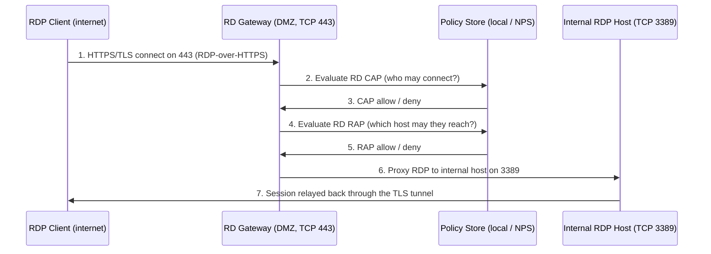

# Remote Desktop Gateway

Remote Desktop Gateway (RD Gateway, historically **TS Gateway**) is a Remote Desktop Services role service that lets authorized remote users reach internal RDP hosts by tunnelling RDP inside **HTTPS**. Instead of exposing TCP 3389 on the internet, clients connect to the gateway on TCP 443; the gateway authenticates them, applies authorization policy, and proxies the RDP session to the correct internal machine.

## Overview

RD Gateway is the RDP equivalent of what [SSTP](SSTP.md) does for VPN traffic: it wraps the RDP protocol in a TLS channel so the connection looks like ordinary web traffic and traverses firewalls, NAT, and web proxies that would block raw 3389. It is a role service of the full **Remote Desktop Services (RDS)** platform, distinct from plain "Remote Desktop for Administration" (see [Remote-Access-and-VPN](Remote-Access-and-VPN.md) for that distinction). A single gateway can front many session hosts and RemoteApp servers, and can enforce per-user, per-resource access rules that raw RDP cannot.

Because the gateway is the single internet-facing entry point, it centralizes authentication, policy, and logging for all inbound RDP — which also makes it a high-value target. Compare it with the alternatives covered elsewhere in this module: full [VPN tunnelling](VPN-Types.md) via [RRAS](RRAS.md), or (for a lab-only quick tunnel) [Ngrok](Ngrok-A-Local-Development-Tool.md).

## How It Works

The gateway terminates the client's TLS connection, authenticates the user, evaluates two authorization policies (CAP and RAP), and only then relays RDP to the internal target.



Transport options:

- **RPC-over-HTTPS / HTTP transport on TCP 443** — the primary, firewall-friendly channel; the RDP stream rides inside TLS.
- **UDP transport on UDP 3391** — an optional performance channel (better handling of graphics/latency over WAN) introduced with Windows Server 2012. It is the transport implicated in the *BlueGate* vulnerabilities (see Security Considerations).

The gateway itself needs a **TLS server certificate** whose subject/SAN matches the external FQDN clients connect to, ideally from a public or enterprise CA the clients already trust.

## Components

The gateway relies on two authorization policy types. Both must pass for a connection to succeed.

| Policy | Question it answers | Typical conditions |
|---|---|---|
| **RD CAP** (Connection Authorization Policy) | *Who* is allowed to connect through the gateway? | User/computer group membership, allowed authentication method (password, smart card), device redirection rules |
| **RD RAP** (Resource Authorization Policy) | *Which internal hosts* may an authorized user reach? | Target computer group (RD Gateway-managed group, AD security group, or "any resource"), allowed ports |

> [!NOTE]
> **CAP and RAP are AND-ed**
> A user must satisfy **both** an RD CAP (permission to use the gateway at all) **and** an RD RAP (permission to reach the specific target host). Passing CAP but no matching RAP means the tunnel authenticates but the connection to the internal host is refused. This two-stage model is what lets one gateway serve different user groups with different reachable resources.

## Configuration

RD Gateway installs as a Remote Desktop Services role service. High-level path (Server Manager GUI): **Add Roles and Features → Remote Desktop Services → Remote Desktop Gateway**, then manage policies in the **RD Gateway Manager** MMC snap-in.

```powershell
# Install the RD Gateway role service and its management tools
Install-WindowsFeature -Name RDS-Gateway -IncludeManagementTools   # untested
```

Bind the TLS certificate and inspect settings via the RDGateway PowerShell provider:

```powershell
# Import the RD Gateway module and browse its configuration provider
Import-Module RemoteDesktopServices
Get-ChildItem RDS:\GatewayServer\GatewayManagedComputerGroups   # untested — provider paths vary by build
```

```powershell
# Point the gateway at a central NPS/RADIUS store instead of local CAP evaluation
# (configured in RD Gateway Manager: Properties > RD CAP Store > "Central server running NPS")
netsh nps show config   # inspect NPS-side policy on the RADIUS server   # untested
```

> [!TIP]
> **Use a central NPS store for scale**
> A standalone gateway keeps its RD CAPs locally. In larger or load-balanced deployments, set the CAP store to a **central NPS (RADIUS) server** so all gateways share one policy set — and so you can attach the **NPS Extension for Azure MFA** to require MFA on RDP without touching each gateway. See the NPS section of [Remote-Access-and-VPN](Remote-Access-and-VPN.md).

## Types

RD Gateway supports two CAP-store models:

- **Local (Windows) store** — the gateway evaluates its own RD CAPs. Simplest; fine for a single gateway.
- **Central store (NPS/RADIUS)** — the gateway forwards connection requests to a central Network Policy Server, which returns the authorization decision. Required for consistent policy across multiple gateways and for MFA integration.

## Security Considerations

> [!WARNING]
> **The gateway is an internet-facing, pre-auth attack surface**
> RD Gateway sits in the DMZ and answers unauthenticated requests by design, so flaws in its protocol handling are directly exploitable from the internet.
> - **BlueGate (CVE-2020-0609 / CVE-2020-0610)** — pre-authentication remote code execution in the RD Gateway **UDP transport (port 3391)**, caused by improper handling of fragmented UDP requests. Patch and, if the UDP channel is not needed, block UDP 3391. These are the canonical RD Gateway RCEs; track current advisories rather than assuming this is the only one.
> - **Credential attacks** — because the gateway centralizes RDP logon, it is a natural target for password spraying/stuffing against 443. Failed authentications should trip account lockout and surface in the logs below.
> - **Weak/mismatched TLS certificate** — a self-signed or wrong-name cert trains users to click through certificate warnings, enabling man-in-the-middle. Use a trusted CA-issued cert.

Defensive value: a correctly deployed gateway **removes direct 3389 exposure**, forces authentication and per-resource authorization before any internal host is touched, and gives one place to log and monitor all inbound RDP. From an offensive perspective, an exposed RD Gateway on 443 is a recognizable RDP entry point worth enumerating (RDWeb/`/remoteDesktopGateway/` endpoints) and, if unpatched, directly exploitable.

## Best Practices

- **Never expose raw RDP (3389) to the internet** — front it with RD Gateway on 443 (or require a VPN first, per [VPN-Types](VPN-Types.md)).
- **Require Network Level Authentication (NLA)** on the backing session hosts and enforce **MFA** at the gateway via the NPS Azure MFA extension.
- **Scope RD RAPs tightly** — grant each user group only the specific host groups it needs, not "any resource"; combine with least-privilege AD groups from [Active-Directory-Domain-Services](../Active-Directory-Domain-Services-AD-DS/Active-Directory-Domain-Services.md).
- **Use a trusted CA certificate** matching the external FQDN, and keep TLS configuration hardened (disable legacy protocols/ciphers).
- **Patch aggressively and centralize policy/logging** — evaluate CAPs against a central [GPO](../Group-Policy-Objects-GPO/Group-Policy(GPO).md)-managed NPS store and ship gateway logs to a SIEM.

## Troubleshooting

| Symptom | Likely cause & fix |
|---|---|
| Client error "logon attempt failed" / certificate warning | TLS cert not trusted by client or name mismatch — install a CA-issued cert whose SAN matches the external FQDN |
| Connects to gateway but "not authorized to connect" | RD **CAP** denies the user — add them to the CAP's user/computer group or fix the required auth method |
| Authorized but cannot reach the target host | No matching RD **RAP** for that computer — add the target to a managed group referenced by an RAP |
| Poor session performance over WAN | UDP transport (3391) blocked or disabled — allow UDP 3391 if the WAN benefits from it (weigh against BlueGate exposure) |
| Central policy not applied | CAP store still set to *Local* — switch to *Central server running NPS* and register the gateway as a RADIUS client |

## References

- [Remote Desktop Services architecture — Microsoft Learn](https://learn.microsoft.com/en-us/windows-server/remote/remote-desktop-services/desktop-hosting-logical-architecture)
- [Deploy RD Gateway (RDS deployment) — Microsoft Learn](https://learn.microsoft.com/en-us/windows-server/remote/remote-desktop-services/remotepc/remote-desktop-services)
- [CVE-2020-0609 — Windows Remote Desktop Gateway RCE (MSRC)](https://msrc.microsoft.com/update-guide/vulnerability/CVE-2020-0609)
- [Remote Desktop Services roles overview — Microsoft Learn](https://learn.microsoft.com/en-us/windows-server/remote/remote-desktop-services/rds-roles)

## Related

- [Enterprise Windows Infrastructure Security](../Readme.md) — course hub
- [SSTP](SSTP.md) — the VPN equivalent: RDP-over-HTTPS vs PPP-over-HTTPS, same TLS/443 traversal story
- [Remote-Access-and-VPN](Remote-Access-and-VPN.md) — module overview, RDS vs admin RDP, and the NPS/RADIUS central store
- [RRAS](RRAS.md) — VPN alternative to a gateway for remote access
- [VPN-Types](VPN-Types.md) — choosing a tunnel protocol when a gateway is not the right fit
- [Remote-Desktop-Access-to-a-Domain-User](Remote-Desktop-Access-to-a-Domain-User.md) — granting a domain user rights to RDP in through the gateway
- [Port-Forwarding](../Proxy-Server-Administration/Port-Forwarding.md) — exposing internal services through NAT; contrast with proper gateway/VPN access
- [Group-Policy(GPO)](../Group-Policy-Objects-GPO/Group-Policy(GPO).md) — centrally enforcing NLA, lockout, and remote-access policy
- [Windows-Event-Logs](../Windows-Operating-System-Administration/Windows-Event-Logs.md) — general Windows logging/detection reference (gateway events log to `Microsoft-Windows-TerminalServices-Gateway/Operational`)
- [Windows-Server](../Windows-Server-Management/Windows-Server.md) — role/feature model RD Gateway installs into
