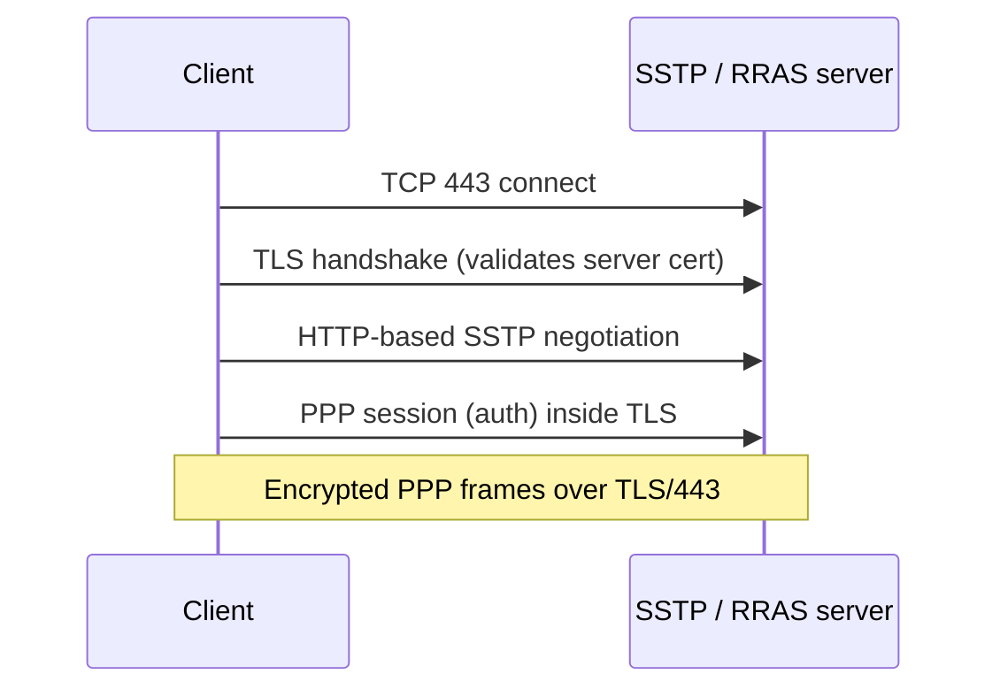

# SSTP

**Secure Socket Tunneling Protocol (SSTP)** is a Microsoft VPN tunnelling protocol that carries PPP traffic inside an SSL/TLS channel over **TCP 443**. Because it looks like ordinary HTTPS, SSTP traverses almost any firewall or web proxy, making it the standard firewall-friendly fallback for Windows remote-access VPNs.

## Overview

SSTP was introduced with Windows Server 2008 / Windows Vista SP1. Its defining trait is that the entire PPP session is encapsulated in a TLS-secured HTTP channel on port 443, so it is very hard to block without breaking general HTTPS.

| Attribute | Value |
|---|---|
| Transport / port | TCP 443 (HTTPS/TLS) |
| Encapsulation | PPP over SSTP over TLS over TCP |
| Encryption | TLS (cipher suite negotiated; AES-based on modern builds) |
| Authentication | PPP auth inside the tunnel (MS-CHAPv2, EAP) + server TLS certificate |
| NAT/firewall traversal | Excellent — indistinguishable from HTTPS |
| Platform support | Windows-centric (native on Windows; limited third-party clients) |

## Architecture



## Configuration

SSTP is served by the [RRAS](RRAS.md) role. The critical requirement is a **valid TLS server certificate** whose subject/SAN matches the public VPN hostname and whose issuing CA the client trusts, with a reachable CRL distribution point.

Server side (RRAS): ensure SSTP ports are enabled (RRAS console → **Ports → Configure**) and bind the machine certificate:

```powershell
# Inspect the certificate SSTP is using / available machine certs
Get-ChildItem Cert:\LocalMachine\My                                # untested
Get-RemoteAccess | Select-Object SslCertificate                    # untested
```

Client side:

```powershell
# Create an SSTP VPN connection (Windows built-in client)
Add-VpnConnection -Name "Corp SSTP" -ServerAddress "vpn.contoso.com" `
    -TunnelType Sstp -EncryptionLevel Required `
    -AuthenticationMethod Eap -RememberCredential                  # untested
```

GUI (client): **Settings → Network & Internet → VPN → Add a VPN connection** → provider "Windows (built-in)" → VPN type **SSTP**.

> [!NOTE]
> **Screenshot**
> 

## Security Considerations

> [!IMPORTANT]
> - SSTP's security rides entirely on the **TLS certificate** — use a certificate from a trusted CA, keep the CRL reachable, and disable weak TLS versions/ciphers on the server.
> - Prefer **EAP-TLS/PEAP** for the inner PPP auth rather than MS-CHAPv2.
> - Because SSTP is Windows-centric, it is best used as the **fallback** to IKEv2 for clients behind restrictive firewalls, not as the sole protocol for a mixed-OS estate.

## Best Practices

- Deploy SSTP alongside IKEv2; clients fall back to SSTP (TCP 443) when UDP 500/4500 is blocked.
- Use a publicly-trusted or internal-CA certificate matching the VPN FQDN.
- Harden the server's TLS configuration (TLS 1.2+, modern cipher suites only).

## Troubleshooting

| Error | Cause | Action |
|---|---|---|
| 0x80092013 (CRL) | Client can't reach the CRL distribution point | Publish/replicate CRL to an internet-reachable location |
| Certificate name mismatch | Cert subject/SAN ≠ VPN hostname | Reissue the cert with the correct FQDN |
| Connects then drops | TLS version/cipher mismatch or proxy interference | Align TLS settings; test direct vs proxied path |

## References

- [SSTP overview — Microsoft Learn](https://learn.microsoft.com/en-us/windows-server/remote/remote-access/vpn/vpn-map-da)
- [Add-VpnConnection — Microsoft Learn](https://learn.microsoft.com/en-us/powershell/module/vpnclient/add-vpnconnection)

## Related

- [Enterprise Windows Infrastructure Security](../Readme.md) — course hub and map of content
- [Remote Access and VPN Configuration](../Readme.md) — module hub — related note
- [Remote-Access-and-VPN](Remote-Access-and-VPN.md) — integrative module overview — related note
- [VPN-Types](VPN-Types.md) — where SSTP fits among tunnel types — related note
- [RRAS](RRAS.md) — the role that terminates SSTP tunnels — related note
- [L2TP-IPsec](L2TP-IPsec.md) — the UDP-based alternative — related note
