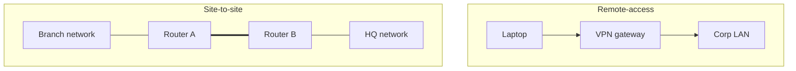

# VPN-Types

A **Virtual Private Network (VPN)** extends a private network across a public network by tunnelling traffic through an encrypted, authenticated channel. This note categorises VPNs by deployment model and by tunnelling protocol, and compares the protocols supported by Windows Server RRAS and common third-party clients.

## Overview

VPNs are classified along two independent axes:

- **Deployment model** — *how* the VPN is used (who connects to whom).
- **Tunnelling protocol** — *how* the tunnel is built and secured on the wire.

Choosing a VPN means picking one of each: e.g. a *remote-access* VPN using the *IKEv2* protocol.

## Concepts

### Deployment models

| Model | Description | Typical use |
|---|---|---|
| **Remote-access VPN** | An individual client device dials in to a VPN gateway and is placed logically on the corporate network | Teleworkers, road warriors, admin access |
| **Site-to-site VPN** | Two gateways (routers/firewalls) build a permanent tunnel joining two whole networks | Branch-office to HQ, datacentre interconnect |
| **Point-to-site (P2S)** | Cloud variant of remote-access; a client connects to a cloud virtual network gateway | Azure/AWS developer access to a VNet |
| **Host-to-host** | A single tunnel between two endpoints for a specific service | Encrypting one server-to-server link |

### Split tunnelling vs full tunnelling

| Mode | Behaviour | Trade-off |
|---|---|---|
| **Full tunnel** | All client traffic (including internet) routes through the VPN | Central inspection/control, higher latency and gateway load |
| **Split tunnel** | Only corporate-subnet traffic goes through the tunnel; internet goes direct | Better performance, but less visibility over client internet traffic |

## Architecture

## Concepts — Tunnelling protocols

The four protocols supported natively by Windows RRAS, plus the two popular third-party protocols:

| Protocol | Transport / Ports | Crypto | NAT / firewall traversal | Verdict |
|---|---|---|---|---|
| **PPTP** | TCP 1723 + GRE (IP 47) | MPPE/RC4 over MS-CHAPv2 | Poor (GRE) | Broken — disable ([RRAS](RRAS.md) legacy only) |
| **L2TP/IPsec** | UDP 500/4500/1701 | IPsec ESP (AES/3DES) | Good (NAT-T) | OK with certificate auth ([L2TP-IPsec](L2TP-IPsec.md)) |
| **SSTP** | TCP 443 (TLS) | PPP inside TLS | Excellent | Strong, firewall-friendly, Windows-centric ([SSTP](SSTP.md)) |
| **IKEv2** | UDP 500/4500 + ESP | IPsec (AES-GCM), MOBIKE | Good (NAT-T) | Preferred modern Windows default |
| **OpenVPN** | UDP/TCP 1194 (configurable) | TLS (OpenSSL) | Excellent (TCP/443 mode) | Cross-platform, third-party ([OpenVPN](OpenVPN.md)) |
| **WireGuard** | UDP (default 51820) | Noise protocol (Curve25519, ChaCha20-Poly1305) | Good | Modern, fast, minimal ([WireGuard](WireGuard.md)) |

> [!TIP]
> **Choosing a protocol**
> For a Windows-first estate, standardise on **IKEv2** with certificate/EAP auth and keep **SSTP** as the fallback where only outbound TCP 443 is permitted. Use **WireGuard** or **OpenVPN** when you need cross-platform clients or a simpler, high-performance tunnel outside the Microsoft stack.

## Security Considerations

- Encryption strength depends on the **negotiated cipher suite**, not just the protocol name — pin modern suites (AES-GCM, ChaCha20-Poly1305) and disable weak ones (3DES, RC4).
- Prefer **certificate/EAP** authentication over shared secrets or passwords.
- **PPTP is cryptographically broken** (MS-CHAPv2 offline crackable); do not deploy it.
- Full-tunnel gives central inspection but concentrates risk at the gateway; split-tunnel reduces load but loses visibility over client internet traffic.

## Best Practices

- Match the deployment model to the need: remote-access for users, site-to-site for network joins.
- Standardise on one or two protocols and disable the rest to shrink the attack surface.
- Enforce MFA on remote-access VPNs.

## References

- [Remote Access overview — Microsoft Learn](https://learn.microsoft.com/en-us/windows-server/remote/remote-access/remote-access)
- [VPN connection types — Microsoft Learn](https://learn.microsoft.com/en-us/windows-server/remote/remote-access/vpn/vpn-map-da)

## Related

- [Enterprise Windows Infrastructure Security](../Readme.md) — course hub and map of content
- [Remote Access and VPN Configuration](../Readme.md) — module hub — related note
- [Remote-Access-and-VPN](Remote-Access-and-VPN.md) — integrative module overview — related note
- [RRAS](RRAS.md) — Windows role that terminates native VPN tunnels — related note
- [SSTP](SSTP.md) — TLS-based tunnel — related note
- [L2TP-IPsec](L2TP-IPsec.md) — L2TP over IPsec tunnel — related note
- [OpenVPN](OpenVPN.md) — third-party TLS VPN — related note
- [WireGuard](WireGuard.md) — modern lightweight VPN — related note
