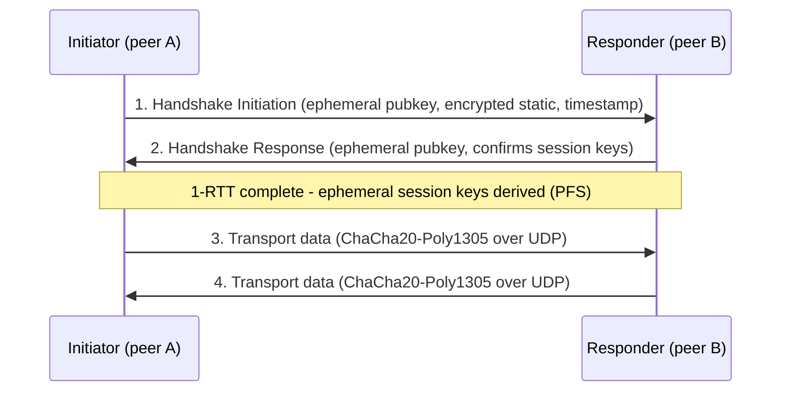

# WireGuard

WireGuard is a modern, open-source VPN protocol and implementation that builds an encrypted layer-3 tunnel over UDP using state-of-the-art cryptography and a deliberately minimal codebase. It aims to be faster, simpler, and easier to audit than IPsec or the classic RRAS tunnel protocols, and it ships in the Linux kernel as well as in cross-platform apps for Windows, macOS, iOS, and Android.

## Overview

Where the Windows-native tunnel protocols in [VPN-Types](VPN-Types.md) (PPTP, L2TP/IPsec, SSTP, IKEv2) rely on RRAS and heavy negotiation, WireGuard takes a different approach: each peer is identified by a **static Curve25519 public key**, and the whole configuration reduces to a short list of peers, their public keys, and the IP ranges each is allowed to use. It is not a drop-in RRAS role — Windows runs it through the standalone **WireGuard for Windows** client rather than through [RRAS](RRAS.md) — but it is increasingly common as a site-to-site and remote-access alternative to [SSTP](SSTP.md) and IKEv2 in the broader [Remote-Access-and-VPN](Remote-Access-and-VPN.md) landscape.

> [!NOTE]
> **Design philosophy**
> WireGuard's whole codebase is a few thousand lines — orders of magnitude smaller than OpenVPN or the kernel IPsec stack. A smaller attack surface means fewer places for bugs and an implementation that is realistically auditable.

## How It Works

WireGuard uses a fixed, opinionated set of primitives (no cipher negotiation — a feature called **cryptographic versioning** rather than agility):

| Purpose | Primitive |
|---|---|
| Key agreement | Curve25519 (ECDH) |
| Symmetric encryption | ChaCha20 |
| Authentication (AEAD) | Poly1305 (as ChaCha20-Poly1305) |
| Hashing | BLAKE2s |
| Handshake framework | Noise protocol framework (1-RTT handshake) |
| Key derivation | HKDF |

Because there is no cipher negotiation, there is no downgrade attack surface — every peer speaks exactly one, current cryptosuite.

### Cryptokey Routing

The central concept is **cryptokey routing**: a peer's public key is bound to a set of `AllowedIPs`. Inbound packets are only accepted if they are cryptographically signed by the peer whose `AllowedIPs` contains the source address; outbound packets are routed to the peer whose `AllowedIPs` contains the destination. This single association replaces separate firewall rules, routing tables, and SA policy.

### Handshake and Sessions

The Noise-based handshake completes in **one round trip (1-RTT)**, establishes fresh ephemeral session keys (giving **perfect forward secrecy**), and then transport data flows as authenticated ChaCha20-Poly1305 datagrams. Sessions are re-keyed periodically so that captured session keys age out quickly.



> [!IMPORTANT]
> **Silent by default**
> WireGuard does not reply to any packet that is not from an authenticated peer. An unauthenticated scanner sees no response at all, which makes a WireGuard endpoint effectively invisible to network scans and greatly reduces its remote attack surface.

### Roaming and NAT Traversal

Because a peer is identified by its key rather than its IP, the `Endpoint` for a peer updates automatically when a valid authenticated packet arrives from a new address — so a client roaming from Wi-Fi to cellular keeps its tunnel. To keep a NAT/firewall mapping alive from behind NAT, set `PersistentKeepalive` (25 seconds is a widely compatible value); `0` (the default) turns it off.

## Configuration

WireGuard has no fixed control port; the conventional default `ListenPort` is **UDP 51820**. A tunnel is defined by an interface config (typically `/etc/wireguard/wg0.conf` on Linux) with one `[Interface]` section and one `[Peer]` block per remote peer.

Generate a keypair (Linux/`wg` tools):

```bash
wg genkey | tee privatekey | wg pubkey > publickey
```

Or in discrete steps with a tight umask:

```bash
umask 077
wg genkey > privatekey
wg pubkey < privatekey > publickey
```

Example server-side `wg0.conf`:

```text
[Interface]
PrivateKey = <server private key>
Address = 10.0.0.1/24
ListenPort = 51820

[Peer]
PublicKey = <client public key>
AllowedIPs = 10.0.0.2/32
Endpoint = client.example.com:51820
PersistentKeepalive = 25
```

Bring the interface up or down and inspect it (`wg-quick` automates address, route, and key setup):

```bash
wg-quick up wg0
wg show
wg-quick down wg0
```

### On Windows

WireGuard for Windows installs a GUI plus a tunnel service driven by the same `.conf` format. A saved tunnel can be installed as an auto-started Windows service:

```powershell
wireguard.exe /installtunnelservice C:\Program Files\WireGuard\Data\Configurations\wg0.conf   # untested
wireguard.exe /uninstalltunnelservice wg0                                                     # untested
```

> [!TIP]
> **Import, don't hand-edit, on Windows**
> The Windows client can generate keys and import a `.conf` file directly from the GUI ("Add Tunnel → Import tunnel(s) from file"). Prefer that over manually driving the service so the app manages the WireGuard NT driver and firewall rules for you.

## Components

| Component | Role |
|---|---|
| `wg` | Low-level CLI to configure interfaces, keys, and peers (`wg show`, `wg set`, `wg genkey`, `wg pubkey`). |
| `wg-quick` | Convenience wrapper that reads a `.conf`, creates the interface, and sets addresses/routes/DNS. |
| `wg0` interface | The virtual layer-3 tunnel network interface. |
| WireGuard for Windows | GUI app + tunnel service and the WireGuard NT kernel driver. |
| `[Interface]` / `[Peer]` | Config sections: local identity/keys vs. each remote peer and its `AllowedIPs`. |

## Security Considerations

> [!WARNING]
> **Offensive and defensive relevance**
> - **Static key theft = tunnel access.** A peer's private key is a plaintext file (or DPAPI-protected on Windows). An attacker who reads a config file (`/etc/wireguard/*.conf`, or the Windows `Data\Configurations` folder) obtains the private key and can impersonate that peer — there is no second factor by default.
> - **No built-in MFA or user identity.** WireGuard authenticates *keys*, not *users*, and has no native RADIUS/NPS or MFA hook. In an enterprise, layer identity/MFA around it (e.g. an orchestration/SSO front-end) rather than relying on the key alone.
> - **`AllowedIPs = 0.0.0.0/0` is full reachability.** An over-broad `AllowedIPs` on a peer grants that peer routing into everything — treat it like a firewall rule and scope it tightly.
> - **Covert/exfil channel.** Its small footprint, UDP transport, and silent-to-scanners behavior also make WireGuard attractive to attackers for stealthy C2 or data exfiltration; defenders should baseline expected UDP 51820 (and other) endpoints and flag rogue tunnels.

Because WireGuard does not respond to unauthenticated traffic, an exposed endpoint is hard to fingerprint — good for defenders running it, and a reason for blue teams to hunt for unsanctioned WireGuard interfaces on hosts rather than relying on port scans.

## Best Practices

- Keep private keys `0600`/least-privilege and never commit `.conf` files to version control; rotate keys if a config leaks.
- Scope every peer's `AllowedIPs` to the minimum needed; avoid blanket `0.0.0.0/0` unless full-tunnel is the intent.
- Front WireGuard with real user identity/MFA (an SSO or orchestration layer) since the protocol itself only authenticates keys.
- Set `PersistentKeepalive = 25` only for peers behind NAT; leave it off otherwise to reduce needless traffic.
- Monitor `wg show` handshake timestamps and hunt for unexpected WireGuard interfaces as part of endpoint auditing.

## Troubleshooting

| Symptom | Likely cause & fix |
|---|---|
| Handshake never completes (`latest handshake` blank in `wg show`) | Wrong peer public key, or UDP `ListenPort` blocked upstream — verify keys and open the UDP port on the firewall/NAT. |
| Tunnel up but no traffic passes | `AllowedIPs` too narrow, or missing route — confirm the destination is inside the peer's `AllowedIPs`. |
| Connection drops after idle behind NAT | NAT mapping expired — set `PersistentKeepalive = 25` on the NAT-side peer. |
| Client roams networks and stalls | Endpoint didn't update — ensure the roaming peer initiates traffic so the responder learns its new address. |
| Both peers behind NAT, no connection | Neither side has a reachable `Endpoint` — give at least one peer a public, port-forwarded endpoint. |

## References

- WireGuard — Official site and protocol overview: https://www.wireguard.com/
- WireGuard — Quick Start (keys, `wg-quick`, config): https://www.wireguard.com/quickstart/
- WireGuard — Protocol & Cryptography: https://www.wireguard.com/protocol/
- WireGuard — Whitepaper (Jason A. Donenfeld): https://www.wireguard.com/papers/wireguard.pdf

## Related

- [Enterprise Windows Infrastructure Security](../Readme.md) — course hub
- [Remote-Access-and-VPN](Remote-Access-and-VPN.md) — remote access and VPN concepts
- [VPN-Types](VPN-Types.md) — the classic RRAS tunnel protocols WireGuard is an alternative to
- [RRAS](RRAS.md) — Windows Routing and Remote Access Service
- [SSTP](SSTP.md) — TLS-based Windows VPN tunnel protocol
