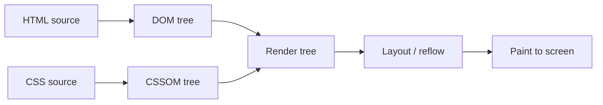

# HTML and CSS

HTML (HyperText Markup Language) and CSS (Cascading Style Sheets) are the foundational technologies used to create and design web pages. HTML provides the structure and content of a page, while CSS controls its styling and layout.

## Overview

HTML and CSS are the two front-end building blocks a browser needs to render every page delivered by a web server. **HTML** defines the *structure* of a page — headings, paragraphs, links, images, forms, and media — using nested elements (tags). **CSS** defines the *presentation* of that structure — colors, fonts, spacing, and responsive layout — by attaching style rules to those elements.

Together they form the client-side output of the [SDLC](Software-Development-Life-Cycle(SDLC)-and-Related-IT-Roles.md): a developer builds a [Website](Website.md) from HTML/CSS (and usually JavaScript), and a web server such as [Internet-Information-Services(IIS)](../Web-Server-IIS/Internet-Information-Services(IIS).md) delivers it to the browser. For an attacker or defender, this rendered markup is also the client-side attack surface examined during a Web-Application-Penetration-Test.

## How It Works

A browser does not display HTML and CSS directly — it parses each into an in-memory model and combines them before painting pixels:

- **HTML** is parsed into the **DOM** (Document Object Model), a tree of elements.
- **CSS** is parsed into the **CSSOM** (CSS Object Model), a tree of style rules.
- The two are combined into a **render tree**, which is laid out (geometry) and then painted to the screen.



Because the browser downloads the raw HTML and CSS before rendering, everything in the source — including comments and inline styles — is fully visible to the client. This is what makes **View Source** (`Ctrl+U`) and the browser developer tools such a useful starting point during web reconnaissance.

## Structure and Styling

### HTML Elements

HTML content is written as nested **elements** delimited by tags. A minimal, well-formed document declares its type, a `<head>` for metadata, and a `<body>` for visible content.

```html
<!DOCTYPE html>
<html>
  <head>
    <title>My Web Page</title>
  </head>
  <body>
    <h1>Welcome to My Page</h1>
    <p>This page is an example of HTML and CSS basics.</p>
  </body>
</html>
```

### Applying CSS

CSS rules target elements with **selectors** and set **properties**. Styles can be applied inline (`style="..."`), in a `<style>` block, or — preferred for maintainability — in an external stylesheet linked from the `<head>`.

```css
body {
  background-color: #f0f0f0; /* Set a light background color */
  font-family: Arial, sans-serif;
}
```

## Comments

Both languages support comments — notes in the source that document intent. Crucially, they are stripped only from the *rendered* output, not from the source the client receives.

### HTML Comments

HTML comments leave notes or instructions in the code that are not shown on the rendered page but remain in the page source. They help developers understand why a section of code was written.

```html
<!-- This is a comment -->
```

### CSS Comments

CSS comments document styling rules and are ignored by the browser at render time.

```css
/* This is a CSS comment */
```

> [!IMPORTANT]
> **Comments are visible to the client**
> HTML and CSS comments are **not** rendered on the page, but they are delivered verbatim in the source and are trivially readable via **View Source** or developer tools. Never leave credentials, internal URLs, TODO notes, hidden endpoints, or debugging hints in comments on a production site — they are a common information-disclosure finding.

## Security Considerations

HTML/CSS is the client-side attack surface. It is untrusted from the server's perspective and inspectable from the attacker's perspective.

> [!WARNING]
> **Client-side markup is an attack surface**
> - **Information disclosure via comments/source** — developer comments, hidden form fields, and commented-out code often leak internal paths, framework versions, or credentials. Source review is standard early recon in a Web-Application-Penetration-Test.
> - **HTML injection / Cross-Site-Scripting(XSS)** — when user input is reflected into HTML without proper output encoding, an attacker can inject markup or script that executes in other users' browsers.
> - **Clickjacking** — CSS can layer a transparent, attacker-controlled frame over a legitimate UI so victims click hidden elements; mitigate with `X-Frame-Options` / `Content-Security-Policy: frame-ancestors`.
> - **CSS data exfiltration** — attribute selectors combined with `background: url(...)` can leak page content (e.g., CSRF tokens) even without JavaScript.

Defensive fundamentals: encode/escape all user-supplied data before placing it in HTML, set a restrictive **Content-Security-Policy**, and never ship comments or hidden fields containing sensitive data.

## Best Practices

> [!TIP]
> **Tips for beginners**
> - Use semantic tags like `<header>`, `<main>`, `<footer>`, and `<section>` for cleaner code and better accessibility.
> - Keep HTML and CSS in separate files for larger projects.
> - Validate your HTML with tools like the [W3C Markup Validation Service](https://validator.w3.org/).
> - Start with mobile-first design principles when writing CSS.
> - Use comments to document structure and logic — but keep them free of sensitive data.

## Troubleshooting

| Symptom | Likely cause & fix |
| --- | --- |
| Page renders but styling is missing | Broken `<link>` path to the stylesheet, or the server's static-content handler is not serving `.css` — check the relative path and web-server config. |
| Styles apply locally but not when hosted | Wrong document root or case-sensitive path mismatch (Linux hosts are case-sensitive); verify file names and [Hosting](Hosting.md) paths. |
| Layout breaks on mobile | Missing `<meta name="viewport">` tag or fixed pixel widths instead of responsive units. |
| Sensitive data visible in the page | Comments or hidden fields left in the source — remove them and review before publishing. |

## References

- [MDN Web Docs — HTML: HyperText Markup Language](https://developer.mozilla.org/en-US/docs/Web/HTML) — authoritative HTML element and attribute reference.
- [MDN Web Docs — CSS: Cascading Style Sheets](https://developer.mozilla.org/en-US/docs/Web/CSS) — authoritative CSS property and selector reference.
- [W3C HTML Standard](https://html.spec.whatwg.org/) — the living HTML specification (WHATWG).
- [W3Schools HTML Tutorial](https://www.w3schools.com/html/default.asp) — beginner-friendly tutorials covering elements, attributes, forms, and media.

## Related

- [Enterprise Windows Infrastructure Security](../Readme.md) — course hub and map of content
- [Website](Website.md) — pages built from HTML and CSS
- [Hosting](Hosting.md) — how a finished site is served to clients
- [Software-Development-Life-Cycle(SDLC)-and-Related-IT-Roles](Software-Development-Life-Cycle(SDLC)-and-Related-IT-Roles.md) — where front-end development fits
- [Internet-Information-Services(IIS)](../Web-Server-IIS/Internet-Information-Services(IIS).md) — server that delivers the HTML/CSS
- Web-Application-Penetration-Test — client-side attack surface (HTML/CSS/JS)
- Cross-Site-Scripting(XSS) — injection into HTML output
