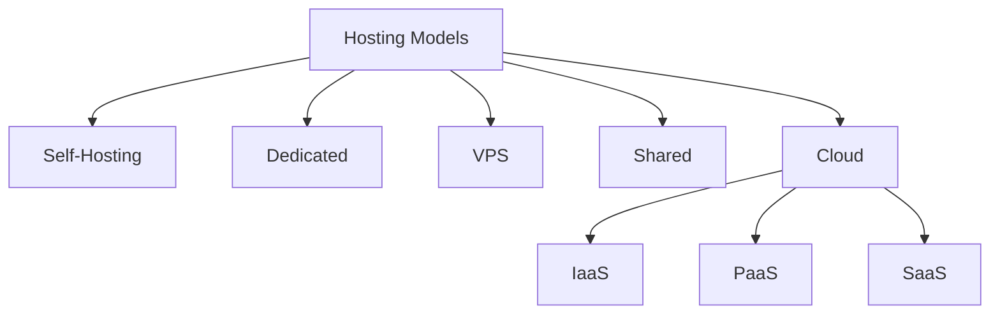

# Hosting

Hosting enables a website, application, or service to be accessible online by providing server space, connectivity, and management. The type of hosting you choose impacts performance, scalability, security, and cost.

## Overview

Hosting models range from running your own hardware (self-hosting) to fully managed, elastically-scaled cloud platforms. Each model trades off control, cost, scalability, performance, security, and complexity differently.

## Concepts

### 1. Self-Hosting

Self-hosting means running your own infrastructure using personal or company-owned hardware.

**Key Components:**

- Hardware: dedicated server, desktop workstation, rack-mounted server, NAS (Network Attached Storage)
- Software:
  - Operating System: Linux, Windows Server
  - Web Servers: Apache, Nginx, IIS
  - Databases: MySQL, PostgreSQL, MariaDB, MongoDB
- Network Requirements: reliable internet connection, static public IP address, port forwarding, DNS configuration
- Security: firewalls, Intrusion Detection Systems (IDS), SSL/TLS certificates, regular updates and patching
- Maintenance: monitoring, backups, hardware replacement, troubleshooting

**Common Self-Hosting Use Cases:** personal cloud storage, media streaming servers, game servers, development labs, home automation, private VPN servers, internal business applications

**Advantages:** maximum control over infrastructure, full data ownership and privacy, highly customizable environment, no vendor lock-in, excellent learning experience

**Disadvantages:** requires advanced technical knowledge, hardware and electricity costs, downtime risks from power/internet failures, scalability limitations, security responsibility falls entirely on the owner

**Popular Self-Hosted Services:**

| Category | Software |
| :-- | :-- |
| File Hosting | Nextcloud, OwnCloud |
| Media Servers | Plex, Jellyfin |
| Virtualization | Proxmox, VMware ESXi |
| Containerization | Docker, Kubernetes |
| Monitoring | Zabbix, Grafana |
| Reverse Proxy | Nginx Proxy Manager, Traefik |

### 2. Dedicated Hosting

Dedicated hosting provides an entire physical server exclusively for one customer.

**Features:** dedicated CPU, RAM, and storage; full administrative access; better security isolation; predictable performance; custom operating system installation

| Type | Description |
| :-- | :-- |
| Managed Dedicated | Provider handles maintenance, updates, backups, and monitoring |
| Unmanaged Dedicated | Customer manages everything |

**Advantages:** high performance, excellent for heavy workloads, full control over server configuration, better security isolation, suitable for enterprise applications

**Disadvantages:** expensive, hardware scalability limitations, requires server administration knowledge, maintenance complexity in unmanaged setups

**Common Use Cases:** enterprise applications, large databases, high-traffic websites, game hosting, virtualization hosts, streaming platforms

### 3. Virtual Private Server (VPS) Hosting

A VPS uses virtualization technology to divide a physical server into multiple isolated virtual machines.

| Technology | Description |
| :-- | :-- |
| KVM | Full virtualization, high isolation |
| VMware | Enterprise-grade virtualization |
| Hyper-V | Microsoft virtualization platform |
| OpenVZ | Container-based virtualization |
| Xen | High-performance virtualization |

**Features:** dedicated virtual resources, root or administrator access, custom operating system support, snapshot and backup support, resource scalability

| Type | Responsibility |
| :-- | :-- |
| Managed VPS | Provider handles maintenance and monitoring |
| Unmanaged VPS | User manages everything |

**Advantages:** more affordable than dedicated hosting, better isolation than shared hosting, flexible scaling, good balance of cost and performance, suitable for developers and businesses

**Disadvantages:** shared physical hardware, performance depends on host node quality, requires administration skills in unmanaged plans

**Common Use Cases:** web hosting, development environments, VPN servers, mail servers, small business infrastructure, application hosting

### 4. Shared Hosting

Shared hosting places multiple websites on the same server and shares resources among them.

**Features:** lowest-cost hosting option, beginner-friendly, includes graphical control panels, minimal technical knowledge required, one-click installers for CMS platforms

| Control Panel | Platform |
| :-- | :-- |
| cPanel | Linux |
| Plesk | Linux/Windows |
| DirectAdmin | Linux |
| Webmin | Linux |

**Advantages:** very affordable, easy setup, provider manages infrastructure, good for small websites

**Disadvantages:** limited customization, shared resources reduce performance, higher security risks from neighboring accounts, limited scalability

**Best For:** personal blogs, portfolio websites, small business websites, beginners learning web hosting

### 5. Cloud Hosting

Cloud hosting uses distributed infrastructure across multiple interconnected servers.

**Core Concepts:**

- **Virtualization:** Cloud providers create virtual resources from massive physical infrastructure pools.
- **Redundancy:** Multiple servers ensure services remain available even if hardware fails.
- **Elastic Scalability:** Resources can scale automatically depending on demand.

| Model | Description |
| :-- | :-- |
| IaaS | Infrastructure as a Service |
| PaaS | Platform as a Service |
| SaaS | Software as a Service |

| Type | Description |
| :-- | :-- |
| Public Cloud | Shared infrastructure provided publicly |
| Private Cloud | Dedicated cloud for one organization |
| Hybrid Cloud | Combination of public and private cloud |
| Multi-Cloud | Multiple cloud providers |

**Features:** high availability, auto-scaling, geographic redundancy, usage-based billing, API-driven infrastructure, managed services

**Advantages:** extremely scalable, high uptime, flexible pricing, rapid deployment, global infrastructure

**Disadvantages:** costs can become unpredictable, vendor lock-in risks, requires cloud architecture knowledge, internet dependency

**Common Use Cases:** SaaS applications, enterprise infrastructure, AI/ML workloads, disaster recovery, microservices, container orchestration

### Cloud Self-Hosting Software

These tools help build private cloud environments on personal or enterprise hardware.

| Software | Use Case | Key Features |
| :-- | :-- | :-- |
| Nextcloud | File sync/collaboration | Encryption, plugins, online office tools |
| OwnCloud | File syncing/sharing | User management, external storage |
| Seafile | Fast file syncing | Lightweight, encrypted libraries |
| OpenStack | Private cloud infrastructure | Compute, storage, networking |
| Pydio Cells | Enterprise collaboration | Compliance, auditing |
| Syncthing | Decentralized file sync | Peer-to-peer encryption |
| Proxmox VE | Virtualization platform | Containers and VM management |
| TrueNAS | Storage hosting | ZFS, snapshots, NAS functionality |

## Hosting Comparison Table

| Hosting Type | Control | Maintenance | Scalability | Cost | Best For |
| :-- | :-- | :-- | :-- | :-- | :-- |
| Self-Hosting | Maximum | You | Difficult/Manual | Upfront | Privacy, labs, enthusiasts |
| Dedicated | High | You/Provider | Hardware-limited | High | Enterprises |
| VPS | High | You/Provider | Easy | Moderate | Developers, SMBs |
| Shared | Low | Provider | Limited | Low | Beginners |
| Cloud | Variable | Provider | Instant/Flexible | Usage-based | Modern scalable applications |

## Architecture

### Reverse Proxy

A reverse proxy sits between users and backend services.

- **Common Reverse Proxies:** Nginx, HAProxy, Traefik, Caddy
- **Benefits:** SSL termination, load balancing, caching, security filtering, centralized routing

### Load Balancing

Distributes traffic across multiple servers.

| Algorithm | Description |
| :-- | :-- |
| Round Robin | Requests distributed sequentially |
| Least Connections | Sends traffic to least busy server |
| IP Hash | Routes based on client IP |

### Containers and Modern Hosting

- **Docker** packages applications into portable containers.
  - **Benefits:** lightweight, fast deployment, environment consistency, easy scaling
- **Kubernetes** is a container orchestration platform for large-scale deployments.
  - **Features:** auto-scaling, self-healing containers, rolling updates, service discovery

## Security Considerations

> [!WARNING]
> **Important Security Practices**
> - Use strong passwords and MFA
> - Keep systems updated
> - Configure firewalls properly
> - Use HTTPS everywhere
> - Perform regular backups
> - Monitor logs and intrusion attempts
> - Limit exposed services
> - Use fail2ban or IDS/IPS solutions

**Common Hosting Threats:**

| Threat | Description |
| :-- | :-- |
| DDoS | Traffic flooding attacks |
| Ransomware | Data encryption/extortion |
| Misconfiguration | Incorrect security settings |
| Data Breaches | Unauthorized access |
| Privilege Escalation | Unauthorized admin access |

## Best Practices

### Backup Strategies

| Type | Description |
| :-- | :-- |
| Full Backup | Entire system backup |
| Incremental Backup | Only changed files |
| Differential Backup | Changes since last full backup |

> [!TIP]
> **Backup best practices**
> - Follow the 3-2-1 backup rule
> - Test restoration regularly
> - Encrypt backups
> - Store offsite copies

### Choosing the Right Hosting

- **Choose Self-Hosting if:** you want maximum privacy and control; you enjoy managing infrastructure; you need custom environments; you are building a home lab.
- **Choose Dedicated Hosting if:** you require maximum performance; you handle high traffic or sensitive workloads; you need hardware-level control.
- **Choose VPS Hosting if:** you need flexibility and scalability; you want root access at moderate cost; you are deploying custom applications.
- **Choose Shared Hosting if:** you are a beginner; you have a small website; budget is your primary concern.
- **Choose Cloud Hosting if:** you require high availability; your workloads scale dynamically; you need rapid deployment and automation; you are building modern distributed applications.

## Summary

Hosting determines how your applications and services are delivered online. Each hosting model offers different trade-offs between control, cost, scalability, performance, security, and complexity.

The right choice depends on budget, technical expertise, expected traffic, security requirements, and future growth plans. Modern environments often combine multiple hosting approaches, such as hybrid cloud infrastructure, VPS-based deployments, and self-hosted internal services.

## Related

- [Enterprise Windows Infrastructure Security](../Readme.md) — course hub and map of content
- [Website](Website.md) — the content being hosted
- [Internet-Information-Services(IIS)](../Web-Server-IIS/Internet-Information-Services(IIS).md) — Windows web server used for hosting
- [Types-of-Site-Binding-in-IIS](../Web-Server-IIS/Types-of-Site-Binding-in-IIS.md) — bindings that map hosts to sites
- Web-Enumeration — enumerating hosted sites and virtual hosts
