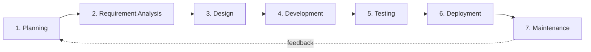

# Software Development Life Cycle (SDLC) and Related IT Roles

The Software Development Life Cycle (SDLC) is a structured, repeatable process used for the systematic development of high-quality software. Modern IT workflows integrate security at every stage (SSDLC), automation through DevOps, and Artificial Intelligence (AI) to improve productivity, decision-making, security, and software quality.

AI is now deeply integrated into software engineering, cybersecurity, cloud operations, testing, and infrastructure management.

## Overview

The SDLC turns an idea into a running application — commonly a [Website](Website.md) built with [HTML-and-CSS](HTML-and-CSS.md), released through [Hosting](Hosting.md), and validated by application penetration testing before and after go-live. Understanding the pipeline clarifies where security fits and why the web-server and IIS modules exist.

Artificial Intelligence enhances nearly every phase of the SDLC by automating repetitive tasks, improving accuracy, and accelerating development cycles.

> [!NOTE]
> **Benefits of AI in SDLC**
> - Faster software development
> - Automated code generation
> - Intelligent bug detection
> - Predictive analytics
> - Automated testing
> - AI-assisted security analysis
> - Infrastructure automation
> - Improved user experience personalization
> - Reduced operational costs

## Architecture

The SDLC is a sequential-with-feedback lifecycle. Each phase feeds the next, and maintenance loops learnings back into planning.

## Concepts

### SDLC Phases with AI Integration

#### 1. Planning

- Define objectives, feasibility, resources, timeline, and budget.
- AI assists with:
  - Project estimation
  - Risk prediction
  - Requirement forecasting
  - Resource allocation analysis

**AI Tools:** ChatGPT, Jira AI, Notion AI, Microsoft Copilot

#### 2. Requirement Analysis

- Gather user needs, document specifications, and validate with stakeholders.
- AI assists with:
  - Requirement summarization
  - Automated documentation
  - User behavior analysis
  - NLP-based requirement extraction

**AI Technologies:** Natural Language Processing (NLP), AI chatbots, Requirement intelligence systems

#### 3. Design

- Create architecture, data flows, UI/UX mockups, databases, APIs, and select tech stack.
- AI assists with:
  - UI/UX generation
  - Design recommendations
  - Architecture optimization
  - AI-generated wireframes

**AI Design Tools:** Figma AI, Adobe Firefly, Uizard, Canva AI

#### 4. Development

- Write code based on specifications; follow best software engineering practices.
- AI assists with:
  - Code generation
  - Auto-completion
  - Refactoring
  - Documentation generation
  - Secure coding suggestions

**AI Coding Tools:** GitHub Copilot, ChatGPT, Amazon CodeWhisperer, Tabnine

#### 5. Testing

- Perform unit, integration, and system testing; fix bugs and optimize performance.
- AI assists with:
  - Automated test generation
  - Intelligent bug detection
  - Predictive failure analysis
  - Regression optimization
  - AI-based fuzzing

**AI Testing Tools:** Testim, Applitools, Selenium AI, Mabl

#### 6. Deployment

- Release software to production; configure for reliability and scalability.
- AI assists with:
  - Predictive deployment analysis
  - Automated rollback decisions
  - Infrastructure optimization
  - Smart CI/CD pipelines

**AI + DevOps:** AIOps, Kubernetes AI monitoring, AI-driven CI/CD automation

#### 7. Maintenance

- Ongoing support, updates, patches, and enhancements.
- AI assists with:
  - Log analysis
  - Threat detection
  - Predictive maintenance
  - Chatbot support systems
  - Automated incident response

**AI Monitoring Tools:** Splunk AI, Dynatrace, Datadog AI, New Relic AI

### SDLC Models

| Model | Approach | Best For |
| :-- | :-- | :-- |
| Waterfall | Linear/sequential | Simple, well-defined projects |
| Agile | Iterative, flexible, frequent feedback | Projects needing adaptability and collaboration |
| Spiral | Iterative + risk analysis | High-risk, complex projects |
| V-Model | Testing and development in parallel | Projects with strong QA requirements |
| DevOps | Integrates development and operations | Rapid, continuous deployment pipelines |
| AI-Driven SDLC | AI-assisted automation across lifecycle | Large-scale modern intelligent systems |

## Related IT Roles

### Web Designer

Designs the visual layout and user experience of websites.

- **Key Responsibilities:** UI design (colors, typography, graphics); UX design (usability, navigation, research); responsive layouts (desktop/mobile); wireframing/prototyping; branding and visual consistency; collaboration with developers; AI-assisted design generation
- **Tools & Technologies:** HTML, CSS, JavaScript; Figma, Adobe XD, Photoshop; Bootstrap, Tailwind CSS; Canva AI; Adobe Firefly; Uizard AI
- **Skills:** UI/UX principles; responsive design; wireframing; creativity + AI-assisted design workflows

### Web Developer

Builds and maintains the functionality and structure of websites/web applications.

- **Specializations:** Front-End; Back-End; Full-Stack; Database Management; AI-Integrated Application Development
- **Responsibilities:** Convert UI designs to code; API integration; debugging and optimization; AI API integration (OpenAI, Gemini, Claude); deployment and scaling
- **AI Development Areas:** AI chatbots; recommendation systems; computer vision apps; NLP systems; generative AI applications
- **Skills:** Front/back-end coding; APIs and databases; AI framework integration; cloud deployment

| Feature | Web Developer | Web Designer |
| :-- | :-- | :-- |
| Focus | Functionality, Backend | Visual, UI/UX |
| Tools | VS Code, GitHub, AWS | Figma, Photoshop |
| Languages | PHP, JS, Python, Java | HTML, CSS, JS |
| AI Usage | AI APIs, automation | AI-assisted design |

### AI Engineer

Designs, trains, deploys, and maintains AI/ML systems.

- **Responsibilities:** Build machine learning models; train neural networks; deploy AI systems; fine-tune LLMs; data preprocessing; AI model optimization; AI security validation
- **Tools & Frameworks:** Python; TensorFlow; PyTorch; Scikit-learn; Hugging Face; LangChain; Docker/Kubernetes
- **Skills:** Machine Learning; Deep Learning; NLP; Data Science; Python programming; model deployment

| Feature | AI Engineer | Software Developer |
| :-- | :-- | :-- |
| Focus | AI/ML systems | Traditional applications |
| Core Skills | ML, data, neural networks | Software engineering |
| Tools | TensorFlow, PyTorch | VS Code, Git |
| Output | Intelligent systems | Business applications |

### Software Tester

Ensures software reliability, security, and quality before release.

- **Key Tasks:** Analyze requirements; design test plans/cases; manual and automated testing; AI-assisted testing; bug tracking; security testing
- **AI in Testing:** AI-generated test cases; automated UI validation; smart regression testing; predictive bug analysis
- **Tools:** Selenium; Cypress; JUnit; Testim AI; Applitools

| Feature | Tester | Developer |
| :-- | :-- | :-- |
| Focus | QA, bug identification | Coding, feature development |
| Tools | Selenium, JMeter | VS Code, GitHub |
| AI Usage | Automated testing | AI-assisted coding |

### Server Administrator

Sets up, configures, and secures servers in IT infrastructure.

- **Responsibilities:** OS management; server configuration; security hardening; backup and disaster recovery; AI-assisted monitoring; infrastructure automation
- **AI in Server Administration:** Predictive resource scaling; automated alert analysis; AI-powered monitoring; smart log analysis; infrastructure anomaly detection
- **Tools:** AWS, Azure, GCP; Docker, Kubernetes; Ansible, Puppet; Splunk AI; Nagios; Datadog AI

| Feature | Server Admin | Network Admin |
| :-- | :-- | :-- |
| Focus | Servers, applications | Networks, routing |
| Tools | AWS, VMware | Cisco, Firewalls |
| AI Usage | Monitoring automation | Traffic analysis |

### Penetration Tester

Ethically hacks systems to uncover vulnerabilities.

- **Responsibilities:** Reconnaissance; vulnerability scanning; exploitation; reporting; AI-assisted attack simulation
- **AI in Pen Testing:** Automated recon; intelligent vulnerability prioritization; AI-generated exploit suggestions; malware behavior analysis
- **Tools:** Nmap; Metasploit; Burp Suite; Wireshark; AI-assisted scanners

| Feature | Penetration Tester | Security Engineer |
| :-- | :-- | :-- |
| Focus | Offensive security | Defensive security |
| Tools | Metasploit, Burp Suite | SIEM, IDS/IPS |
| AI Usage | AI recon & scanning | AI monitoring |

### Security Engineer

> [!NOTE]
> **Designs and implements security to protect IT assets (defensive counterpart to the penetration tester).**

- **Responsibilities:** Security architecture; incident response; threat monitoring; cloud security; AI-based defense systems
- **AI Security Areas:** Behavioral analytics; threat intelligence; SOAR automation; AI-driven SOC operations

### Emerging AI-Driven IT Roles

| Role | Focus |
| :-- | :-- |
| AI Engineer | AI/ML systems |
| Prompt Engineer | Optimizing AI prompts |
| MLOps Engineer | ML deployment pipelines |
| AI Security Analyst | AI system protection |
| Data Scientist | Data analytics & prediction |
| AI Researcher | Advanced AI models |
| AIOps Engineer | AI-driven IT operations |

## Security Considerations

> [!WARNING]
> **Security is a lifecycle property, not a final gate**
> Flaws introduced early — in design, or pulled in through third-party dependencies — are cheapest to fix early and most expensive (and dangerous) in production. From an offensive standpoint, insecure defaults, hard-coded secrets, and unpatched dependencies introduced anywhere in the lifecycle become the attacker's entry points, which is precisely why security must be woven into every phase (SSDLC) rather than bolted on at the end.

### Secure Software Development Life Cycle (SSDLC)

> [!IMPORTANT]
> **SSDLC integrates security from requirements through maintenance, rather than bolting it on after development.**

- Security Practices:
  - Threat modeling
  - Secure coding
  - SAST/DAST
  - Pen Testing
  - DevSecOps
  - AI-based threat detection
- Benefits:
  - Early vulnerability detection
  - Compliance
  - Reduced breaches
  - Faster incident response
  - Continuous monitoring

| Feature | SDLC | SSDLC |
| :-- | :-- | :-- |
| Focus | Functionality | Functionality + Security |
| Security | Post-development | Throughout lifecycle |
| Tools | CI/CD, GitHub | SAST, DAST, SIEM, IDS/IPS |
| AI Usage | Optional | AI-driven threat analysis |

### AI in Cybersecurity & DevSecOps

AI is transforming cybersecurity operations by enabling:

- Automated threat detection
- Malware classification
- Behavioral analytics
- AI-powered SOC monitoring
- Automated incident response
- Vulnerability prioritization
- AI phishing detection
- Cloud anomaly detection

**AI Security Tools:** Microsoft Security Copilot, Darktrace, CrowdStrike AI, Splunk AI, SentinelOne

## Best Practices

- Build security into every SDLC phase (secure design, code review, SAST/DAST, testing) rather than bolting it on at the end.
- Separate development, staging, and production environments, and keep configuration in version control for repeatability.
- Track third-party dependencies for known vulnerabilities across the whole lifecycle (SCA/SBOM).
- Validate requirements with stakeholders early and iterate — catching drift in analysis is far cheaper than reworking production code.
- Treat the hosting server as part of the application's trust boundary and harden defaults before publishing.

### Career Paths

- **Development:** Front-End Developer, Back-End Developer, Full-Stack Developer, AI Developer, Mobile App Developer, Cloud Developer
- **Security:** Pen Tester, Security Engineer, DevSecOps Engineer, SOC Analyst, Cloud Security Engineer
- **AI & Data:** AI Engineer, ML Engineer, Data Scientist, NLP Engineer, Computer Vision Engineer, MLOps Engineer

### Summary Table: Major Roles & Focus

| Role | Main Focus | Must-Have Skills | Key Tools | Example Tasks |
| :-- | :-- | :-- | :-- | :-- |
| Web Designer | UX/UI, visual design | HTML, CSS, Figma | Figma, Photoshop | Layouts, branding |
| Web Developer | Functionality, coding | JavaScript, APIs | VS Code, GitHub | Coding, deployment |
| Software Tester | QA, automation | Testing frameworks | Selenium, JUnit | Test plans, bug reports |
| Server Admin | Infrastructure management | Linux, scripting | AWS, Nagios | Server setup, monitoring |
| Pen Tester | Offensive security | Networking, exploitation | Metasploit, Burp Suite | Security testing |
| Security Engineer | Defense & monitoring | Security frameworks | SIEM, firewalls | Hardening, incident response |
| AI Engineer | AI/ML systems | Python, ML, NLP | TensorFlow, PyTorch | Model development |
| MLOps Engineer | AI deployment | CI/CD, Kubernetes | Docker, MLflow | Model deployment |
| Prompt Engineer | AI interaction | NLP, prompt design | ChatGPT, Claude | AI optimization |

> [!TIP]
> **The SDLC and SSDLC frameworks underpin modern software engineering and cybersecurity, providing structure and proactive risk management. Modern IT professionals increasingly combine traditional technical skills with AI-assisted workflows to build intelligent, secure, scalable, and automated systems. Organizations adopting AI-driven SDLC practices gain faster delivery cycles, improved security posture, enhanced productivity, and better decision-making.**

## Troubleshooting

| Symptom | Likely cause & fix |
| :-- | :-- |
| Security bugs surface only in production | Security bolted on at the end — shift left with threat modeling and SAST/DAST in the CI pipeline |
| The same vulnerable dependency keeps reappearing | No dependency/SBOM tracking — add software composition analysis (SCA) across the lifecycle |
| Constant requirement drift and rework | Weak requirement analysis — validate with stakeholders early and iterate (Agile) |
| Deployments frequently need rollback | Missing staging/testing gates — enforce CI/CD quality gates before production release |

## References

- [Microsoft Security Development Lifecycle (SDL)](https://www.microsoft.com/en-us/securityengineering/sdl)
- [OWASP — Secure Software Development Life Cycle](https://owasp.org/www-project-integration-standards/writeups/owasp_in_sdlc/)
- [NIST Secure Software Development Framework (SSDF, SP 800-218)](https://csrc.nist.gov/pubs/sp/800/218/final)

## Related

- [Enterprise Windows Infrastructure Security](../Readme.md) — course hub and map of content
- [HTML-and-CSS](HTML-and-CSS.md) — front-end skills used in the build phase
- [Website](Website.md) — typical deliverable of the SDLC
- [Hosting](Hosting.md) — deployment/hosting stage of the lifecycle
- [Internet-Information-Services(IIS)](../Web-Server-IIS/Internet-Information-Services(IIS).md) — Windows web server used at the hosting stage
- Web-Application-Penetration-Test — security testing within the SDLC
