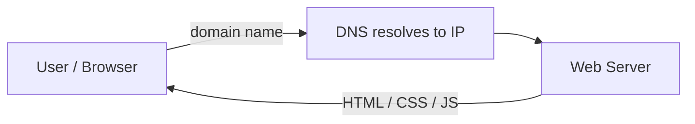

# Website

A **website** is a collection of related digital pages, typically identified by a common domain name (such as `example.com`), and published on at least one web server accessible through the internet or a private network. Websites serve numerous purposes — including information sharing, communication, shopping, entertainment, and business — and are a primary means of creating an online presence for individuals and organizations.

To access a website, users type its domain name into a web browser on a device connected to the internet, which retrieves and displays the website's pages. A website generally begins with a "homepage", serving as the main entry point, and includes links to additional pages for navigation.

## Overview

A website is the visible surface of the development pipeline described in [Software-Development-Life-Cycle(SDLC)-and-Related-IT-Roles](Software-Development-Life-Cycle(SDLC)-and-Related-IT-Roles.md): source files authored during development, served to browsers by a web server as covered in [Hosting](Hosting.md). The browser requests a page by domain name, the name resolves to a server IP address, and the server returns the page's content — HTML for structure, CSS for styling, and JavaScript for interactivity (see [HTML-and-CSS](HTML-and-CSS.md)).

> [!NOTE]
> **Why websites matter**
> Websites are essential for establishing credibility, reaching audiences, enabling transactions, and disseminating information in the modern digital age. From a security standpoint, a website is also the most exposed part of most organizations — the first thing an attacker sees and probes.

## Components

Key components of a website include:

- **Web Pages** — individual documents (written in HTML/CSS) within the website, such as "About", "Contact", etc.
- **Hyperlinks** — clickable links connecting different pages or external resources.
- **Domain Name** — the unique address used to find the site (e.g., `www.example.com`).
- **Web Server** — the computer where the site's files are stored and transmitted from.

## Types of Websites

Websites fall into two broad architectural categories based on how their content is produced.

- **Static Websites** — these show the *same content* to every visitor. The content is coded directly into each page as HTML, sometimes with minimal CSS or JavaScript. Updates must be made manually by editing the files. Static sites load quickly, tend to be more secure, and are simpler to develop, making them a popular choice for informational, brochure, or simple portfolio sites.
- **Dynamic Websites** — these serve *personalized or frequently changing content*. The pages are generated in real time, often using server-side technologies (like PHP, Python, Node.js, or database queries). Content can change based on user actions, login state, search queries, or external data feeds. Most major modern sites — e-commerce stores, social networks, news portals — are dynamic, as they need to manage user accounts, comments, shopping carts, or blog posts without manual code changes.

In summary:

- **Static** — same for everyone, changed by the developer.
- **Dynamic** — content updates automatically or based on user interaction.

### Common Types of Websites

> [!NOTE]
> **Common site categories**
> Websites come in a wide variety of types, each serving specific functions and audiences. Here are some of the most common types you'll encounter.

- **E-commerce Websites** — platforms for buying and selling goods or services online. Examples include Amazon, Flipkart, and Shopify stores.
- **Business Websites** — represent companies, providing information about services, products, and contact details. Aimed at gaining new clients or customers and establishing brand presence.
- **Blog Websites** — regularly updated with written content such as articles, opinions, news, or personal stories. Used for sharing information and engaging with an audience through comments or subscriptions.
- **Portfolio Websites** — designed to showcase creative or professional work, such as art, writing, design, or photography, often used by freelancers or job seekers to highlight their skills.
- **News and Magazine Websites** — focused on journalism, current events, entertainment, and specialized topics, providing articles, videos, and the latest updates. Examples include BBC, CNN, and local news outlets.
- **Social Media Websites** — platforms that facilitate social interaction, content sharing, and networking. Facebook, Instagram, Twitter, and LinkedIn are leading examples.
- **Educational Websites** — offer courses, tutorials, school or college resources, and learning materials. Platforms like Coursera or Khan Academy fall in this category.
- **Informational Websites** — built primarily to share knowledge on specific topics, causes, or interests. These range from Wikipedia to government or organizational sites.
- **Non-profit Websites** — promote causes, raise awareness, provide information about charities, and often include features for donations or volunteer engagement.
- **Entertainment Websites** — provide engaging content such as videos, games, comics, music, and celebrity news. Examples include YouTube and BuzzFeed.
- **Community Forums and Discussion Boards** — allow like-minded people to exchange ideas, ask questions, and build online communities (e.g., Reddit, Stack Overflow, niche forums).
- **Personal Websites** — individual spaces for sharing resumes, hobbies, family news, or personal interests.

## Web Technology Stack

Modern websites are built from three cooperating layers: the front end the user sees, the back end that runs on the server, and the database that persists data.

### Front-End Languages

> [!NOTE]
> **Client side**
> Front-end languages create everything a user sees and interacts with in the web browser.

- **HTML (HyperText Markup Language)** — provides the structure and content of web pages (headings, paragraphs, links, images, etc.).
- **CSS (Cascading Style Sheets)** — controls the styling and layout — colors, fonts, spacing, and visual arrangement.
- **JavaScript** — adds interactivity — handling form validation, animations, real-time updates, and dynamic content changes.
- **TypeScript** — a superset of JavaScript introducing static typing. It helps developers catch errors early, benefiting larger codebases.
- **Popular Frameworks/Libraries**:
  - **React** — JavaScript library for building interactive user interfaces and single-page applications.
  - **Angular** — a comprehensive JavaScript framework for developing large, dynamic web apps.
  - **Vue.js** — lightweight, approachable framework for building modern user interfaces and SPAs.

### Back-End Languages

> [!NOTE]
> **Server side**
> Back-end languages operate on the server, handling data processing, database management, authentication, server logic, and communications.

- **JavaScript (Node.js)** — enables JavaScript to run server-side, making it possible to share code and logic between client and server.
- **Python** — praised for readability and versatility — used with web frameworks like Django and Flask.
- **Java** — stable and scalable, popular for enterprise applications, often using Spring Boot and Hibernate.
- **Ruby** — focuses on developer productivity and ease of use. Ruby on Rails streamlines full-stack web app development.
- **PHP** — widely supported, especially in content management systems (like WordPress) and server-side web scripting.
- **C#** — used with Microsoft's .NET framework, ideal for enterprise and Windows-focused applications.
- **Go (Golang)** — a newer language by Google, known for speed, ease of use, and excellent performance at scale.
- **Rust** — modern language focused on performance and memory safety. Used for system-level and, increasingly, backend web programming.

### Database Management Systems (DBMS)

> [!NOTE]
> **Data layer**
> A DBMS is software designed for creating, managing, and manipulating databases. It ensures data is securely stored, organized, and retrievable.

#### Relational Database Management System (RDBMS)

- **How it works** — data is stored in structured tables (rows and columns), with relationships between entities.
- **Query Language** — SQL (Structured Query Language) is used to retrieve and manage data.

Examples:

- **MySQL** — open-source and widely adopted, especially in web apps.
- **PostgreSQL** — advanced features, highly extensible and SQL-standard compliant.
- **Oracle Database** — enterprise-grade, powerful for large organizations.
- **Microsoft SQL Server** — integrates with Microsoft's ecosystem, suited for business needs.

#### NoSQL Database

- **How it works** — stores unstructured or semi-structured data. Designed for flexibility and horizontal scalability.
- **Types of NoSQL**:
  - **Document** — data as documents (e.g., JSON), flexible structure (e.g., MongoDB).
  - **Key-value** — simple pairings, ultra-fast access (e.g., Redis).
  - **Column-family** — large datasets arranged in columns (e.g., Cassandra).
  - **Graph** — focuses on data relationships, efficient for connected data (e.g., Neo4j).

Examples:

- **MongoDB** — document-oriented, flexible for varied data types.
- **Cassandra** — distributed, durable, and scalable for big data.
- **Redis** — in-memory, ultra-fast key-value storage (great for caching).
- **Neo4j** — graph-based, ideal for networks, relationships, and social data.

> [!TIP]
> **The full stack works together**
> This ecosystem of front-end, back-end, and database technologies forms the foundation of modern web development, ensuring seamless user experiences, robust server-side logic, and reliable, scalable data storage.

## Security Considerations

A website is usually an organization's largest and most exposed attack surface. Its architecture directly shapes what an attacker can do to it.

> [!WARNING]
> **Static vs. dynamic risk profile**
> **Static sites** have a small attack surface: with no server-side processing, the main risks are web-server misconfiguration, exposed files, and information disclosure. **Dynamic sites** process untrusted input and touch databases, opening the door to the classic web vulnerability classes — injection (including SQL injection), broken authentication, access-control flaws, and business-logic abuse (see the OWASP Top Ten). More moving parts means more to get wrong.

- **Reconnaissance first** — attackers profile a site before attacking it: fingerprinting the technology stack (front-end framework, back-end language, DBMS), mapping pages and endpoints, and reading page source and comments for leaked details.
- **Information disclosure** — verbose error messages, directory listing, exposed backup or config files, and revealing HTTP headers or HTML comments hand attackers a head start. Harden defaults before publishing.
- **The stack is the attack surface** — every layer added (a database, an auth system, third-party JavaScript, a CMS such as WordPress) adds code that can be misconfigured or vulnerable. Keep the stack minimal and patched.
- **Client-side is not a trust boundary** — front-end validation is a usability feature, not a security control. All input must be re-validated server-side, since the client is fully attacker-controlled.

## Best Practices

- Prefer **static hosting** for content that does not need server-side logic — it is faster and materially harder to attack.
- **Validate and sanitize all input server-side**, and use parameterized queries when talking to a database to prevent injection.
- **Serve over HTTPS** and disable insecure defaults (directory listing, verbose errors, unnecessary HTTP methods) before going live.
- **Keep every layer patched** — framework, runtime, CMS, and third-party libraries — and track dependencies for known vulnerabilities across the life cycle.
- **Separate environments** (development, staging, production) so test data and debug features never reach the public site.

## Troubleshooting

| Symptom | Likely cause & fix |
| --- | --- |
| Page shows but styling is missing | Broken relative path to the CSS file, or the server's static-content handler is blocking it — check the `<link>` reference and server config |
| Site loads locally but not when hosted | Wrong document root, missing files in the upload, or a MIME/handler misconfiguration on the web server |
| Dynamic content not updating | Server-side code error or a caching layer serving stale pages — check application logs and clear/adjust the cache |
| Domain does not resolve | DNS not configured or not yet propagated — verify the domain's records point to the server IP |

## References

- [MDN Web Docs — Getting started with the web](https://developer.mozilla.org/en-US/docs/Learn/Getting_started_with_the_web)
- [MDN Web Docs — What is a web server?](https://developer.mozilla.org/en-US/docs/Learn/Common_questions/Web_mechanics/What_is_a_web_server)
- [OWASP Top Ten](https://owasp.org/www-project-top-ten/)

## Related

- [Enterprise Windows Infrastructure Security](../Readme.md) — course hub and map of content
- [Software-Development-Life-Cycle(SDLC)-and-Related-IT-Roles](Software-Development-Life-Cycle(SDLC)-and-Related-IT-Roles.md) — the process that produces websites
- [HTML-and-CSS](HTML-and-CSS.md) — front-end building blocks of website content
- [Hosting](Hosting.md) — how a website is hosted and served
