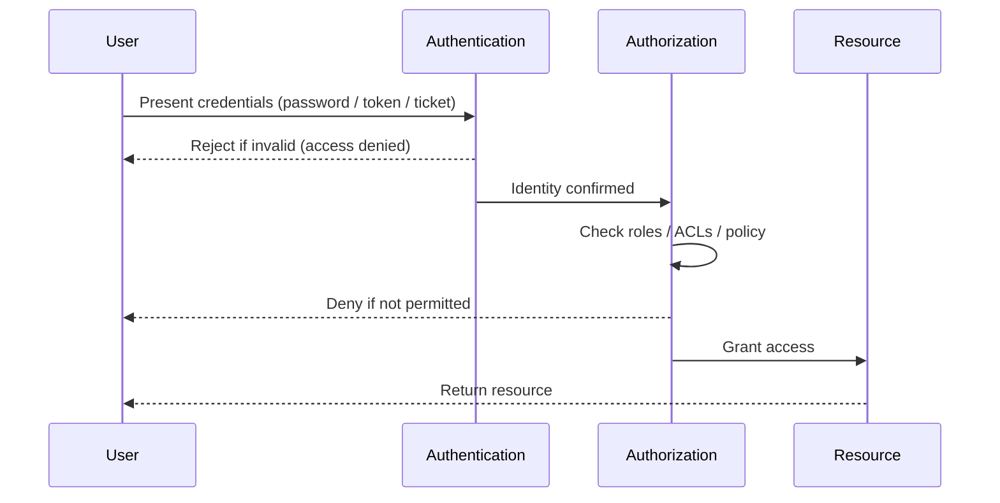

# Authentication vs Authorization

Authentication and authorization are two distinct security controls that are easy to confuse: authentication proves *who* you are, while authorization decides *what* you are allowed to do. They always run in that order, and both must succeed before a request reaches a protected resource.

## Overview

Every access decision on a Windows or web platform is really two checks stacked together. First the system **authenticates** the caller — validating credentials such as a password, a Kerberos ticket, an OAuth token, or a certificate — to establish a trusted identity. Only once identity is confirmed does the system **authorize** the request, comparing that identity's roles, group memberships, and permissions against the policy protecting the resource. In [Internet-Information-Services(IIS)](Internet-Information-Services(IIS).md) this maps directly onto the pipeline: an authentication method (see [Authentication-Methods-in-Windows](Authentication-Methods-in-Windows.md)) establishes the user, and NTFS/URL authorization rules then decide whether that user may read or run the requested content.

> [!IMPORTANT]
> **Two questions, two controls**
> Authentication answers "**Are you who you say you are?**" Authorization answers "**Are you allowed to do this?**" Confusing or collapsing the two is a root cause of broken access control — a user can be perfectly authenticated and still must be denied.

## Authentication

- **Definition:** The process of verifying *who* a user is.
- **Purpose:** To confirm the identity of a user or system before granting access.
- **Key Concept:** *You must prove your identity first, before anything else.*
- **Common Methods:**
	- Username and password
	- Biometrics (fingerprints, face recognition)
	- Multi-factor authentication (MFA / 2FA, OTP)
	- OAuth tokens and API keys
	- Kerberos tickets and NTLM challenge/response (Windows) — see [Kerberos-Authentication](../Active-Directory-Domain-Services-AD-DS/Kerberos-Authentication.md) and [NTLM](../Active-Directory-Domain-Services-AD-DS/NTLM.md)
- **Question Answered:**

> "Are you really who you say you are?"

## Authorization

- **Definition:** The process of determining *what* an authenticated user is allowed to do.
- **Purpose:** To control access and permissions for resources or actions.
- **Key Concept:** *Authorization checks come only after authentication succeeds.*
- **Common Methods:**
	- Role-based access control (RBAC)
	- Access control lists (ACLs) — e.g. NTFS permissions
	- Policy enforcement (e.g. attribute-based access control, ABAC)
- **Question Answered:**

> "Are you permitted to perform this operation or access this resource?"

## How They Work Together

1. **Authentication happens first** — the system verifies your identity.
2. **Authorization follows** — based on your verified identity, the system checks your permissions.
3. **Access is granted or denied** based on the authorization decision.

The two controls form a strict sequence: if authentication fails (invalid credentials), authorization never runs and the request is rejected outright.

## Comparison

| Aspect | Authentication | Authorization |
| :-- | :-- | :-- |
| **Purpose** | Verify user identity | Grant or deny access based on permissions |
| **When it occurs** | First step | After authentication |
| **Data used** | Credentials (passwords, biometrics, tokens) | User roles, permissions, policies, ACLs |
| **Typical questions** | "Who are you?" | "Can you do this?" |
| **Examples** | Login screens, OAuth sign-in, biometrics | Access control to files, admin dashboards |
| **Result** | User is confirmed as genuine | User gains or is restricted from actions/resources |
| **Visibility to user** | Usually visible (login prompt) | Usually invisible (silent policy check) |

## Real-World Analogies

- **Authentication:** Like showing your driver's license or passport at the entrance to prove your identity.
- **Authorization:** Like a security guard checking whether your badge allows you into a certain room or floor of the building.

> [!NOTE]
> **Blended protocols**
> Some technologies blend both workflows. **OAuth2**, **JWT (JSON Web Tokens)**, and **SAML** carry authentication *and* authorization data, and **federated authentication** (e.g. "Sign in with Google/Microsoft") delegates identity verification to an external identity provider while the relying application still enforces its own authorization.

## Security Considerations

> [!WARNING]
> **Authentication without authorization is a false sense of security**
> A logged-in user is not a trusted user. **Broken access control** — where the app authenticates a user but fails to enforce per-object or per-function authorization — is consistently one of the most common and impactful web vulnerabilities (OWASP Top 10 A01). Attackers exploit it via **IDOR** (tampering with object IDs), **forced browsing** to unlinked admin URLs, and **privilege escalation** by replaying a valid session against endpoints they should not reach.

- **Enforce authorization server-side, on every request.** Client-side hiding of a button or menu is not access control; the backend must re-check permissions for each object and action.
- **Fail closed.** If an authorization decision cannot be made, deny by default rather than allow.
- **Separate the two layers.** A compromised or stolen credential (pass-the-hash, token theft) grants authentication; least-privilege authorization limits the blast radius of that compromise.
- **Offensive relevance:** during testing, always probe both axes — bypass authentication (weak/missing auth, default creds) *and* abuse authorization (horizontal/vertical privilege escalation) even against a properly authenticated session.

## Best Practices

- Keep authentication mechanisms strong: enforce MFA, disable legacy/weak protocols, and store credentials only as salted hashes.
- Apply **least privilege** — grant the minimum roles and permissions needed, and review them regularly.
- Centralize and clearly document authorization policies (RBAC/ABAC) so access rules are auditable and consistent.
- Validate authorization on the server for every protected object and function, never trusting client-supplied identity or role claims.
- Log both authentication events and authorization denials to support detection and incident response.

## Troubleshooting

| Symptom | Likely cause & fix |
| :-- | :-- |
| User can log in but gets "403 Forbidden" / "Access Denied" | Authentication succeeded, authorization failed — check role/group membership and NTFS/URL ACLs on the resource |
| User reaches admin pages they should not | Broken/absent authorization check — enforce server-side role checks on every protected endpoint |
| "401 Unauthorized" prompt keeps reappearing | Authentication failure — wrong credentials, expired token/ticket, or the wrong IIS authentication method enabled |
| Access works for some objects but not others of the same type | Inconsistent per-object authorization (possible IDOR surface) — enforce ownership checks per object ID |

## References

- Microsoft Learn — Authentication vs. authorization: https://learn.microsoft.com/entra/identity-platform/authentication-vs-authorization
- Microsoft Learn — IIS Authentication: https://learn.microsoft.com/iis/configuration/system.webserver/security/authentication/
- OWASP — Broken Access Control (Top 10 A01): https://owasp.org/Top10/A01_2021-Broken_Access_Control/
- OWASP — Authorization Cheat Sheet: https://cheatsheetseries.owasp.org/cheatsheets/Authorization_Cheat_Sheet.html

## Related

- [Enterprise Windows Infrastructure Security](../Readme.md) — course hub
- [Authentication-Methods-in-Windows](Authentication-Methods-in-Windows.md) — concrete Windows/IIS authentication mechanisms
- [Internet-Information-Services(IIS)](Internet-Information-Services(IIS).md) — IIS enforces both authentication and authorization
- [Kerberos-Authentication](../Active-Directory-Domain-Services-AD-DS/Kerberos-Authentication.md) — default Windows authentication protocol
- [NTLM](../Active-Directory-Domain-Services-AD-DS/NTLM.md) — legacy Windows authentication protocol
- Access-Control-Vulnerabilities-in-Web-Applications — how broken authorization is exploited
- Web-Application-Penetration-Test — testing auth/authz flaws in web apps
- Web-Enumeration — enumerating protected vs public resources
