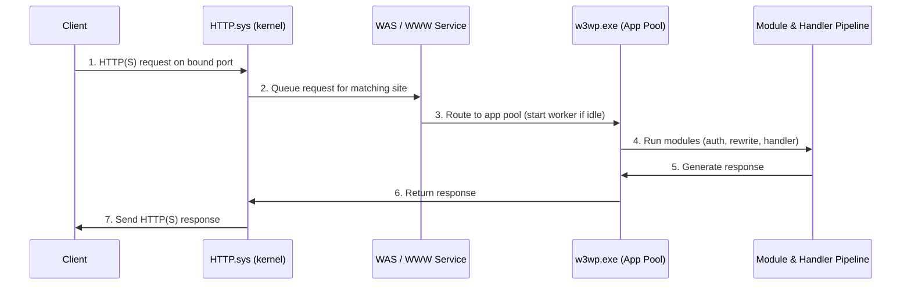

# Internet Information Services (IIS)

Internet Information Services (IIS) is a robust and versatile web server by Microsoft for hosting websites, web apps, APIs, and services on Windows systems. It supports multiple protocols—HTTP, HTTPS, FTP, FTPS, and SMTP—making it a preferred choice for deploying Microsoft-based technologies such as ASP.NET.

## Overview

IIS is the built-in web server role on Windows Server and Windows client editions. It serves static content and, through pluggable handlers, dynamic applications written in [PHP](Setting-Up-PHP-on-Windows-Server.md), ASP.NET, and Classic ASP. Requests are mapped to sites through [site bindings](Types-of-Site-Binding-in-IIS.md) (protocol, IP, port, and host header) and secured through the [Windows authentication methods](Authentication-Methods-in-Windows.md) IIS exposes, layered on top of the operating system's identity model.

Architecturally, IIS is **modular**: each feature (URL Rewrite, compression, WebSockets, authentication providers) is a separately installable module, and every site runs inside an isolated **application pool**. This makes IIS the [hosting](../Software-Development-Life-Cycle/Hosting.md) platform behind most Microsoft-stack [websites](../Software-Development-Life-Cycle/Website.md) and a common target during web enumeration.

## IIS - Version History

- Below is a comprehensive overview of the **IIS (Internet Information Services) versions**, their release timeline, and platform compatibility up to August 2025:


| IIS Version | Release Year | Bundled With | Key Features / Notes |
| :-- | :-- | :-- | :-- |
| 1.0 | 1995 | Windows NT 3.51 (add-on) | First release; basic HTTP support |
| 2.0 | 1996 | Windows NT 4.0 | Integration to NT 4.0 |
| 3.0 | 1997 | Windows NT 4.0 SP3 | Added Classic ASP (dynamic scripting) |
| 4.0 | 1997 | Windows NT 4.0 Option Pack | MMC admin, true multi-instance support |
| 5.0 | 2000 | Windows 2000 | WebDAV, new authentication, dropped Gopher |
| 5.1 | 2001 | Windows XP Professional | Enhanced desktop support |
| 6.0 | 2003 | Windows Server 2003, XP Pro x64 | Worker process model, IPv6, HTTP.sys |
| 7.0 | 2007 | Windows Vista, Windows Server 2008 | Completely redesigned, modular architecture |
| 7.5 | 2009 | Windows 7, Windows Server 2008 R2 | Improved FTP/WebDAV, PowerShell support, BPA |
| 8.0 | 2012 | Windows 8, Windows Server 2012 | SNI SSL, multicore scaling, central cert management |
| 8.5 | 2013 | Windows 8.1, Windows Server 2012 R2 | Idle worker page-out, enhanced logging, ETW |
| 10.0 | 2015–2016 | Windows 10, Windows Server 2016/2019/2022/2025 | HTTP/2, HTTP/3, Windows containers, HSTS, latest security/encryption standards |

- **IIS 10.0** remains the current mainstream version through at least Windows Server 2025 and Windows 11. It continues to receive feature updates (such as enhanced HTTP/2/3 support, security enhancements, REST management API) with each new Windows release.
- **Lifecycle Note:** IIS is tied to the Windows OS lifecycle. Support for specific IIS versions ends when OS support ends.
- **Legacy versions** (IIS 1.0 through 8.5) are no longer supported.

> [!NOTE]
> **Version is tied to the OS**
> IIS is not a standalone product with its own release cadence — its version is fixed by the host Windows build. There is no "IIS 11"; IIS 10.0 simply gains features with each new Windows Server release, so a server's IIS version is effectively a fingerprint of its OS.

### How to Check Your IIS Version

- Open IIS Manager, go to **Help > About**.
- Or, via PowerShell/Registry:

```powershell
Get-ItemProperty "HKLM:\SOFTWARE\Microsoft\InetStp\" | Select-Object VersionString
```

**Reference Table** (Partial):


| IIS Version | Supported OS | End of Support |
| :-- | :-- | :-- |
| 10.0 | Windows 10/11, Server 2016–2025 | 2029 (latest)[^4] |
| 8.5 | Windows 8.1, Server 2012 R2 | 10 Oct 2023 |
| 7.5 | Windows 7, Server 2008 R2 | 14 Jan 2020 |

**Summary:**
Almost all modern production IIS servers use **IIS 10.0** on **Windows Server 2016/2019/2022/2025** or **Windows 10/11**. No new major standalone IIS version beyond 10.0 has been released as of August 2025, but it continues to be updated with the host Windows OS.

## IIS Core Features

- **Application Pool Isolation:**
Every site or application runs in its own process, enhancing reliability and isolating faults.
- **Supported Protocols:**
    - HTTP (80)
    - HTTPS (443)
    - FTP/FTPS (21)
    - SMTP
- **Authentication Methods:**
    - Windows Authentication
    - Basic \& Anonymous Access
    - Digest and Forms-based Authentication
- **Dynamic Content:**
    - ASP.NET (.NET Core/Framework)
    - PHP
    - Classic ASP
- **Load Balancing:**
Integrates with Windows NLB and is compatible with web farm solutions for distributing load.
- **SSL/TLS Support:**
Secure communications with certificate-based HTTPS.
- **Logging \& Monitoring:**
Tracks access, requests, errors, and integrates with Windows Event Viewer.
- **Modular:**
Features like URL Rewrite, Compression, and WebSockets are installable as needed.


## How It Works — Request Pipeline

IIS splits request handling between the kernel and user mode. Incoming requests are first received by **HTTP.sys**, a kernel-mode listener that queues the request and handles connection management, response caching, and SSL. The **Windows Process Activation Service (WAS)** then routes the request to the correct **application pool**, starting a **worker process** (`w3wp.exe`) if one is not already running. Inside the worker process the request flows through the ordered pipeline of native and managed **modules** (authentication, compression, static/dynamic handlers) until a handler produces the response.



> [!TIP]
> **App pools are the isolation boundary**
> Because each site runs in its own worker process under its own identity, a crash — or a compromise — of one site's app pool does not directly affect others. Assigning a **least-privilege app pool identity** per site is one of the highest-value IIS hardening steps.

## IIS Binding Settings Explained

Bindings define **how IIS sites respond** to traffic:


| Setting | What it controls | Examples |
| :-- | :-- | :-- |
| **Type** | Protocol (HTTP, HTTPS, FTP) | HTTP, HTTPS |
| **IP Address** | Which addresses respond (or all) | All Unassigned, 192.168.1.100 |
| **Port** | Listen port | 80, 443, 21 |
| **Host Name** | Differentiates sites on same IP/port | www.example.com, api.example.com |
| **SSL Cert.** | Associates certificate for HTTPS | *.example.com (Let's Encrypt, etc.) |

**Example Bindings Table:**


| Type | IP Address | Port | Host Name | SSL Certificate |
| :-- | :-- | :-- | :-- | :-- |
| HTTPS | All Unassigned | 443 | www.mysite.com | *.mysite.com (TLS) |
| HTTP | 192.168.1.50 | 80 | dev.mysite.local | (none) |

See [Types-of-Site-Binding-in-IIS](Types-of-Site-Binding-in-IIS.md) for a deeper treatment of how bindings map requests to sites.

## How to Add a Website in IIS: Step-by-Step

1. Open **IIS Manager**
2. Right-click **Sites** → select **Add Website...**
3. Complete fields:
    - **Site name:** e.g., MyWebsite
    - **Physical Path:** e.g., C:\inetpub\wwwroot\mywebsite
    - **Binding Type:** http (or https)
    - **IP Address:** All Unassigned (or specific IP)
    - **Port:** 80
    - **Host Name:** mywebsite.local
4. Click **OK** to create

## Testing Classic ASP and ASP.NET

**Classic ASP Test:**

```text
<%
Response.Write("<h1>Classic ASP is working!</h1>")
Response.Write("Current Server Time: " & Now())
%>
```

- Save as `test.asp` in your site root; visit `http://localhost/test.asp`.

**ASP.NET Web Forms Test:**

```text
<%@ Page Language="C#" %>
<!DOCTYPE html>
<html xmlns="http://www.w3.org/1999/xhtml">
<head runat="server">
    <title>ASP.NET Web Forms Test</title>
</head>
<body>
    <form id="form1" runat="server">
        <div>
            <h1>ASP.NET is working!</h1>
            <asp:Label ID="Label1" runat="server" Text=""></asp:Label>
        </div>
    </form>
</body>
<script runat="server">
    protected void Page_Load(object sender, EventArgs e)
    {
        Label1.Text = "Current Server Time: " + DateTime.Now.ToString();
    }
</script>
</html>
```

- Save as `test.aspx` in your site root; visit `http://localhost/test.aspx`.

If you see the message and the server time, the respective technology is functioning.

## Security Considerations

IIS is one of the most commonly fingerprinted web servers on the internet, and its default configuration leaks details that help an attacker map the application before ever finding a flaw.

> [!WARNING]
> **Default IIS exposure**
> - **Banner / version disclosure** — the `Server:` response header (and headers such as `X-Powered-By` and `X-AspNet-Version`) advertise IIS and framework versions, guiding an attacker straight to version-specific exploits.
> - **Directory browsing** — if enabled, it exposes the full file listing of a virtual directory, revealing backups, configs, and source.
> - **Verbose error pages** — detailed .NET/IIS errors leak physical paths, stack traces, and connection strings; return custom errors to remote clients.
> - **Over-privileged app pool identity** — a worker process running as a high-privilege account turns a web-app compromise (e.g. an upload or deserialization flaw) into host-level access.
> - **Exposed management surfaces** — WebDAV, the FTP service, and admin tools like phpMyAdmin left reachable widen the attack surface.

- On the **offensive** side, IIS is enumerated for its version banner, allowed HTTP methods (e.g. WebDAV `PUT`), exposed directories, and default files during web enumeration and reconnaissance.
- On the **defensive** side, strip version banners, disable directory browsing, return custom error pages, enforce least-privilege app-pool identities, and keep the OS/IIS patched to its supported version.

## Best Practices

- Use **host headers** (host names) to run many sites on one server, and give each site its own **application pool** running under a least-privilege identity.
- Install SSL/TLS certificates before enabling HTTPS bindings; enforce modern TLS and redirect HTTP to HTTPS.
- Remove unused IIS modules, sample apps, and default content to shrink the attack surface.
- Suppress version banners and disable directory browsing; serve custom (non-verbose) error pages to remote clients.
- Review logs at `C:\inetpub\logs\LogFiles\` regularly and forward them to central monitoring.

## Troubleshooting

| Symptom | Likely cause & fix |
| :-- | :-- |
| Requests reach the wrong site | Overlapping bindings — make the host header / IP / port unique per site and check binding precedence |
| PHP / ASPX pages download as text instead of executing | Handler mapping missing — register the FastCGI/PHP or ASP.NET handler for that site |
| HTTP 503 "Service Unavailable" | The application pool is stopped or crashed — check the app-pool state and the System event log for worker-process (WAS) errors |
| HTTPS binding fails or shows a cert warning | No certificate bound, wrong host name, or expired cert — reassign a valid certificate in the site's HTTPS binding |
| HTTP 500.19 / config error | Malformed `web.config` or a locked configuration section — fix or unlock the offending section |

## References

- [IIS documentation (Microsoft Learn)](https://learn.microsoft.com/en-us/iis/)
- [Introduction to IIS Architecture (Microsoft Learn)](https://learn.microsoft.com/en-us/iis/get-started/introduction-to-iis/introduction-to-iis-architecture)
- [Install and configure PHP on IIS (Microsoft Learn)](https://learn.microsoft.com/en-us/iis/application-frameworks/install-and-configure-php-on-iis/)
- [OWASP Secure Headers Project](https://owasp.org/www-project-secure-headers/)

## Related
- [Types-of-Site-Binding-in-IIS](Types-of-Site-Binding-in-IIS.md) — how IIS maps requests to sites
- [Setting-Up-PHP-on-Windows-Server](Setting-Up-PHP-on-Windows-Server.md) — running PHP applications on IIS
- [phpMyAdmin-on-Windows-Server-with-IIS](phpMyAdmin-on-Windows-Server-with-IIS.md) — deploying phpMyAdmin behind IIS
- [Authentication-Methods-in-Windows](Authentication-Methods-in-Windows.md) — authentication methods IIS supports
- [Authentication-vs-Authorization](Authentication-vs-Authorization.md) — the distinction IIS access control relies on
- [Website](../Software-Development-Life-Cycle/Website.md) — content served by IIS
- [Hosting](../Software-Development-Life-Cycle/Hosting.md) — hosting model IIS implements
- Web-Enumeration — enumerating IIS servers and sites
- [Enterprise Windows Infrastructure Security](../Readme.md) — course hub
